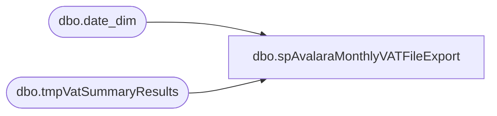

# dbo.spAvalaraMonthlyVATFileExport

**Database:** dw  
**Server:** papamart  

## Architecture Diagram



## Table Dependencies

| Referenced Table |
|---|
| dbo.date_dim |
| dbo.tmpVatSummaryResults |

## Stored Procedure Code

```sql
CREATE procedure [dbo].[spAvalaraMonthlyVATFileExport]
--@TransactionStartDate as int
--,@TransactionEndDate as int

AS


SET NOCOUNT ON


--####################################
-- Check for same day job completion
--####################################

--IF (SELECT COUNT(*) FROM notification_status WHERE reported = 1 AND CONVERT(VARCHAR(19),first_reported,101) = CONVERT(VARCHAR(19),GETDATE(),101) AND notification_name = 'Avalara VAT Tax file generated' AND reported_cleared IS NULL) = 1
--GOTO FINISH

--IF (SELECT COUNT(*) FROM notification_status WHERE reported = 1 AND CONVERT(VARCHAR(19),first_reported,101) != CONVERT(VARCHAR(19),GETDATE(),101) AND notification_name = 'Avalara VAT Tax file generated' AND reported_cleared IS NULL) = 1
--BEGIN
--	UPDATE notification_status
--	SET reported = 0,reported_cleared = CONVERT(VARCHAR(19),GETDATE(),120)
--	WHERE CONVERT(VARCHAR(19),first_reported,101) != CONVERT(VARCHAR(19),GETDATE(),101)
--	AND notification_name = 'Avalara VAT Tax file generated'
--END


--####################################
-- Temp Tables
--####################################

IF (Object_ID('tempdb..##StartJobCheck') IS NOT NULL) DROP TABLE ##StartJobCheck
IF (Object_ID('tempdb..##TaxStoreData') IS NOT NULL) DROP TABLE ##TaxStoreData
IF (Object_ID('tempdb..##TaxCountryList') IS NOT NULL) DROP TABLE ##TaxCountryList
--IF (Object_ID('tempdb..##TaxCodes') IS NOT NULL) DROP TABLE ##TaxCodes
IF (Object_ID('tempdb..##TaxLineCounts') IS NOT NULL) DROP TABLE ##TaxLineCounts
IF (Object_ID('tempdb..##TaxSalesDetail') IS NOT NULL) DROP TABLE ##TaxSalesDetail
IF (Object_ID('tempdb..##TaxExemptSalesDetail') IS NOT NULL) DROP TABLE ##TaxExemptSalesDetail
IF (Object_ID('tempdb..##TaxESSalesDetail') IS NOT NULL) DROP TABLE ##TaxESSalesDetail
IF (Object_ID('tempdb..##TaxSendSaleSalesDetail') IS NOT NULL) DROP TABLE ##TaxSendSaleSalesDetail
IF (Object_ID('tempdb..##TaxDetailResults') IS NOT NULL) DROP TABLE ##TaxDetailResults
IF (Object_ID('tempdb..##TaxDetailResultsFinal') IS NOT NULL) DROP TABLE ##TaxDetailResultsFinal
IF (Object_ID('tempdb..##TaxSummaryResults') IS NOT NULL) DROP TABLE ##TaxSummaryResults
IF (Object_ID('tempdb..##TaxSummaryOutput') IS NOT NULL) DROP TABLE ##TaxSummaryOutput
IF (Object_ID('tempdb..##TaxExportHeaders') IS NOT NULL) DROP TABLE ##TaxExportHeaders
IF (Object_ID('tempdb..##merchyearweek') IS NOT NULL) DROP TABLE ##merchyearweek
IF (Object_ID('tempdb..##taxedDonations') IS NOT NULL) DROP TABLE ##taxedDonations

--####################################
-- Declare script variables
--####################################

DECLARE @SQL VARCHAR(8000)
DECLARE @CMD VARCHAR(4000)
DECLARE @FileDate VARCHAR(14)
DECLARE @FileName VARCHAR(60)
DECLARE @FilePath VARCHAR(90)
DECLARE @AvalaraFilePath VARCHAR(90)
DECLARE @BackupFilePath VARCHAR(90)
DECLARE @TempFilePath VARCHAR(90)
DECLARE @TransactionStartDate DATE
DECLARE @TransactionEndDate DATE

DECLARE @ChkFileDrive VARCHAR(5)  
DECLARE @ChkFileCMD VARCHAR(200)
DECLARE @ChkFileCount VARCHAR(5)

DECLARE @Recipients VARCHAR(4000)
DECLARE @Copy_Recipients VARCHAR(4000)
DECLARE @Subject VARCHAR(80)
DECLARE @Query VARCHAR(8000)
DECLARE @Text NVARCHAR(MAX)
DECLARE @EmailAttachment VARCHAR(100)


----####################################
---- Set variables
----####################################

SET @FileDate = (SELECT CONVERT(VARCHAR(8), GETDATE(), 112) + REPLACE(CONVERT(VARCHAR(8),GETDATE(), 108),':',''))


---- testing paths
--SET @FilePath = '\\saapp01\HostData\Avalara_TEST'  --<< File path
--SET @TempFilePath = '\\saapp01\HostData\Avalara_TEST'  
--SET @BackupFilePath = '\\saapp01\HostData\Avalara_TEST'
----

SET @FilePath = '\\saapp01\Financials\Avalara'  --<< File path
SET @TempFilePath = '\\saapp01\Financials\Avalara\Work'
SET @BackupFilePath = '\\saapp01\Financials\Avalara\Backup'

--SET @AvalaraFilePath = '\\saapp01\Financials\Avalara\Test'  --<< TEST build path
--SET @AvalaraFilePath = '\\stl-avalap-t-01\d$\Inbox'  --<< TEST Avalara file destination path
SET @AvalaraFilePath = '\\stl-avalap-p-01\AvalaraInbox'  --<< PROD Avalara file destination path

--SET @Recipients = 'sahilaq@buildabear.co.uk;christianc@buildabear.co.uk'
SET @Recipients = 'ianw@buildabear.com'
--SET @Copy_Recipients = 'SAAdmin@buildabear.com;BIadmin@buildabear.com'
SET @Copy_Recipients = 'ianw@buildabear.com'


--####################################
-- Create Headers file
--####################################

SELECT 
		'DocumentType' AS 'DocumentType'
		,'TransactionDate' AS 'TransactionDate'
		,'InvoiceNumber' AS 'InvoiceNumber'
		,'InvoiceDate' AS 'InvoiceDate'
		,'Currency' AS 'Currency'
		,'VATCode' AS 'VATCode'
		,'SupplierID' AS 'SupplierID'
		,'SupplierName' AS 'SupplierName'
		,'SupplierCountry' AS 'SupplierCountry'
		,'SupplierVATNumberUsed' AS 'SupplierVATNumberUsed'
		,'SupplierCountryVATNumberUsed' AS 'SupplierCountryVATNumberUsed'
		,'CustomerID' AS 'CustomerID'
		,'CustomerName' AS 'CustomerName'
		,'CustomerCountry' AS 'CustomerCountry'
		,'CustomerVATNumberUsed' AS 'CustomerVATNumberUsed'
		,'CustomerCountryVATNumberUsed' AS 'CustomerCountryVATNumberUsed'
		,'TaxableBasis' AS 'TaxableBasis'
		,'ValueVAT' AS 'ValueVAT'
		,'TotalValueLine' AS 'TotalValueLine'
		,'AmountVATDeducted' AS 'AmountVATDeducted'
		,'AmountVATReverseCharged' AS 'AmountVATReverseCharged'
INTO ##TaxExportHeaders

SET @SQL = 'SELECT * FROM ##TaxExportHeaders'

SELECT  @CMD = 'bcp "' + @SQL + '" queryout "' + @TempFilePath + '\AVALARA_VAT_TAX_EXPORT_HEADERS.multitxt" -T -c'
    SELECT  @CMD
    exec master..xp_cmdshell @CMD
	

--####################################
-- Create file for each country
--   loops through each country code
--   to create results & file output
--####################################

----DECLARE @cntrycode VARCHAR(3)

--DECLARE @cntrycode VARCHAR(3)
DECLARE @merchyearweek VARCHAR(6)


DECLARE merchyearweek CURSOR FOR
select	 distinct cast(fiscal_year as varchar(4)) + cast(dd.fiscal_week as varchar(2)) 
from	[dwstaging].[dbo].[tmpVatSummaryResults] tsr
join	[dbo].[date_dim] dd on tsr.TransactionDate = dd.actual_date
--order by cast(dd.fiscal_year as varchar(4)) + cast(dd.fiscal_week as varchar(2)) 


select	distinct cast(dd.fiscal_year as varchar(4)) + cast(dd.fiscal_week as varchar(2)) as merchyearweek
into	##merchyearweek
from	[dwstaging].[dbo].[tmpVatSummaryResults] tsr
join	[dbo].[date_dim] dd on tsr.TransactionDate = dd.actual_date
--order by cast(dd.fiscal_year as varchar(4)) + cast(dd.fiscal_week as varchar(2)) 

OPEN merchyearweek  
  
FETCH next  
 FROM merchyearweek  
 INTO @merchyearweek  

WHILE @@fetch_status = 0  

BEGIN


--set @merchyearweek = '202444'

IF (Object_ID('tempdb..##TaxSummaryOutput') IS NOT NULL) DROP TABLE ##TaxSummaryOutput

SELECT tsr.*
INTO ##TaxSummaryOutput
--FROM ##TaxSummaryResults tsr WITH (NOLOCK)
from [dwstaging].[dbo].[tmpVatSummaryResults] tsr
--where cast(tsr.TransactionDate as date) between '12/01/2024' and '12/07/2024'
join	[dbo].[date_dim] dd on tsr.TransactionDate = dd.actual_date
WHERE 1=1 -- tsr.CustomerCountry = @cntrycode  -- not used anymore - KL
and		cast(dd.fiscal_year as varchar(4)) + cast(dd.fiscal_week as varchar(2)) = @merchyearweek


SET @FileName = '\AVALARA_VAT_EXPORT_' + 'GB' + '_' + @FileDate + '_' + @merchyearweek + '.multitxt'

SET @SQL = 'SELECT * FROM ##TaxSummaryOutput'

SELECT  @CMD = 'bcp "' + @SQL + '" queryout "' + @TempFilePath + '\AVALARA_VAT_TAX_EXPORT_RESULTS_' + 'GB' + '_' + @FileDate + '_' + @merchyearweek + '.multitxt" -T -c'
    select  @CMD
    exec master..xp_cmdshell @CMD

SET @CMD = 'echo Build-a-Bear transaction data > ' + @FilePath + @FileName
    select  @CMD
    exec master..xp_cmdshell @CMD

SET @CMD = 'type ' + @TempFilePath + '\AVALARA_VAT_TAX_EXPORT_HEADERS.multitxt >> ' + @FilePath + @FileName
    select  @CMD
    exec master..xp_cmdshell @CMD

SET @CMD = 'type ' + @TempFilePath + '\AVALARA_VAT_TAX_EXPORT_RESULTS_' + 'GB' + '_' + @FileDate + '_' + @merchyearweek + '.multitxt >> ' + @FilePath + @FileName
    select  @CMD
    exec master..xp_cmdshell @CMD

--FETCH next  
 --FROM cntrycode  
 --INTO @cntrycode  
--END  
  
--CLOSE cntrycode
--DEALLOCATE cntrycode

FETCH next  
 FROM merchyearweek  
 INTO @merchyearweek  
END  
  
CLOSE merchyearweek
DEALLOCATE merchyearweek


--SET @EmailAttachment = @BackupFilePath + @FileName


--####################################
-- File cleanup
--####################################

SET @CMD = 'del /Q ' + @TempFilePath + '\AVALARA_VAT_TAX_EXPORT_*.multitxt'
    select  @CMD
    exec master..xp_cmdshell @CMD

SET @CMD = 'move /Y ' + @FilePath + '\*.multitxt ' + @BackupFilePath
    select  @CMD
    exec master..xp_cmdshell @CMD

WAITFOR DELAY '00:00:15'

--SET @CMD = 'xcopy /y /v /f /r  ' + @BackupFilePath + '\AVALARA_VAT_EXPORT_*_' + @FileDate + '*.multitxt' + ' ' + @AvalaraFilePath
--    select  @CMD
--    exec master..xp_cmdshell @CMD

--WAITFOR DELAY '00:00:20'


--####################################
-- File check and email completion
--####################################

--IF (Object_ID('tempdb..#filecheck') IS NOT NULL) DROP TABLE #filecheck
--CREATE TABLE #filecheck (dirtext VARCHAR(60))

--SET @ChkFileDrive = 'v:'  
--SET @ChkFileCMD = 'net use ' + @ChkFileDrive + ' /d'  
----EXEC master..xp_cmdshell @ChkFileCMD  
--SET @ChkFileCMD = 'net use ' + @ChkFileDrive + ' ' + @AvalaraFilePath  
--EXEC master..xp_cmdshell @ChkFileCMD  

--SET @ChkFileCMD = 'dir /B ' + @ChkFileDrive +  + ' ' + @AvalaraFilePath + 'AVALARA_VAT_EXPORT_*_' + @FileDate + '*.multitxt' 

----print @ChkFileCMD

--INSERT INTO #filecheck (dirtext)
--EXEC master..xp_cmdshell @ChkFileCMD 
--DELETE FROM #filecheck WHERE dirtext IS NULL OR dirtext = 'File Not Found'

--SET @CMD = 'forfiles /p ' + @ChkFileDrive + ' /s /m *.multitxt /D -400 /C "cmd /c del @path"'
--    select  @CMD
--    exec master..xp_cmdshell @CMD

--SET @ChkFileCMD = 'net use ' + @ChkFileDrive + ' /d'
--EXEC master..xp_cmdshell @ChkFileCMD

--SET @ChkFileCount = (SELECT COUNT(*) FROM #filecheck)

----IF (SELECT COUNT(*) FROM #filecheck) != (SELECT COUNT(*) from ##merchyearweek) 

----GOTO ERROREMAIL

--SET @Text = 
--		'<font face =arial size = 2>' +
--		'Avalara VAT Tax export file has been created for import to Avalara. <br>' +
--		'Transaction date range... <br>' +
--		'From: ' + CONVERT(VARCHAR(10),@TransactionStartDate) + '<br>' +
--		'To: ' + CONVERT(VARCHAR(10),@TransactionEndDate) + ' <br>' +
--		'<br>' +
--		'(' + @ChkFileCount + ') AVALARA_VAT_EXPORT_*_' + @FileDate + '*.multitxt files found in ' + @AvalaraFilePath + '. <br>' +
--		'<br>' +
--		'<table border="1">' + 
--		'<font face =arial size = 2>' +
--		'<tr bgcolor=#D5D5F7><th>Avalara VAT Tax export file name</th></tr>' +
--		CAST ( ( SELECT [td/@align]='left',
--						td = dirtext, ''
--				FROM #filecheck
--				FOR xml path ('tr'), type
--		) AS NVARCHAR(MAX) ) +
--		'</table>' +
--		'<font face =arial size = 2>' +
--		'<br>' +
--		'<font face =arial size = 1 color="#C0C0C0">' +
--		'<br><br><br><br>' +
--		'Server:  BEDROCKDB01 <br>' +
--		'Job Name:  Avalara_Sales_Tax_File_Export <br>' +
--		'Stored Proc:  BEDROCKDB01.auditworks.dbo.spAvalaraMonthlyVATTaxExport_IDW <br>' +
--		'Created by:  IDW <br>' +
--		'Team Ownership:  SAadmin <br>'

--SET @Subject = 'Avalara VAT Tax export file created'
--	EXEC msdb.dbo.sp_send_dbmail  
--	@profile_name = 'SAAdmin',
--	@recipients = @Recipients,
--	@copy_recipients = @Copy_Recipients,
--	@subject=@Subject, 
--	@body = @Text,
--	@body_format = 'HTML'


--####################################
-- Log job completion for the day
--####################################

--UPDATE notification_status
--SET reported = 1,first_reported = CONVERT(VARCHAR(19),GETDATE(),120),reported_cleared = NULL
--WHERE notification_name = 'Avalara VAT Tax file generated'

GOTO FINISH


--####################################
-- Error Email for Missing files
--####################################

--ERROREMAIL:

--IF (SELECT COUNT(*) FROM #filecheck) = 0
--BEGIN
--SET @Text = 
--		'<font face =arial size = 2 color="Red">' +
--		'** ACTION REQUIRED **  <br>' +
--		'<br>' +
--		'SA export files Missing for Avalara. <br>' +
--		'<br>' +
--		'(' + @ChkFileCount + ') AVALARA_VAT_EXPORT_*_' + @FileDate + '*.multitxt files found in ' + @AvalaraFilePath + '. <br>' +
--		'<br>' +
--		'Please check on status of SQL job execution. <br>' +
--		'<br>' +
--		'<font face =arial size = 1 color="#C0C0C0">' +
--		'<br><br><br><br>' +
--		'Server:  BEDROCKDB01 <br>' +
--		'Job Name:  Avalara_Sales_Tax_File_Export <br>' +
--		'Stored Proc:  BEDROCKDB01.auditworks.dbo.spAvalaraMonthlyVATTaxExport <br>' +
--		'Created by:  Paul Beckman/Keith Lee <br>' +
--		'Team Ownership:  Enterprise Systems <br>'

--SET @Subject = 'WARNING - Missing all (' + CONVERT(VARCHAR(1),(SELECT COUNT(*) from ##merchyearweek)-@ChkFileCount) + ') Avalara VAT Tax export files'
--	EXEC msdb.dbo.sp_send_dbmail  
--	@profile_name = 'SAAdmin',
--	@recipients = @Copy_Recipients,
--	@copy_recipients = @Recipients,
--	@subject=@Subject, 
--	@body = @Text,
--	@body_format = 'HTML'
--END
--ELSE
--BEGIN
--SET @Text = 
--		'<font face =arial size = 2 color="Red">' +
--		'** ACTION REQUIRED **  <br>' +
--		'<br>' +
--		'SA export files Missing for Avalara. <br>' +
--		'<br>' +
--		'(' + @ChkFileCount + ') AVALARA_VAT_EXPORT_*_' + @FileDate + '*.multitxt files found in ' + @AvalaraFilePath + '. <br>' +
--		'<br>' +
--		'Please check on status of SQL job execution. <br>' +
--		'<br>' +
--		'Transaction date range... <br>' +
--		'From: ' + CONVERT(VARCHAR(10),@TransactionStartDate) + '<br>' +
--		'To: ' + CONVERT(VARCHAR(10),@TransactionEndDate) + ' <br>' +
--		'<br>' +
--		'<table border="1">' + 
--		'<font face =arial size = 2>' +
--		'<tr bgcolor=#D5D5F7><th>Avalara VAT Tax export file name</th></tr>' +
--		CAST ( ( SELECT [td/@align]='left',
--						td = dirtext, ''
--				FROM #filecheck
--				FOR xml path ('tr'), type
--		) AS NVARCHAR(MAX) ) +
--		'</table>' +
--		'<font face =arial size = 1 color="#C0C0C0">' +
--		'<br><br><br><br>' +
--		'Server:  BEDROCKDB01 <br>' +
--		'Job Name:  Avalara_Sales_Tax_File_Export <br>' +
--		'Stored Proc:  BEDROCKDB01.auditworks.dbo.spAvalaraMonthlyVATTaxExport <br>' +
--		'Created by:  Paul Beckman/Keith Lee <br>' +
--		'Team Ownership:  Enterprise Systems <br>'

--SET @Subject = 'ALERT - Missing (' + CONVERT(VARCHAR(1),(SELECT COUNT(*) FROM ##TaxCountryList)-@ChkFileCount) + ') Avalara VAT Tax export files'
--	EXEC msdb.dbo.sp_send_dbmail  
--	@profile_name = 'SAAdmin',
--	@recipients = @Copy_Recipients,
--	@copy_recipients = @Recipients,
--	@subject=@Subject, 
--	@body = @Text,
--	@body_format = 'HTML'
--END


FINISH:
--####################################
-- Temp Table Cleanup
--####################################

IF (Object_ID('tempdb..##StartJobCheck') IS NOT NULL) DROP TABLE ##StartJobCheck
IF (Object_ID('tempdb..##TaxStoreData') IS NOT NULL) DROP TABLE ##TaxStoreData
IF (Object_ID('tempdb..##TaxCountryList') IS NOT NULL) DROP TABLE ##TaxCountryList
----IF (Object_ID('tempdb..##TaxCodes') IS NOT NULL) DROP TABLE ##TaxCodes
IF (Object_ID('tempdb..##Taxable') IS NOT NULL) DROP TABLE ##Taxable
IF (Object_ID('tempdb..##TaxLineCounts') IS NOT NULL) DROP TABLE ##TaxLineCounts
IF (Object_ID('tempdb..##TaxSalesDetail') IS NOT NULL) DROP TABLE ##TaxSalesDetail
IF (Object_ID('tempdb..##TaxExemptSalesDetail') IS NOT NULL) DROP TABLE ##TaxExemptSalesDetail
IF (Object_ID('tempdb..##TaxESSalesDetail') IS NOT NULL) DROP TABLE ##TaxESSalesDetail
IF (Object_ID('tempdb..##TaxSendSaleSalesDetail') IS NOT NULL) DROP TABLE ##TaxSendSaleSalesDetail
IF (Object_ID('tempdb..##TaxDetailResults') IS NOT NULL) DROP TABLE ##TaxDetailResults
IF (Object_ID('tempdb..##TaxDetailResultsFinal') IS NOT NULL) DROP TABLE ##TaxDetailResultsFinal
IF (Object_ID('tempdb..##TaxSummaryResults') IS NOT NULL) DROP TABLE ##TaxSummaryResults
IF (Object_ID('tempdb..##TaxSummaryOutput') IS NOT NULL) DROP TABLE ##TaxSummaryOutput
IF (Object_ID('tempdb..##TaxExportHeaders') IS NOT NULL) DROP TABLE ##TaxExportHeaders
IF (Object_ID('tempdb..##merchyearweek') IS NOT NULL) DROP TABLE ##merchyearweek
IF (Object_ID('tempdb..##taxedDonations') IS NOT NULL) DROP TABLE ##taxedDonations


--####################################
-- Misc Manual Run Queries
--####################################

/*

SELECT * FROM ##StartJobCheck
SELECT * FROM ##TaxStoreData
SELECT * FROM ##TaxCountryList
SELECT * FROM ##TaxCodes
SELECT * FROM ##TaxLineCounts
SELECT * FROM ##TaxSalesDetail
SELECT * FROM ##TaxExemptSalesDetail
SELECT * FROM ##TaxESSalesDetail
SELECT * FROM ##TaxSendSaleSalesDetail
SELECT * FROM ##TaxDetailResults where InvoiceNumber = '20012019010602104096'
SELECT * FROM ##TaxDetailResultsFinal
SELECT * FROM ##TaxSummaryResults
SELECT * FROM ##TaxSummaryOutput
SELECT * FROM ##TaxExportHeaders

SELECT * FROM ##TaxDetailResults where InvoiceNumber = '20012019010602104096'

SELECT * FROM ##TaxDetailResults 
WHERE DocumentType = 2


SELECT * FROM ##TaxStoreData ORDER BY CustomerCode
SELECT * FROM ##TaxCountryList
SELECT * FROM ##TaxCodes

SELECT TOP 20000 * FROM ##TaxSalesDetail ORDER BY 1,3 --where Ref2 = 365002815
SELECT TOP 20000 * FROM ##TaxSalesDetail WHERE CustomerCode = '1255' ORDER BY 1,3,9,10
SELECT * FROM ##TaxExemptSalesDetail order by 1,3 --where Ref2 in (364823299,364823307,364839354,364839360)
SELECT * FROM ##TaxExemptSalesDetail order by 1,3 --where CustomerCode = '1001'
SELECT * FROM ##TaxESSalesDetail order by 1,3 --where Ref2 = 365002815
SELECT * FROM ##TaxSendSaleSalesDetail order by 1,3 --where Ref2 = 365002815

SELECT * FROM ##TaxDetailResults
WHERE CustomerCode = '2001'
ORDER BY 1,3,9,10

SELECT * FROM ##TaxSummaryResults
ORDER BY 2,4,6,9,10

SELECT * FROM ##StartJobCheck

SELECT * FROM ##TaxSummaryOutput
GROUP BY DoCode
	,Doc

SELECT DISTINCT * FROM ##TaxSummaryOutput

SELECT * FROM ##TaxExportHeaders

SELECT COUNT(*) FROM ##TaxDetailResults

SELECT tdr.*
	,tlc.line_count
	,CASE WHEN tlc.line_count > 1 THEN CONVERT(DECIMAL(10,2),tdr.Amount/tlc.line_count)
		ELSE CONVERT(DECIMAL(10,2),tdr.Amount)
		END AS Final_Amount
INTO ##TaxDetailResultsFinal
FROM ##TaxLineCounts tlc WITH(NOLOCK)
JOIN ##TaxDetailResults tdr WITH(NOLOCK) ON tlc.transaction_id = tdr.Ref2 AND tlc.line_id = tdr.line_id
WHERE CustomerCode = '2001'
ORDER BY 1,3,9

SELECT * FROM ##TaxDetailResultsFinal
WHERE CustomerCode = '1990'
ORDER BY 1,3,9,10

*/
```

