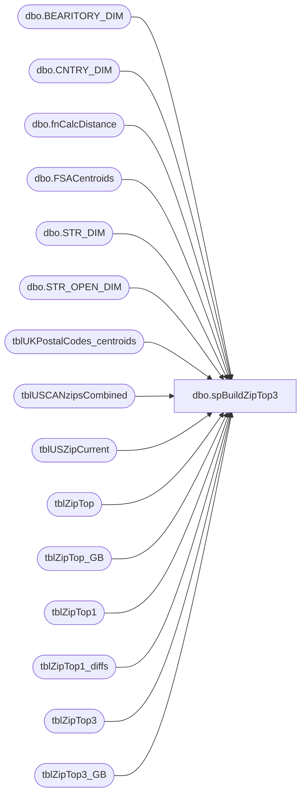

# dbo.spBuildZipTop3

**Database:** dw  
**Server:** papamart  

## Architecture Diagram



## Table Dependencies

| Referenced Table |
|---|
| dbo.BEARITORY_DIM |
| dbo.CNTRY_DIM |
| dbo.fnCalcDistance |
| dbo.FSACentroids |
| dbo.STR_DIM |
| dbo.STR_OPEN_DIM |
| tblUKPostalCodes_centroids |
| tblUSCANzipsCombined |
| tblUSZipCurrent |
| tblZipTop |
| tblZipTop_GB |
| tblZipTop1 |
| tblZipTop1_diffs |
| tblZipTop3 |
| tblZipTop3_GB |

## Stored Procedure Code

```sql
CREATE procedure [dbo].[spBuildZipTop3]
AS
-- =============================================================================================================
-- Name: spBuildZipTop3
--
-- Description:	builds zip code tables for distance calculations and export to Kodiak and Bearwebdb
--
-- Input:		@startdate			
--				@enddate
--
-- Output: 
--
-- Dependencies: 
--
-- Revision History
--		Name:			Date:			Comments:
--		Dave Rice						Created
--		Keith Missey	8/26/2008		uncommented code to drop/create table tblziptop1_diff
--		Radhika Kamath	8/26/2009		select only stores with id's < 1000 to stop the unwanted return of RZ locations
--		Mike Pelikan	05/24/2013		Rewriten to use StoreMDM, Common Table Expressions. Reduced runtime from 31 min to 3 min
--		Mike Pelikan	02/20/2014		Added ; after line preceding CTEs after updating database Compatablility level to 9
--		Mike Pelikan	03/14/2014		Added exceptions area
--		Mike Pelikan	04/29/2014		Changed BABWMSTRDATA linked server reference
-- =============================================================================================================

SET NOCOUNT ON 
DECLARE  @Startdate datetime, @EndDate datetime

-- we look one month into the future to give some breathing room.  4 weeks might be too long, and one week
-- might be too short, if we have problems running the job then we could fall behind.
--
-- we are supposed to run this every week, so, as long as we know what it is doing, we should be fine

-- SET @Startdate = dateadd(mm,3,getdate()) -- lord knows why we were looking 3 months out
SET @Startdate = dateadd(mm,1,getdate())
--SET @Startdate = getdate()
SET @Enddate = '01/01/1990'

-- ***************************************************************************************************************************
/*
ziptop1 is used by dan's process to update all the customer records for the nearest store

the problem is that there are a whole lot uk and ca postal codes.  to calculate each one 
is very expensive.  So, what we can do is take a cluster of the lat/lons down to the prefix 
level and then use a representive postal code for all the postal codes in the 

went with ziptop1 for dan.  really, when you think about it, a us zipcode should only be close to
one store.  but, it could happen that a house is on the edge of the zipcode and MIGHT be closer to a
different store.  the st louis area could be an example of that.  but, we should be safe.

keep in mind that this is all based on the shortest distance.  large bodies of water or other impediments 
aren't factored in, e.g., the great lakes and the michigan's upper peninsela.

*/
CREATE TABLE #tblZipTop1(
	country		varchar(2) NOT NULL,
	postal_code varchar(10) NOT NULL,
	store_key	int NOT NULL,
	distance float NOT NULL
)
-- ***************************************************************************************************************************

DROP INDEX tblZipTop3.idxC_NU_tblZipTop3_sZip_iStore 
DROP INDEX tblZipTop.idxC_NU_tblZipTop_sZip_iStore 

DROP INDEX tblZipTop3_GB.idxC_NU_tblZipTop3_GB_sZip_iStore 
DROP INDEX tblZipTop_GB.idxC_NU_tblZipTop_GB_sZip_iStore 

DROP INDEX tblZipTop1.idxC_NU_tblZipTop1_postal_code 

TRUNCATE TABLE tblZipTop3
TRUNCATE TABLE tblZipTop
TRUNCATE TABLE tblZipTop3_GB
TRUNCATE TABLE tblZipTop_GB
TRUNCATE TABLE tblUSCANzipsCombined
--TRUNCATE TABLE tblZipTop1_diffs
--/* Combine US and Canada zips */

INSERT INTO tblUSCANzipsCombined
SELECT ZIP, LAT, LON 
FROM tblUSZipCurrent
UNION ALL
SELECT FSA, Lat, Lon FROM dbo.FSACentroids

/*Get Open Stores */
SELECT s.STR_NUM, s.STR_ID, b.NM Bearitory, c.NM_ABBRV Country, s.LATITUDE, s.LONGITUDE, qry.STR_TYPE_KEY
INTO #STR_DIM
FROM KODIAK.BABWMstrData.dbo.STR_DIM s
INNER JOIN KODIAK.BABWMstrData.dbo.BEARITORY_DIM b on s.BEARITORY_ID = b.BEARITORY_ID
INNER JOIN KODIAK.BABWMstrData.dbo.CNTRY_DIM c on s.CNTRY_ID = c.CNTRY_ID
INNER JOIN (
		SELECT STR_KEY, STR_TYPE_KEY
			FROM KODIAK.BABWMstrData.dbo.STR_OPEN_DIM WHERE @Startdate BETWEEN OPEN_DT AND CLOSE_DT
		UNION
		SELECT STR_KEY, STR_TYPE_KEY
			FROM KODIAK.BABWMstrData.dbo.STR_OPEN_DIM 
			WHERE PERM_CLOSE = 0 AND @Startdate > CLOSE_DT 
			AND STR_KEY NOT IN (SELECT STR_KEY FROM KODIAK.BABWMstrData.dbo.STR_OPEN_DIM WHERE @Startdate BETWEEN OPEN_DT AND CLOSE_DT)
			AND STR_KEY NOT IN (SELECT STR_KEY FROM KODIAK.BABWMstrData.dbo.STR_OPEN_DIM WHERE @Startdate > CLOSE_DT  AND PERM_CLOSE = 1)		
			GROUP BY STR_KEY, STR_TYPE_KEY
) qry ON s.STR_ID = qry.STR_KEY
WHERE s.Latitude IS NOT NULL
AND s.STR_NUM NOT IN (17, 155, 179, 180, 209, 212, 285);

-- ************************************************************************************************************
-- * figure out US/CA
-- ************************************************************************************************************
WITH T AS 
(
    SELECT ROW_NUMBER() OVER ( PARTITION BY sZip ORDER BY dist ASC ) AS 'RowNumber', * 
    FROM 
		(
			SELECT z.zip sZip, s.STR_NUM iStore, @StartDate start_date, @EndDate end_date, 
			dbo.fnCalcDistance(s.Latitude, s.Longitude, z.LAT, z.LON) dist, STR_TYPE_KEY, s.country	
			FROM #STR_DIM s 
			CROSS JOIN tblUSCANzipsCombined z WITH (NOLOCK)
				WHERE s.country IN ('US', 'CA')
		) qry
)
SELECT RowNumber, sZip, iStore, start_date, end_date, STR_TYPE_KEY, dist, country
INTO #a
FROM T
WHERE RowNumber <= 4 
---------------------------------------------------------------------------------------------------
-- Exceptions (due to street layout or centroid vs actual zip codes)
---------------------------------------------------------------------------------------------------
OR (szip = '08096' AND iStore = 114)

DELETE FROM #a WHERE szip = '08096' AND iStore = 62
UPDATE #a 
SET RowNumber = 3 WHERE szip = '08096' AND iStore = 114
---------------------------------------------------------------------------------------------------
-- for the web locations (include Stadiums)
INSERT INTO tblZipTop3 (sZip, iStore, start_date, end_date, distance)
SELECT sZip, iStore, start_date, end_date, dist FROM #a WHERE RowNumber <= 3

---------------For dw and PartyDB--Need Top 3 (No Stadiums)-----------------------
DELETE FROM #a WHERE STR_TYPE_KEY NOT IN (3, 4);

WITH T AS 
(
    SELECT ROW_NUMBER() OVER ( PARTITION BY sZip ORDER BY dist ASC ) AS 'RowNumber', sZip, iStore, start_date, end_date, dist 
    FROM 
		(
			SELECT sZip, iStore, start_date, end_date, dist
			FROM #a 			
		) qry
    )
INSERT INTO tblZipTop (sZip, iStore, start_date, end_date, distance)
SELECT sZip, iStore, start_date, end_date, dist
FROM T
WHERE RowNumber <= 3

INSERT INTO #tblZipTop1 (country, postal_code, store_key, distance)
SELECT country, sZip, iStore, dist
FROM #a 
WHERE RowNumber <= 1

TRUNCATE TABLE #a;
-- ************************************************************************************************************
-- * figure out the UK/GB
-- ************************************************************************************************************
WITH T AS 
(
    SELECT ROW_NUMBER() OVER ( PARTITION BY sZip ORDER BY dist ASC ) AS 'RowNumber', * 
    FROM 
		(
			SELECT z.postcode sZip, s.STR_NUM iStore, @StartDate start_date, @EndDate end_date, 
			dbo.fnCalcDistance(s.Latitude, s.Longitude, z.LAT, z.LON) dist, STR_TYPE_KEY, s.country		
			FROM #STR_DIM s 
			CROSS JOIN tblUKPostalCodes_centroids z WITH (NOLOCK)
			WHERE s.country NOT IN ('US', 'CA')
		) qry
)
INSERT INTO #a
SELECT RowNumber, sZip, iStore, start_date, end_date, STR_TYPE_KEY, dist, country	
FROM T
WHERE RowNumber <= 4

-- for the web locations (include Stadiums)
INSERT INTO tblZipTop3_GB (sZip, iStore, start_date, end_date, distance)
SELECT sZip, iStore, start_date, end_date, dist FROM #a WHERE RowNumber <= 3

---------------For dw and PartyDB--Need Top 3 (No Stadiums)-----------------------
DELETE FROM #a WHERE STR_TYPE_KEY NOT IN (3, 4);

WITH T AS 
(
    SELECT ROW_NUMBER() OVER ( PARTITION BY sZip ORDER BY dist ASC ) AS 'RowNumber', sZip, iStore, start_date, end_date, dist 
    FROM 
		(
			SELECT sZip, iStore, start_date, end_date, dist
			FROM #a 			
		) qry
    )
INSERT INTO tblZipTop3_GB (sZip, iStore, start_date, end_date, distance)
SELECT sZip, iStore, start_date, end_date, dist
FROM T
WHERE RowNumber <= 3

INSERT INTO #tblZipTop1 (country, postal_code, store_key, distance)
SELECT country, sZip, iStore, dist
FROM #a
WHERE RowNumber <= 1

CREATE  CLUSTERED  INDEX idxC_NU_tblZipTop3_sZip_iStore ON dbo.tblZipTop3(sZip, iStore) WITH  FILLFACTOR = 100
CREATE  CLUSTERED  INDEX idxC_NU_tblZipTop_sZip_iStore ON dbo.tblZipTop(sZip, iStore) WITH  FILLFACTOR = 100

CREATE  CLUSTERED  INDEX idxC_NU_tblZipTop3_GB_sZip_iStore ON dbo.tblZipTop3_GB(sZip, iStore) WITH  FILLFACTOR = 100
CREATE  CLUSTERED  INDEX idxC_NU_tblZipTop_GB_sZip_iStore ON dbo.tblZipTop_GB(sZip, iStore) WITH  FILLFACTOR = 100


-- ***************************************************************************************************************************
-- look for any differences
-- ***************************************************************************************************************************

INSERT INTO tblZipTop1_diffs (datestamp, country, postal_code, old_store_key, new_store_key, old_distance, new_distance) 
-- find any changes
SELECT GETDATE(), z.country, z.postal_code, z.store_key, t.store_key, z.distance, t.distance
FROM tblZipTop1 z WITH (NOLOCK)
	join #tblZipTop1 t on t.country = z.country and t.postal_code = z.postal_code
WHERE (t.store_key != z.store_key
	or t.distance != z.distance)
UNION
-- find any missing ones
SELECT GETDATE(), z.country, z.postal_code, z.store_key, t.store_key, z.distance, t.distance
FROM tblZipTop1 z WITH (NOLOCK)
left join #tblZipTop1 t on t.country = z.country and t.postal_code = z.postal_code
WHERE t.postal_code is null
UNION
-- find any new ones
SELECT GETDATE(), t.country, t.postal_code, z.store_key, t.store_key, z.distance, t.distance
FROM tblZipTop1 z WITH (NOLOCK)
	right join #tblZipTop1 t on t.country = z.country and t.postal_code = z.postal_code
WHERE z.postal_code is null

-- remove anything really old so that we don't keep redoing those
DELETE FROM tblZipTop1_diffs
WHERE datestamp < dateadd(mm, -2, getdate())

-- ***************************************************************************************************************************
-- sync up the ziptop1 table
-- ***************************************************************************************************************************
TRUNCATE TABLE tblZipTop1

INSERT INTO tblZipTop1 (country, postal_code, store_key, distance)
SELECT country, postal_code, store_key, distance 
FROM #tblZipTop1 

CREATE  CLUSTERED  INDEX idxC_NU_tblZipTop1_postal_code ON dbo.tblZipTop1(postal_code) WITH  FILLFACTOR = 100
```

