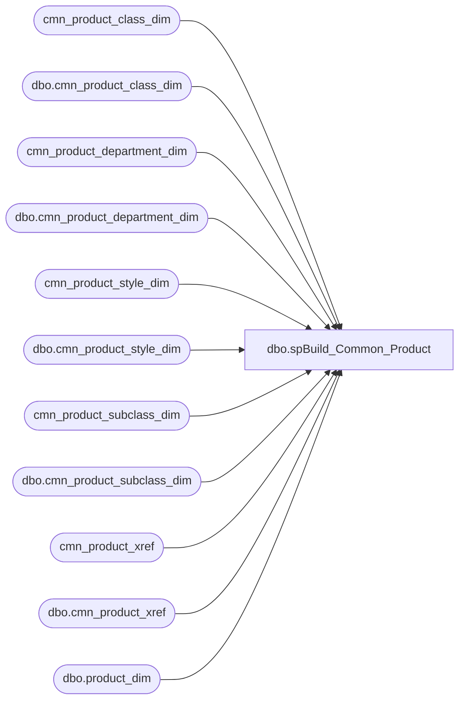

# dbo.spBuild_Common_Product

**Database:** dw  
**Server:** papamart  

## Architecture Diagram



## Table Dependencies

| Referenced Table |
|---|
| cmn_product_class_dim |
| dbo.cmn_product_class_dim |
| cmn_product_department_dim |
| dbo.cmn_product_department_dim |
| cmn_product_style_dim |
| dbo.cmn_product_style_dim |
| cmn_product_subclass_dim |
| dbo.cmn_product_subclass_dim |
| cmn_product_xref |
| dbo.cmn_product_xref |
| dbo.product_dim |

## Stored Procedure Code

```sql
-- =============================================
-- Author:		Gary Murrish
-- Create date: 9/3/2011
-- Description:	Construct the Common Product Dimensions
-- Change Log
--				2015-01-06	Kevin Shyr	No Longer needing geography information to build common product hierarchy
-- =============================================
CREATE PROCEDURE [dbo].[spBuild_Common_Product]
AS
BEGIN
	-- SET NOCOUNT ON added to prevent extra result sets from
	-- interfering with SELECT statements.
	SET NOCOUNT ON;
	/* Construct Common Product Dimension */

	--		----------------------------------------------------
	--				D E P A R T M E N T
	--		----------------------------------------------------
	TRUNCATE TABLE cmn_product_department_dim;

	IF OBJECT_ID('tempdb.dbo.#tmpDepartments') IS NOT NULL
		DROP TABLE #tmpDepartments;

	SELECT
		department_code,
		MIN(department) AS department
	INTO #tmpDepartments
	FROM
		dbo.product_dim WITH(NOLOCK)
	WHERE
		department_code IS NOT NULL
	GROUP BY department_code
	ORDER BY department_code;
	
	-- insert relocated styles first
	INSERT INTO cmn_product_department_dim
		(	cmn_department_code,
			cmn_department)
		SELECT
			RIGHT(department_code, 2),
			department
		FROM
			#tmpDepartments WITH(NOLOCK)
		WHERE
			LEFT(department_code, 1) IN ('W')
		GROUP BY RIGHT(department_code, 2),
			department
	
	-- Insert missing ones from old US hierarchy first
	INSERT INTO cmn_product_department_dim
		(	cmn_department_code,
			cmn_department)
		SELECT DISTINCT
			RIGHT(ins_c.department_code, 2)
			, ins_c.department
		FROM
			#tmpDepartments ins_c WITH(NOLOCK)
			LEFT OUTER JOIN cmn_product_department_dim ins_ref WITH(NOLOCK)
				ON RIGHT(ins_c.department_code, 2) = ins_ref.cmn_department_code
		WHERE
			ins_ref.cmn_department_code IS NULL
			AND LEFT(department_code, 5) IN ('R-B-D');

	-- Insert missing ones from Canada and UK
	INSERT INTO cmn_product_department_dim
		(	cmn_department_code,
			cmn_department)
		SELECT DISTINCT
			RIGHT(ins_c.department_code, 2)
			, ins_c.department
		FROM
			#tmpDepartments ins_c WITH(NOLOCK)
			LEFT OUTER JOIN cmn_product_department_dim ins_ref WITH(NOLOCK)
				ON RIGHT(ins_c.department_code, 2) = ins_ref.cmn_department_code
		WHERE
			ins_ref.cmn_department_code IS NULL
			AND LEFT(department_code, 5) IN ('R-B-U', 'R-B-C');
			
	-- Insert missing ones from Zhu Zhu
	INSERT INTO cmn_product_department_dim
		(	cmn_department_code,
			cmn_department)
		SELECT DISTINCT
			RIGHT(ins_c.department_code, 4)
			, MIN(ins_c.department)
		FROM
			#tmpDepartments ins_c WITH(NOLOCK)
			LEFT OUTER JOIN cmn_product_department_dim ins_ref WITH(NOLOCK)
				ON RIGHT(ins_c.department_code, 4) = ins_ref.cmn_department_code
		WHERE
			ins_ref.cmn_department_code IS NULL
			AND LEFT(department_code, 5) IN ('R-B-Z')
		GROUP BY RIGHT(department_code, 4);
			
	-- Insert missing ones 
	INSERT INTO cmn_product_department_dim
		(	cmn_department_code,
			cmn_department)
		SELECT DISTINCT
			RIGHT(ins_c.department_code, 2)
			, MIN(ins_c.department)
		FROM
			#tmpDepartments ins_c WITH(NOLOCK)
			LEFT OUTER JOIN cmn_product_department_dim ins_ref WITH(NOLOCK)
				ON RIGHT(ins_c.department_code, 2) = ins_ref.cmn_department_code
		WHERE
			ins_ref.cmn_department_code IS NULL
			AND LEFT(department_code, 1) = 'R'
			AND LEFT(department_code, 5) <> 'R-B-Z'
		GROUP BY RIGHT(ins_c.department_code, 2);

	-- Insert an Unknown entry
	INSERT INTO dbo.cmn_product_department_dim
		(	cmn_department_code,
			cmn_department)
	VALUES
		(	'Unknown',
			'Unknown');

	--		----------------------------------------------------
	--         C L A S S
	--		----------------------------------------------------
	TRUNCATE TABLE cmn_product_class_dim;

	IF OBJECT_ID('tempdb.dbo.#tmpClass') IS NOT NULL
		DROP TABLE #tmpClass;
	
	SELECT
		LEFT(subclass_code, 11) AS class_code,
		MIN(class) AS description
	INTO #tmpClass
	FROM
		dbo.product_dim WITH (NOLOCK)
	WHERE
		department_code IS NOT NULL
		AND subclass_code IS NOT NULL
	GROUP BY LEFT(subclass_code, 11);

	-- Insert newly relocated Classes
	INSERT INTO dbo.cmn_product_class_dim
		(	cmn_class_code,
			cmn_class,
			cmn_department_code)
		SELECT
			CAST(RIGHT(class_code, 5) AS varchar(7)),
			description,
			CAST(LEFT(RIGHT(class_code, 5), 2) AS varchar(4))
		FROM
			#tmpClass
		WHERE
			LEFT(class_code, 1) IN ('W')
		GROUP BY 
			CAST(RIGHT(class_code, 5) AS varchar(7)),
			description,
			CAST(LEFT(RIGHT(class_code, 5), 2) AS varchar(4));
	
	-- Insert from old hierarchy the US Classes
	INSERT INTO dbo.cmn_product_class_dim
		(	cmn_class_code,
			cmn_class,
			cmn_department_code)
		SELECT
			CAST(RIGHT(class_code, 5) AS varchar(7)),
			description,
			CAST(LEFT(RIGHT(class_code, 5), 2) AS varchar(4))
		FROM
			#tmpClass tmp
			LEFT JOIN dbo.cmn_product_class_dim cmn
				ON RIGHT(tmp.class_code, 5) = cmn.cmn_class_code
		WHERE
			cmn.cmn_class_code IS NULL
			AND LEFT(class_code, 5) = 'R-B-D';

	-- Insert any Missing Classes	
	INSERT INTO dbo.cmn_product_class_dim
		(	cmn_class_code,
			cmn_class,
			cmn_department_code)
		SELECT
			RIGHT(tmp.class_code, 5),
			MIN(tmp.description),
			LEFT(RIGHT(tmp.class_code, 5), 2)
		FROM
			#tmpClass tmp
			LEFT JOIN dbo.cmn_product_class_dim cmn
				ON RIGHT(tmp.class_code, 5) = cmn.cmn_class_code
		WHERE
			cmn.cmn_class_code IS NULL
			AND LEFT(class_code, 5) IN ('R-B-C', 'R-B-U')
		GROUP BY RIGHT(tmp.class_code, 5);

	-- Insert R-B-Z Classes	
	INSERT INTO dbo.cmn_product_class_dim
		(	cmn_class_code,
			cmn_class,
			cmn_department_code)
		SELECT
			RIGHT(LEFT(subclass_code, 11), 7) AS class_code,
			MIN(class) AS description,
			MIN(RIGHT(department_code, 4)) AS department_code
		FROM
			dbo.product_dim WITH (NOLOCK)
		WHERE
			LEFT(department_code, 5) IN ('R-B-Z')
		GROUP BY RIGHT(LEFT(subclass_code, 11), 7);
		
	-- Insert any Missing Classes	
	INSERT INTO dbo.cmn_product_class_dim
		(	cmn_class_code,
			cmn_class,
			cmn_department_code)
		SELECT
			RIGHT(tmp.class_code, 5),
			MIN(tmp.description),
			LEFT(RIGHT(tmp.class_code, 5), 2)
		FROM
			#tmpClass tmp
			LEFT JOIN dbo.cmn_product_class_dim cmn
				ON RIGHT(tmp.class_code, 5) = cmn.cmn_class_code
		WHERE
			cmn.cmn_class_code IS NULL
			AND LEFT(class_code, 1) = 'R'
			AND LEFT(class_code, 5) <> 'R-B-Z'
		GROUP BY RIGHT(tmp.class_code, 5);

	-- Insert an Unknown Entry
	INSERT INTO dbo.cmn_product_class_dim
		(	cmn_class_code,
			cmn_class,
			cmn_department_code)
	VALUES
		(	'Unknown',
			'Unknown',
			'Unknown');

	--		----------------------------------------------------
	--			S U B C L A S S
	--		----------------------------------------------------
	TRUNCATE TABLE cmn_product_subclass_dim;

	IF OBJECT_ID('tempdb.dbo.#tmpSubClass') IS NOT NULL
		DROP TABLE #tmpSubclass;

	SELECT
		subclass_code,
		MIN(subclass) AS description
	INTO #tmpSubclass
	FROM
		dbo.product_dim WITH (NOLOCK)
	WHERE
		subclass_code IS NOT NULL
	GROUP BY subclass_code;
	
	-- insert relocated styles first
	INSERT INTO dbo.cmn_product_subclass_dim
		(	cmn_subclass_code,
			cmn_subclass,
			cmn_class_code)
		SELECT
			CAST(RIGHT(subclass_code, 8) AS varchar(10)) AS cmnSubClass_code,
			description,
			CAST(LEFT(RIGHT(subclass_code, 8), 5) AS varchar(7)) AS cmnClass_Code
		FROM
			#tmpSubclass
		WHERE 
			LEFT(subclass_code, 1) IN ('W')
		GROUP BY 
			CAST(RIGHT(subclass_code, 8) AS varchar(10)),
			description,
			CAST(LEFT(RIGHT(subclass_code, 8), 5) AS varchar(7));

	-- Insert the US Subclasses
	INSERT INTO dbo.cmn_product_subclass_dim
		(	cmn_subclass_code,
			cmn_subclass,
			cmn_class_code)
		SELECT
			CAST(RIGHT(subclass_code, 8) AS varchar(10)) AS cmnSubClass_code,
			description,
			CAST(LEFT(RIGHT(subclass_code, 8), 5) AS varchar(7)) AS cmnClass_Code
		FROM
			#tmpSubclass tmp
			LEFT JOIN dbo.cmn_product_subclass_dim cmn
				ON RIGHT(tmp.subclass_code, 8) = cmn.cmn_subclass_code
		WHERE
			cmn.cmn_subclass_code IS NULL
			AND LEFT(subclass_code, 5) = 'R-B-D';

	-- Insert Missing SubClasses	
	INSERT INTO dbo.cmn_product_subclass_dim
		(	cmn_subclass_code,
			cmn_subclass,
			cmn_class_code)
		SELECT DISTINCT
			RIGHT(tmp.subclass_code, 8) AS cmnsubClass_code,
			MIN(tmp.description),
			LEFT(RIGHT(tmp.subclass_code, 8), 5) AS cmnclass_Code
		FROM
			#tmpSubclass tmp
			LEFT JOIN dbo.cmn_product_subclass_dim cmn
				ON RIGHT(tmp.subclass_code, 8) = cmn.cmn_subclass_code
		WHERE
			cmn.cmn_subclass_code IS NULL
			AND LEFT(subclass_code, 5) IN ('R-B-C', 'R-B-U')
		GROUP BY RIGHT(tmp.subclass_code, 8);

	-- Insert R-B-Z subclasses
	INSERT INTO dbo.cmn_product_subclass_dim
		(	cmn_subclass_code,
			cmn_subclass,
			cmn_class_code)
		SELECT
			RIGHT(subclass_code, 10) AS cmnsubclass_code,
			MIN(subclass) AS description,
			MIN(LEFT(RIGHT(subclass_code, 10), 7)) AS cmnClass_Code
		FROM
			dbo.product_dim WITH (NOLOCK)
		WHERE
			LEFT(department_code, 5) IN ('R-B-Z')
		GROUP BY RIGHT(subclass_code, 10);
		
	-- Insert Missing SubClasses	
	INSERT INTO dbo.cmn_product_subclass_dim
		(	cmn_subclass_code,
			cmn_subclass,
			cmn_class_code)
		SELECT DISTINCT
			RIGHT(tmp.subclass_code, 8) AS cmnsubClass_code,
			MIN(tmp.description),
			LEFT(RIGHT(tmp.subclass_code, 8), 5) AS cmnclass_Code
		FROM
			#tmpSubclass tmp
			LEFT JOIN dbo.cmn_product_subclass_dim cmn
				ON RIGHT(tmp.subclass_code, 8) = cmn.cmn_subclass_code
		WHERE
			cmn.cmn_subclass_code IS NULL
			AND LEFT(subclass_code, 1) = 'R'
			AND LEFT(subclass_code, 5) <> 'R-B-Z'
		GROUP BY RIGHT(tmp.subclass_code, 8);

	-- Insert Unknown
	INSERT INTO dbo.cmn_product_subclass_dim
		(	cmn_subclass_code,
			cmn_subclass,
			cmn_class_code)
	VALUES
		(	'Unknown',
			'Unknown',
			'Unknown');

	--		----------------------------------------------------
	--             P R O D U C T
	--		----------------------------------------------------
	TRUNCATE TABLE cmn_product_style_dim;

	IF OBJECT_ID('tempdb.dbo.#tmpProduct') IS NOT NULL
		DROP TABLE #tmpProduct;

	SELECT
		CAST(RIGHT(style_code,5) AS varchar(20)) AS style_code,
		ISNULL(style_desc, 'Unknown') AS description,
		CAST(RIGHT(subclass_code, 8) AS varchar(10)) AS cmnSubClass_Code,
		LEFT(department_code, 5) AS company
	INTO #tmpProduct
	FROM
		dbo.product_dim WITH (NOLOCK)
	WHERE
		style_code IS NOT NULL
	--GROUP BY CAST(RIGHT(style_code,5) AS varchar(20));

	-- insert newly relocated styles first
	INSERT INTO dbo.cmn_product_style_dim
		(	cmn_style_code,
			description,
			cmn_subclass_code)
		SELECT
			RIGHT(style_code, 5) AS cmnStyle_code,
			MIN(description) AS description,
			MIN(cmnSubClass_Code) AS cmnSubClass_Code
		FROM
			#tmpProduct
		WHERE 
			LEFT(company, 1) IN ('W')
		GROUP BY RIGHT(style_code, 5);
		
	-- Insert US styles from old hierarchy
	INSERT INTO dbo.cmn_product_style_dim
		(	cmn_style_code,
			description,
			cmn_subclass_code)
		SELECT
			RIGHT(style_code, 5) AS cmnStyle_code,
			MIN(tmp.description) AS description,
			MIN(cmnSubClass_Code) AS cmnSubClass_Code
		FROM
			#tmpProduct tmp
			LEFT JOIN dbo.cmn_product_style_dim cmn
				ON tmp.style_code = cmn.cmn_style_code
		WHERE
			cmn.cmn_style_code IS NULL
			AND company IN ('R-B-D')
		GROUP BY RIGHT(style_code, 5);
		
	-- Insert US styles from old hierarchy
	INSERT INTO dbo.cmn_product_style_dim
		(	cmn_style_code,
			description,
			cmn_subclass_code)
		SELECT
			RIGHT(style_code, 5) AS cmnStyle_code,
			MIN(tmp.description) AS description,
			MIN(cmnSubClass_Code) AS cmnSubClass_Code
		FROM
			#tmpProduct tmp
			LEFT JOIN dbo.cmn_product_style_dim cmn
				ON tmp.style_code = cmn.cmn_style_code
		WHERE
			cmn.cmn_style_code IS NULL
			AND company IN ('R-B-C', 'R-B-U')
		GROUP BY RIGHT(style_code, 5);

	-- Get the R-B-Z Styles from old hierarchy
	INSERT INTO #tmpProduct
		(	style_code,
			description,
			cmnSubClass_Code,
			company)
		SELECT
			'Z' + style_code,
			MIN(style_desc) AS description,
			CAST(MIN(RIGHT(subclass_code, 10)) AS varchar(10)) AS cmnSubClass_Code,
			MIN(LEFT(department_code, 5)) AS company
		FROM
			dbo.product_dim WITH (NOLOCK)
		WHERE
			LEFT(department_code, 5) IN ('R-B-Z')
		GROUP BY style_code;

	-- Insert missing Products; These are the non-US styles that are not a US style
	INSERT INTO dbo.cmn_product_style_dim
		(	cmn_style_code,
			description,
			cmn_subclass_code)
		SELECT
			--RIGHT(tmp.style_code, 5)
			tmp.style_code AS cmnStyle_code,
			MIN(tmp.description) AS description,
			MIN(tmp.cmnSubClass_Code) AS cmnSubClass_Code
		FROM
			#tmpProduct tmp
			LEFT JOIN dbo.cmn_product_style_dim cmn
				ON tmp.style_code = cmn.cmn_style_code
		WHERE
			cmn.cmn_style_code IS NULL
			AND tmp.cmnSubClass_Code IS NOT NULL
		GROUP BY --RIGHT(tmp.style_code, 5)
			tmp.style_code

	-- Insert Unknown
	INSERT INTO dbo.cmn_product_style_dim
		(	cmn_style_code,
			description,
			cmn_subclass_code)
	VALUES
		(	'Unknown',
			'Unknown',
			'Unknown');

	--		----------------------------------------------------
	--             P R O D U C T   X R E F
	--		----------------------------------------------------
	TRUNCATE TABLE cmn_product_xref;

	-- Get the matches
	
	-- Get the matches
	INSERT INTO dbo.cmn_product_xref
		(	product_key,
			cmn_style_code)
		SELECT
			prd.product_key,
			cmn.cmn_style_code
		FROM
			(SELECT
					prd.product_key,
					CASE
						WHEN LEFT(prd.department_code, 5) = 'R-B-Z' THEN 'Z' + prd.style_code
						ELSE RIGHT(prd.style_code, 5)
					END AS style_code
				FROM
					dbo.product_dim prd WITH (NOLOCK)
			) prd
				INNER JOIN dbo.cmn_product_style_dim cmn WITH (NOLOCK)
					ON --RIGHT(prd.style_code, 5) 
					prd.style_code = cmn.cmn_style_code;

	-- Insert the missing ones
	INSERT INTO dbo.cmn_product_xref
		(	product_key,
			cmn_style_code)
		SELECT
			prd.product_key,
			'UNKNOWN'
		FROM
			(SELECT
					prd.product_key,
					CASE
						WHEN LEFT(prd.department_code, 5) = 'R-B-Z' THEN 'Z' + prd.style_code
						ELSE RIGHT(prd.style_code, 5)
					END AS style_code
				FROM
					dbo.product_dim prd WITH (NOLOCK)
			) prd
				LEFT JOIN dbo.cmn_product_style_dim cmn WITH (NOLOCK)
					ON --RIGHT(prd.style_code, 5) 
					prd.style_code = cmn.cmn_style_code
		WHERE
			cmn.cmn_style_code IS NULL;
END;


/******************************  Old Product code  *****************************/
/******************************  Old Product code  *****************************/
/******************************  Old Product code  *****************************/
/******************************  Old Product code  *****************************/
/*
	/* Construct Common Product Dimension */

	--		----------------------------------------------------
	--				D E P A R T M E N T
	--		----------------------------------------------------
	TRUNCATE TABLE cmn_product_department_dim;

	IF OBJECT_ID('tempdb.dbo.#tmpDepartments') IS NOT NULL
		DROP TABLE #tmpDepartments;

	SELECT
		department_code,
		MIN(department) AS department
	INTO #tmpDepartments
	FROM
		dbo.product_dim WITH(NOLOCK)
	WHERE
		LEFT(department_code, 5) IN ('R-B-C', 'R-B-D', 'R-B-U')
	GROUP BY department_code
	ORDER BY department_code;

	-- Insert US Departments
	INSERT INTO cmn_product_department_dim
		(	cmn_department_code,
			cmn_department)
		SELECT
			RIGHT(department_code, 2),
			department
		FROM
			#tmpDepartments WITH(NOLOCK)
		WHERE
			LEFT(department_code, 5) = 'R-B-D';
	
	-- Insert missing ones 
	INSERT INTO cmn_product_department_dim
		(	cmn_department_code,
			cmn_department)
		SELECT DISTINCT
			RIGHT(ins_c.department_code, 2)
			, ins_c.department
		FROM
			#tmpDepartments ins_c WITH(NOLOCK)
			LEFT OUTER JOIN cmn_product_department_dim ins_ref WITH(NOLOCK)
				ON RIGHT(ins_c.department_code, 2) = ins_ref.cmn_department_code
		WHERE
			ins_ref.cmn_department_code IS NULL;

	-- Insert R-B-Z Departments
	INSERT INTO dbo.cmn_product_department_dim
		(	cmn_department_code,
			cmn_department)
		SELECT
			RIGHT(department_code, 4) AS department_code,
			MIN(department) AS department
		FROM
			dbo.product_dim WITH (NOLOCK)
		WHERE
			LEFT(department_code, 5) IN ('R-B-Z')
		GROUP BY RIGHT(department_code, 4);

	-- Insert an Unknown entry
	INSERT INTO dbo.cmn_product_department_dim
		(	cmn_department_code,
			cmn_department)
	VALUES
		(	'Unknown',
			'Unknown');

	--		----------------------------------------------------
	--         C L A S S
	--		----------------------------------------------------
	TRUNCATE TABLE cmn_product_class_dim;

	IF OBJECT_ID('tempdb.dbo.#tmpClass') IS NOT NULL
		DROP TABLE
		#tmpClass;
	SELECT
		LEFT(subclass_code, 11) AS class_code,
		MIN(class) AS description
	INTO #tmpClass
	FROM
		dbo.product_dim WITH (NOLOCK)
	WHERE
		LEFT(department_code, 5) IN ('R-B-C', 'R-B-D', 'R-B-U')
	GROUP BY LEFT(subclass_code, 11);

	-- Insert the US Classes
	INSERT INTO dbo.cmn_product_class_dim
		(	cmn_class_code,
			cmn_class,
			cmn_department_code)
		SELECT
			CAST(RIGHT(class_code, 5) AS varchar(7)),
			description,
			CAST(LEFT(RIGHT(class_code, 5), 2) AS varchar(4))
		FROM
			#tmpClass
		WHERE
			LEFT(class_code, 5) = 'R-B-D';

	-- Insert any Missing Classes	
	INSERT INTO dbo.cmn_product_class_dim
		(	cmn_class_code,
			cmn_class,
			cmn_department_code)
		SELECT
			RIGHT(tmp.class_code, 5),
			MIN(tmp.description),
			LEFT(RIGHT(tmp.class_code, 5), 2)
		FROM
			#tmpClass tmp
			LEFT JOIN dbo.cmn_product_class_dim cmn
				ON RIGHT(tmp.class_code, 5) = cmn.cmn_class_code
		WHERE
			cmn.cmn_class_code IS NULL
		GROUP BY RIGHT(tmp.class_code, 5);

	-- Insert R-B-Z Classes	
	INSERT INTO dbo.cmn_product_class_dim
		(	cmn_class_code,
			cmn_class,
			cmn_department_code)
		SELECT
			RIGHT(LEFT(subclass_code, 11), 7) AS class_code,
			MIN(class) AS description,
			MIN(RIGHT(department_code, 4)) AS department_code
		FROM
			dbo.product_dim WITH (NOLOCK)
		WHERE
			LEFT(department_code, 5) IN ('R-B-Z')
		GROUP BY RIGHT(LEFT(subclass_code, 11), 7);

	-- Insert an Unknown Entry
	INSERT INTO dbo.cmn_product_class_dim
		(	cmn_class_code,
			cmn_class,
			cmn_department_code)
	VALUES
		(	'Unknown',
			'Unknown',
			'Unknown');

	--		----------------------------------------------------
	--			S U B C L A S S
	--		----------------------------------------------------
	TRUNCATE TABLE cmn_product_subclass_dim;

	IF OBJECT_ID('tempdb.dbo.#tmpSubClass') IS NOT NULL
		DROP TABLE
		#tmpSubclass;
	SELECT
		subclass_code,
		MIN(subclass) AS description
	INTO #tmpSubclass
	FROM
		dbo.product_dim WITH (NOLOCK)
	WHERE
		LEFT(department_code, 5) IN ('R-B-C', 'R-B-D', 'R-B-U')
	GROUP BY subclass_code;

	-- Insert the US Subclasses
	INSERT INTO dbo.cmn_product_subclass_dim
		(	cmn_subclass_code,
			cmn_subclass,
			cmn_class_code)
		SELECT
			CAST(RIGHT(subclass_code, 8) AS varchar(10)) AS cmnSubClass_code,
			description,
			CAST(LEFT(RIGHT(subclass_code, 8), 5) AS varchar(7)) AS cmnClass_Code
		FROM
			#tmpSubclass
		WHERE
			LEFT(subclass_code, 5) = 'R-B-D';

	-- Insert Missing Classes	
	INSERT INTO dbo.cmn_product_subclass_dim
		(	cmn_subclass_code,
			cmn_subclass,
			cmn_class_code)
		SELECT
			RIGHT(tmp.subclass_code, 8) AS cmnsubClass_code,
			MIN(tmp.description),
			LEFT(RIGHT(tmp.subclass_code, 8), 5) AS cmnclass_Code
		FROM
			#tmpSubclass tmp
			LEFT JOIN dbo.cmn_product_subclass_dim cmn
				ON RIGHT(tmp.subclass_code, 8) = cmn.cmn_subclass_code
		WHERE
			cmn.cmn_subclass_code IS NULL
		GROUP BY RIGHT(tmp.subclass_code, 8);

	-- Insert R-B-Z
	INSERT INTO dbo.cmn_product_subclass_dim
		(	cmn_subclass_code,
			cmn_subclass,
			cmn_class_code)
		SELECT
			RIGHT(subclass_code, 10) AS cmnsubclass_code,
			MIN(subclass) AS description,
			MIN(LEFT(RIGHT(subclass_code, 10), 7)) AS cmnClass_Code
		FROM
			dbo.product_dim WITH (NOLOCK)
		WHERE
			LEFT(department_code, 5) IN ('R-B-Z')
		GROUP BY RIGHT(subclass_code, 10);

	-- Insert Unknown
	INSERT INTO dbo.cmn_product_subclass_dim
		(	cmn_subclass_code,
			cmn_subclass,
			cmn_class_code)
	VALUES
		(	'Unknown',
			'Unknown',
			'Unknown');

	--		----------------------------------------------------
	--             P R O D U C T
	--		----------------------------------------------------
	TRUNCATE TABLE cmn_product_style_dim;

	IF OBJECT_ID('tempdb.dbo.#tmpProduct') IS NOT NULL
		DROP TABLE
		#tmpProduct;

	SELECT
		CAST(RIGHT(style_code,5) AS varchar(20)) AS style_code,
		ISNULL(MIN(style_desc), 'Unknown') AS description,
		CAST(MIN(RIGHT(subclass_code, 8)) AS varchar(10)) AS cmnSubClass_Code,
		MIN(LEFT(department_code, 5)) AS company
	INTO #tmpProduct
	FROM
		dbo.product_dim WITH (NOLOCK)
	WHERE
		LEFT(department_code, 5) IN ('R-B-C', 'R-B-D', 'R-B-U')
	GROUP BY CAST(RIGHT(style_code,5) AS varchar(20));

	-- Get the R-B-Z Styles
	INSERT INTO #tmpProduct
		(	style_code,
			description,
			cmnSubClass_Code,
			company)
		SELECT
			'Z' + style_code,
			MIN(style_desc) AS description,
			CAST(MIN(RIGHT(subclass_code, 10)) AS varchar(10)) AS cmnSubClass_Code,
			MIN(LEFT(department_code, 5)) AS company
		FROM
			dbo.product_dim WITH (NOLOCK)
		WHERE
			LEFT(department_code, 5) IN ('R-B-Z')
		GROUP BY style_code;


	INSERT INTO dbo.cmn_product_style_dim
		(	cmn_style_code,
			description,
			cmn_subclass_code)
		SELECT
			RIGHT(style_code, 5) AS cmnStyle_code,
			MIN(description) AS description,
			MIN(cmnSubClass_Code) AS cmnSubClass_Code
		FROM
			#tmpProduct
		WHERE
			company = 'R-B-D'
		GROUP BY RIGHT(style_code, 5);

	-- Insert missing Products; These are the non-US styles that are not a US style
	INSERT INTO dbo.cmn_product_style_dim
		(	cmn_style_code,
			description,
			cmn_subclass_code)
		SELECT
			--RIGHT(tmp.style_code, 5)
			tmp.style_code AS cmnStyle_code,
			MIN(tmp.description) AS description,
			MIN(tmp.cmnSubClass_Code) AS cmnSubClass_Code
		FROM
			#tmpProduct tmp
			LEFT JOIN dbo.cmn_product_style_dim cmn
				ON --RIGHT(tmp.style_code, 5) 
				tmp.style_code = cmn.cmn_style_code
		WHERE
			cmn.cmn_style_code IS NULL
		GROUP BY --RIGHT(tmp.style_code, 5)
			tmp.style_code

	-- Insert Unknown
	INSERT INTO dbo.cmn_product_style_dim
		(	cmn_style_code,
			description,
			cmn_subclass_code)
	VALUES
		(	'Unknown',
			'Unknown',
			'Unknown');

	--		----------------------------------------------------
	--             P R O D U C T   X R E F
	--		----------------------------------------------------
	TRUNCATE TABLE cmn_product_xref;

	-- Get the matches
	INSERT INTO dbo.cmn_product_xref
		(	product_key,
			cmn_style_code)
		SELECT
			prd.product_key,
			cmn.cmn_style_code
		FROM

			(SELECT
					prd.product_key,
					CASE
						WHEN LEFT(prd.department_code, 5) = 'R-B-Z' THEN 'Z' + prd.style_code
						ELSE RIGHT(prd.style_code, 5)
					END AS style_code
				FROM
					dbo.product_dim prd WITH (NOLOCK)) prd
			INNER JOIN dbo.cmn_product_style_dim cmn WITH (NOLOCK)
				ON --RIGHT(prd.style_code, 5) 
				prd.style_code = cmn.cmn_style_code;

	-- Insert the missing ones
	INSERT INTO dbo.cmn_product_xref
		(	product_key,
			cmn_style_code)
		SELECT
			prd.product_key,
			'UNKNOWN'
		FROM
			(SELECT
					prd.product_key,
					CASE
						WHEN LEFT(prd.department_code, 5) = 'R-B-Z' THEN 'Z' + prd.style_code
						ELSE RIGHT(prd.style_code, 5)
					END AS style_code
				FROM
					dbo.product_dim prd WITH (NOLOCK)) prd
			LEFT JOIN dbo.cmn_product_style_dim cmn WITH (NOLOCK)
				ON --RIGHT(prd.style_code, 5) 
				prd.style_code = cmn.cmn_style_code
		WHERE
			cmn.cmn_style_code IS NULL;
END;
*/
/******************************  Old Product code  *****************************/
/******************************  Old Product code  *****************************/
/******************************  Old Product code  *****************************/
/******************************  Old Product code  *****************************/
```

