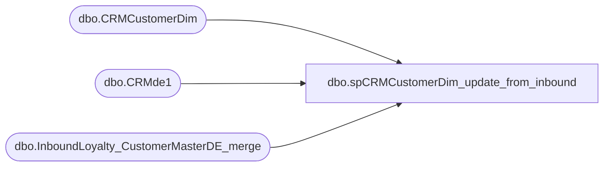

# dbo.spCRMCustomerDim_update_from_inbound

**Database:** dw  
**Server:** papamart  

## Architecture Diagram



## Table Dependencies

| Referenced Table |
|---|
| dbo.CRMCustomerDim |
| dbo.CRMde1 |
| dbo.InboundLoyalty_CustomerMasterDE_merge |

## Stored Procedure Code

```sql
CREATE proc [dbo].[spCRMCustomerDim_update_from_inbound]

-------------------------------------------------------------------------------------------
--Ian Wallace 2023-09-12 -update CRMCUstomerDim from  dwstaging.dbo.InboundLoyalty_CustomerMasterDE_merge
-------------------------------------------------------------------------------------------

as 

 update c set c.[ClubStatus] = i.[status],c.[isBonusCLubMember] = i.[bonusClubMember],c.[MembershipType] = i.[bonusClubMembershipType], c.[CurrentRewardPoints] = i.[bonusClubPointsBalance], 
	c.[MembershipDate]  = i.[bonusClubStartDate],c.[hasOnlineAccount] = i.[hasOnlineAccount] ,c.[SignUpSource]  = i.[bonusClubSignUpSource],c.[CountryCode]  = i.[Country], 
	c.[address_1]  = i.[address_1], c.[address_2]  = i.[address_2], c.[address_3]  = i.[address_3], c.[address_4]  = i.[address_4], c.[PostalCode] = i.[post_code], 
	c.[PhoneNumber] = i.[mobile], c.[Locale]  = i.[locale], c.[TextOptIn]  = i.[text_opt_in], c.[EmailAddress] = i.[EmailAddress], c.[LifetimeTotalPointsEarned]  = i.[LifetimePoints], 
c.[FirstName]  = i.[FirstName], c.[LastName]  = i.[LastName],c.[DataSource] = i.[DataSource]
 from dw.dbo.CRMCustomerDim c
 join dwstaging.dbo.InboundLoyalty_CustomerMasterDE_merge i on c.CustomerNumber = i.customerNumber


 
update d set d.status = i.[status],d.bonusClubMember = i.[bonusCLubMember] ,d.bonusClubMembershipType = i.[bonusClubMembershipType]
from [dbo].[CRMde1] d
 join dwstaging.dbo.InboundLoyalty_CustomerMasterDE_merge i on d.CustomerNumber = i.customerNumber
 --where d.customerNumber = '933929150'
```

