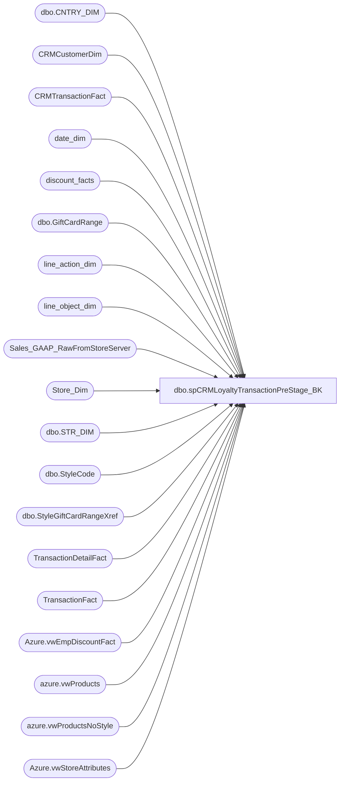

# dbo.spCRMLoyaltyTransactionPreStage_BK

**Database:** dw  
**Server:** papamart  

## Architecture Diagram



## Table Dependencies

| Referenced Table |
|---|
| dbo.CNTRY_DIM |
| CRMCustomerDim |
| CRMTransactionFact |
| date_dim |
| discount_facts |
| dbo.GiftCardRange |
| line_action_dim |
| line_object_dim |
| Sales_GAAP_RawFromStoreServer |
| Store_Dim |
| dbo.STR_DIM |
| dbo.StyleCode |
| dbo.StyleGiftCardRangeXref |
| TransactionDetailFact |
| TransactionFact |
| Azure.vwEmpDiscountFact |
| azure.vwProducts |
| azure.vwProductsNoStyle |
| Azure.vwStoreAttributes |

## Stored Procedure Code

```sql
CREATE proc [dbo].[spCRMLoyaltyTransactionPreStage]

--------------------------------------------------------------------------------------------------------------------------------
--		Dan Tweedie	2022-08-13	- Created proc as part of LoyaltyTransaction staging, destined for Azure, then Salesforce
--								- Drops and Inserts into dwstaging.dbo.tmpLoyaltyTransactionsStage via CRMLoyaltyETL SSIS
--      Ian Wallace 2022-08-31  - modified PurchaseRevenue calc to prevent merch sold < 0 while still allowing a reutrn to be 
--		Dan Tweedie	2022-09-16	- Added pre-stage of WebOrderNumbers w/TransactionID + new columns OrderReference and EmployeeID
--      Ian Wallace 2022-12-01  - Added join to a view of employee discounts to not allow points on those transactions
--------------------------------------------------------------------------------------------------------------------------------


as

set nocount on


--1 sec
IF (Object_ID('tempdb..#stores') IS NOT NULL) DROP TABLE #stores
SELECT	 
	right(('0000' + CAST(sd.STR_NUM AS VARCHAR)), 4) AS StoreNumber,
	CAST(dsd.Store_Key AS VARCHAR) AS StoreKey,
	cd.NM_FULL AS CountryNameFull,
	sa.StoreConcept
into #stores		 
FROM KODIAK.BABWMstrData.dbo.STR_DIM sd
INNER JOIN Store_Dim dsd ON dsd.store_id=sd.STR_NUM
left join KODIAK.BABWMstrData.dbo.CNTRY_DIM cd ON cd.CNTRY_ID=sd.CNTRY_ID
left join [Azure].[vwStoreAttributes] sa on right(('0000' + CAST(sd.STR_NUM AS VARCHAR)), 4) = sa.storenumber
WHERE sd.CMPNY_ID=1 AND sd.STR_ID > 0
--AND (dsd.closing_date>=DATEADD(day, -7, DATEADD(year, -2, DATEADD(yy, DATEDIFF(yy, 0, GETDATE()), 0)))
	--OR dsd.closing_date IS NULL)
AND sd.STR_NUM not between 501 and 505  -- Labs
AND sd.STR_NUM NOT BETWEEN 9001 AND 9100 -- Test Stores

--55 sec
IF (Object_ID('tempdb..#Products') IS NOT NULL) DROP TABLE #Products
select ProductKey,Style,KeyStory,Chain,Department,LicenseCode, Class, SubClass
into #Products
from azure.vwProducts
UNION
select ProductKey,isnull(Style,('N/A' + cast(ProductKey as varchar))) as Style, KeyStory,isnull(Chain,'N/A') as Chain,isnull(Department,'N/A') as Department, LicenseCode, Class, SubClass
from azure.vwProductsNoStyle

--0 sec
IF (Object_ID('tempdb..#GiftCardRanges') IS NOT NULL) DROP TABLE #GiftCardRanges
select s.Style_Code,
	concat(left(left(GiftCardRangeStart,13),1),right(left(GiftCardRangeStart,13),11)) as GiftCardRangeStart,
	concat(left(left(GiftCardRangeEnd,13),1),right(left(GiftCardRangeEnd,13),11)) as GiftCardRangeEnd
into #GiftCardRanges
from kodiaktest.GiftCardMstrData.dbo.GiftCardRange gc
join kodiaktest.GiftCardMstrData.dbo.StyleGiftCardRangeXref x on gc.GiftCardRangeID=x.GiftCardRangeID
join kodiaktest.GiftCardMstrData.dbo.StyleCode s on x.StyleID=s.StyleID

--0 sec
IF (Object_ID('tempdb..#GiftCardRanges2') IS NOT NULL) DROP TABLE #GiftCardRanges2
select s.Style_Code,gc.GiftCardRangeStart,gc.GiftCardRangeEnd
into #GiftCardRanges2
from kodiaktest.GiftCardMstrData.dbo.GiftCardRange gc with (nolock)
join kodiaktest.GiftCardMstrData.dbo.StyleGiftCardRangeXref x with (nolock) on gc.GiftCardRangeID=x.GiftCardRangeID
join kodiaktest.GiftCardMstrData.dbo.StyleCode s with (nolock) on x.StyleID=s.StyleID

--0 sec
IF (Object_ID('tempdb..#GiftCardRanges3') IS NOT NULL) DROP TABLE #GiftCardRanges3
select right('00000' + g.Style_Code,6) as Style_Code,g.GiftCardRangeStart,g.GiftCardRangeEnd, p.Department, p.Class, p.SubClass 
into #GiftCardRanges3
from #GiftCardRanges g
join #Products p with (nolock) on right('00000' + g.Style_Code,6) = p.Style

--25 seconds
IF (Object_ID('tempdb..#customers') IS NOT NULL) DROP TABLE #customers
select CustomerNumber
into #customers
from CRMCustomerDim with (nolock)
where isBonusClubMember=1

--1 second
IF (Object_ID('tempdb..#WebOrders') IS NOT NULL) DROP TABLE #WebOrders
select 
	rs.TransactionID,
	rs.WebOrderNumber--,
	--rs.isBOSISorBOPIS
into #WebOrders
from Sales_GAAP_RawFromStoreServer rs with (nolock)
where rs.WebOrderNumber is not null
group by 
	rs.TransactionID,
	rs.WebOrderNumber--,
	--rs.isBOSISorBOPIS

IF (Object_ID('tempdb..#EmpDiscounts') IS NOT NULL) DROP TABLE #EmpDiscounts
select TransactionID,
      TransactionDate,
      ReferenceNumber,
      LineObject,
      DiscountUnits,
      DiscountUnitGrossAmount,
      ExpiredFlag,
      DiscountCategoryType,
      DiscountChannelType,
      DiscountFinancialGroup,
      RetailPro,
      CouponDesc
into #EmpDiscounts
from Azure.vwEmpDiscountFact


declare @DateKey int
select @DateKey=date_key 
from date_dim 
where datediff(dd, actual_date, getdate()-45)=0

IF (Object_ID('dwstaging..tmpLoyaltyTransactionsStage') IS NOT NULL) DROP TABLE dwstaging.dbo.tmpLoyaltyTransactionsStage
select	
	ctf.TransactionID,
	tdf.transaction_line_seq,
	row_number() over(partition by ctf.TransactionID order by transaction_line_seq) TransactionLineNumber,
	tdf.reference_no DiscountReference,
	case when df.reference_no is null then 0 else 1 end as inDiscountFacts,
	ctf.CustomerNumber,
	datepart(yyyy, ctf.TransactionDate) TransactionYear,
	datepart(mm, ctf.TransactionDate) TransactionMonth,
	ctf.TransactionDate,
	sd.StoreConcept,
	
	case when (tf.isShipFromStore+tf.isPickupFromStore+tf.isCurbside+tf.isSameDayShipt) > 0 and sd.CountryNameFull in ('United States','Canada') then '0013'
		when (tf.isShipFromStore+tf.isPickupFromStore+tf.isCurbside+tf.isSameDayShipt) > 0 and sd.CountryNameFull = 'United Kingdom' then '2013'
		else sd.StoreNumber end as 'StoreNumber',


    sd.CountryNameFull as Country,
	ctf.LifetimeVisitNumber,
	sum(case when  
				(
					lod.Line_Object IN (100, 102, 103, 104, 200, 202, 203, 204, 206, 210, 250, 290, 291, 293, 295, 296, 623, 640, 690, 691, 1630, 1631, 1199, 115, 215, 1660,
                                                                                                                               294, 400, 401, 402, 403, 404, 410, 1625) 
					OR 
					(lod.line_object = 106 and lad.line_action in (90,142,99) )
				)
			then tdf.Units else 0 end) 
		as Units,
	--sum(case when  
	--			(
	--				lod.Line_Object IN (100, 101, 102, 103, 104, 200, 202, 203, 204, 206, 210, 250, 290, 291, 292, 293, 295, 296, 623, 640, 690, 691, 1630, 1631, 1199, 115, 215, 1660,
 --                                                                                                                               294, 400, 401, 402, 403, 404, 410, 1625)
	--				OR 
	--				(lod.line_object = 106 and lad.line_action in (90,142,99) )
	--			)
	--		--then (tdf.unit_gross_amount-tdf.unit_disc_amount+tdf.vat_tax_amount) else 0 end)
 --                                                          then (tdf.unit_gross_amount-(tdf.unit_disc_amount - tdf.upsell_disc_allocated) +tdf.vat_tax_amount) else 0 end)
	--	as PurchaseRevenue,

	sum(case when  
				(
					lod.Line_Object IN (100, 101, 102, 103, 104, 200, 202, 203, 204, 206, 210, 250, 290, 291, 292, 293, 295, 296, 623, 640, 690, 691, 1630, 1631, 1199, 115, 215, 1660,
                                                                                                                                294, 400, 401, 402, 403, 404, 410, 1625)
					OR 
					(lod.line_object = 106 and lad.line_action in (90,142,99) )
				)
			  AND lad.Line_Action not in (2,12)
                 
				 then 
				 case when (tdf.unit_gross_amount-(tdf.unit_disc_amount - tdf.upsell_disc_allocated) +tdf.vat_tax_amount)  < 0 then 0
				 else (tdf.unit_gross_amount-(tdf.unit_disc_amount - tdf.upsell_disc_allocated) +tdf.vat_tax_amount) end

				 when (
					lod.Line_Object IN (100, 101, 102, 103, 104, 200, 202, 203, 204, 206, 210, 250, 290, 291, 292, 293, 295, 296, 623, 640, 690, 691, 1630, 1631, 1199, 115, 215, 1660,
                                                                                                                                294, 400, 401, 402, 403, 404, 410, 1625)
					OR 
					(lod.line_object = 106 and lad.line_action in (90,142,99) )
				)
			  AND lad.Line_Action in (2,12)
			   then (tdf.unit_gross_amount-(tdf.unit_disc_amount - tdf.upsell_disc_allocated) +tdf.vat_tax_amount) else 0 end)
		as PurchaseRevenue,


	sum(case when  
				(
					lod.Line_Object IN (100, 102, 103, 104, 200, 202, 203, 204, 206, 210, 250, 290, 291, 293, 295, 296, 623, 640, 690, 691, 1630, 1631, 1199, 115, 215, 1660,
                                                                                                                                294, 400, 401, 402, 403, 404, 410, 1625)
					OR 
					(lod.line_object = 106 and lad.line_action in (90,142,99) )
				)
			then (tdf.unit_gross_amount) else 0 end)
		as LineItemPrice,
	sum(case when  
				(
					lod.Line_Object IN (100, 102, 103, 104, 200, 202, 203, 204, 206, 210, 250, 290, 291, 293, 295, 296, 623, 640, 690, 691, 1630, 1631, 1199, 115, 215, 1660,
                                                                                                                                 294, 400, 401, 402, 403, 404, 410, 1625)
					OR 
					(lod.line_object = 106 and lad.line_action in (90,142,99) )
				)
			then (tdf.unit_disc_amount) else 0 end)
		as UnitDiscountAmount,
	tf.gaap_sales_amount ParentTransactionSubTotal,--need to verify if this is the same value needed here..
	pd.ProductKey,
                   case when pd.ProductKey in (-5,-6) then isnull(gcr.Style_Code, pd.Style)
	                   when pd.ProductKey = -16 then isnull(left(tdf.reference_no,20), 'FeeSku')
		 when pd.ProductKey = -11 then isnull(left(tdf.reference_no,20), 'FeeSku')
		 when pd.ProductKey = -10 and isnumeric(tdf.reference_no)= 0 then 'FeeSku'
		 when pd.ProductKey = -10 and isnumeric(tdf.reference_no)= 1 then left(tdf.reference_no,20)
		 when pd.ProductKey = -8 then isnull(left(tdf.reference_no,20), '022610')
		 when pd.ProductKey = -8 then isnull(left(tdf.reference_no,20), 'FeeSku')
		 else pd.Style end as SKU,
                   pd.KeyStory,


               --    pd.Class,

		case when pd.ProductKey in (-5,-6) then 'Gift Cards'
	                    when pd.ProductKey = -16 then pd2.Class
		 when pd.ProductKey = -11 then pd2.Class
		 when pd.ProductKey = -10 then pd2.Class
		 when pd.ProductKey = -10 then pd2.Class
		 when pd.ProductKey = -8 then pd2.Class
		 when pd.ProductKey in (-99,-17,-15, -13,-12,-9,-7,-4,-3,-2,-1) then pd2.Class
		 else pd.Class end as Class,


               --    pd.Subclass,

			   case when pd.ProductKey in (-5,-6) then 'Up Sell'
	     when pd.ProductKey = -16 then pd2.SubClass
		 when pd.ProductKey = -11 then pd2.SubClass
		 when pd.ProductKey = -10 then pd2.SubClass
		 when pd.ProductKey = -10 then pd2.SubClass
		 when pd.ProductKey = -8 then pd2.SubClass
		 when pd.ProductKey in (-99,-17,-15, -13,-12,-9,-7,-4,-3,-2,-1) then pd2.SubClass
		 else pd.Class end as SubClass,


	pd.Chain as ConsumerGroup,	
	--pd.Department,

	  case when pd.ProductKey in (-5,-6) then isnull(gcr.Department,'Misc POS')
	     when pd.ProductKey = -16 then isnull(pd2.Department,'Misc POS')
		 when pd.ProductKey = -11 then isnull(pd2.Department,'Misc POS')
		 when pd.ProductKey = -10 then isnull(pd2.Department,'Misc POS')
		 when pd.ProductKey = -10 then isnull(pd2.Department,'Misc POS')
		 when pd.ProductKey = -8 then isnull(pd2.Department,'Misc POS')
		 when pd.ProductKey in (-99,-17,-15, -13,-12,-9,-7,-4,-3,-2,-1) then isnull(pd2.Department,'Misc POS')
		 else pd.Department end as Department,

	case 
		when len(pd.LicenseCode) > 1  
			then 1 
		else 0 
	end as LicensedOrNot,
	tf.currency_key,

	--case when lod.Line_Object IN (100, 102, 103, 104, 101, 202, 204, 292)  then 1 
	--when lod.Line_Object = 106 and lad.line_action in (90,142,99)  then 1 
	--else 0 end as 'isPointsEligible',

	case when isnull(ed.LineObject,0) in (57,58,253,805,819)  then 0
		 when isnull(ed.LineObject,0) not in (57,58,253,805,819) then
			case when lod.Line_Object IN (100, 102, 103, 104, 101, 202, 204, 292) then 1 
				when lod.Line_Object = 106 and lad.line_action in (90,142,99)  then 1
				else 0 
			end 
	end as 'isPointsEligible',


	isnull(wo.WebOrderNumber,tf.transaction_no) as OrderReference,
	tdf.cashier_id EmployeeID
	--, tf.EmployeeDiscountUGA
	--, ed.LineObject
into dwstaging.dbo.tmpLoyaltyTransactionsStage
from CRMTransactionFact ctf with (nolock)
join #Stores sd with (nolock) on ctf.StoreKey=sd.StoreKey
join TransactionDetailFact tdf with (nolock) on ctf.TransactionID=tdf.Transaction_ID
join line_object_dim lod on tdf.line_object_key=lod.line_object_key 
join line_action_dim lad on tdf.line_action_key=lad.line_action_key
join #Products pd with (nolock) on tdf.product_key=pd.ProductKey
left join #Products pd2 with (nolock) on tdf.reference_no = pd2.Style
left join discount_facts df with (nolock) on tdf.transaction_id=df.transaction_id and tdf.reference_no=df.reference_no
join TransactionFact tf with (nolock) on ctf.TransactionID=tf.transaction_id
join #Customers cd on ctf.CustomerNumber=cd.CustomerNumber--CRMcustomerDim cd on ctf.CustomerNumber = cd.CustomerNumber 
left join #GiftCardRanges3 gcr on left(tdf.reference_no, 12)  between gcr.GiftCardRangeStart and gcr.GiftCardRangeEnd
left join #WebOrders wo on tf.transaction_id=wo.TransactionID
left join #EmpDiscounts ed on tf.transaction_id=ed.TransactionID
where 1=1
--and cd.isBonusClubMember = 1
--and ctf.TransactionDate >= cast(getdate()-45 as date)

and tf.date_key >@DateKey
and	(
		( 
			lod.Line_Object IN (100, 102, 103, 104, 115) 
			--AND RIGHT(pd.subclass_code, 8) NOT IN ('57-01-01')  -- These are bag fees, probably do not want to exclude - 3/25/2022
		)-- Merchandise Transaction Lines
	or 
		(
            line_object=106 and line_action in (90,142,99)   -- ES shipped orders 
        )

	or (
			lod.line_object in (101,105,202,204,292)
			
		) -- Misc Fee and Donation lines 
	or 
		(	
			lod.Line_Object IN (294, 400, 401, 402, 403, 404, 410, 1625)
		)-- Gift Card Transaction  Lines 

)

group by
	ctf.TransactionID,
	tdf.transaction_line_seq,
	tdf.reference_no,
	case when df.reference_no is null then 0 else 1 end,
	ctf.CustomerNumber,
	datepart(yyyy, ctf.TransactionDate),
	datepart(mm, ctf.TransactionDate),
	ctf.TransactionDate,
	sd.StoreConcept,
    sd.StoreNumber,
    sd.CountryNameFull,
	ctf.LifetimeVisitNumber,
	pd.ProductKey,
	pd.Style ,
	isnull(gcr.Style_Code, pd.Style),
	gcr.Department,
	pd.KeyStory,
    pd.Class,  
    pd.SubClass,
	pd.Chain,	
	pd.Department,
	pd2.Department,
	pd2.Class,  
    pd2.SubClass,
	case 
		when len(pd.LicenseCode) > 1  
			then 1 
		else 0 
	end,
	tf.gaap_sales_amount,
	tf.currency_key,
	lod.Line_Object,
	lad.line_action,
	(tf.isShipFromStore+tf.isPickupFromStore+tf.isCurbside+tf.isSameDayShipt),
	isnull(wo.WebOrderNumber,tf.transaction_no),
	tdf.cashier_id
	--,tf.EmployeeDiscountUGA
	,ed.LineObject
```

