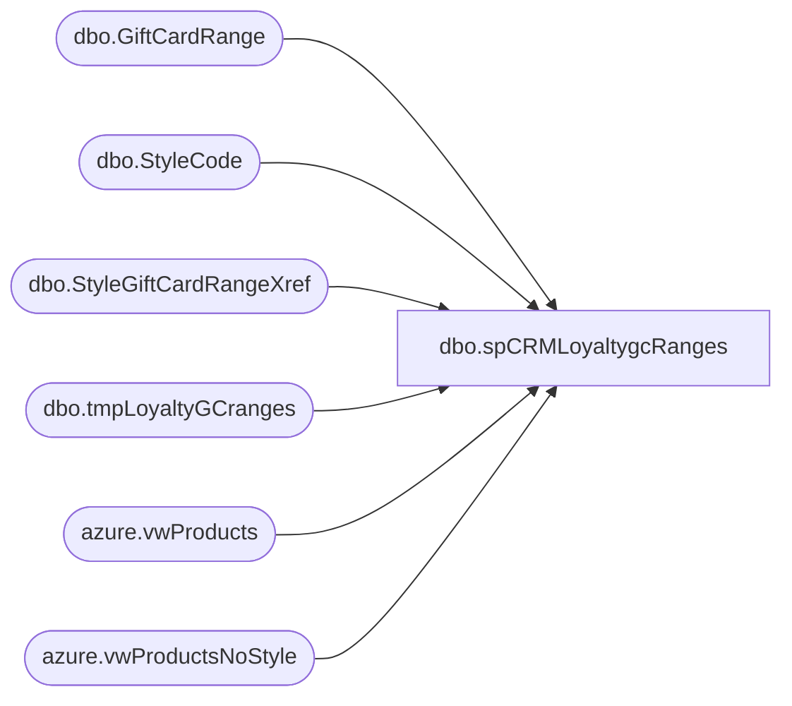

# dbo.spCRMLoyaltygcRanges

**Database:** dw  
**Server:** papamart  

## Architecture Diagram



## Table Dependencies

| Referenced Table |
|---|
| dbo.GiftCardRange |
| dbo.StyleCode |
| dbo.StyleGiftCardRangeXref |
| dbo.tmpLoyaltyGCranges |
| azure.vwProducts |
| azure.vwProductsNoStyle |

## Stored Procedure Code

```sql
CREATE proc [dbo].[spCRMLoyaltygcRanges]

--------------------------------------------------------------------------------------------------------------------------------
--      Ian Wallace 2022-12-22  - created for one time export of gc ranges from kodiaktest
--------------------------------------------------------------------------------------------------------------------------------

as

set nocount on


IF (Object_ID('tempdb..#Products') IS NOT NULL) DROP TABLE #Products
select ProductKey,Style,KeyStory,Chain,Department,LicenseCode, Class, SubClass
into #Products
from azure.vwProducts
UNION
select ProductKey,isnull(Style,('N/A' + cast(ProductKey as varchar))) as Style, KeyStory,isnull(Chain,'N/A') as Chain,isnull(Department,'N/A') as Department, LicenseCode, Class, SubClass
from azure.vwProductsNoStyle

IF (Object_ID('tempdb..#GiftCardRanges') IS NOT NULL) DROP TABLE #GiftCardRanges
select s.Style_Code,
	concat(left(left(GiftCardRangeStart,13),1),right(left(GiftCardRangeStart,13),11)) as GiftCardRangeStart,
	concat(left(left(GiftCardRangeEnd,13),1),right(left(GiftCardRangeEnd,13),11)) as GiftCardRangeEnd
into #GiftCardRanges
from kodiak.GiftCardMstrData.dbo.GiftCardRange gc
join kodiak.GiftCardMstrData.dbo.StyleGiftCardRangeXref x on gc.GiftCardRangeID=x.GiftCardRangeID
join kodiak.GiftCardMstrData.dbo.StyleCode s on x.StyleID=s.StyleID

IF (Object_ID('tempdb..#GiftCardRanges3') IS NOT NULL) DROP TABLE #GiftCardRanges3
select right('00000' + g.Style_Code,6) as Style_Code,g.GiftCardRangeStart,g.GiftCardRangeEnd, p.Department, p.Class, p.SubClass 
into #GiftCardRanges3
from #GiftCardRanges g
join #Products p with (nolock) on right('00000' + g.Style_Code,6) = p.Style


INSERT INTO DWSTaging.[dbo].[tmpLoyaltyGCranges]([Style_Code],[GiftCardRangeStart],[GiftCardRangeEnd],[Department],[Class],[SubClass]) select * from #GiftCardRanges3
```

