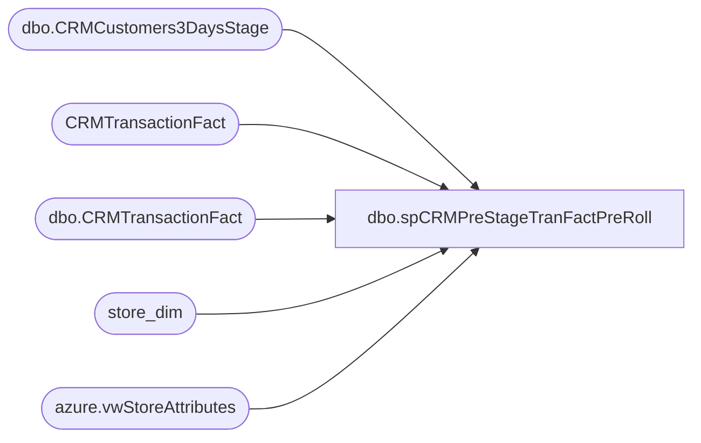

# dbo.spCRMPreStageTranFactPreRoll

**Database:** dw  
**Server:** papamart  

## Architecture Diagram



## Table Dependencies

| Referenced Table |
|---|
| dbo.CRMCustomers3DaysStage |
| CRMTransactionFact |
| dbo.CRMTransactionFact |
| store_dim |
| azure.vwStoreAttributes |

## Stored Procedure Code

```sql
CREATE proc [dbo].[spCRMPreStageTranFactPreRoll]

-------------------------------------------------------------------------------------------
--Dan Tweedie 2021-02-26 - Works with CRMCustomerTransactionMetrics___ SSIS only--
-------------------------------------------------------------------------------------------

as 

set nocount on

IF (Object_ID('tempdb..#SD') IS NOT NULL) DROP TABLE #SD;
select
	sd.store_key StoreKey,
	right(('0000' + CAST(sd.store_id AS VARCHAR)), 4) AS StoreNumber,
	sa.StoreConcept
into #SD
from store_dim sd with (nolock)
left join azure.vwStoreAttributes sa
	on right(('0000' + CAST(sd.store_id AS VARCHAR)), 4) = sa.storenumber


IF (Object_ID('tempdb..#PS1') IS NOT NULL) DROP TABLE #PS1;
select
	x.CustomerNumber,
	count(t.TransactionID) LifetimeTransactionCount,
	datediff(dd, max(t.TransactionDate), getdate()) LifetimeRecencyCount,
	sum(t.GaapSales) LifetimeSalesTotal,
	min(t.TransactionDate) as FirstTransactionDate,
	max(t.TransactionDate) as LastTransDate
into #PS1
from dwstaging.dbo.CRMCustomers3DaysStage x
join CRMTransactionFact t with (nolock) on x.CustomerNumber=t.CustomerNumber
group by 
	x.CustomerNumber

IF (Object_ID('tempdb..#PS2') IS NOT NULL) DROP TABLE #PS2;
select
	x.CustomerNumber,
	sd.StoreConcept as FirstStoreConcept
into #PS2
from dwstaging.dbo.CRMCustomers3DaysStage x
join dw.dbo.CRMTransactionFact t with (nolock) 
	on x.CustomerNumber=t.CustomerNumber
	and x.FirstTransaction=t.TransactionID
join #SD sd on t.StoreKey=sd.StoreKey
	
IF (Object_ID('tempdb..#PS3') IS NOT NULL) DROP TABLE #PS3;
select
	x.CustomerNumber,
	sd2.StoreNumber as LastTransStore
into #PS3
from dwstaging.dbo.CRMCustomers3DaysStage x
join CRMTransactionFact t2 with (nolock) 
	on x.CustomerNumber=t2.CustomerNumber
	and x.LastTransaction=t2.TransactionID
join #SD sd2 on t2.StoreKey=sd2.StoreKey


IF (Object_ID('dwstaging..CRMTranFactPreRollStage') IS NOT NULL) DROP TABLE dwstaging.dbo.CRMTranFactPreRollStage;
select 
	ps1.CustomerNumber,
	ps1.LifetimeTransactionCount,	
	ps1.LifetimeRecencyCount,	
	ps1.LifetimeSalesTotal,	
	ps1.FirstTransactionDate,	
	ps1.LastTransDate,
	ps2.FirstStoreConcept,
	ps3.LastTransStore
into dwstaging.dbo.CRMTranFactPreRollStage
from #PS1 ps1
join #PS2 ps2 on ps1.CustomerNumber=ps2.CustomerNumber
join #PS3 ps3 on ps1.CustomerNumber=ps3.CustomerNumber


Azure,spLoadMerchOnHand,-- =============================================
-- Author:		<Author,,Name>
-- Create date: <Create Date,,>
-- Description:	<Description,,>
-- =============================================
CREATE PROCEDURE [Azure].[spLoadMerchOnHand]
AS
BEGIN

Declare @BegWeek1 char(6)
Declare @BegWeek2 char(6)
Declare @EndWeek1 char(6)
Declare @EndWeek2 char(6)
Declare @EndWeek3 char(6)

Select @BegWeek1 = (Select Cast(Fiscal_Year as char(4)) + Right('00' + cast(fiscal_Week as varchar(2)),2) from date_Dim where Actual_Date between GetDate()-29 and GetDate()-28)
Select @EndWeek1 = (Select Cast(Fiscal_Year as char(4)) + Right('00' + cast(fiscal_Week as varchar(2)),2) from date_Dim where Actual_Date between GetDate()-8 and GetDate()-7)
Select @BegWeek2 = (Select Cast(Fiscal_Year as char(4)) + Right('00' + cast(fiscal_Week as varchar(2)),2) from date_Dim where Actual_Date between GetDate()-394 and GetDate()-393)
Select @EndWeek2 = (Select Cast(Fiscal_Year as char(4)) + Right('00' + cast(fiscal_Week as varchar(2)),2) from date_Dim where Actual_Date between GetDate()-365 and GetDate()-364)
Select @EndWeek3 = (Select Cast(Fiscal_Year as char(4)) + Right('00' + cast(fiscal_Week as varchar(2)),2) from date_Dim where Actual_Date between GetDate()-2 and GetDate()-1)

--Select @BegWeek1,@EndWeek1,@BegWeek2,@EndWeek2,@EndWeek3
Truncate table Azure.OnHand
Insert into Azure.OnHand
select StoreKey,ProductKey, SUM(on_hand_units) as OnHand ,Left(Merch_year_wk,4) as workYear ,Right(Merch_year_wk,2) as workweek,
Case Inventory_status_ID
	when 1 then 'Available'
    when 2 then 'In Transit'
	when 3 then 'Allocated'
	when 4 then 'Discrepancy'
	when 5 then 'Unavailable'
	when 6 then  'Unavailable'
	when 7 then 'Pending Shrink'
	when 8 then 'Damaged'
	when 9 then 'Reserved Cust Order'
	Else 'Unavailable'
	End AS InventoryType,
	Sum(on_hand_cost)
from bedrockdb02.ma_01.dbo.hist_oh_style_loc_wk  d
inner join bedrockdb02.ma_01.dbo.style a on d.style_ID = a.style_id
inner join Azure.vwStyleToProdKey p on a.style_code = p.style
inner join Azure.vwLocationToStoreKey S on d.location_id = s.Locationid
where Merch_year_wk between @BegWeek1 and @EndWeek1 or Merch_year_wk between @BegWeek2 and @EndWeek2 
and Inventory_Status_ID in (1,2,7,9,4)
group by StoreKey,ProductKey,Left(Merch_year_wk,4) ,Right(Merch_year_wk,2) ,
Case Inventory_status_ID
	when 1 then 'Available'
    when 2 then 'In Transit'
	when 3 then 'Allocated'
	when 4 then 'Discrepancy'
	when 5 then 'Unavailable'
	when 6 then  'Unavailable'
	when 7 then 'Pending Shrink'
	when 8 then 'Damaged'
	when 9 then 'Reserved Cust Order'
	Else 'Unavailable'
	End
having sum(on_hand_units) <> 0

Insert into Azure.OnHand
select StoreKey,ProductKey, SUM(on_hand_units) as OnHand ,Left(@EndWeek3,4) as workYear ,Right(@EndWeek3,2) as workweek,
Case Inventory_status_ID
	when 1 then 'Available'
    when 2 then 'In Transit'
	when 3 then 'Allocated'
	when 4 then 'Discrepancy'
	when 5 then 'Unavailable'
	when 6 then  'Unavailable'
	when 7 then 'Pending Shrink'
	when 8 then 'Damaged'
	when 9 then 'Reserved Cust Order'
	Else 'Unavailable'
	End AS InventoryType,
	Sum(on_hand_cost)
from bedrockdb02.ma_01.dbo.hist_oh_style_loc_li   d
inner join bedrockdb02.ma_01.dbo.style a on d.style_ID = a.style_id
inner join Azure.vwStyleToProdKey p on a.style_code = p.style
inner join Azure.vwLocationToStoreKey S on d.location_id = s.Locationid
where Inventory_Status_ID in (1,2,7,9,4)
group by StoreKey,ProductKey,
Case Inventory_status_ID
	when 1 then 'Available'
    when 2 then 'In Transit'
	when 3 then 'Allocated'
	when 4 then 'Discrepancy'
	when 5 then 'Unavailable'
	when 6 then  'Unavailable'
	when 7 then 'Pending Shrink'
	when 8 then 'Damaged'
	when 9 then 'Reserved Cust Order'
	Else 'Unavailable'
	End
having sum(on_hand_units) <> 0

Insert into Azure.OnHand
select StoreKey,ProductKey, SUM(Allocation_units) as OnHand ,Left(Merch_year_wk,4) as workYear ,Right(Merch_year_wk,2)
,'Allocated',0
from bedrockdb02.ma_01.dbo.oo_all_style_loc_wk d 
inner join bedrockdb02.ma_01.dbo.style a on d.style_ID = a.style_id
inner join Azure.vwStyleToProdKey p on a.style_code = p.style
inner join Azure.vwLocationToStoreKey S on d.location_id = s.Locationid

where Merch_year_wk between @BegWeek1 and @EndWeek1 or Merch_year_wk between @BegWeek2 and @EndWeek2 
and Allocation_Units <> 0
group by 
StoreKey,ProductKey,Left(Merch_year_wk,4) ,Right(Merch_year_wk,2)


Insert into Azure.OnHand
select StoreKey,ProductKey, SUM(Allocation_Units) as OnHand ,Left(@EndWeek3,4) as workYear ,Right(@EndWeek3,2) as workweek ,
	  'Allocated',0
from bedrockdb02.ma_01.dbo.oo_all_style_loc_li d
inner join bedrockdb02.ma_01.dbo.style a on d.style_ID = a.style_id
inner join Azure.vwStyleToProdKey p on a.style_code = p.style
inner join Azure.vwLocationToStoreKey S on d.location_id = s.Locationid
where Allocation_Units <> 0
group by StoreKey,ProductKey


Insert into Azure.OnHand
Select 1,1, 0,Left(@EndWeek3,4)  ,Right(@EndWeek3,2),'Allocated',0
Insert into Azure.OnHand
Select 1,1, 0,Left(@EndWeek3,4) ,Right(@EndWeek3,2),'Available',0
Insert into Azure.OnHand
Select 1,1, 0,Left(@EndWeek3,4)  ,Right(@EndWeek3,2),'In Transit',0
Insert into Azure.OnHand
Select 1,1, 0,Left(@EndWeek3,4)  ,Right(@EndWeek3,2),'Discrepancy',0
Insert into Azure.OnHand
Select 1,1, 0,Left(@EndWeek3,4) ,Right(@EndWeek3,2),'Pending Shrink',0
Insert into Azure.OnHand
Select 1,1, 0,Left(@EndWeek3,4) ,Right(@EndWeek3,2),'Damaged',0
Insert into Azure.OnHand
Select 1,1, 0,Left(@EndWeek3,4) ,Right(@EndWeek3,2),'Reserved Cust Order',0
Insert into Azure.OnHand
Select 253,1, 0,Left(@EndWeek3,4)  ,Right(@EndWeek3,2),'Allocated',0
Insert into Azure.OnHand
Select 253,1, 0,Left(@EndWeek3,4) ,Right(@EndWeek3,2),'Available',0
Insert into Azure.OnHand
Select 253,1, 0,Left(@EndWeek3,4)  ,Right(@EndWeek3,2),'In Transit',0
Insert into Azure.OnHand
Select 253,1, 0,Left(@EndWeek3,4)  ,Right(@EndWeek3,2),'Discrepancy',0
Insert into Azure.OnHand
Select 253,1, 0,Left(@EndWeek3,4) ,Right(@EndWeek3,2),'Pending Shrink',0
Insert into Azure.OnHand
Select 253,1, 0,Left(@EndWeek3,4) ,Right(@EndWeek3,2),'Damaged',0
Insert into Azure.OnHand
Select 253,1, 0,Left(@EndWeek3,4) ,Right(@EndWeek3,2),'Reserved Cust Order',0

End
```

