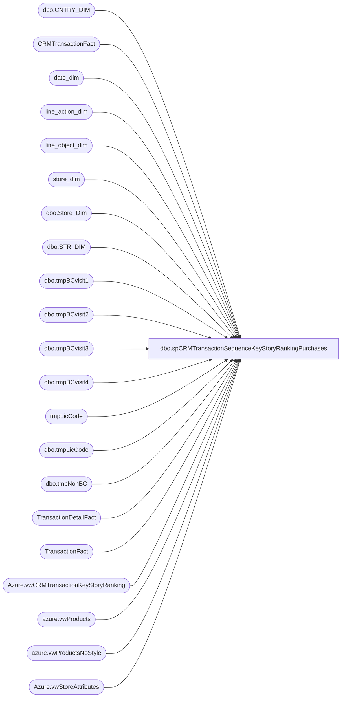

# dbo.spCRMTransactionSequenceKeyStoryRankingPurchases

**Database:** dw  
**Server:** papamart  

## Architecture Diagram



## Table Dependencies

| Referenced Table |
|---|
| dbo.CNTRY_DIM |
| CRMTransactionFact |
| date_dim |
| line_action_dim |
| line_object_dim |
| store_dim |
| dbo.Store_Dim |
| dbo.STR_DIM |
| dbo.tmpBCvisit1 |
| dbo.tmpBCvisit2 |
| dbo.tmpBCvisit3 |
| dbo.tmpBCvisit4 |
| tmpLicCode |
| dbo.tmpLicCode |
| dbo.tmpNonBC |
| TransactionDetailFact |
| TransactionFact |
| Azure.vwCRMTransactionKeyStoryRanking |
| azure.vwProducts |
| azure.vwProductsNoStyle |
| Azure.vwStoreAttributes |

## Stored Procedure Code

```sql
CREATE proc [dbo].[spCRMTransactionSequenceKeyStoryRankingPurchases] 


as
--====================================================================================================================================--
--	Ian Wallace	2022-03-28	daily update of tables queried by vwCRMTransactionSequenceKeyStoryRankingPurchases for power BI Key Story Ranking report
--====================================================================================================================================--

set nocount on

;
with 
Stores as
	(
		SELECT right(('0000' + CAST(sd.STR_NUM AS VARCHAR)), 4) AS StoreNumber,CAST(dsd.Store_Key AS VARCHAR) AS StoreKey,cd.NM_FULL AS CountryNameFull,sa.StoreConcept
		FROM KODIAK.BABWMstrData.dbo.STR_DIM sd
		INNER JOIN papamart.dw.dbo.Store_Dim dsd ON dsd.store_id=sd.STR_NUM
		left join KODIAK.BABWMstrData.dbo.CNTRY_DIM cd ON cd.CNTRY_ID=sd.CNTRY_ID
		left join papamart.dw.Azure.vwStoreAttributes sa on right(('0000' + CAST(sd.STR_NUM AS VARCHAR)), 4) = sa.storenumber
		WHERE sd.CMPNY_ID=1 AND sd.STR_ID > 0 AND sd.STR_NUM not between 501 and 505 AND sd.STR_NUM NOT BETWEEN 9001 AND 9100 
	),
Products as
	(
		select ProductKey,Style,KeyStory,Chain,Department,LicenseCode from papamart.dw.azure.vwProducts
		UNION
		select ProductKey,isnull(Style,('N/A' + cast(ProductKey as varchar))) as Style, KeyStory,isnull(Chain,'N/A') as Chain,isnull(Department,'N/A') as Department, LicenseCode from papamart.dw.azure.vwProductsNoStyle
	),
license as
	(
		select KeyStory, max(LicenseCode) as licenseCode from Products group by keyStory
	)
	
	
	INSERT INTO [dbo].[tmpNonBC] ([country],[PurchaseChannel],[transaction_ID],[TransactionDate],[KeyStory],[GaapUnits],[GaapSales],[isWeb],[isRetail],[2ndPurchase],[3rdPurchase],[4thPurchase])
		select case sd.country when 'United Kingdom' then 'UK' when 'United States' then 'US' when 'Canada' then 'CA' else sd.country end as country,
		sd2.StoreConcept as PurchaseChannel,
		 tf.transaction_ID,cast(dd.actual_date as date) as TransactionDate, case when isnull(pd.KeyStory,'')='' then 'No Key' else pd.KeyStory end as keyStory,
       sum(case when (lod.Line_Object IN (100, 102, 103, 104, 200, 202, 203, 204, 206, 210, 250, 290, 291, 293, 295, 296, 623, 640, 690, 691, 1630, 1631, 1199, 115, 215, 1660) 
		OR (lod.line_object = 106 and lad.line_action in (90,142,99) ))then tdf.Units else 0 end) as GaapUnits,
		sum(case when (lod.Line_Object IN (100, 102, 103, 104, 200, 202, 203, 204, 206, 210, 250, 290, 291, 293, 295, 296, 623, 640, 690, 691, 1630, 1631, 1199, 115, 215, 1660) 
		OR (lod.line_object = 106 and lad.line_action in (90,142,99) )) then (tdf.unit_gross_amount-tdf.unit_disc_amount) else 0 end) as GaapSales,
       cast(case when sd.store_id in (13,2013) then 1 else 0 end as int) as isWeb,cast(case when sd.store_id in (13,2013) then 0 else 1 end as int) as isRetail,
		'' as '2ndPurchase', '' as '3rdPurchase', '' as '4thPurchase'
		from TransactionFact tf
		join date_dim dd on tf.date_key = dd.date_key
		join TransactionDetailFact tdf with (nolock) on tf.Transaction_id=tdf.Transaction_ID
		join line_object_dim lod on tdf.line_object_key=lod.line_object_key 
		join line_action_dim lad on tdf.line_action_key=lad.line_action_key
		join Products pd with (nolock) on tdf.product_key=pd.ProductKey
		join Stores sd2 with (nolock) on tf.store_key=sd2.StoreKey
		join store_dim sd with (nolock) on tf.store_key=sd.store_key
		left join CRMTransactionFact ctf on tf.transaction_id = ctf.TransactionID
		where 1=1
		and ctf.TransactionID is null 
		and cast(dd.actual_date as date) = cast(getdate()-1 as date)
		group by country,sd2.StoreConcept,tf.transaction_ID,dd.actual_date,pd.KeyStory,sd.store_id
	
--===========================================================================
	
INSERT INTO [dbo].[tmpBCvisit1] ([country],[PurchaseChannel],[customerNumber],[transactionID],[TransactionDate],[keyStory],[KeyRankPerTransaction],[KeyRankPerSequenceNewVOldCustomers],[KeyRankPerSequenceGlobal],[KeyStorySales]
,[KeyStoryUnits],[CustomerFirstTransactionDate],[isFreshCustomer],[isFirstPurchaseChannel],[isFirstPurchase],[isNewCustomer],[isRepeatCustomer],[isWeb],[isRetail],[GaapSalesTranTotal],[KeyStoryPctToTotal]
,[LifetimeTransactionSequence],[LifetimeVisitSequence],[ParentTransactionID],[ChildTransactionID],[isTopKeyStoryPerTransaction],[isTopKeyStoryNewOrOldGlobal],[isTopKeyStoryGlobal],[hasCountYourCandles],[hasBirthdayGift]
,[hasHalfBirthday],[hasWinback],[hasOther],[TransactionKey],[firstPurchaseFlag])
		select [Country],[PurchaseChannel],[customerNumber],[transactionID],[TransactionDate],[keyStory],[KeyRankPerTransaction],[KeyRankPerSequenceNewVOldCustomers]
		,[KeyRankPerSequenceGlobal],[KeyStorySales],[KeyStoryUnits],[CustomerFirstTransactionDate],[isFreshCustomer],[isFirstPurchaseChannel],[isFirstPurchase]
		,[isNewCustomer],[isRepeatCustomer],[isWeb],[isRetail],[GaapSalesTranTotal],[KeyStoryPctToTotal],[LifetimeTransactionSequence],[LifetimeVisitSequence]
		,[ParentTransactionID],[ChildTransactionID],[isTopKeyStoryPerTransaction],[isTopKeyStoryNewOrOldGlobal],[isTopKeyStoryGlobal],[hasCountYourCandles],[hasBirthdayGift]
		,[hasHalfBirthday],[hasWinback],[hasOther],[TransactionKey],[firstPurchaseFlag] 
		from [Azure].[vwCRMTransactionKeyStoryRanking]
		where 1=1
		and LifetimeTransactionSequence  = 1 and KeyRankPerTransaction = 1
		and cast([TransactionDate] as date) = cast(getdate()-1 as date)

--	--===========================================================================

INSERT INTO [dbo].[tmpBCvisit2] ([country],[PurchaseChannel],[customerNumber],[transactionID],[TransactionDate],[keyStory],[KeyRankPerTransaction],[KeyRankPerSequenceNewVOldCustomers],[KeyRankPerSequenceGlobal],[KeyStorySales]
,[KeyStoryUnits],[CustomerFirstTransactionDate],[isFreshCustomer],[isFirstPurchaseChannel],[isFirstPurchase],[isNewCustomer],[isRepeatCustomer],[isWeb],[isRetail],[GaapSalesTranTotal],[KeyStoryPctToTotal]
,[LifetimeTransactionSequence],[LifetimeVisitSequence],[ParentTransactionID],[ChildTransactionID],[isTopKeyStoryPerTransaction],[isTopKeyStoryNewOrOldGlobal],[isTopKeyStoryGlobal],[hasCountYourCandles],[hasBirthdayGift]
,[hasHalfBirthday],[hasWinback],[hasOther],[TransactionKey],[firstPurchaseFlag])
		select [Country],[PurchaseChannel],[customerNumber],[transactionID],[TransactionDate],[keyStory],[KeyRankPerTransaction],[KeyRankPerSequenceNewVOldCustomers]
		,[KeyRankPerSequenceGlobal],[KeyStorySales],[KeyStoryUnits],[CustomerFirstTransactionDate],[isFreshCustomer],[isFirstPurchaseChannel],[isFirstPurchase]
		,[isNewCustomer],[isRepeatCustomer],[isWeb],[isRetail],[GaapSalesTranTotal],[KeyStoryPctToTotal],[LifetimeTransactionSequence],[LifetimeVisitSequence]
		,[ParentTransactionID],[ChildTransactionID],[isTopKeyStoryPerTransaction],[isTopKeyStoryNewOrOldGlobal],[isTopKeyStoryGlobal],[hasCountYourCandles],[hasBirthdayGift]
		,[hasHalfBirthday],[hasWinback],[hasOther],[TransactionKey],[firstPurchaseFlag] 
		from [Azure].[vwCRMTransactionKeyStoryRanking]
		where 1=1
		and LifetimeTransactionSequence  = 2 and KeyRankPerTransaction = 1
		and cast([TransactionDate] as date) = cast(getdate()-1 as date)

--===========================================================================

INSERT INTO [dbo].[tmpBCvisit3] ([country],[PurchaseChannel],[customerNumber],[transactionID],[TransactionDate],[keyStory],[KeyRankPerTransaction],[KeyRankPerSequenceNewVOldCustomers],[KeyRankPerSequenceGlobal],[KeyStorySales]
,[KeyStoryUnits],[CustomerFirstTransactionDate],[isFreshCustomer],[isFirstPurchaseChannel],[isFirstPurchase],[isNewCustomer],[isRepeatCustomer],[isWeb],[isRetail],[GaapSalesTranTotal],[KeyStoryPctToTotal]
,[LifetimeTransactionSequence],[LifetimeVisitSequence],[ParentTransactionID],[ChildTransactionID],[isTopKeyStoryPerTransaction],[isTopKeyStoryNewOrOldGlobal],[isTopKeyStoryGlobal],[hasCountYourCandles],[hasBirthdayGift]
,[hasHalfBirthday],[hasWinback],[hasOther],[TransactionKey],[firstPurchaseFlag])
		select [Country],[PurchaseChannel],[customerNumber],[transactionID],[TransactionDate],[keyStory],[KeyRankPerTransaction],[KeyRankPerSequenceNewVOldCustomers]
		,[KeyRankPerSequenceGlobal],[KeyStorySales],[KeyStoryUnits],[CustomerFirstTransactionDate],[isFreshCustomer],[isFirstPurchaseChannel],[isFirstPurchase]
		,[isNewCustomer],[isRepeatCustomer],[isWeb],[isRetail],[GaapSalesTranTotal],[KeyStoryPctToTotal],[LifetimeTransactionSequence],[LifetimeVisitSequence]
		,[ParentTransactionID],[ChildTransactionID],[isTopKeyStoryPerTransaction],[isTopKeyStoryNewOrOldGlobal],[isTopKeyStoryGlobal],[hasCountYourCandles],[hasBirthdayGift]
		,[hasHalfBirthday],[hasWinback],[hasOther],[TransactionKey],[firstPurchaseFlag] 
		from [Azure].[vwCRMTransactionKeyStoryRanking]
		where 1=1
		and LifetimeTransactionSequence  = 3 and KeyRankPerTransaction = 1
		and cast([TransactionDate] as date) = cast(getdate()-1 as date)

--		--===========================================================================

INSERT INTO [dbo].[tmpBCvisit4] ([country],[PurchaseChannel],[customerNumber],[transactionID],[TransactionDate],[keyStory],[KeyRankPerTransaction],[KeyRankPerSequenceNewVOldCustomers],[KeyRankPerSequenceGlobal],[KeyStorySales]
,[KeyStoryUnits],[CustomerFirstTransactionDate],[isFreshCustomer],[isFirstPurchaseChannel],[isFirstPurchase],[isNewCustomer],[isRepeatCustomer],[isWeb],[isRetail],[GaapSalesTranTotal],[KeyStoryPctToTotal]
,[LifetimeTransactionSequence],[LifetimeVisitSequence],[ParentTransactionID],[ChildTransactionID],[isTopKeyStoryPerTransaction],[isTopKeyStoryNewOrOldGlobal],[isTopKeyStoryGlobal],[hasCountYourCandles],[hasBirthdayGift]
,[hasHalfBirthday],[hasWinback],[hasOther],[TransactionKey],[firstPurchaseFlag])
		select [Country],[PurchaseChannel],[customerNumber],[transactionID],[TransactionDate],[keyStory],[KeyRankPerTransaction],[KeyRankPerSequenceNewVOldCustomers]
		,[KeyRankPerSequenceGlobal],[KeyStorySales],[KeyStoryUnits],[CustomerFirstTransactionDate],[isFreshCustomer],[isFirstPurchaseChannel],[isFirstPurchase]
		,[isNewCustomer],[isRepeatCustomer],[isWeb],[isRetail],[GaapSalesTranTotal],[KeyStoryPctToTotal],[LifetimeTransactionSequence],[LifetimeVisitSequence]
		,[ParentTransactionID],[ChildTransactionID],[isTopKeyStoryPerTransaction],[isTopKeyStoryNewOrOldGlobal],[isTopKeyStoryGlobal],[hasCountYourCandles],[hasBirthdayGift]
		,[hasHalfBirthday],[hasWinback],[hasOther],[TransactionKey],[firstPurchaseFlag] 
		--into [dbo].[tmpBCvisit4]
		from [Azure].[vwCRMTransactionKeyStoryRanking]
		where 1=1
		and LifetimeTransactionSequence  = 4 and KeyRankPerTransaction = 1
		and cast([TransactionDate] as date) = cast(getdate()-1 as date)
--===========================================================================
		
	truncate table  tmpLicCode

	;
with 
		Products as
	(
		select ProductKey,Style,KeyStory,Chain,Department,LicenseCode from azure.vwProducts
		UNION
		select ProductKey,isnull(Style,('N/A' + cast(ProductKey as varchar))) as Style, KeyStory,isnull(Chain,'N/A') as Chain,isnull(Department,'N/A') as Department, LicenseCode from azure.vwProductsNoStyle
	)

	INSERT INTO [dbo].[tmpLicCode]([KeyStory],[licenseCode])
		select KeyStory, max(LicenseCode) as licenseCode 
		--into tmpLicCode
		from Products group by keyStory
```

