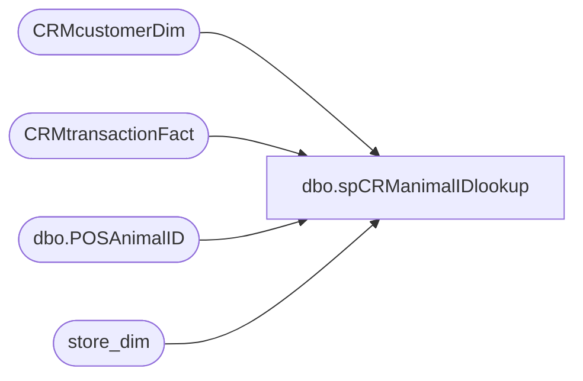

# dbo.spCRManimalIDlookup

**Database:** dw  
**Server:** papamart  

## Architecture Diagram



## Table Dependencies

| Referenced Table |
|---|
| CRMcustomerDim |
| CRMtransactionFact |
| dbo.POSAnimalID |
| store_dim |

## Stored Procedure Code

```sql
CREATE proc [dbo].[spCRManimalIDlookup]
	@animal_id varchar(4000)
	
as


Begin 

	
with 
animalTrans
as
(
SELECT [transaction_id],[animal_id],[TransactionDate] FROM [dbo].[POSAnimalID] where [animal_id] = @animal_id
),
transInfo
as
(
select aT.animal_id, c.StoreKey, c.TransactionPostedDate, c.CustomerNumber from CRMtransactionFact c
join animalTrans aT on aT.transaction_id = c.TransactionID
),
storeInfo
as
(
select s.store_key, s.store_id, s.store_name from store_dim s
 join transInfo t on t.StoreKey = s.store_key
),
customerInfo
as
(
select cDim.CustomerNumber, cDim.FirstName, cDim.LastName, cDim.EmailAddress 
from CRMcustomerDim cDim 
join transInfo t on cDim.CustomerNumber = t.CustomerNumber
)
select t.animal_id, s.store_id, s.store_name, t.CustomerNumber, cI.FIrstName, cI.LastName, cI.EmailAddress,  t.TransactionPostedDate
from transInfo t 
join storeInfo s on t.StoreKey = s.store_key
join customerInfo cI on t.CustomerNumber = cI.CustomerNumber


END

dbo,spCosell_Report,-- =============================================================================================================
-- Name: spCosell_Report
--
-- Description:	
--		Extract the sales for the items requested and the other items on those transactions
--
-- Input:
--		@fromDate	The starting date to retrieve
--		@thruDate	The ending date to retrieve
--		@skus		A comma delimited list of the target skus
--		@onlyUseSingelAnimalTransactions	1 = get only transactions with 1 animal, 0 = All transactions
--
-- Output: 
--		dataset which unions together all of the target and other skus. This is in one dataset
--		because SSRS only allows one dataset to be recognized
--		The column target_result_ind indicates whether this was a target item (0),an other item (1)
--			, or a summary of other Items grouped by department (2)
--
-- Dependencies: 
--
-- EXAMPLE:
--		EXEC	spCosell_Report
--			@fromDate = '11/1/2012',
--			@thruDate = '11/15/2012',
--			@skus = '18954,18278',
--			@onlyUseSingleAnimalTransactions = 1
--
-- Revision History
--		Name:				Date:			Comments:
--		Gary Murrish		11/13/2012		created
--		Gary Murrish		11/19/2012		Changed Transaction_ID counting
--		Gary Murrish		12/10/2012		Changed department selection to be department code instead of department
--		Gary Murrish		12/18/2012		Changed to omit R-B-Z in department Summary
-- =============================================================================================================
CREATE PROCEDURE [dbo].[spCosell_Report]
    @fromDate                        DATETIME,
    @thruDate                        DATETIME,
    @skus                            VARCHAR(MAX),
    @onlyUseSingleAnimalTransactions BIT
AS
BEGIN
	-- SET NOCOUNT ON added to prevent extra result sets from
	-- interfering with SELECT statements.
	SET NOCOUNT ON;


	-- Get the Date Keys
	DECLARE @fromDateKey INT
	DECLARE @thruDateKey INT
	SELECT @fromDateKey = date_key
	FROM
		date_dim dd WITH (NOLOCK)
	WHERE
		actual_date = @fromDate
	SELECT @thruDateKey = date_key
	FROM
		date_dim dd WITH (NOLOCK)
	WHERE
		actual_date = @thruDate

	-- Parse out the skus requested.
	IF object_id('tempdb..#skus') IS NOT NULL
	BEGIN
		DROP TABLE #skus
	END

	SELECT Val
	INTO
		#skus
	FROM
		dbo.fn_String_To_Table(@skus, ',', 1)


	-- Get the product Keys
	IF object_id('tempdb..#targetSKUS') IS NOT NULL
	BEGIN
		DROP TABLE #targetSKUS
	END

	SELECT product_key
	INTO
		#targetSKUS
	FROM
		product_dim pd WITH (NOLOCK)
		INNER JOIN #skus s
			ON s.Val = pd.sku

	-- Get the transactions for the requested skus
	IF object_id('tempdb..#targetSOLD') IS NOT NULL
	BEGIN
		DROP TABLE #targetSOLD
	END
	SELECT base.*
		 , tf.GAAP_sales_amount
		 , tf.animal_units
	INTO
		#targetSOLD
	FROM
		(
		 SELECT tdf.product_key
			  , tdf.transaction_id
			  , sum(tdf.units) AS Units
		 FROM
			 transaction_detail_facts tdf WITH (NOLOCK)
			 INNER JOIN #targetSKUS s
				 ON s.product_key = tdf.product_key
		 WHERE
			 tdf.date_key BETWEEN @fromDateKey AND @thruDateKey
		 GROUP BY
			 tdf.product_key
		   , tdf.transaction_id) base
		INNER JOIN Transaction_Facts tf WITH (NOLOCK)
			ON base.transaction_id = tf.transaction_id

	-- Delete all transactions with more than one animal
	IF @onlyUseSingleAnimalTransactions = 1
	BEGIN
		DELETE
		FROM
			#targetSOLD
		WHERE
			animal_units <> 1
	END

	-- Now get all of the skus which were sold on these transactions
	IF object_id('tempdb..#otherSOLD') IS NOT NULL
	BEGIN
		DROP TABLE #otherSOLD
	END
	SELECT tdf.product_key
		 , sum(tdf.units) AS Units
		 , sum(tdf.unit_gross_amount - tdf.unit_disc_amount) AS NetAmount
		 , tdf.transaction_id
	INTO
		#otherSOLD
	FROM
		(
		 SELECT DISTINCT transaction_id
		 FROM
			 #targetSOLD s) trans
		INNER JOIN transaction_detail_facts tdf WITH (NOLOCK)
			ON trans.transaction_id = tdf.transaction_id
	WHERE
		product_key > 0
	GROUP BY
		tdf.product_key
	  , tdf.transaction_id

	-- Return the Target Items
	SELECT 0 AS target_result_ind
		 , pd.sku
		 , pd.department
		 , pd.class
		 , pd.subclass
		 , pd.style_desc
		 , base.Units
		 , base.GAAPSales
		 , base.numTrans
	FROM
		(
		 SELECT s.product_key
			  , sum(s.Units) AS Units
			  , sum(s.GAAP_sales_amount) AS GAAPSales
			  , count(DISTINCT transaction_id) AS numTrans
		 FROM
			 #targetSOLD s
		 GROUP BY
			 s.product_key) base
		INNER JOIN product_dim pd WITH (NOLOCK)
			ON pd.product_key = base.product_key
	UNION ALL
	-- Return the Other Items		
	SELECT 1 AS target_result_ind
		 , pd.sku
		 , pd.department
		 , pd.class
		 , pd.subclass
		 , pd.style_desc
		 , s.Units
		 , s.NetAmount
		 , s.numTrans
	FROM
		(
		 SELECT product_key
			  , sum(Units) AS Units
			  , sum(NetAmount) AS netAmount
			  , count(DISTINCT transaction_id) AS numTrans
		 FROM
			 #otherSOLD
		 GROUP BY
			 product_key) s
		INNER JOIN product_dim pd WITH (NOLOCK)
			ON pd.product_key = s.product_key

	UNION ALL
	-- Return the Other Items summarized by selected departments
	SELECT 2 AS target_result_ind
		 , '' AS sku
		 , s.department
		 , '' AS class
		 , '' AS subclass
		 , '' AS style_desc
		 , (s.Units) AS Units
		 , (s.NetAmount) AS NetAmount
		 , (s.numTrans) AS numTrans
	FROM
		(
		 SELECT pd.department AS department
			  , sum(Units) AS Units
			  , sum(NetAmount) AS netAmount
			  , count(DISTINCT transaction_id) AS numTrans
		 FROM
			 #otherSOLD s
			 INNER JOIN product_dim pd WITH (NOLOCK)
				 ON pd.product_key = s.product_key
		 WHERE
			pd.ScorecardCategory IN ('Clothing', 'Footwear', 'Animal', 'Accessories', 'Sounds', 'Buddies', 'Licensing', 'Prestuffed')
		 GROUP BY
			 pd.department, pd.department_code) s

END
```

