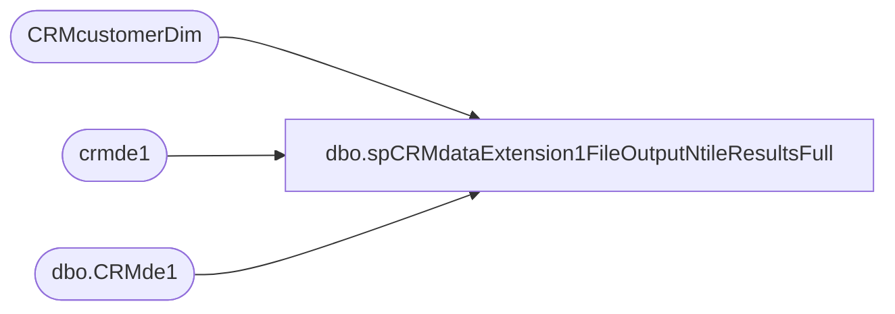

# dbo.spCRMdataExtension1FileOutputNtileResultsFull

**Database:** dw  
**Server:** papamart  

## Architecture Diagram



## Table Dependencies

| Referenced Table |
|---|
| CRMcustomerDim |
| crmde1 |
| dbo.CRMde1 |

## Stored Procedure Code

```sql
CREATE proc [dbo].[spCRMdataExtension1FileOutputNtileResultsFull]
	
as


Begin 

		--create Email file
		DECLARE @ntile_var int;

		--set @ntile_var = (select (count(*)/350000)+1 as varNumberOfGroups from DW.dbo.CRMde1)

		--set @ntile_var = (select (count(*)/3000000)+1 as varNumberOfGroups from DW.dbo.CRMde1)
		--where cast(InsertDate as date) = cast(getdate() as date) or cast(UpdateDate as date)  = cast(getdate() as date))
		set @ntile_var = 7

		--select @ntile_var

select [customerNumber],REPLACE([SubscriberKey],',',' ') as SubscriberKey
			,NULLIF([status], '') as 'status',
			 convert (varchar(10), [dateJoined], 101) as 'dateJoined', convert (varchar(10), [LastSentDate], 101) as 'LastSentDate',
			 convert (varchar(10), [LastOpenDate], 101) as 'LastOpenDate', convert (varchar(10), [LastClickDate], 101) as 'LastClickDate',
			[bonusClubMember],NULLIF([bonusClubMembershipType],' ') as 'bonusClubMembershipType',[bonusClubPointsBalance],[hasOnlineAccount],NULLIF(REPLACE([bonusClubSignUpSource],',',' '),' ') as bonusCLubSignUpSource,
			case when country = ' ' then null when [country] = 'SGP' then 'SG' when [country] = 'ESP' then 'ES' when [country] = 'DEU' then	'DE' when [country] = 'COL' then 'CO' when [country] = 'ARE' then 'AE'
			 when [country] = 'SWE' then	'SE' when [country] = 'PHL' then 'PH' when [country] = 'AUS' then 'AU' when [country] = 'BEL' then 'BE' when [country] = 'NOR' then	'NO'
				when [country] = 'USA' then	'US' when [country] = 'FIN' then 'FI' when [country] = 'IRL' then 'IE' when [country] = ''	then '' when [country] = 'ISL' then	'IS'
				when [country] = 'MEX' then	'MX' when [country] = 'LIE' then 'LI' when [country] = 'CAF' then 'CF' when [country] = 'ITA' then 'IT' when [country] = 'NZL' then	'NZ'
				when [country] = 'JPN' then	'JP' when [country] =  'PRI' then 'PR' when [country] = 'LUX' then	'LU' when [country] = 'CAN' then 'CA' when [country] = 'CHE' then	'CH'
				when [country] = 'CHN' then	'CN' when [country] = 'IDN' then 'ID' when [country] = 'IRE' then 'IE' when [country] = 'THA' then	'TH' when [country] = 'ZAF' then	'ZA'
				when [country] = 'AUT' then	'AT' when [country] = 'DNK' then 'DK' when [country] = 'HKG' then 'HK' when [country] = 'BRA' then 'BR' when [country] = 'UNK' then	''
				when [country] = 'EUR' then	'UK' when [country] = 'GBR' then 'UK' when [country] = 'GRC' then 'GR' when [country] = 'FRA' then 'FR' when [country] = 'KOR' then	'KR'
				when [country] = 'PRT' then	'PT' when [country] = 'NLD' then 'NL' when [country] = 'TUR' then 'TR' when [country] = 'ARG' then 'AR' when [country] = 'TWN' then	'TW' end as 'Country',
			[FrequencyCount3m],[FrequencyCount6m],[FrequencyCount12m],[FrequencyCount18m],[FrequencyCount24m],[FrequencyCountTTL],
			[RecencyCount3m],[RecencyCount6m],[RecencyCount12m],[RecencyCount18m],[RecencyCount24m],[RecencyCountTTL],[MonetarySum3m],
			[MonetarySum6m],[MonetarySum12m],[MonetarySum18m],[MonetarySum24m],[MonetarySumTTL],[FrequencyCount1m],[RecencyCount1m],
			[MonetarySum1m],NULLIF(REPLACE([address_1],',',' '),'') as address_1,
			--NULLIF(REPLACE([address_2],',',' '),' ') as address_2,
			NULLIF(REPLACE(REPLACE([address_2],',',' '),'''',' '),' ') as address_2,
			NULLIF(REPLACE([address_3],',',' '),' ') as address_3,
			NULLIF(REPLACE([address_4],',',' '),' ') as address_4,NULLIF(REPLACE([post_code],',',' '),' ') as post_code,
			NULLIF(REPLACE([mobile],',',' '),' ') as mobile,NULLIF(REPLACE([locale],',',' '),' ') as locale,[text_opt_in],REPLACE([EmailAddress],',',' ') as EmailAddress,
			NULLIF(convert(varchar, [LastTransactionDate], 101),' ') as LastTransactionDate,NULLIF(REPLACE([LastTransactionStore],',',' '),' ') as LastTransactionStore,
			NULLIF(REPLACE([PreferredStory],',',' '),' ') as PreferredStory, [LifetimePoints],
			--0NULLIF(REPLACE([FirstName],',',' '),' ') as FirstName, 
			NULLIF(REPLACE(REPLACE([FirstName],',',' '),'''',' '),' ') as FirstName, 
			--ISNULL(NULLIF(REPLACE([LastName],',',' '),' '), [EmailAddress])  as LastName,
			ISNULL(NULLIF(REPLACE(REPLACE([LastName],',',' '),'''',' '),' '), [EmailAddress])  as LastName,
			'0124R000001ZDUzQAO' as RecordTypeId
			,NULLIF([InsertDate],' ') as InsertDate,NULLIF([UpdateDate],' ') as UpdateDate
			,NTILE(@ntile_var) OVER (order by customerNumber asc ) as groupNum
			,'TRUE' as SFCC_update__c
			 from DW.dbo.CRMde1
			 where len(customerNumber) < 16
			 --and status = 'unsubscribed'
			 --and customerNumber in ('921092659', '847694225')
			 --where cast(InsertDate as date) = cast(getdate() as date) or cast(UpdateDate as date)  = cast(getdate() as date)
			 	--and customerNumber = '707170042'
and customerNumber in 
(
select de.customerNumber from crmde1 de
--select de.customerNumber, de.SubscriberKey from crmde1 de 
left join CRMcustomerDim cDim on de.customerNumber = cDim.customerNumber
where 1=1
and (cast(cDim.MembershipDate as date) >= '01/01/2018' or cast(cDim.EmailOptInDate as date) >= '01/01/2018' or cast(de.LastTransactionDate as date)  >= '01/01/2018' or cast(de.LastOpenDate as date) >= '01/01/2018')
)


END
```

