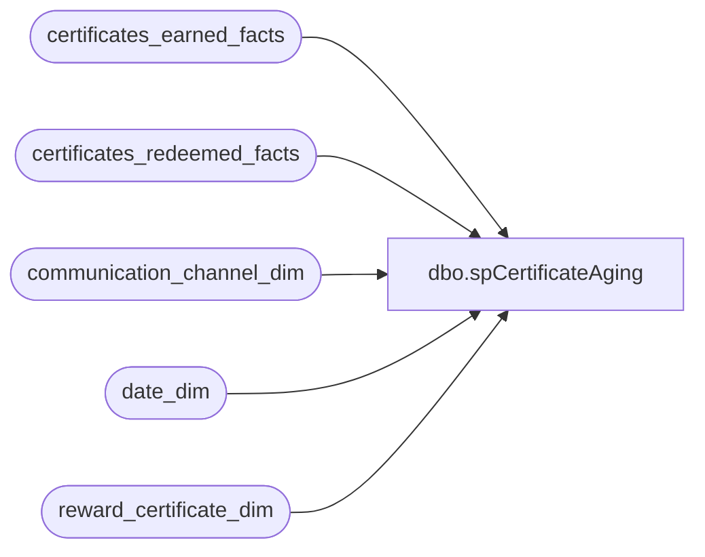

# dbo.spCertificateAging

**Database:** dw  
**Server:** papamart  

## Architecture Diagram



## Table Dependencies

| Referenced Table |
|---|
| certificates_earned_facts |
| certificates_redeemed_facts |
| communication_channel_dim |
| date_dim |
| reward_certificate_dim |

## Stored Procedure Code

```sql
CREATE proc [dbo].[spCertificateAging]
as
/*
exec [spCertificateAging]

select * from reward_certificate_dim

drop table #e
drop table #r

select * from #r where reward_certificate_key = 66
	order by communication_channel_key, communication_date_key

select * from #e e
	inner join #r r
		on r.reward_certificate_key = e.reward_certificate_key
			and r.communication_channel_key = e.communication_channel_key
			and r.communication_date_key = e.communication_date_key
	inner join date_dim edate
		on edate.date_key = e.communication_date_key
	inner join date_dim rdate
		on rdate.date_key = r.date_key
	inner join reward_certificate_dim c
		on c.reward_certificate_key = e.reward_certificate_key
	inner join communication_channel_dim cc
		on cc.communication_channel_key = e.communication_channel_key
	where e.reward_certificate_key = 66
	order by substring(c.reward_certificate_code,3,2)
		, left(c.reward_certificate_code,2)


select e.reward_certificate_key
	, c.reward_certificate_code
	, cc.communication_channel_name
	, convert(char(10), edate.actual_date, 110) as sent_date
	, rdate.actual_date
	, edate.actual_date
	, max(e.Earned) as Earned
	, sum(case when rdate.actual_date <= dateAdd(day, 30, edate.actual_date) then 1 end) as r30
	, sum(case when rdate.actual_date between dateAdd(day, 31, edate.actual_date) and dateAdd(day, 60, edate.actual_date) then r.Redeemed end) as r60
	, sum(case when rdate.actual_date between dateAdd(day, 61, edate.actual_date) and dateAdd(day, 90, edate.actual_date) then r.Redeemed end) as r90
	, sum(case when rdate.actual_date between dateAdd(day, 91 , edate.actual_date) and dateAdd(day,  120 , edate.actual_date) then r.Redeemed end) as r120
	, sum(case when rdate.actual_date between dateAdd(day, 121 , edate.actual_date) and dateAdd(day,  150 , edate.actual_date) then r.Redeemed end) as r150
	, sum(case when rdate.actual_date between dateAdd(day, 151 , edate.actual_date) and dateAdd(day,  180 , edate.actual_date) then r.Redeemed end) as r180
	, sum(case when rdate.actual_date between dateAdd(day, 181 , edate.actual_date) and dateAdd(day,  210 , edate.actual_date) then r.Redeemed end) as r210
	, sum(case when rdate.actual_date between dateAdd(day, 211 , edate.actual_date) and dateAdd(day,  240 , edate.actual_date) then r.Redeemed end) as r240
	, sum(case when rdate.actual_date between dateAdd(day, 241 , edate.actual_date) and dateAdd(day,  270 , edate.actual_date) then r.Redeemed end) as r270
	, sum(case when rdate.actual_date between dateAdd(day, 271 , edate.actual_date) and dateAdd(day,  300 , edate.actual_date) then r.Redeemed end) as r300
	, sum(case when rdate.actual_date between dateAdd(day, 301 , edate.actual_date) and dateAdd(day,  330 , edate.actual_date) then r.Redeemed end) as r330
	, sum(case when rdate.actual_date between dateAdd(day, 331 , edate.actual_date) and dateAdd(day,  360 , edate.actual_date) then r.Redeemed end) as r360
	, sum(case when rdate.actual_date between dateAdd(day, 361 , edate.actual_date) and dateAdd(day,  390 , edate.actual_date) then r.Redeemed end) as r390
	, sum(case when rdate.actual_date between dateAdd(day, 391 , edate.actual_date) and dateAdd(day,  420 , edate.actual_date) then r.Redeemed end) as r420
	, sum(case when rdate.actual_date between dateAdd(day, 421 , edate.actual_date) and dateAdd(day,  450 , edate.actual_date) then r.Redeemed end) as r450
	, sum(case when rdate.actual_date between dateAdd(day, 451 , edate.actual_date) and dateAdd(day,  480 , edate.actual_date) then r.Redeemed end) as r480
	, sum(case when rdate.actual_date between dateAdd(day, 481 , edate.actual_date) and dateAdd(day,  510 , edate.actual_date) then r.Redeemed end) as r510
	, sum(case when rdate.actual_date between dateAdd(day, 511 , edate.actual_date) and dateAdd(day,  540 , edate.actual_date) then r.Redeemed end) as r540
	, sum(case when rdate.actual_date between dateAdd(day, 541 , edate.actual_date) and dateAdd(day,  570 , edate.actual_date) then r.Redeemed end) as r570
	, sum(case when rdate.actual_date between dateAdd(day, 571 , edate.actual_date) and dateAdd(day,  600 , edate.actual_date) then r.Redeemed end) as r600
	, sum(case when rdate.actual_date between dateAdd(day, 601 , edate.actual_date) and dateAdd(day,  630 , edate.actual_date) then r.Redeemed end) as r630
	, sum(case when rdate.actual_date between dateAdd(day, 631 , edate.actual_date) and dateAdd(day,  660 , edate.actual_date) then r.Redeemed end) as r660
	, sum(case when rdate.actual_date between dateAdd(day, 661 , edate.actual_date) and dateAdd(day,  690 , edate.actual_date) then r.Redeemed end) as r690
	, sum(case when rdate.actual_date between dateAdd(day, 691 , edate.actual_date) and dateAdd(day,  720 , edate.actual_date) then r.Redeemed end) as r720
	, sum(case when rdate.actual_date >= dateAdd(day, 721, edate.actual_date) then r.Redeemed end) as rPlus
	, sum(r.Redeemed) as TotalR
	from #e e
	inner join #r r
		on r.reward_certificate_key = e.reward_certificate_key
			and r.communication_channel_key = e.communication_channel_key
			and r.communication_date_key = e.communication_date_key
	inner join date_dim edate
		on edate.date_key = e.communication_date_key
	inner join date_dim rdate
		on rdate.date_key = r.date_key
	inner join reward_certificate_dim c
		on c.reward_certificate_key = e.reward_certificate_key
	inner join communication_channel_dim cc
		on cc.communication_channel_key = e.communication_channel_key
	where e.reward_certificate_key = 66
	group by e.reward_certificate_key
		, c.reward_certificate_code
		, cc.communication_channel_name
		, convert(char(10), edate.actual_date, 110)
	, rdate.actual_date
	, edate.actual_date
	order by substring(c.reward_certificate_code,3,2)
		, left(c.reward_certificate_code,2)
*/

select e.reward_certificate_key 
	, e.communication_channel_key
	, d.communication_date_key
	, count(*) as Earned
into #e
	from certificates_earned_facts e
	inner join reward_certificate_dim c
		on c.reward_certificate_key = e.reward_certificate_key
	inner join (select e.[reward_certificate_key]
					, e.[communication_channel_key]
					, min(isnull(e.[communication_date_key],c.first_earned_date_key)) as [communication_date_key]
					from [certificates_earned_facts] e
					inner join reward_certificate_dim c
						on c.reward_certificate_key = e.reward_certificate_key
					group by e.[reward_certificate_key]
						, e.[communication_channel_key]) d
		on d.reward_certificate_key = e.reward_certificate_key
			and d.[communication_channel_key] = e.[communication_channel_key]
	group by e.reward_certificate_key 
		, e.communication_channel_key
		, d.communication_date_key

select r.reward_certificate_key 
	, r.date_key
	, r.communication_channel_key
	, d.communication_date_key
	, count(*) as Redeemed
into #r
	from certificates_redeemed_facts r
	inner join reward_certificate_dim c
		on c.reward_certificate_key = r.reward_certificate_key
	inner join (select e.[reward_certificate_key]
					, e.[communication_channel_key]
					, min(isnull(e.[communication_date_key],c.first_earned_date_key)) as [communication_date_key]
					from [certificates_earned_facts] e
					inner join reward_certificate_dim c
						on c.reward_certificate_key = e.reward_certificate_key
					group by e.[reward_certificate_key]
						, e.[communication_channel_key]) d
		on d.reward_certificate_key = r.reward_certificate_key
			and d.[communication_channel_key] = r.[communication_channel_key]
	group by r.reward_certificate_key 
		, r.date_key
		, r.communication_channel_key
		, d.communication_date_key


select e.reward_certificate_key
	, c.reward_certificate_code
	, cc.communication_channel_name
	, convert(char(10), edate.actual_date, 110) as sent_date
	, max(e.Earned) as Earned
	--, sum(case when dateDiff(day,edate.actual_date,rdate.actual_date) <= 30 then 1 end) rt
	, sum(case when rdate.actual_date <= dateAdd(day, 30-2, edate.actual_date) then r.Redeemed end) as r30
	, sum(case when rdate.actual_date between dateAdd(day, 31-2, edate.actual_date) and dateAdd(day, 60-2, edate.actual_date) then r.Redeemed end) as r60
	, sum(case when rdate.actual_date between dateAdd(day, 61-2, edate.actual_date) and dateAdd(day, 90-2, edate.actual_date) then r.Redeemed end) as r90
	, sum(case when rdate.actual_date between dateAdd(day, 91-2 , edate.actual_date) and dateAdd(day,  120-2 , edate.actual_date) then r.Redeemed end) as r120
	, sum(case when rdate.actual_date between dateAdd(day, 121-2 , edate.actual_date) and dateAdd(day,  150-2 , edate.actual_date) then r.Redeemed end) as r150
	, sum(case when rdate.actual_date between dateAdd(day, 151-2 , edate.actual_date) and dateAdd(day,  180-2 , edate.actual_date) then r.Redeemed end) as r180
	, sum(case when rdate.actual_date between dateAdd(day, 181-2 , edate.actual_date) and dateAdd(day,  210-2 , edate.actual_date) then r.Redeemed end) as r210
	, sum(case when rdate.actual_date between dateAdd(day, 211-2 , edate.actual_date) and dateAdd(day,  240-2 , edate.actual_date) then r.Redeemed end) as r240
	, sum(case when rdate.actual_date between dateAdd(day, 241-2 , edate.actual_date) and dateAdd(day,  270-2 , edate.actual_date) then r.Redeemed end) as r270
	, sum(case when rdate.actual_date between dateAdd(day, 271-2 , edate.actual_date) and dateAdd(day,  300-2 , edate.actual_date) then r.Redeemed end) as r300
	, sum(case when rdate.actual_date between dateAdd(day, 301-2 , edate.actual_date) and dateAdd(day,  330-2 , edate.actual_date) then r.Redeemed end) as r330
	, sum(case when rdate.actual_date between dateAdd(day, 331-2 , edate.actual_date) and dateAdd(day,  360-2 , edate.actual_date) then r.Redeemed end) as r360
	, sum(case when rdate.actual_date between dateAdd(day, 361-2 , edate.actual_date) and dateAdd(day,  390-2 , edate.actual_date) then r.Redeemed end) as r390
	, sum(case when rdate.actual_date between dateAdd(day, 391-2 , edate.actual_date) and dateAdd(day,  420-2 , edate.actual_date) then r.Redeemed end) as r420
	, sum(case when rdate.actual_date between dateAdd(day, 421-2 , edate.actual_date) and dateAdd(day,  450-2 , edate.actual_date) then r.Redeemed end) as r450
	, sum(case when rdate.actual_date between dateAdd(day, 451-2 , edate.actual_date) and dateAdd(day,  480-2 , edate.actual_date) then r.Redeemed end) as r480
	, sum(case when rdate.actual_date between dateAdd(day, 481-2 , edate.actual_date) and dateAdd(day,  510-2 , edate.actual_date) then r.Redeemed end) as r510
	, sum(case when rdate.actual_date between dateAdd(day, 511-2 , edate.actual_date) and dateAdd(day,  540-2 , edate.actual_date) then r.Redeemed end) as r540
	, sum(case when rdate.actual_date between dateAdd(day, 541-2 , edate.actual_date) and dateAdd(day,  570-2 , edate.actual_date) then r.Redeemed end) as r570
	, sum(case when rdate.actual_date between dateAdd(day, 571-2 , edate.actual_date) and dateAdd(day,  600-2 , edate.actual_date) then r.Redeemed end) as r600
	, sum(case when rdate.actual_date between dateAdd(day, 601-2 , edate.actual_date) and dateAdd(day,  630-2 , edate.actual_date) then r.Redeemed end) as r630
	, sum(case when rdate.actual_date between dateAdd(day, 631-2 , edate.actual_date) and dateAdd(day,  660-2 , edate.actual_date) then r.Redeemed end) as r660
	, sum(case when rdate.actual_date between dateAdd(day, 661-2 , edate.actual_date) and dateAdd(day,  690-2 , edate.actual_date) then r.Redeemed end) as r690
	, sum(case when rdate.actual_date between dateAdd(day, 691-2 , edate.actual_date) and dateAdd(day,  720-2 , edate.actual_date) then r.Redeemed end) as r720
	, sum(case when rdate.actual_date >= dateAdd(day, 721-2, edate.actual_date) then r.Redeemed end) as rPlus
	, sum(r.Redeemed) as TotalR
	from #e e
	inner join #r r
		on r.reward_certificate_key = e.reward_certificate_key
			and r.communication_channel_key = e.communication_channel_key
			and r.communication_date_key = e.communication_date_key
	inner join date_dim edate
		on edate.date_key = e.communication_date_key
	inner join date_dim rdate
		on rdate.date_key = r.date_key
	inner join reward_certificate_dim c
		on c.reward_certificate_key = e.reward_certificate_key
	inner join communication_channel_dim cc
		on cc.communication_channel_key = e.communication_channel_key
	group by e.reward_certificate_key
		, c.reward_certificate_code
		, cc.communication_channel_name
		, convert(char(10), edate.actual_date, 110)
	order by substring(c.reward_certificate_code,3,2) desc
		, left(c.reward_certificate_code,2) desc
		, 4
/*
select e.reward_certificate_key
	, c.reward_certificate_code
	, cc.communication_channel_name
	, edate.actual_date as sent_date
	, rdate.actual_date as redeemed_date
	, dateDiff(day,edate.actual_date,rdate.actual_date) as DaysSince
	, dateDiff(day,edate.actual_date,rdate.actual_date) / 30 + 1 * 30
	, max(e.Earned) as Earned
	, sum(r.Redeemed)
	from #e e
	inner join #r r
		on r.reward_certificate_key = e.reward_certificate_key
			and r.communication_channel_key = e.communication_channel_key
			and r.communication_date_key = e.communication_date_key
	inner join date_dim edate
		on edate.date_key = e.communication_date_key
	inner join date_dim rdate
		on rdate.date_key = r.date_key
	inner join reward_certificate_dim c
		on c.reward_certificate_key = e.reward_certificate_key
	inner join communication_channel_dim cc
		on cc.communication_channel_key = e.communication_channel_key
	where e.reward_certificate_key = 64
	group by e.reward_certificate_key
		, c.reward_certificate_code
		, cc.communication_channel_name
		, edate.actual_date
		, rdate.actual_date
	order by substring(c.reward_certificate_code,3,2) desc
		, left(c.reward_certificate_code,2) desc
		, 4
*/
```

