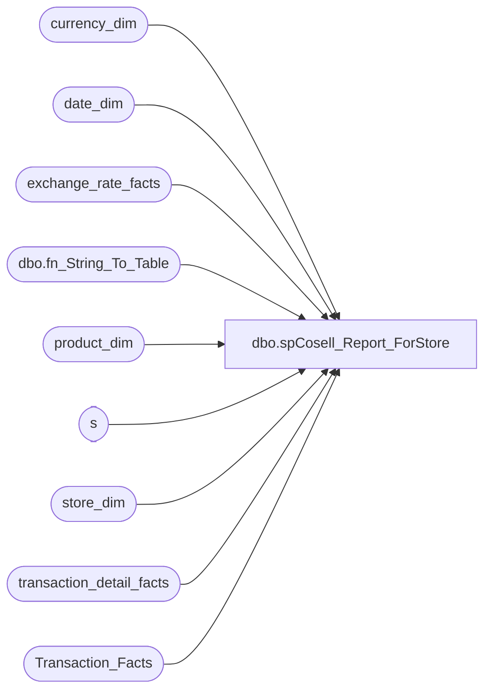

# dbo.spCosell_Report_ForStore

**Database:** dw  
**Server:** papamart  

## Architecture Diagram



## Table Dependencies

| Referenced Table |
|---|
| currency_dim |
| date_dim |
| exchange_rate_facts |
| dbo.fn_String_To_Table |
| product_dim |
| s |
| store_dim |
| transaction_detail_facts |
| Transaction_Facts |

## Stored Procedure Code

```sql
-- =============================================================================================================
-- Name: spCosell_Report
--
-- Description:	
--		Extract the sales for the items requested and the other items on those transactions
--
-- Input:
--		@fromDate	The starting date to retrieve
--		@thruDate	The ending date to retrieve
--		@skus		A comma delimited list of the target skus
--		@onlyUseSingelAnimalTransactions	1 = get only transactions with 1 animal, 0 = All transactions
--		@forStoreID	A comma delimited list of the target stores, '' = All Stores
--
-- Output: 
--		dataset which unions together all of the target and other skus. This is in one dataset
--		because SSRS only allows one dataset to be recognized
--		The column target_result_ind indicates whether this was a target item (0),an other item (1)
--			, or a summary of other Items grouped by department (2)
--
-- Dependencies: 
--
-- EXAMPLE:
--		EXEC	spCosell_Report
--			@fromDate = '11/1/2012',
--			@thruDate = '11/15/2012',
--			@skus = '18954,18278',
--			@onlyUseSingleAnimalTransactions = 1,
--			@forStoreID = '105,1'
--
-- Revision History
--		Name:				Date:			Comments:
--		Gary Murrish		11/13/2012		created
--		Gary Murrish		11/19/2012		Changed Transaction_ID counting
--		Gary Murrish		12/10/2012		Changed department selection to be department code instead of department
--		Gary Murrish		12/18/2012		Changed to omit R-B-Z in department Summary
--		Gary Murrish		7/26/2013		Changed to add a Store Parameter, if -1 then all stores
--		Gary Murrish		9/19/2013		Added Currency Code
--		Gary Murrish		1/30/2014		Added Currency Conversion for UK for Euros to Pounds
-- =============================================================================================================
CREATE PROCEDURE [dbo].[spCosell_Report_ForStore]
	@fromDate datetime,
	@thruDate datetime,
	@skus varchar(max),
	@onlyUseSingleAnimalTransactions bit,
	@forStoreID varchar(max)
AS
BEGIN
	-- SET NOCOUNT ON added to prevent extra result sets from
	-- interfering with SELECT statements.
	SET NOCOUNT ON;


	-- Get the Date Keys
	DECLARE @fromDateKey int
	DECLARE @thruDateKey int
	SELECT
		@fromDateKey = date_key
	FROM
		date_dim dd WITH (NOLOCK)
	WHERE
		actual_date = @fromDate
	SELECT
		@thruDateKey = date_key
	FROM
		date_dim dd WITH (NOLOCK)
	WHERE
		actual_date = @thruDate


	-- Parse out the skus requested.
	IF OBJECT_ID('tempdb..#skus') IS NOT NULL
	BEGIN
		DROP TABLE #skus
	END

	SELECT
		Val
	INTO #skus
	FROM
		dbo.fn_String_To_Table(@skus, ',', 1)

	-- Parse out the stores requested.
	IF OBJECT_ID('tempdb..#stores') IS NOT NULL
	BEGIN
		DROP TABLE #stores
	END

	SELECT
		store_key,
		store_id
	INTO #stores
	FROM
		store_dim sd WITH (NOLOCK)

	IF NOT @forStoreID IS NULL
		AND @forStoreID <> ''
	BEGIN
		DELETE s
			FROM #stores s WITH (NOLOCK)
			LEFT JOIN dbo.fn_String_To_Table(@forStoreID, ',', 1)
				ON Val = s.store_id
		WHERE Val IS NULL

	END

	-- Get the product Keys
	IF OBJECT_ID('tempdb..#targetSKUS') IS NOT NULL
	BEGIN
		DROP TABLE #targetSKUS
	END

	SELECT
		product_key
	INTO #targetSKUS
	FROM
		product_dim pd WITH (NOLOCK)
		INNER JOIN #skus s
			ON s.Val = pd.sku

	-- Get the transactions for the requested skus
	IF OBJECT_ID('tempdb..#targetSOLD') IS NOT NULL
	BEGIN
		DROP TABLE #targetSOLD
	END
	SELECT
		base.*,
		tf.GAAP_sales_amount,
		tf.animal_units,
		tf.currency_key,
		tf.date_key
	INTO #targetSOLD
	FROM
		(SELECT
				tdf.product_key,
				tdf.transaction_id,
				SUM(tdf.Units) AS Units
			FROM
				transaction_detail_facts tdf WITH (NOLOCK)
				INNER JOIN #targetSKUS s
					ON s.product_key = tdf.product_key
				INNER JOIN #stores s1 WITH (NOLOCK)
					ON tdf.store_key = s1.store_key
			WHERE
				tdf.date_key BETWEEN @fromDateKey AND @thruDateKey
			GROUP BY	tdf.product_key,
						tdf.transaction_id) base
		INNER JOIN Transaction_Facts tf WITH (NOLOCK)
			ON base.transaction_id = tf.transaction_id

	-- Delete all transactions with more than one animal
	IF @onlyUseSingleAnimalTransactions = 1
	BEGIN
		DELETE FROM #targetSOLD
		WHERE animal_units <> 1
	END

	-- Now get all of the skus which were sold on these transactions
	IF OBJECT_ID('tempdb..#otherSOLD') IS NOT NULL
	BEGIN
		DROP TABLE #otherSOLD
	END
	SELECT
		tdf.product_key,
		SUM(tdf.Units) AS Units,
		SUM(tdf.unit_gross_amount - tdf.unit_disc_amount) AS NetAmount,
		tdf.transaction_id,
		tdf.currency_key,
		tdf.date_key
	INTO #otherSOLD
	FROM
		(SELECT DISTINCT
				transaction_id
			FROM
				#targetSOLD s) trans
		INNER JOIN transaction_detail_facts tdf WITH (NOLOCK)
			ON trans.transaction_id = tdf.transaction_id
	WHERE
		product_key > 0
	GROUP BY	tdf.product_key,
				tdf.transaction_id,
				tdf.currency_key,
				tdf.date_key


	-- Convert all of the Euros to Pounds in the detail files
	UPDATE s
		SET	GAAP_sales_amount = s.GAAP_sales_amount * erf.fiscal_month_ave_rate,
			currency_key = erf.to_currency_key
	FROM
		#targetSOLD s
		INNER JOIN exchange_rate_facts erf WITH (NOLOCK)
			ON s.currency_key = erf.from_currency_key
			AND s.date_key = erf.date_key
		INNER JOIN currency_dim fmCurr WITH (NOLOCK)
			ON erf.from_currency_key = fmCurr.currency_key
		INNER JOIN currency_dim toCurr WITH (NOLOCK)
			ON erf.to_currency_key = erf.to_currency_key
	WHERE fmCurr.currency_code = 'EUR'
	AND toCurr.currency_code = 'GBP'

	UPDATE s
		SET	NetAmount = s.NetAmount * erf.fiscal_month_ave_rate,
			currency_key = erf.to_currency_key
	FROM
		#otherSOLD s
		INNER JOIN exchange_rate_facts erf WITH (NOLOCK)
			ON s.currency_key = erf.from_currency_key
			AND s.date_key = erf.date_key
		INNER JOIN currency_dim fmCurr WITH (NOLOCK)
			ON erf.from_currency_key = fmCurr.currency_key
		INNER JOIN currency_dim toCurr WITH (NOLOCK)
			ON erf.to_currency_key = erf.to_currency_key
	WHERE fmCurr.currency_code = 'EUR'
	AND toCurr.currency_code = 'GBP'


	-- Select the data for the report
	SELECT
		data.target_result_ind,
		data.sku,
		data.department,
		data.class,
		data.subclass,
		data.style_desc,
		data.units,
		data.gaapsales,
		data.numTrans,
		cd.currency_code
	FROM
		(-- Return the Target Items
			SELECT
				0 AS target_result_ind,
				pd.sku,
				pd.department,
				pd.class,
				pd.subclass,
				pd.style_desc,
				base.units,
				base.gaapsales,
				base.numTrans,
				base.currency_key
			FROM
				(SELECT
						s.product_key,
						SUM(s.Units) AS Units,
						SUM(s.GAAP_sales_amount) AS GAAPSales,
						COUNT(DISTINCT transaction_id) AS numTrans,
						s.currency_key
					FROM
						#targetSOLD s
					GROUP BY	s.product_key,
								s.currency_key) base
				INNER JOIN product_dim pd WITH (NOLOCK)
					ON pd.product_key = base.product_key
			UNION ALL
			-- Return the Other Items		
			SELECT
				1 AS target_result_ind,
				pd.sku,
				pd.department,
				pd.class,
				pd.subclass,
				pd.style_desc,
				s.units,
				s.NetAmount,
				s.numTrans,
				s.currency_key
			FROM
				(SELECT
						product_key,
						SUM(Units) AS Units,
						SUM(netAmount) AS netAmount,
						COUNT(DISTINCT transaction_id) AS numTrans,
						currency_key
					FROM
						#otherSOLD
					GROUP BY	product_key,
								currency_key) s
				INNER JOIN product_dim pd WITH (NOLOCK)
					ON pd.product_key = s.product_key

			UNION ALL
			-- Return the Other Items summarized by selected departments
			SELECT
				2 AS target_result_ind,
				'' AS sku,
				s.department,
				'' AS class,
				'' AS subclass,
				'' AS style_desc,
				(s.Units) AS Units,
				(s.NetAmount) AS NetAmount,
				(s.numTrans) AS numTrans,
				s.currency_key
			FROM
				(SELECT
						pd.department AS department,
						SUM(Units) AS Units,
						SUM(netAmount) AS netAmount,
						COUNT(DISTINCT transaction_id) AS numTrans,
						s.currency_key
					FROM
						#otherSOLD s
						INNER JOIN product_dim pd WITH (NOLOCK)
							ON pd.product_key = s.product_key
					WHERE
						pd.ScorecardCategory IN ('Clothing', 'Footwear', 'Animal', 'Accessories', 'Sounds', 'Buddies', 'Licensing', 'Prestuffed')
					GROUP BY	pd.department,
								pd.department_code,
								s.currency_key) s) data

		INNER JOIN currency_dim cd WITH (NOLOCK)
			ON data.currency_key = cd.currency_key
END
```

