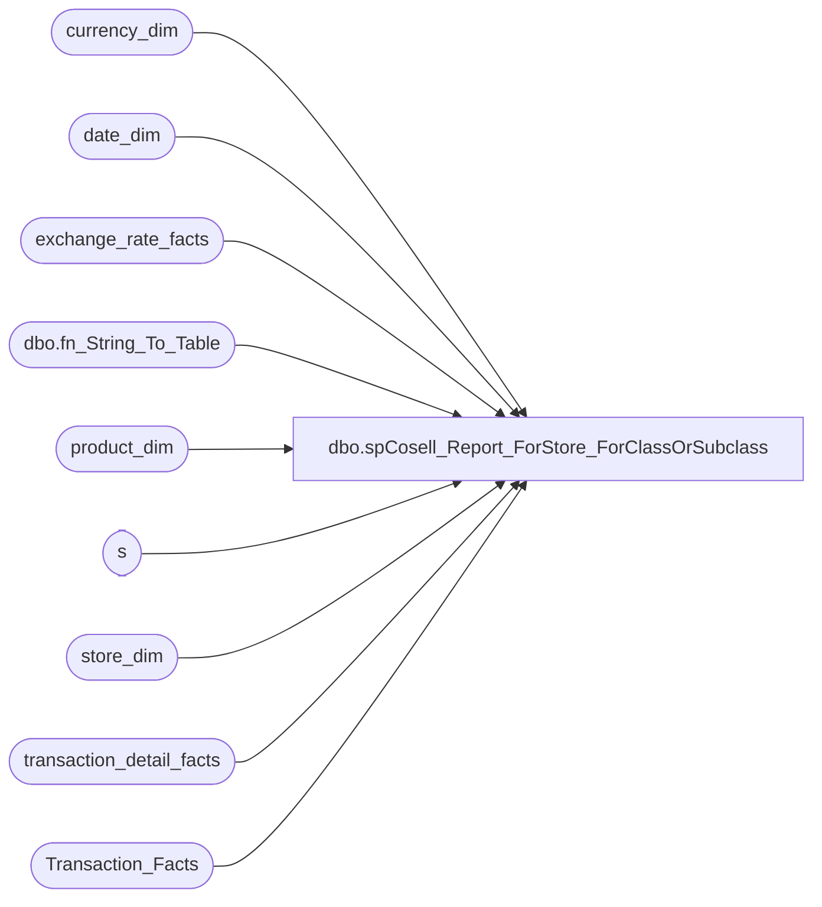

# dbo.spCosell_Report_ForStore_ForClassOrSubclass

**Database:** dw  
**Server:** papamart  

## Architecture Diagram



## Table Dependencies

| Referenced Table |
|---|
| currency_dim |
| date_dim |
| exchange_rate_facts |
| dbo.fn_String_To_Table |
| product_dim |
| s |
| store_dim |
| transaction_detail_facts |
| Transaction_Facts |

## Stored Procedure Code

```sql
-- =============================================================================================================
-- Name: spCosell_Report_ForStore_ForClassOrSubclass
--
-- Description:	
--		Extract the sales for the items in the class or subclass requested and the other items on those transactions
--
-- Input:
--		@fromDate	The starting date to retrieve
--		@thruDate	The ending date to retrieve
--		@onlyUseSingelAnimalTransactions	1 = get only transactions with 1 animal, 0 = All transactions
--		@forStoreID	A comma delimited list of the target stores, '' = All Stores
--		@forClassOrSubclass The class or subclass which was requested
--
-- Output: 
--		dataset which unions together all of the target and other skus. This is in one dataset
--		because SSRS only allows one dataset to be recognized
--		The column target_result_ind indicates whether this was a target item (0),an other item (1)
--			, or a summary of other Items grouped by department (2)
--
-- Dependencies: 
--
-- EXAMPLE:
--		EXEC	spCosell_Report_ForStore_ForClassOrSubclass
--			@fromDate = '11/1/2012',
--			@thruDate = '11/15/2012',
--			@onlyUseSingleAnimalTransactions = 1,
--			@forStoreID = '105,1',
--			@forClassOrSubclass = 'R-B-D-05-01'
--
-- Revision History
--		Name:				Date:			Comments:
--		Gary Murrish		11/13/2012		created
--		Gary Murrish		11/19/2012		Changed Transaction_ID counting
--		Gary Murrish		12/10/2012		Changed department selection to be department code instead of department
--		Gary Murrish		12/18/2012		Changed to omit R-B-Z in department Summary
--		Gary Murrish		7/26/2013		Changed to add a Store Parameter, if -1 then all stores
--		Gary Murrish		9/19/2013		Added Currency Code
--		Gary Murrish		1/30/2014		Force Euros to GBP
-- =============================================================================================================
CREATE PROCEDURE [dbo].[spCosell_Report_ForStore_ForClassOrSubclass]
	@fromDate datetime,
	@thruDate datetime,
	@onlyUseSingleAnimalTransactions bit,
	@forStoreID varchar(max),
	@forClassOrSubclass varchar(50)
AS
BEGIN
	-- SET NOCOUNT ON added to prevent extra result sets from
	-- interfering with SELECT statements.
	SET NOCOUNT ON;


	-- Get the Date Keys
	DECLARE @fromDateKey int
	DECLARE @thruDateKey int
	SELECT
		@fromDateKey = date_key
	FROM
		date_dim dd WITH (NOLOCK)
	WHERE
		actual_date = @fromDate
	SELECT
		@thruDateKey = date_key
	FROM
		date_dim dd WITH (NOLOCK)
	WHERE
		actual_date = @thruDate


	-- Parse out the stores requested.
	IF OBJECT_ID('tempdb..#stores') IS NOT NULL
	BEGIN
		DROP TABLE #stores
	END

	SELECT
		store_key,
		store_id
	INTO #stores
	FROM
		store_dim sd WITH (NOLOCK)

	IF NOT @forStoreID IS NULL
		AND @forStoreID <> ''
	BEGIN
		DELETE s
			FROM #stores s WITH (NOLOCK)
			LEFT JOIN dbo.fn_String_To_Table(@forStoreID, ',', 1)
				ON Val = s.store_id
		WHERE Val IS NULL

	END

	-- Get the product Keys
	IF OBJECT_ID('tempdb..#targetSKUS') IS NOT NULL
	BEGIN
		DROP TABLE #targetSKUS
	END

	SELECT
		product_key
	INTO #targetSKUS
	FROM
		product_dim pd WITH (NOLOCK)
	WHERE
		@forClassOrSubclass =
			CASE
				WHEN LEN(@forClassOrSubclass) = 11 THEN LEFT(pd.subclass_code, 11)
				WHEN LEN(@forClassOrSubclass) = 14 THEN pd.subclass_code
				ELSE ''
			END

	-- Get the transactions for the requested skus
	IF OBJECT_ID('tempdb..#targetSOLD') IS NOT NULL
	BEGIN
		DROP TABLE #targetSOLD
	END
	SELECT
		base.*,
		tf.GAAP_sales_amount,
		tf.animal_units
	INTO #targetSOLD
	FROM
		(SELECT
				tdf.product_key,
				tdf.transaction_id,
				SUM(tdf.Units) AS Units,
				tdf.currency_key,
				tdf.date_key
			FROM
				transaction_detail_facts tdf WITH (NOLOCK)
				INNER JOIN #targetSKUS s
					ON s.product_key = tdf.product_key
				INNER JOIN #stores s1 WITH (NOLOCK)
					ON tdf.store_key = s1.store_key
			WHERE
				tdf.date_key BETWEEN @fromDateKey AND @thruDateKey
			GROUP BY	tdf.product_key,
						tdf.transaction_id,
						tdf.currency_key,
						tdf.date_key) base
		INNER JOIN Transaction_Facts tf WITH (NOLOCK)
			ON base.transaction_id = tf.transaction_id

	-- Delete all transactions with more than one animal
	IF @onlyUseSingleAnimalTransactions = 1
	BEGIN
		DELETE FROM #targetSOLD
		WHERE animal_units <> 1
	END

	-- Now get all of the skus which were sold on these transactions
	IF OBJECT_ID('tempdb..#otherSOLD') IS NOT NULL
	BEGIN
		DROP TABLE #otherSOLD
	END
	SELECT
		tdf.product_key,
		SUM(tdf.Units) AS Units,
		SUM(tdf.unit_gross_amount - tdf.unit_disc_amount) AS NetAmount,
		tdf.transaction_id,
		tdf.currency_key,
		tdf.date_key
	INTO #otherSOLD
	FROM
		(SELECT DISTINCT
				transaction_id
			FROM
				#targetSOLD s) trans
		INNER JOIN transaction_detail_facts tdf WITH (NOLOCK)
			ON trans.transaction_id = tdf.transaction_id
	WHERE
		product_key > 0
	GROUP BY	tdf.product_key,
				tdf.transaction_id,
				tdf.currency_key,
				tdf.date_key

	-- Convert all of the Euros to Pounds in the detail files
	UPDATE s
		SET	GAAP_sales_amount = s.GAAP_sales_amount * erf.fiscal_month_ave_rate,
			currency_key = erf.to_currency_key
	FROM
		#targetSOLD s
		INNER JOIN exchange_rate_facts erf WITH (NOLOCK)
			ON s.currency_key = erf.from_currency_key
			AND s.date_key = erf.date_key
		INNER JOIN currency_dim fmCurr WITH (NOLOCK)
			ON erf.from_currency_key = fmCurr.currency_key
		INNER JOIN currency_dim toCurr WITH (NOLOCK)
			ON erf.to_currency_key = erf.to_currency_key
	WHERE fmCurr.currency_code = 'EUR'
	AND toCurr.currency_code = 'GBP'

	UPDATE s
		SET	NetAmount = s.NetAmount * erf.fiscal_month_ave_rate,
			currency_key = erf.to_currency_key
	FROM
		#otherSOLD s
		INNER JOIN exchange_rate_facts erf WITH (NOLOCK)
			ON s.currency_key = erf.from_currency_key
			AND s.date_key = erf.date_key
		INNER JOIN currency_dim fmCurr WITH (NOLOCK)
			ON erf.from_currency_key = fmCurr.currency_key
		INNER JOIN currency_dim toCurr WITH (NOLOCK)
			ON erf.to_currency_key = erf.to_currency_key
	WHERE fmCurr.currency_code = 'EUR'
	AND toCurr.currency_code = 'GBP'


	SELECT
		data.target_result_ind,
		data.sku,
		data.department,
		data.class,
		data.subclass,
		data.style_desc,
		data.units,
		data.gaapsales,
		data.numTrans,
		cd.currency_code
	FROM
		(-- Return the Target Items
			SELECT
				0 AS target_result_ind,
				pd.sku,
				pd.department,
				pd.class,
				pd.subclass,
				pd.style_desc,
				base.units,
				base.gaapsales,
				base.numTrans,
				base.currency_key
			FROM
				(SELECT
						s.product_key,
						SUM(s.Units) AS Units,
						SUM(s.GAAP_sales_amount) AS GAAPSales,
						COUNT(DISTINCT transaction_id) AS numTrans,
						s.currency_key
					FROM
						#targetSOLD s
					GROUP BY	s.product_key,
								s.currency_key) base
				INNER JOIN product_dim pd WITH (NOLOCK)
					ON pd.product_key = base.product_key
			UNION ALL
			-- Return the Other Items		
			SELECT
				1 AS target_result_ind,
				pd.sku,
				pd.department,
				pd.class,
				pd.subclass,
				pd.style_desc,
				s.units,
				s.NetAmount,
				s.numTrans,
				s.currency_key
			FROM
				(SELECT
						product_key,
						SUM(Units) AS Units,
						SUM(netAmount) AS netAmount,
						COUNT(DISTINCT transaction_id) AS numTrans,
						currency_key
					FROM
						#otherSOLD
					GROUP BY	product_key,
								currency_key) s
				INNER JOIN product_dim pd WITH (NOLOCK)
					ON pd.product_key = s.product_key

			UNION ALL
			-- Return the Other Items summarized by selected departments
			SELECT
				2 AS target_result_ind,
				'' AS sku,
				s.department,
				'' AS class,
				'' AS subclass,
				'' AS style_desc,
				(s.Units) AS Units,
				(s.NetAmount) AS NetAmount,
				(s.numTrans) AS numTrans,
				s.currency_key
			FROM
				(SELECT
						pd.department AS department,
						SUM(Units) AS Units,
						SUM(netAmount) AS netAmount,
						COUNT(DISTINCT transaction_id) AS numTrans,
						s.currency_key
					FROM
						#otherSOLD s
						INNER JOIN product_dim pd WITH (NOLOCK)
							ON pd.product_key = s.product_key
					WHERE
						pd.ScorecardCategory IN ('Clothing', 'Footwear', 'Animal', 'Accessories', 'Sounds', 'Buddies', 'Licensing', 'Prestuffed')
					GROUP BY	pd.department,
								pd.department_code,
								s.currency_key) s) data
		INNER JOIN currency_dim cd WITH (NOLOCK)
			ON data.currency_key = cd.currency_key

END


dbo,spDW_Build_Transaction_Facts_Backup2021-08-29,


-- =============================================================================================================
-- Name: [dbo].[spDW_Build_Transaction_Facts]
--
-- Description: 
-- Aggregates POS transactions sales and product group metrics by store and date into Transaction_Facts
--
--	NOTE: IF YOU CHANGE THIS, YOU WILL PROBABLY HAVE TO ALSO CHANGE vwDW_Transactions
--
-- Dependencies: 
--
-- Revision History
--		Name:				Date:			Comments:
--		Gary Murrish			12/29/2011		Removed subclass '48-06-01' from Merchandise Units
--		Gary Murrish			3/5/2012		Changed definition of GAAP Transactions
--		Gary Murrish			8/1/2012		Ensured that department R-B-Z is in Other only
--												and that subclass ending in 25 is in skins only
--		Gary Murrish			5/10/2013		Changed to utilize the Transaction Trigger table
--		Gary Murrish			7/1/2013		Added the Upsell Discount and the Financial GAAP Sales
--		Gary Murrish			7/10/2013		Added Batch Logic
--		Gary Murrish			7/16/2013		Fix calculation of Net amounts when both UGA and Disc are negative
--		Gary Murrish			12/3/2013		Added Cashier_key
--		Gary Murrish			12/20/2013		Corrrected GAAP Sales calculation for Credit Card Returns
--		Gary Murrish			5/2/2014		Moved 640 from Tender to discounts
--		Gary Murrish			5/5/2014		Added costs to record
--		Gary Murrish			5/6/2014		Changed the Net calculation to remove an old Case Statement
--		Kevin Shyr				1/13/2014		Change logic to use ScorecardCategory field on product_dim to determine sales category
--		Kevin Shyr				2/3/2015		Add in scents
--		Kevin Shyr				3/27/2016		Add in line_objects for Corporate sales (115, 215, 1660)
--		Dan Tweedie				06/08/2016		Altered proc to handle Enterprise Selling data, we now use line_action to distinguish between Gaap and new Store Sales
--		Dan Tweedie				06/28/2016		Added handling for new Enterprise Selling Discount line_objects / line_actions
--		Dan Tweedie				07/28/2016		Added + ISNULL(cte.STORE_shipping_UGA, 0) to Store_Sales_Amount and Fin_Store_Sales_Amount
--		Dan Tweedie				08/04/2016		Enterprise Selling Returns will now count as both Gaap AND Store Sale, will continue to post to the location where Return transaction occurred.
--												Enterprise Selling Fulfillments will now post to the original Order location's Gaap.
--												In order to handle Returns and Fulfillments differently, we need to separate them out for all associated staging Discount and Transaction Detail measures and make the changes to final build query.
--												Additional transaction_facts columns:
--													New Transaction Facts Columns
--													•	Enterprise_selling_amount = Sale amount associated with ES Order, Cancel, or Return
--													•	Enterprise_selling_only_flag = Transaction contains only ES Order, Cancel or Return
--													•	Gaap_units = Units associated with Gaap part of transaction only (includes ES Fulfillment)
--													•	Enterprise_selling_units = Units associated with ES Order, Cancel or Return
--												NOTE: Presently, Enterprise Selling Fulfillments are only coming from the WEB, as 990 in Auditworks, but otherwise store 13. 
--													  As stated above, these will post to the Original ES ORDER location.
--													  ES Cancels also posting to original location.
--													  In the future, fulfillments will also come from a store location. 
--														If we need to post that to the Original ES ORDER location, and assuming the transaction may also contain non ES,
--														then we would have to break out a single transaction to pull out the Fulfillment to post it to the Original ES Order location, posting the rest of the transaction to the store.
--														This means what would otherwise be one transaction_fact, will now be two transaction_facts. Same transaction_id, different store_key. 
--								8/05/2016		Where noted, Each measure is broken out by:
--																Non-ES
--																Enterprise Selling Order / Cancel 
--																Enterprise Selling Fulfillments
--																Enterprise Selling Returns
--		Dan Tweedie			2018-02-12	-- Added to transaction_facts:
--												EmployeeDiscountUGA -- Added new column to staged discounts, included in final insert to transaction_facts
--												ReturnUGA -- Added new column to temp table staged transaction_detail_facts -- filter for line action 2,99, included in final insert to transaction_facts
--												ReturnUnits-- Added new column to temp table staged transaction_detail_facts -- filter for line action 2,99, included in final insert to transaction_facts
--		Tim Bytnar			2018-4-19		Added party_key to the process
--		Dan Tweedie			2020-05-28		Added isShipFromStore and isPickupFromStore
--		Dan Tweedie			2020-07-08		Added logic for isPickupFromStore
--		Dan Tweedie			2020-01-11		Added isCurbside, isSameDayShipt, updated so isShipFromStore, isPickupFromStore use same source data as isCurbside, isSameDayShipt
--		Dan Tweedie			2021-08-02		Removed query into tmpESRef, that is now handled earlier in the process, via the flash gaap email usp_FlashGAAPSales
-- =============================================================================================================

CREATE PROC [dbo].[spDW_Build_Transaction_Facts_Backup2021-08-29]
AS
	SET NOCOUNT ON;

--STAGE PICKUP FROM STORE TRANSACTION IDS -- REMOVED CODE 2020-01-11
--IF OBJECT_ID('tempdb..#PickupFromStore') IS NOT NULL drop table #PickupFromStore
--select transaction_id 
--into #PickupFromStore
--from vwWebPickupFromStoreTransactionID


--====================================
-- STAGE ENTERPRISE SELLING REFERENCE --NO LONGER NEEDED SINCE THIS IS HANDLED VIA usp_FlashGAAPSales EARLIER IN THE PROCESS, CAN USE IF NEEDED...
--====================================

--IF OBJECT_ID('dw..tmpESRef') IS NOT NULL
--BEGIN
--	DROP TABLE dw..tmpESRef
--END

----this table is to enable us to post Enterprise Selling Fulfillments and Cancellations to the original Order location, which is the issuing_store_no from aw_cust_liability
--select acl.reference_no, acl.issuing_store_no, acl.store_key, tdf.transaction_id
--into tmpESRef
--from dwstaging.dbo.aw_cust_liability acl
--join dw.dbo.transaction_detail_facts tdf with (nolock) on acl.reference_no = tdf.reference_no 
--join dw.dbo.line_object_dim lod with (nolock) on tdf.line_object_key = lod.line_object_key
--join dw.dbo.line_action_dim lad with (nolock) on tdf.line_action_key = lad.line_action_key
--join dwstaging.dbo.aw_transaction_header ath on tdf.transaction_id = ath.transaction_id
--where lod.line_object = 106 --enterprise selling
--and lad.line_action in (90, 142, 8) --fulfillment or cancel
--group by acl.reference_no, acl.issuing_store_no, acl.store_key, tdf.transaction_id

--==========================
-- SET BATCH NUMBER
--==========================

--LET'S NOT USE BATCHES...
	--DECLARE @numBatches int
	--SELECT
	--	@numBatches = MAX(batchNumber)
	--FROM
	--	DWStaging.dbo.aw_Transaction_Header ath WITH (NOLOCK)

	--DECLARE @batchNumber int
	--SET @batchNumber = 1
	--WHILE @batchNumber <= @numBatches
	--BEGIN

	--	IF OBJECT_ID('tempdb..#tmpTrans') IS NOT NULL
	--	BEGIN
	--		DROP TABLE #tmpTrans
	--	END

		SELECT
			transaction_id
		INTO #tmpTrans
		FROM
			DWStaging.dbo.aw_Transaction_Header WITH (NOLOCK)
	--	WHERE 
	--		batchNumber = @batchNumber

--===========================================================================================
--== STAGE DISCOUNTS - SEPARATING ENTERPRISE SELLING ORDER VS NON ENTERPRISE SELLING ORDER ==
--===========================================================================================
/*  
	ES LINE_ACTIONS
	91	deducted on order -- ORDER
	92	reversed on order cancellation --CANCEL
	93	deducted on order delivery -- FULFILLMENT 
	160	deducted on order pickup --FULFILLMENT 
	94	reversed on delivery return --RETURN
*/
		IF OBJECT_ID('tempdb..#tmpDiscounts') IS NOT NULL
		BEGIN
			DROP TABLE #tmpDiscounts
		END
		
		SELECT
			df.transaction_id,
			SUM(ISNULL(df.unit_gross_amount, 0)) AS discount_amount,
			
	
			--EXCLUDES ES
			SUM(CASE
				WHEN lo.Line_Object IN (-1617, 640) THEN 0
				WHEN 
					( 
						lo.Line_Object IN (290, 295, 1841, 1842, 1843, 1846, 1849, 1860, 1600, 1610, 1611, 1615, 1618, 1630, 1636, 1641, 1642, 1643, 1646, 1649, 1802, 1803, 1806, 1809, 1830, 1187, 1199) --coupons
						and (lad.line_action NOT in (91,92,93,94,160) or lad.line_action is null) --null is because we recently added line_action to table, not updating old records.
					)
					THEN ISNULL(df.unit_gross_amount, 0) 
				ELSE 0
			END) AS coupon_discount_amount,
				
					-- INCLUDES ES ORDER / CANCEL
						SUM(CASE
						WHEN lo.Line_Object IN (-1617, 640) THEN 0
						WHEN 
							(
								lo.Line_Object IN (290, 295, 1841, 1842, 1843, 1846, 1849, 1860, 1600, 1610, 1611, 1615, 1618, 1630, 1636, 1641, 1642, 1643, 1646, 1649, 1802, 1803, 1806, 1809, 1830, 1187, 1199) --coupons
								and lad.line_action in (91,92) 
							)
							THEN ISNULL(df.unit_gross_amount, 0) 
						ELSE 0
					END) AS StoreOrder_coupon_discount_amount,

					--INCLUDES ES FULFILLMENT 
					SUM(CASE
						WHEN lo.Line_Object IN (-1617, 640) THEN 0
						WHEN 
							(
								lo.Line_Object IN (290, 295, 1841, 1842, 1843, 1846, 1849, 1860, 1600, 1610, 1611, 1615, 1618, 1630, 1636, 1641, 1642, 1643, 1646, 1649, 1802, 1803, 1806, 1809, 1830, 1187, 1199) --coupons
								and lad.line_action in (93,160) 
							)
							THEN ISNULL(df.unit_gross_amount, 0) 
						ELSE 0
					END) AS StoreFulfillment_coupon_discount_amount,

					--INCLUDES ES RETURN
					SUM(CASE
						WHEN lo.Line_Object IN (-1617, 640) THEN 0
						WHEN 
							(
								lo.Line_Object IN (290, 295, 1841, 1842, 1843, 1846, 1849, 1860, 1600, 1610, 1611, 1615, 1618, 1630, 1636, 1641, 1642, 1643, 1646, 1649, 1802, 1803, 1806, 1809, 1830, 1187, 1199) --coupons
								and lad.line_action in (94) 
							)
							THEN ISNULL(df.unit_gross_amount, 0) 
						ELSE 0
					END) AS StoreReturn_coupon_discount_amount,

			--EXCLUDES ES
			SUM(CASE
				WHEN lo.Line_Object IN (-1617, 640) THEN 0
				WHEN 
					(
						lo.Line_Object IN (290, 295, 1841, 1842, 1843, 1846, 1849, 1860, 1600, 1610, 1611, 1615, 1618, 1630, 1636, 1641, 1642, 1643, 1646, 1649, 1802, 1803, 1806, 1809, 1830, 1187, 1199)
						and (lad.line_action NOT in (91,92,93,94,160) or lad.line_action is null) 
					)
					THEN ISNULL(df.units, 0)
				ELSE 0
			END) AS coupon_discount_units,
						
						-- INCLUDES ES ORDER, CANCEL
						SUM(CASE
							WHEN lo.Line_Object IN (-1617, 640) THEN 0
							WHEN 
								(
									lo.Line_Object IN (290, 295, 1841, 1842, 1843, 1846, 1849, 1860, 1600, 1610, 1611, 1615, 1618, 1630, 1636, 1641, 1642, 1643, 1646, 1649, 1802, 1803, 1806, 1809, 1830, 1187, 1199)
									and lad.line_action in (91,92) 
								)
								THEN ISNULL(df.units, 0)
							ELSE 0
						END) AS StoreOrder_coupon_discount_units,

						--INCLUDES ES FULFILLMENT 
						SUM(CASE
							WHEN lo.Line_Object IN (-1617, 640) THEN 0
							WHEN 
								(
									lo.Line_Object IN (290, 295, 1841, 1842, 1843, 1846, 1849, 1860, 1600, 1610, 1611, 1615, 1618, 1630, 1636, 1641, 1642, 1643, 1646, 1649, 1802, 1803, 1806, 1809, 1830, 1187, 1199)
									and lad.line_action in (93,160) 
								)
								THEN ISNULL(df.units, 0)
							ELSE 0
						END) AS StoreFulfillment_coupon_discount_units,

						--INCLUDES ES RETURN 
						SUM(CASE
							WHEN lo.Line_Object IN (-1617, 640) THEN 0
							WHEN 
								(
									lo.Line_Object IN (290, 295, 1841, 1842, 1843, 1846, 1849, 1860, 1600, 1610, 1611, 1615, 1618, 1630, 1636, 1641, 1642, 1643, 1646, 1649, 1802, 1803, 1806, 1809, 1830, 1187, 1199)
									and lad.line_action in (94) 
								)
								THEN ISNULL(df.units, 0)
							ELSE 0
						END) AS StoreReturn_coupon_discount_units,
			
			--EXCLUDES ES
			SUM(CASE
				WHEN lo.Line_Object IN (-1617, 640) THEN 0
				WHEN 
					(
						lo.Line_Object NOT IN (290, 295, 1841, 1842, 1843, 1846, 1849, 1860, 1600, 1610, 1611, 1615, 1618, 1630, 1636, 1641, 1642, 1643, 1646, 1649, 1802, 1803, 1806, 1809, 1830, 1187, 1199) --excludes coupons
						and (lad.line_action NOT in (91,92,93,94,160) or lad.line_action is null) 
					)
					THEN ISNULL(df.unit_gross_amount, 0)
				ELSE 0
			END) AS total_discount_amount,

						-- INCLUDES ES ORDER, CANCEL
						SUM(CASE
							WHEN lo.Line_Object IN (-1617, 640) THEN 0
							WHEN 
								(
									lo.Line_Object NOT IN (290, 295, 1841, 1842, 1843, 1846, 1849, 1860, 1600, 1610, 1611, 1615, 1618, 1630, 1636, 1641, 1642, 1643, 1646, 1649, 1802, 1803, 1806, 1809, 1830, 1187, 1199) --excludes coupons
									and lad.line_action  in (91,92) 
								)
								THEN ISNULL(df.unit_gross_amount, 0)
							ELSE 0
						END) AS StoreOrder_total_discount_amount,

						--INCLUDES ES FULFILLMENT
						SUM(CASE
							WHEN lo.Line_Object IN (-1617, 640) THEN 0
							WHEN 
								(
									lo.Line_Object NOT IN (290, 295, 1841, 1842, 1843, 1846, 1849, 1860, 1600, 1610, 1611, 1615, 1618, 1630, 1636, 1641, 1642, 1643, 1646, 1649, 1802, 1803, 1806, 1809, 1830, 1187, 1199) --excludes coupons
									and lad.line_action in (93,160)  
								)
								THEN ISNULL(df.unit_gross_amount, 0)
							ELSE 0
						END) AS StoreFulfillment_total_discount_amount,

						--INCLUDES ES RETURN
						SUM(CASE
							WHEN lo.Line_Object IN (-1617, 640) THEN 0
							WHEN 
								(
									lo.Line_Object NOT IN (290, 295, 1841, 1842, 1843, 1846, 1849, 1860, 1600, 1610, 1611, 1615, 1618, 1630, 1636, 1641, 1642, 1643, 1646, 1649, 1802, 1803, 1806, 1809, 1830, 1187, 1199) --excludes coupons
									and lad.line_action in (94)  
								)
								THEN ISNULL(df.unit_gross_amount, 0)
							ELSE 0
						END) AS StoreReturn_total_discount_amount,
			
			--EXCLUDES ES
			SUM(CASE
				WHEN 
					(
						lo.Line_Object = -1617 --no ES equivalent found 
						AND (lad.line_action NOT in (91,92,93,94,160) or lad.line_action is null) 
					)
				THEN ISNULL(df.unit_gross_amount, 0) 
				ELSE 0
			END) AS upsell_discount_amount,
				
						-- INCLUDES ES ORDER, CANCEL
						SUM(CASE
							WHEN 
								(
									lo.Line_Object = -1617 --no ES equivalent found 
									AND lad.line_action in (91,92) -- INCLUDES ES ORDER DEDUCTED / REVERSED  
								)
							THEN ISNULL(df.unit_gross_amount, 0) 
							ELSE 0
						END) AS StoreOrder_upsell_discount_amount,
				
						--INCLUDES ES FULFILLMENT
						SUM(CASE
							WHEN 
								(
									lo.Line_Object = -1617 --no ES equivalent found 
									AND lad.line_action in (93,160)
								)
							THEN ISNULL(df.unit_gross_amount, 0) 
							ELSE 0
						END) AS StoreFulfillment_upsell_discount_amount,

						--INCLUDES ES RETURN
						SUM(CASE
							WHEN 
								(
									lo.Line_Object = -1617 --no ES equivalent found 
									AND lad.line_action in (94)
								)
							THEN ISNULL(df.unit_gross_amount, 0) 
							ELSE 0
						END) AS StoreReturn_upsell_discount_amount,

			--EXCLUDES ES
			SUM(CASE
				WHEN 
					(
						lo.Line_Object = 640 --no ES equivalent found
						and (lad.line_action NOT in (91,92,93,94,160) or lad.line_action is null) 
					)
				THEN ISNULL(df.unit_gross_amount, 0) 
				ELSE 0
			END) AS reward_certificate_amount,

						-- INCLUDES ES ORDER, CANCEL
						SUM(CASE
							WHEN 
								(
									lo.Line_Object = 640 --no ES equivalent found
									and lad.line_action in (91,92) 
								)
							THEN ISNULL(df.unit_gross_amount, 0) 
							ELSE 0
						END) AS StoreOrder_reward_certificate_amount,

						--INCLUDES ES FULFILLMENT
						SUM(CASE
							WHEN 
								(
									lo.Line_Object = 640 --no ES equivalent found
									and lad.line_action in (93,160)  
								)
							THEN ISNULL(df.unit_gross_amount, 0) 
							ELSE 0
						END) AS StoreFulfillment_reward_certificate_amount,

						--INCLUDES ES RETURN
						SUM(CASE
							WHEN 
								(
									lo.Line_Object = 640 --no ES equivalent found
									and lad.line_action in (94) 
								)
							THEN ISNULL(df.unit_gross_amount, 0) 
							ELSE 0
						END) AS StoreReturn_reward_certificate_amount,
			---	EMPLOYEE DISCOUNTS --
		SUM(CASE
					WHEN 
						(
							lo.Line_Object IN (1700,1740,1750,1900)
						)
					THEN ISNULL(df.unit_gross_amount, 0) 
					ELSE 0
				END) AS EmployeeDiscount
		INTO #tmpDiscounts
		FROM
			dbo.discount_facts df WITH (NOLOCK)
			INNER JOIN dbo.line_object_dim lo
				ON df.Line_Object_Key = lo.Line_Object_Key
			INNER JOIN #tmpTrans t
				ON df.transaction_id = t.transaction_id
			INNER JOIN dbo.line_action_dim lad 
				ON df.line_action_key = lad.line_action_key
		GROUP BY df.transaction_id


--===========================================================================================
--== END STAGE DISCOUNTS ====================================================================
--===========================================================================================

--------> keep going

--===========================================================================================
--== STAGE TENDER - no special handling for Non-ES vs ES == IF we do end up circling back to break out tender, there's other procs to consider, will need to review job.
--===========================================================================================	

		IF OBJECT_ID('tempdb..#tmpTender') IS NOT NULL
		BEGIN
			DROP TABLE #tmpTender
		END

		SELECT
			tf.transaction_id,
			SUM(CASE
				WHEN t.tender_code = 690 THEN ISNULL(tf.tender_amt, 0)
				ELSE 0
			END) AS buy_stuff_amount,
			SUM(CASE
				WHEN t.tender_code = -1 THEN ISNULL(tf.tender_amt, 0)
				ELSE 0
			END) AS tax_amount,
			SUM(CASE
				WHEN t.tender_code IN (621, 633, 690) THEN ISNULL(tf.tender_amt, 0)
				ELSE 0
			END) AS redemption_amount
		INTO #tmpTender
		FROM
			dbo.tender_facts tf WITH (NOLOCK)
			INNER JOIN dbo.tender_dim t WITH (NOLOCK)
				ON t.tender_key = tf.tender_key
			INNER JOIN #tmpTrans t1
				ON tf.transaction_id = t1.transaction_id
		WHERE
			t.tender_code IN (-1, 621, 633, 690)
		GROUP BY tf.transaction_id

--===========================================================================================
--== END STAGE TENDER ====================================================================
--===========================================================================================

--------> keep going

--========================================================================--
--===STAGE TRANSACTION_DETAIL_FACTS=======================================--
--========================================================================--


		IF OBJECT_ID('tempdb..#tmpTDF') IS NOT NULL
		BEGIN
			DROP TABLE #tmpTDF
		END

		SELECT
			tdf.transaction_id,
			COUNT(*) AS line_count,
			------------------------------------------------------------------------------------
			--these columns are from 'store sale' perspective (gaap + es order/cancel + es return) --EXCLUDES ES FULFILLMENTS
			--these columns are not used to create other measures beyond themselves
			Sum(Case
					when (lo.line_object = 106 and lad.line_action in (90,142)) 
						then 0
					else ISNULL(tdf.units, 0)
				end) as total_units,
			Sum(Case
					when (lo.line_object = 106 and lad.line_action in (90,142))
						then 0
					else ISNULL(tdf.unit_gross_amount - tdf.unit_disc_amount, 0)
				end) as  unit_net_amount, 

			Sum(Case
					when (lo.line_object = 106 and lad.line_action in (90,142))
						then 0
					else ISNULL(tdf.unit_disc_amount, 0)
				end) as unit_discount_amount,
						
			Sum(Case
					when (lo.line_object = 106 and lad.line_action in (90,142))
						then 0
					else ISNULL(tdf.unit_gross_amount, 0)
				end) as unit_gross_amount, 

			SUM(CASE
				WHEN 
					(lo.Line_Object IN (202, 204, 205, 206, 296) AND lad.line_action in (97,147))
					 then 0 
				ELSE ISNULL(tdf.units, 0)
				END) AS other_fees_units,

			------------------------------------------------------------------------------------
			--THESE LINE OBJECTS DO NOT HAVE ES VS NON-ES LINE ACTIONS, SO NO WAY TO BREAK OUT
			SUM(CASE
				WHEN lo.Line_Object IN (101, 294, 400, 401, 402, 403, 404, 410) THEN ISNULL(tdf.unit_disc_amount, 0) * CASE
					WHEN ISNULL(tdf.unit_gross_amount, 0) >= 0 THEN -1
					ELSE -1
				END
				ELSE 0
			END) AS giftcard_discount_amount,

			SUM(CASE
				WHEN lo.Line_Object IN (101, 294, 400, 401, 402, 403, 404, 410) THEN (ISNULL(tdf.unit_disc_amount, 0) - ISNULL(tdf.upsell_disc_allocated, 0)) * CASE
					WHEN ISNULL(tdf.unit_gross_amount, 0) >= 0 THEN -1
					ELSE -1
				END
				ELSE 0
			END) AS giftcard_discount_amount_Less_Upsell,

			SUM(CASE
				WHEN lo.Line_Object IN (101, 292) THEN ISNULL(tdf.unit_gross_amount - tdf.unit_disc_amount, 0)
				ELSE 0
			END) AS donations_UGA,
			SUM(CASE
				WHEN lo.Line_Object IN (101, 292) THEN ISNULL(tdf.units, 0)
				ELSE 0
			END) AS donations_units,
			SUM(CASE
				WHEN tdf.product_key = -18 THEN ISNULL(tdf.unit_gross_amount - tdf.unit_disc_amount, 0)
				ELSE 0
			END) AS party_deposit_UGA,
			SUM(CASE
				WHEN tdf.product_key = -18 THEN ISNULL(tdf.units, 0)
				ELSE 0
			END) AS party_deposit_units,
			SUM(CASE
				WHEN lo.Line_Object IN (294, 400, 401, 402, 403, 404, 410, 1625) THEN ISNULL(tdf.unit_gross_amount, 0)
				ELSE 0
			END) AS giftcard_UGA,
			SUM(CASE
				WHEN lo.Line_Object IN (294, 400, 401, 402, 403, 404, 410, 1625) THEN ISNULL(tdf.units, 0)
				ELSE 0
			END) giftcard_units,

			SUM(CASE
				WHEN lo.Line_Object = 291 THEN ISNULL(tdf.unit_gross_amount, 0)
				ELSE 0
			END) AS cub_cash_UGA,
			SUM(CASE
				WHEN lo.Line_Object = 291 THEN ISNULL(tdf.units, 0)
				ELSE 0
			END) AS cub_cash_units,
			SUM(CASE
				WHEN lo.Line_Object IN (700, 701, 710, 711, 712, 713, 714) THEN ISNULL(tdf.unit_gross_amount, 0) * -1
				ELSE 0
			END) AS paid_outs_UGA,
			SUM(CASE
				WHEN lo.Line_Object IN (700, 701, 710, 711, 712, 713, 714) THEN ISNULL(tdf.units, 0)
				ELSE 0
			END) * -1 AS paid_outs_units,
			SUM(CASE
				WHEN lo.Line_Object IN (210, 250) THEN ISNULL(tdf.unit_gross_amount - tdf.unit_disc_amount, 0)
				ELSE 0
			END) AS stuffing_supplies_UGA,
			SUM(CASE
				WHEN lo.Line_Object IN (210, 250) THEN ISNULL(tdf.units, 0)
				ELSE 0
			END) AS stuffing_supplies_units,

			------------------------------------------------------------------------------------


----NEXT BATCH OF MEASURES ARE ALL GAAP / STORE SALES RELATED
/*
		ES LINE_ACTIONS:
		7	ordered -- ORDER
		8	order cancelled -- CANCEL
		90	order delivered -- FULFILLMENT
		142	order picked up -- FULFILLMENT
		99	delivery returned -- RETURN
*/

--======== BEGIN NON ES --=================
			SUM(CASE
				WHEN lo.Line_Object IN (100, 102, 103, 104, 115) AND
				RIGHT(p.subclass_code, 8) NOT IN ('57-01-01') THEN ISNULL(tdf.unit_gross_amount, 0)
				ELSE 0
			END) AS merchandise_UGA,
			SUM(CASE
				WHEN lo.Line_Object IN (100, 102, 103, 104, 115) AND
				RIGHT(p.subclass_code, 8) NOT IN ('57-01-01') THEN ISNULL(tdf.unit_gross_amount - tdf.unit_disc_amount, 0)
				ELSE 0
			END) AS merchandise_NetAmount,
			SUM(CASE
				WHEN lo.Line_Object IN (100, 102, 103, 104, 115) AND
				RIGHT(p.department_code, 2) NOT IN ('45', '46', '47', '49', '50', '51', '55', '60', '70', '75', '80', '85') AND
				RIGHT(p.subclass_code, 8) NOT IN ('48-06-01', '57-01-01') THEN ISNULL(tdf.units, 0)
				ELSE 0
			END) AS merchandise_units,
			SUM(CASE
				WHEN lo.Line_Object IN (100, 102, 103, 104, 115) AND
				RIGHT(p.department_code, 2) NOT IN ('45', '46', '47', '49', '50', '51', '55', '60', '70', '75', '80', '85') AND
				RIGHT(p.subclass_code, 8) NOT IN ('48-06-01', '57-01-01') THEN ISNULL(tdf.ext_cost, 0)
				ELSE 0
			END) AS merchandise_cost,
			SUM(CASE
				WHEN lo.Line_Object IN (100, 102, 103, 104, 115) AND
				RIGHT(p.department_code, 2) NOT IN ('45', '46', '47', '49', '50', '51', '55', '60', '70', '75', '80', '85') AND
				RIGHT(p.subclass_code, 8) NOT IN ('48-06-01', '57-01-01') AND
				ISNULL(tdf.units, 0) <> 0 THEN 1
				ELSE 0
			END) AS hasGAAPUnits,
--======== END NON ES =================--

--======== BEGIN ES ORDERS / CANCELS --=================
			SUM(CASE
				WHEN (
						 (lo.line_object = 106 and (lad.line_action in (7,8))) 
					 )	
						AND
				RIGHT(p.subclass_code, 8) NOT IN ('57-01-01') THEN ISNULL(tdf.unit_gross_amount, 0)
				ELSE 0
			END) AS ES_Order_UGA,
			SUM(CASE
				WHEN (
						 (lo.line_object = 106 and (lad.line_action in (7,8)))
					 )	
						AND
				RIGHT(p.subclass_code, 8) NOT IN ('57-01-01') THEN ISNULL(tdf.unit_gross_amount - tdf.unit_disc_amount, 0)
				ELSE 0
			END) AS ES_Order_NetAmount,
			SUM(CASE
				WHEN (
						 (lo.line_object = 106 and (lad.line_action in (7,8)))
					 )	
						AND
				RIGHT(p.department_code, 2) NOT IN ('45', '46', '47', '49', '50', '51', '55', '60', '70', '75', '80', '85') AND
				RIGHT(p.subclass_code, 8) NOT IN ('48-06-01', '57-01-01') THEN ISNULL(tdf.units, 0)
				ELSE 0
			END) AS ES_Order_units,
			SUM(CASE
				WHEN (
						 (lo.line_object = 106 and (lad.line_action in (7,8)))
					 )	
						AND
				RIGHT(p.department_code, 2) NOT IN ('45', '46', '47', '49', '50', '51', '55', '60', '70', '75', '80', '85') AND
				RIGHT(p.subclass_code, 8) NOT IN ('48-06-01', '57-01-01') THEN ISNULL(tdf.ext_cost, 0)
				ELSE 0
			END) AS ES_Order_cost,
			SUM(CASE
				WHEN (
						 (lo.line_object = 106 and (lad.line_action in (7,8)))
					 )	
						AND
				RIGHT(p.department_code, 2) NOT IN ('45', '46', '47', '49', '50', '51', '55', '60', '70', '75', '80', '85') AND
				RIGHT(p.subclass_code, 8) NOT IN ('48-06-01', '57-01-01')
				then 1
				else 0
			END) AS hasESOrderUnits,

--======== END ES ORDERS / CANCELS --=================

--======== BEGIN ES FULFILLMENTS --=================

		SUM(CASE
				WHEN (
						 (lo.line_object = 106 and (lad.line_action in (90,142))) 
					 )	
						AND
				RIGHT(p.subclass_code, 8) NOT IN ('57-01-01') THEN ISNULL(tdf.unit_gross_amount, 0)
				ELSE 0
			END) AS ES_Fulfillment_UGA,
			SUM(CASE
				WHEN (
						 (lo.line_object = 106 and (lad.line_action in (90,142))) 
					 )	
						AND
				RIGHT(p.subclass_code, 8) NOT IN ('57-01-01') THEN ISNULL(tdf.unit_gross_amount - tdf.unit_disc_amount, 0)
				ELSE 0
			END) AS ES_Fulfillment_NetAmount,
			SUM(CASE
				WHEN (
						 (lo.line_object = 106 and (lad.line_action in (90,142))) 
					 )	
						AND
				RIGHT(p.department_code, 2) NOT IN ('45', '46', '47', '49', '50', '51', '55', '60', '70', '75', '80', '85') AND
				RIGHT(p.subclass_code, 8) NOT IN ('48-06-01', '57-01-01') THEN ISNULL(tdf.units, 0)
				ELSE 0
			END) AS ES_Fulfillment_units,
			SUM(CASE
				WHEN (
						 (lo.line_object = 106 and (lad.line_action in (90,142))) 
					 )	
						AND
				RIGHT(p.department_code, 2) NOT IN ('45', '46', '47', '49', '50', '51', '55', '60', '70', '75', '80', '85') AND
				RIGHT(p.subclass_code, 8) NOT IN ('48-06-01', '57-01-01') THEN ISNULL(tdf.ext_cost, 0)
				ELSE 0
			END) AS ES_Fulfillment_cost,
			SUM(CASE
				WHEN (
						(lo.line_object = 106 and (lad.line_action in (90,142))) 
					 )
						AND
				RIGHT(p.department_code, 2) NOT IN ('45', '46', '47', '49', '50', '51', '55', '60', '70', '75', '80', '85') AND
				RIGHT(p.subclass_code, 8) NOT IN ('48-06-01', '57-01-01') AND
				ISNULL(tdf.units, 0) <> 0 THEN 1
				ELSE 0
			END) AS hasESFulfillmentUnits,

--======== END ES FULFILLMENT --=================

--======== BEGIN ES RETURNS --===========

		SUM(CASE
				WHEN (
						 (lo.line_object = 106 and (lad.line_action in (99))) 
					 )	
						AND
				RIGHT(p.subclass_code, 8) NOT IN ('57-01-01') THEN ISNULL(tdf.unit_gross_amount, 0)
				ELSE 0
			END) AS ES_Return_UGA,
			SUM(CASE
				WHEN (
						 (lo.line_object = 106 and (lad.line_action in (99))) 
					 )	
						AND
				RIGHT(p.subclass_code, 8) NOT IN ('57-01-01') THEN ISNULL(tdf.unit_gross_amount - tdf.unit_disc_amount, 0)
				ELSE 0
			END) AS ES_Return_NetAmount,
			SUM(CASE
				WHEN (
						 (lo.line_object = 106 and (lad.line_action in (99))) 
					 )	
						AND
				RIGHT(p.department_code, 2) NOT IN ('45', '46', '47', '49', '50', '51', '55', '60', '70', '75', '80', '85') AND
				RIGHT(p.subclass_code, 8) NOT IN ('48-06-01', '57-01-01') THEN ISNULL(tdf.units, 0)
				ELSE 0
			END) AS ES_Return_units,
			SUM(CASE
				WHEN (
						 (lo.line_object = 106 and (lad.line_action in (99))) 
					 )	
						AND
				RIGHT(p.department_code, 2) NOT IN ('45', '46', '47', '49', '50', '51', '55', '60', '70', '75', '80', '85') AND
				RIGHT(p.subclass_code, 8) NOT IN ('48-06-01', '57-01-01') THEN ISNULL(tdf.ext_cost, 0)
				ELSE 0
			END) AS ES_Return_cost,
			SUM(CASE
				WHEN (
						(lo.line_object = 106 and (lad.line_action in (99))) 
					 )
						AND
				RIGHT(p.department_code, 2) NOT IN ('45', '46', '47', '49', '50', '51', '55', '60', '70', '75', '80', '85') AND
				RIGHT(p.subclass_code, 8) NOT IN ('48-06-01', '57-01-01') AND
				ISNULL(tdf.units, 0) <> 0 THEN 1
				ELSE 0
			END) AS hasESReturnUnits,
--======== END ES RETURNS ===========--
			
			------------------------------------------------------------------------------------------------------------------------
			--these columns are from 'store sale' perspective (gaap + es order/cancel + es return) (---EXCLUDES ES FULFILLMENT---)
			------------------------------------------------------------------------------------------------------------------------
			SUM(ISNULL(CASE WHEN p.ScorecardCategory = 'Animal' and (lo.line_object <> 106 and lad.line_action NOT in (90,142) )
								THEN ISNULL(tdf.unit_gross_amount - tdf.unit_disc_amount, 0)
						ELSE 0
						END, 0)) AS animal_UGA,
			SUM(CASE WHEN p.ScorecardCategory = 'Animal' and (lo.line_object <> 106 and lad.line_action NOT in (90,142) )
							THEN ISNULL(tdf.units, 0)
					ELSE 0
					END) AS animal_units,
			SUM(CASE WHEN p.ScorecardCategory = 'Animal' and (lo.line_object <> 106 and lad.line_action NOT in (90,142) ) 
						THEN ISNULL(tdf.ext_cost, 0)
					ELSE 0
					END) AS animal_cost,
			SUM(ISNULL(CASE WHEN  p.ScorecardCategory = 'Footwear' and (lo.line_object <> 106 and lad.line_action NOT in (90,142) )
								THEN ISNULL(tdf.unit_gross_amount - tdf.unit_disc_amount, 0)
					ELSE 0
					END, 0)) AS footwear_UGA,
			SUM(CASE WHEN p.ScorecardCategory = 'Footwear' and (lo.line_object <> 106 and lad.line_action NOT in (90,142) ) 
						THEN ISNULL(tdf.units, 0)
					ELSE 0
					END) AS footwear_units,
			SUM(CASE WHEN p.ScorecardCategory = 'Footwear' and (lo.line_object <> 106 and lad.line_action NOT in (90,142) ) 
						THEN ISNULL(tdf.ext_cost, 0)
					ELSE 0
					END) AS footwear_cost,
			SUM(ISNULL(CASE WHEN p.ScorecardCategory = 'Accessories' and (lo.line_object <> 106 and lad.line_action NOT in (90,142) )
								THEN ISNULL(tdf.unit_gross_amount - tdf.unit_disc_amount, 0)
					ELSE 0
					END, 0)) AS accessories_UGA,
			SUM(CASE WHEN p.ScorecardCategory = 'Accessories' and (lo.line_object <> 106 and lad.line_action NOT in (90,142) ) 
						THEN ISNULL(tdf.units, 0)
					ELSE 0
					END) AS accessories_units,
			SUM(CASE WHEN p.ScorecardCategory = 'Accessories' and (lo.line_object <> 106 and lad.line_action NOT in (90,142) ) 
							THEN ISNULL(tdf.ext_cost, 0)
					ELSE 0
					END) AS accessories_cost,
			SUM(ISNULL(CASE WHEN p.ScorecardCategory = 'Sounds' and (lo.line_object <> 106 and lad.line_action NOT in (90,142) )
							THEN ISNULL(tdf.unit_gross_amount - tdf.unit_disc_amount, 0)
					ELSE 0
					END, 0)) AS sounds_UGA,
			SUM(CASE WHEN p.ScorecardCategory = 'Sounds' and (lo.line_object <> 106 and lad.line_action NOT in (90,142) )
							THEN ISNULL(tdf.units, 0)
					ELSE 0
					END) AS sounds_units,
			SUM(CASE WHEN p.ScorecardCategory = 'Sounds' and (lo.line_object <> 106 and lad.line_action NOT in (90,142) )
						THEN ISNULL(tdf.ext_cost, 0)
					ELSE 0
					END) AS sounds_cost,
			SUM(ISNULL(CASE WHEN p.ScorecardCategory = 'Scents' and (lo.line_object <> 106 and lad.line_action NOT in (90,142) )
							THEN ISNULL(tdf.unit_gross_amount - tdf.unit_disc_amount, 0)
					ELSE 0
					END, 0)) AS Scents_UGA,
			SUM(CASE WHEN p.ScorecardCategory = 'Scents' and (lo.line_object <> 106 and lad.line_action NOT in (90,142) )
						THEN ISNULL(tdf.units, 0)
					ELSE 0
					END) AS Scents_units,
			SUM(CASE WHEN p.ScorecardCategory = 'Scents' and (lo.line_object <> 106 and lad.line_action NOT in (90,142) )
							THEN ISNULL(tdf.ext_cost, 0)
					ELSE 0
					END) AS Scents_cost,
			SUM(ISNULL(CASE WHEN p.ScorecardCategory = 'Clothing' and (lo.line_object <> 106 and lad.line_action NOT in (90,142) )
								THEN ISNULL(tdf.unit_gross_amount - tdf.unit_disc_amount, 0)
					ELSE 0
					END, 0)) AS clothing_UGA,
			SUM(CASE WHEN p.ScorecardCategory = 'Clothing' and (lo.line_object <> 106 and lad.line_action NOT in (90,142) )
						THEN ISNULL(tdf.units, 0)
					ELSE 0
					END) AS clothing_units,
			SUM(CASE WHEN p.ScorecardCategory = 'Clothing' and (lo.line_object <> 106 and lad.line_action NOT in (90,142) )
							THEN ISNULL(tdf.ext_cost, 0)
					ELSE 0
					END) AS clothing_cost,
			SUM(ISNULL(CASE WHEN p.ScorecardCategory = 'Sports' and (lo.line_object <> 106 and lad.line_action NOT in (90,142) )
						THEN ISNULL(tdf.unit_gross_amount - tdf.unit_disc_amount, 0)
					ELSE 0
					END, 0)) AS sports_UGA,
			SUM(ISNULL(CASE WHEN p.ScorecardCategory = 'Sports' and (lo.line_object <> 106 and lad.line_action NOT in (90,142) )
							THEN ISNULL(tdf.units, 0)
					ELSE 0
					END, 0)) AS sports_units,
			SUM(ISNULL(CASE WHEN p.ScorecardCategory = 'Sports' and (lo.line_object <> 106 and lad.line_action NOT in (90,142) )
							THEN ISNULL(tdf.ext_cost, 0)
					ELSE 0
					END, 0)) AS sports_cost,
			SUM(ISNULL(CASE WHEN p.ScorecardCategory = 'Prestuffed' and (lo.line_object <> 106 and lad.line_action NOT in (90,142) )
						THEN ISNULL(tdf.unit_gross_amount - tdf.unit_disc_amount, 0)
					ELSE 0
					END, 0)) AS prestuffed_UGA,
			SUM(ISNULL(CASE WHEN p.ScorecardCategory = 'Prestuffed' and (lo.line_object <> 106 and lad.line_action NOT in (90,142) )
						THEN ISNULL(tdf.units, 0)
					ELSE 0
					END, 0)) AS prestuffed_units,
			SUM(ISNULL(CASE WHEN p.ScorecardCategory = 'Prestuffed' and (lo.line_object <> 106 and lad.line_action NOT in (90,142) )
						THEN ISNULL(tdf.ext_cost, 0)
					ELSE 0
					END, 0)) AS prestuffed_cost,

			------------------------------------------------------------------------------------------------------------------------
			-- OTHER UGA and Units are computed below
/*
	LINE_ACTIONS
	95	charged on order --ORDER
	96	refunded on order cancellation --CANCEL
	97	recognized on order delivery --FULFILLMENT
	147	recognized on order pickup --FULFILLMENT
	98	refunded on delivery return --RETURN

*/

			--EXCLUDES ES 
			SUM(CASE
				WHEN 
					(
						lo.Line_Object IN (200, 203, 215) 
					and lad.line_action NOT in (95,96,97,98,147)
					) THEN ISNULL(tdf.unit_gross_amount, 0)
				ELSE 0
			END) AS shipping_UGA,
					
					-- INCLUDES ES ORDER, CANCEL
					SUM(CASE
						WHEN 
							(
								lo.Line_Object IN (200, 203, 215) 
							and lad.line_action in (95,96)
							) THEN ISNULL(tdf.unit_gross_amount, 0)
						ELSE 0
					END) AS StoreOrder_shipping_UGA,

					--INCLUDES ES FULFILLMENT
					SUM(CASE
						WHEN 
							(
								lo.Line_Object IN (200, 203, 215) 
							and lad.line_action in (97,147)
							) THEN ISNULL(tdf.unit_gross_amount, 0)
						ELSE 0
					END) AS StoreFulfillment_shipping_UGA,

					--INCLUDES ES RETURN
					SUM(CASE
						WHEN 
							(
								lo.Line_Object IN (200, 203, 215) 
							and lad.line_action in (98)
							) THEN ISNULL(tdf.unit_gross_amount, 0)
						ELSE 0
					END) AS StoreReturn_shipping_UGA,

			--EXCLUDES ES
			SUM(CASE
				WHEN 
					(
						lo.Line_Object IN (200, 203, 215) 
					and lad.line_action NOT in (95,96,97,98,147)
					) THEN ISNULL(tdf.units, 0)
				ELSE 0
			END) AS shipping_units,
					
					-- INCLUDES ES ORDER, CANCEL
					SUM(CASE
						WHEN 
							(
								lo.Line_Object IN (200, 203, 215) 
							and lad.line_action in (95,96)
							) THEN ISNULL(tdf.units, 0)
						ELSE 0
					END) AS StoreOrder_shipping_units,

					--INCLUDES ES FULFILLMENT
					SUM(CASE
						WHEN 
							(
								lo.Line_Object IN (200, 203, 215) 
							and lad.line_action in (97,147)
							) THEN ISNULL(tdf.units, 0)
						ELSE 0
					END) AS StoreFulfillment_shipping_units,
					
					--INCLUDES ES RETURN 
					SUM(CASE
						WHEN 
							(
								lo.Line_Object IN (200, 203, 215) 
							and lad.line_action in (98)
							) THEN ISNULL(tdf.units, 0)
						ELSE 0
					END) AS StoreReturn_shipping_units,

			--EXCLUDES ES
			SUM(CASE
				WHEN 
					(
						lo.Line_Object IN (202, 204, 205, 206, 296) 
					and lad.line_action NOT in (95,96,97,98,147)
					) THEN ISNULL(tdf.unit_gross_amount, 0)
				ELSE 0 
			END) AS other_fees_UGA,
					
					-- INCLUDES ES ORDER, CANCEL
					SUM(CASE	
						WHEN 
							(
								lo.Line_Object IN (202, 204, 205, 206, 296) 
							and lad.line_action in (95,96)
							) THEN ISNULL(tdf.unit_gross_amount, 0)
						ELSE 0
					END) AS StoreOrder_other_fees_UGA,

					--INCLUDES ES FULFILLMENT
					SUM(CASE	
						WHEN 
							(
								lo.Line_Object IN (202, 204, 205, 206, 296) 
							and lad.line_action in (97,147)
							) THEN ISNULL(tdf.unit_gross_amount, 0)
						ELSE 0
					END) AS StoreFulfillment_other_fees_UGA,

					--INCLUDES ES RETURN
					SUM(CASE	
						WHEN 
							(
								lo.Line_Object IN (202, 204, 205, 206, 296) 
							and lad.line_action in (98)
							) THEN ISNULL(tdf.unit_gross_amount, 0)
						ELSE 0
					END) AS StoreReturn_other_fees_UGA,
				------------------
				--ALL RETURNS - SIMPLY LOOKING AT LINE ACTION 2 AND 99
				SUM(CASE	
						WHEN 
							(
								lad.line_action in (2,99)
							) THEN ISNULL(tdf.unit_gross_amount, 0)
						ELSE 0
					END) AS ReturnUGA,
				SUM(CASE
						WHEN 
							(
								lad.line_action in (2,99)
							) THEN ISNULL(tdf.units, 0)
						ELSE 0
					END) AS ReturnUnits

		INTO #tmpTDF
		FROM
			dbo.transaction_detail_facts tdf WITH (NOLOCK)
			INNER JOIN #tmpTrans stg ON	tdf.transaction_id = stg.transaction_id  --load only transactions added or updated in tdf
			LEFT OUTER JOIN dbo.line_object_dim lo WITH (NOLOCK) ON lo.Line_Object_Key = tdf.Line_Object_Key
			LEFT OUTER JOIN dbo.product_dim p WITH (NOLOCK) ON p.product_key = tdf.product_key
			LEFT OUTER JOIN dbo.line_action_dim lad with (nolock) on tdf.line_action_key = lad.line_action_key
		WHERE
			tdf.transaction_line_seq > 0
		GROUP BY tdf.transaction_id

--========================================================--
--====BUILD TRANSACTION FACTS======================--
--========================================================--


		BEGIN TRANSACTION
			DELETE dbo.Transaction_Facts
			WHERE transaction_id IN (SELECT transaction_id FROM #tmpTrans)
		COMMIT TRANSACTION

		BEGIN TRANSACTION
			INSERT Transaction_Facts
				(	transaction_id,
					store_key,
					date_key,
					time_key,
					transaction_type_key,
					currency_key,
					transaction_key,
					transaction_no,
					register_no,
					line_count,
					Party_Flag,
					
					GAAP_transaction_flag,
					Store_transaction_flag,
					Enterprise_selling_only_flag,
					
					donation_only_flag,
					giftcard_only_flag,
					party_deposit_only_flag,
					
					GAAP_sales_amount,
					Store_sales_amount,
					Enterprise_selling_amount,
					
					net_sales_amount,
					total_units,
					unit_net_amount,
					unit_gross_amount,
					reward_certificate_amount,
					buy_stuff_amount,
					tax_amount,
					redemption_amount,
					unit_discount_amount,
					coupon_discount_amount,
					coupon_discount_units,
					giftcard_discount_amount,
					total_discount_amount,
					receipt_total_amount,
					Merchandise_UGA,
					
					merchandise_units,
					Store_units,
					Gaap_units,
					Enterprise_selling_units,

					Donations_UGA,
					donations_units,
					Party_Deposit_UGA,
					party_deposit_units,
					giftcard_UGA,
					giftcard_units,
					animal_UGA,
					animal_units,
					non_animal_UGA,
					non_animal_units,
					Footwear_UGA,
					footwear_units,
					accessories_UGA,
					accessories_units,
					sounds_UGA,
					sounds_units,
					Scents_UGA,
					Scents_units,
					Clothing_UGA,
					clothing_units,
					Other_UGA,
					other_units,
					Shipping_UGA,
					shipping_units,
					Other_Fees_UGA,
					other_fees_units,
					Cub_Cash_UGA,
					cub_cash_units,
					paid_outs_UGA,
					paid_outs_units,
					stuffing_supplies_UGA,
					stuffing_supplies_units,
					sports_UGA,
					sports_units,
					Prestuffed_UGA,
					prestuffed_units,
					upsell_discount_amount,
					
					fin_GAAP_sales_amount,
					fin_Store_Sales_amount,
					
					cashier_key,
					merchandise_cost,
					animal_cost,
					non_animal_cost,
					footwear_cost,
					accessories_cost,
					sounds_cost,
					Scents_cost,
					clothing_cost,
					other_cost,
					sports_cost,
					prestuffed_cost,

					party_master,
					EmployeeDiscountUGA,
					ReturnUGA,
					ReturnUnits,
					party_key,
					WebOrderNumber,
					isPickupFromStore,
					isShipfromStore,
					isCurbside,
					isSameDayShipt
					)

				SELECT
					t.transaction_id,
					isnull(es.store_key, ath.store_key) as store_key,
					ath.date_key,
					ath.time_key,
					ISNULL(ttd.transaction_key, 0) AS transaction_type_key,
					ath.currency_key,
					CAST(ath.transaction_id AS varchar) + '-' + CAST(ath.store_key AS varchar) + '-' + CAST(ath.date_key AS varchar) AS transaction_key,
					ath.transaction_no,
					ath.register_no,
					ISNULL(cte.line_count, 0),
					CASE
						WHEN ath.party_y_n = 'y' THEN 1
						ELSE 0
					END AS party_flag,

					CASE
						WHEN cte.hasGAAPUnits > 0 or cte.hasESFulfillmentUnits > 0 or cte.hasESReturnUnits > 0 
							THEN 1
						ELSE 0
					END AS GAAP_transaction_flag,

					CASE
						WHEN cte.hasGAAPUnits > 0 or cte.hasESOrderUnits > 0 or cte.hasESReturnUnits > 0 
							THEN 1
						ELSE 0
					END AS Store_transaction_flag,

					CASE
						WHEN cte.hasGAAPUnits = 0 and (cte.hasESOrderUnits > 0 or cte.hasESReturnUnits > 0) 
							THEN 1
						ELSE 0
					END AS Enterprise_selling_only_flag,

					CASE
						WHEN cte.Merchandise_UGA = 0 AND
						cte.Donations_UGA <> 0 AND
						cte.giftcard_UGA = 0 AND
						cte.Party_Deposit_UGA = 0 THEN 1
						ELSE 0
					END AS donation_only_flag,
					CASE
						WHEN cte.Merchandise_UGA = 0 AND
						cte.Donations_UGA = 0 AND
						cte.giftcard_UGA <> 0 AND
						cte.Party_Deposit_UGA = 0 THEN 1
						ELSE 0
					END AS giftcard_only_flag,
					CASE
						WHEN cte.Merchandise_UGA = 0 AND
						cte.Donations_UGA = 0 AND
						cte.giftcard_UGA = 0 AND
						cte.Party_Deposit_UGA <> 0 THEN 1
						ELSE 0
					END AS party_deposit_only_flag,

					--GAAP INCLUDES ES FULFILLMENTS AND RETURNS
					ISNULL(cte.Merchandise_UGA, 0) + ISNULL(cte.ES_Fulfillment_UGA, 0) + ISNULL(cte.ES_Return_UGA, 0)
						+ ISNULL(df.coupon_discount_amount, 0) + ISNULL(df.StoreFulfillment_coupon_discount_amount, 0) + ISNULL(df.StoreReturn_coupon_discount_amount, 0)
						+ ISNULL(df.total_discount_amount, 0) + ISNULL(df.StoreFulfillment_total_discount_amount, 0) + ISNULL(df.StoreReturn_total_discount_amount, 0)
						- ISNULL(cte.giftcard_discount_amount_Less_Upsell, 0) --no es vs non-es line action breakout possible
						+ ISNULL(cte.Cub_Cash_UGA, 0) --no es vs non-es line action breakout possible
						+ ISNULL(df.reward_certificate_amount, 0) + ISNULL(df.StoreFulfillment_reward_certificate_amount, 0) + ISNULL(df.StoreReturn_reward_certificate_amount, 0)
						+ ISNULL(tender.buy_stuff_amount, 0) --no es vs non-es line action breakout possible
						+ ISNULL(cte.Shipping_UGA, 0) + ISNULL(cte.StoreFulfillment_shipping_UGA, 0) + ISNULL(cte.StoreReturn_shipping_UGA, 0)
						+ ISNULL(cte.Other_Fees_UGA, 0) + ISNULL(cte.StoreFulfillment_other_fees_UGA, 0) + ISNULL(cte.StoreReturn_other_fees_UGA, 0)
						+ ISNULL(cte.stuffing_supplies_UGA, 0) --no es vs non-es line action breakout possible
					AS GAAP_sales_amount,

					ISNULL(cte.Merchandise_UGA, 0) + ISNULL(cte.ES_Order_UGA, 0) + ISNULL(cte.ES_Return_UGA, 0)
						+ ISNULL(df.coupon_discount_amount, 0) + ISNULL(df.StoreOrder_coupon_discount_amount, 0) + ISNULL(df.StoreReturn_coupon_discount_amount, 0)
						+ ISNULL(df.total_discount_amount, 0) + ISNULL(df.StoreOrder_total_discount_amount, 0) + ISNULL(df.StoreReturn_total_discount_amount, 0)
						- ISNULL(cte.giftcard_discount_amount_Less_Upsell, 0) --no es vs non-es line action breakout possible
						+ ISNULL(cte.Cub_Cash_UGA, 0) --no es vs non-es line action breakout possible
						+ ISNULL(df.reward_certificate_amount, 0) + ISNULL(df.StoreOrder_reward_certificate_amount, 0) + ISNULL(df.StoreReturn_reward_certificate_amount, 0)
						+ ISNULL(tender.buy_stuff_amount, 0) --no es vs non-es line action breakout possible
						+ ISNULL(cte.Shipping_UGA, 0) + ISNULL(cte.StoreOrder_shipping_UGA, 0) + ISNULL(cte.StoreReturn_shipping_UGA, 0)
						+ ISNULL(cte.Other_Fees_UGA, 0) + ISNULL(cte.StoreOrder_other_fees_UGA, 0) + ISNULL(cte.StoreReturn_other_fees_UGA, 0)
						+ ISNULL(cte.stuffing_supplies_UGA, 0) --no es vs non-es line action breakout possible
					AS Store_sales_amount,

					ISNULL(cte.ES_Order_UGA, 0) + ISNULL(cte.ES_Return_UGA, 0)
						+ ISNULL(df.StoreOrder_coupon_discount_amount, 0) + ISNULL(df.StoreReturn_coupon_discount_amount, 0)
						+ ISNULL(df.StoreOrder_total_discount_amount, 0) + ISNULL(df.StoreReturn_total_discount_amount, 0)
						--- ISNULL(cte.giftcard_discount_amount_Less_Upsell, 0) --no es vs non-es line action breakout possible
						--+ ISNULL(cte.Cub_Cash_UGA, 0) --no es vs non-es line action breakout possible
						+ ISNULL(df.StoreOrder_reward_certificate_amount, 0) + ISNULL(df.StoreReturn_reward_certificate_amount, 0)
						--+ ISNULL(tender.buy_stuff_amount, 0) --no es vs non-es line action breakout possible
						+ ISNULL(cte.StoreOrder_shipping_UGA, 0) + ISNULL(cte.StoreReturn_shipping_UGA, 0)
						+ ISNULL(cte.StoreOrder_other_fees_UGA, 0) + ISNULL(cte.StoreReturn_other_fees_UGA, 0)
						--+ ISNULL(cte.stuffing_supplies_UGA, 0) --no es vs non-es line action breakout possible
					AS Enterprise_selling_amount,

					--HANDLED AS STORE SALE, SO WILL INCLUDE ES ORDER, CANCELS AND RETURN
					ISNULL(cte.Merchandise_UGA, 0) + ISNULL(cte.ES_Order_UGA, 0) + ISNULL(cte.ES_Return_UGA, 0)
						+ ISNULL(df.coupon_discount_amount, 0) + ISNULL(df.StoreOrder_coupon_discount_amount, 0) + ISNULL(df.StoreReturn_coupon_discount_amount, 0)
						+ ISNULL(df.total_discount_amount, 0) + ISNULL(df.StoreOrder_total_discount_amount, 0) + ISNULL(df.StoreReturn_total_discount_amount, 0)
						+ ISNULL(tender.redemption_amount, 0) --no tender breakout
						+ ISNULL(df.reward_certificate_amount, 0) + ISNULL(df.StoreOrder_reward_certificate_amount, 0) + ISNULL(df.StoreReturn_reward_certificate_amount, 0)
						+ ISNULL(cte.giftcard_UGA, 0) --no es vs non-es line action breakout possible
						+ ISNULL(cte.Cub_Cash_UGA, 0) --no es vs non-es line action breakout possible
						+ ISNULL(cte.Party_Deposit_UGA, 0) --no es vs non-es line action breakout possible
						+ ISNULL(cte.Shipping_UGA, 0) + ISNULL(cte.StoreOrder_shipping_UGA, 0) + ISNULL(cte.StoreReturn_shipping_UGA, 0)
						+ ISNULL(cte.Other_Fees_UGA, 0) + ISNULL(cte.StoreOrder_other_fees_UGA, 0) + ISNULL(cte.StoreReturn_other_fees_UGA, 0)
						+ ISNULL(cte.stuffing_supplies_UGA, 0) --no es vs non-es line action breakout possible
					AS net_sales_amount,

					ISNULL(cte.total_units, 0),
					ISNULL(cte.unit_net_amount, 0),
					ISNULL(cte.unit_gross_amount, 0),
					ISNULL(df.reward_certificate_amount, 0) + ISNULL(df.StoreOrder_reward_certificate_amount, 0) + ISNULL(df.StoreReturn_reward_certificate_amount, 0),
					ISNULL(tender.buy_stuff_amount, 0),
					ISNULL(tender.tax_amount, 0),

					ISNULL(tender.redemption_amount, 0) 
						+ ISNULL(df.reward_certificate_amount, 0) + ISNULL(df.StoreOrder_reward_certificate_amount, 0) + ISNULL(df.StoreReturn_reward_certificate_amount, 0),

					ISNULL(cte.unit_discount_amount, 0),
					ISNULL(df.coupon_discount_amount, 0) + ISNULL(df.StoreOrder_coupon_discount_amount, 0) + ISNULL(df.StoreReturn_coupon_discount_amount, 0),
					ISNULL(df.coupon_discount_units, 0) + ISNULL(df.StoreOrder_coupon_discount_units, 0) + ISNULL(df.StoreReturn_coupon_discount_units, 0),
					ISNULL(cte.giftcard_discount_amount, 0),
					ISNULL(df.total_discount_amount, 0) + ISNULL(df.StoreOrder_total_discount_amount, 0) + ISNULL(df.StoreReturn_total_discount_amount, 0),

					(ISNULL(cte.Merchandise_UGA, 0) + ISNULL(cte.ES_Order_UGA, 0) + ISNULL(cte.ES_Return_UGA, 0)
						+ ISNULL(cte.giftcard_UGA, 0) 
						+ ISNULL(cte.Donations_UGA, 0) 
						+ ISNULL(cte.stuffing_supplies_UGA, 0) 
						+ ISNULL(df.coupon_discount_amount, 0) + ISNULL(df.StoreOrder_coupon_discount_amount, 0) + ISNULL(df.StoreReturn_coupon_discount_amount, 0)
						+ ISNULL(df.total_discount_amount, 0) + ISNULL(df.StoreOrder_total_discount_amount, 0) + ISNULL(df.StoreReturn_total_discount_amount, 0)
						+ ISNULL(cte.Party_Deposit_UGA, 0) 
						+ ISNULL(tender.tax_amount, 0) 
						+ ISNULL(tender.redemption_amount, 0) 
						+ ISNULL(df.reward_certificate_amount, 0) + ISNULL(df.StoreOrder_reward_certificate_amount, 0) + ISNULL(df.StoreReturn_reward_certificate_amount, 0)
						+ ISNULL(cte.Shipping_UGA, 0) + ISNULL(cte.StoreOrder_shipping_UGA, 0) + ISNULL(cte.StoreReturn_shipping_UGA, 0)
						+ ISNULL(cte.Other_Fees_UGA, 0) + ISNULL(cte.StoreOrder_other_fees_UGA, 0) + ISNULL(cte.StoreReturn_other_fees_UGA, 0)) 
					AS receipt_total_amount,

					ISNULL(cte.Merchandise_UGA, 0) + ISNULL(cte.ES_Order_UGA, 0) + ISNULL(cte.ES_Return_UGA, 0) as merchandise_uga,

					ISNULL(cte.merchandise_units, 0) + ISNULL(cte.ES_Order_units, 0) + ISNULL(cte.ES_Return_units, 0) as merchandise_units,
					ISNULL(cte.merchandise_units, 0) + ISNULL(cte.ES_Order_units, 0) + ISNULL(cte.ES_Return_units, 0) as Store_units,
					ISNULL(cte.merchandise_units, 0) + ISNULL(cte.ES_Fulfillment_units, 0) + ISNULL(cte.ES_Return_units, 0) as Gaap_units,
					ISNULL(cte.ES_Order_units, 0) as Enterprise_selling_units,

					ISNULL(cte.Donations_UGA, 0),
					ISNULL(cte.donations_units, 0),
					ISNULL(cte.Party_Deposit_UGA, 0),
					ISNULL(cte.party_deposit_units, 0),
					ISNULL(cte.giftcard_UGA, 0),
					ISNULL(cte.giftcard_units, 0),
					ISNULL(cte.animal_UGA, 0),
					ISNULL(cte.animal_units, 0),

					ISNULL(cte.merchandise_NetAmount, 0) + ISNULL(cte.ES_Order_NetAmount, 0) + ISNULL(cte.ES_Return_NetAmount, 0)
						- ISNULL(cte.animal_UGA, 0) 
					AS non_animal_UGA,

					ISNULL(cte.merchandise_units, 0) + ISNULL(cte.ES_Order_units, 0) + ISNULL(cte.ES_Return_units, 0)
						- ISNULL(cte.animal_units, 0) 
					AS non_animal_units,

					ISNULL(cte.Footwear_UGA, 0),
					ISNULL(cte.footwear_units, 0),
					ISNULL(cte.accessories_UGA, 0),
					ISNULL(cte.accessories_units, 0),
					ISNULL(cte.sounds_UGA, 0),
					ISNULL(cte.sounds_units, 0),
					ISNULL(cte.Scents_UGA, 0),
					ISNULL(cte.Scents_units, 0),
					ISNULL(cte.Clothing_UGA, 0),
					ISNULL(cte.clothing_units, 0),

					(ISNULL(merchandise_NetAmount, 0) + ISNULL(cte.ES_Order_NetAmount, 0) + ISNULL(cte.ES_Return_NetAmount, 0)
						- ISNULL(cte.animal_UGA, 0) 
						- ISNULL(accessories_UGA, 0)
						- ISNULL(Clothing_UGA, 0) 
						- ISNULL(Footwear_UGA, 0) 
						- ISNULL(sounds_UGA, 0) 
						- ISNULL(sports_UGA, 0)) 
					AS other_UGA,

					(ISNULL(merchandise_units, 0) + ISNULL(cte.ES_Order_units, 0) + ISNULL(cte.ES_Return_units, 0)
						- ISNULL(animal_units, 0) 
						- ISNULL(accessories_units, 0)
						- ISNULL(clothing_units, 0) 
						- ISNULL(footwear_units, 0) 
						- ISNULL(sounds_units, 0) 
						- ISNULL(sports_units, 0)) 
					AS other_units,

					ISNULL(cte.Shipping_UGA, 0) + ISNULL(cte.StoreFulfillment_shipping_UGA, 0) + ISNULL(cte.StoreReturn_shipping_UGA, 0),
					ISNULL(cte.shipping_units, 0) + ISNULL(cte.StoreOrder_shipping_units, 0) + ISNULL(cte.StoreReturn_shipping_units, 0),
					ISNULL(cte.Other_Fees_UGA, 0) + ISNULL(cte.StoreFulfillment_other_fees_UGA, 0) + ISNULL(cte.StoreReturn_other_fees_UGA, 0),
					ISNULL(cte.other_fees_units, 0),
					ISNULL(cte.Cub_Cash_UGA, 0),
					ISNULL(cte.cub_cash_units, 0),
					ISNULL(cte.paid_outs_UGA, 0),
					ISNULL(cte.paid_outs_units, 0),
					ISNULL(cte.stuffing_supplies_UGA, 0),
					ISNULL(cte.stuffing_supplies_units, 0),
					ISNULL(cte.sports_UGA, 0),
					ISNULL(cte.sports_units, 0),
					ISNULL(cte.Prestuffed_UGA, 0),
					ISNULL(cte.prestuffed_units, 0),
					ISNULL(df.upsell_discount_amount, 0) + ISNULL(df.StoreOrder_upsell_discount_amount, 0) + ISNULL(df.StoreReturn_upsell_discount_amount, 0),

					ISNULL(cte.Merchandise_UGA, 0) + ISNULL(cte.ES_Fulfillment_UGA, 0) + ISNULL(cte.ES_Return_UGA, 0)
						+ ISNULL(df.coupon_discount_amount, 0) + ISNULL(df.StoreFulfillment_coupon_discount_amount, 0) + ISNULL(df.StoreReturn_coupon_discount_amount, 0)
						+ ISNULL(df.total_discount_amount, 0) + ISNULL(df.StoreFulfillment_total_discount_amount, 0) + ISNULL(df.StoreReturn_total_discount_amount, 0)
						- ISNULL(cte.giftcard_discount_amount_Less_Upsell, 0) --no es vs non-es line action breakout possible
						+ ISNULL(cte.Cub_Cash_UGA, 0) --no es vs non-es line action breakout possible
						+ ISNULL(df.reward_certificate_amount, 0) + ISNULL(df.StoreFulfillment_reward_certificate_amount, 0) + ISNULL(df.StoreReturn_reward_certificate_amount, 0)
						+ ISNULL(tender.buy_stuff_amount, 0) --no es vs non-es line action breakout possible
						+ ISNULL(cte.Shipping_UGA, 0) + ISNULL(cte.StoreFulfillment_shipping_UGA, 0) + ISNULL(cte.StoreReturn_shipping_UGA, 0)
						+ ISNULL(cte.Other_Fees_UGA, 0) + ISNULL(cte.StoreFulfillment_other_fees_UGA, 0) + ISNULL(cte.StoreReturn_other_fees_UGA, 0)
						+ ISNULL(cte.stuffing_supplies_UGA, 0) --no es vs non-es line action breakout possible
						+ ISNULL(df.upsell_discount_amount, 0) + ISNULL(df.StoreFulfillment_upsell_discount_amount, 0) + ISNULL(df.StoreReturn_upsell_discount_amount, 0)
					AS fin_GAAP_sales_amount,

					ISNULL(cte.Merchandise_UGA, 0) + ISNULL(cte.ES_Order_UGA, 0) + ISNULL(cte.ES_Return_UGA, 0)
						+ ISNULL(df.coupon_discount_amount, 0) + ISNULL(df.StoreOrder_coupon_discount_amount, 0) + ISNULL(df.StoreReturn_coupon_discount_amount, 0)
						+ ISNULL(df.total_discount_amount, 0) + ISNULL(df.StoreOrder_total_discount_amount, 0) + ISNULL(df.StoreReturn_total_discount_amount, 0)
						- ISNULL(cte.giftcard_discount_amount_Less_Upsell, 0) --no es vs non-es line action breakout possible
						+ ISNULL(cte.Cub_Cash_UGA, 0) --no es vs non-es line action breakout possible
						+ ISNULL(df.reward_certificate_amount, 0) + ISNULL(df.StoreOrder_reward_certificate_amount, 0) + ISNULL(df.StoreReturn_reward_certificate_amount, 0)
						+ ISNULL(tender.buy_stuff_amount, 0) --no es vs non-es line action breakout possible
						+ ISNULL(cte.Shipping_UGA, 0) + ISNULL(cte.StoreOrder_shipping_UGA, 0) + ISNULL(cte.StoreReturn_shipping_UGA, 0)
						+ ISNULL(cte.Other_Fees_UGA, 0) + ISNULL(cte.StoreOrder_other_fees_UGA, 0) + ISNULL(cte.StoreReturn_other_fees_UGA, 0)
						+ ISNULL(cte.stuffing_supplies_UGA, 0) --no es vs non-es line action breakout possible
						+ ISNULL(df.upsell_discount_amount, 0) + ISNULL(df.StoreFulfillment_upsell_discount_amount, 0) + ISNULL(df.StoreReturn_upsell_discount_amount, 0)
					AS fin_Store_sales_amount,

					ath.cashier_key,
					ISNULL(cte.merchandise_cost, 0) + ISNULL(cte.ES_Order_cost, 0) + ISNULL(cte.ES_Return_cost, 0),
					ISNULL(cte.animal_cost, 0),

					ISNULL(cte.merchandise_cost, 0) 
						- ISNULL(cte.animal_cost, 0) 
					AS non_animal_cost,

					ISNULL(cte.footwear_cost, 0),
					ISNULL(cte.accessories_cost, 0),
					ISNULL(cte.sounds_cost, 0),
					ISNULL(cte.Scents_cost, 0),
					ISNULL(cte.clothing_cost, 0),

					(ISNULL(merchandise_cost, 0) + ISNULL(cte.ES_Order_cost, 0) + ISNULL(cte.ES_Return_cost, 0)
						- ISNULL(animal_cost, 0) 
						- ISNULL(accessories_cost, 0)
						- ISNULL(clothing_cost, 0) 
						- ISNULL(footwear_cost, 0) 
						- ISNULL(sounds_cost, 0) 
						- ISNULL(sports_cost, 0)) 
					AS other_cost,

					ISNULL(cte.sports_cost, 0),
					ISNULL(cte.prestuffed_cost, 0),
					ISNULL(ath.party_master, 0),
					ISNULL(df.EmployeeDiscount,0),
					ISNULL(cte.ReturnUGA,0),
					ISNULL(cte.ReturnUnits,0),
					ISNULL(ath.party_key, 0),
					-----USING NEW SOURCE (STAGED WEB ORDER PROCESSING DATA) FOR 
						--case
						--	when ath.date_key >= 8428 ---2/1/2020---older transactions might have these registers but not be ship from store
						--	and ath.register_no in (52,53,56,57)
						--	and ath.transaction_id not in (select transaction_id from #PickupFromStore) --excludes pickup from store
						--		then 1
						--	else 0
						--end as isShipFromStore,
						--case 
						--	when ath.date_key >= 8428 --just following logic for ship from store
						--	and ath.transaction_id in (select transaction_id from #PickupFromStore)
						--		then 1
						--	else 0
						--end as isPickUpFromStore,
					w.OrderNum as WebOrderNumber,	
					isnull(w.isPickupFromStore,0) as isPickupFromStore,
					isnull(w.isShipFromStore,0) as isShipFromStore,
					isnull(w.isCurbside,0) as isCurbside,
					isnull(w.isSameDay,0) as isSameDayShipt
				FROM
					#tmpTrans t WITH (NOLOCK)
					INNER JOIN DWStaging.dbo.aw_Transaction_Header ath WITH (NOLOCK)
						ON t.transaction_id = ath.transaction_id
					LEFT JOIN #tmpTDF cte WITH (NOLOCK)
						ON cte.transaction_id = t.transaction_id
					LEFT OUTER JOIN #tmpDiscounts df
						ON df.transaction_id = t.transaction_id
					LEFT OUTER JOIN #tmpTender tender
						ON t.transaction_id = tender.transaction_id
					LEFT JOIN Transaction_Type_Dim ttd WITH (NOLOCK)
						ON ath.transaction_type = ttd.transaction_type
					LEFT OUTER JOIN tmpESRef es
						ON t.transaction_id = es.transaction_id
					left join DWStaging.dbo.WebToStoreLookup w on ath.transaction_id=w.transaction_id

		COMMIT TRANSACTION

		--SET @batchNumber = @batchNumber + 1
--	END
```

