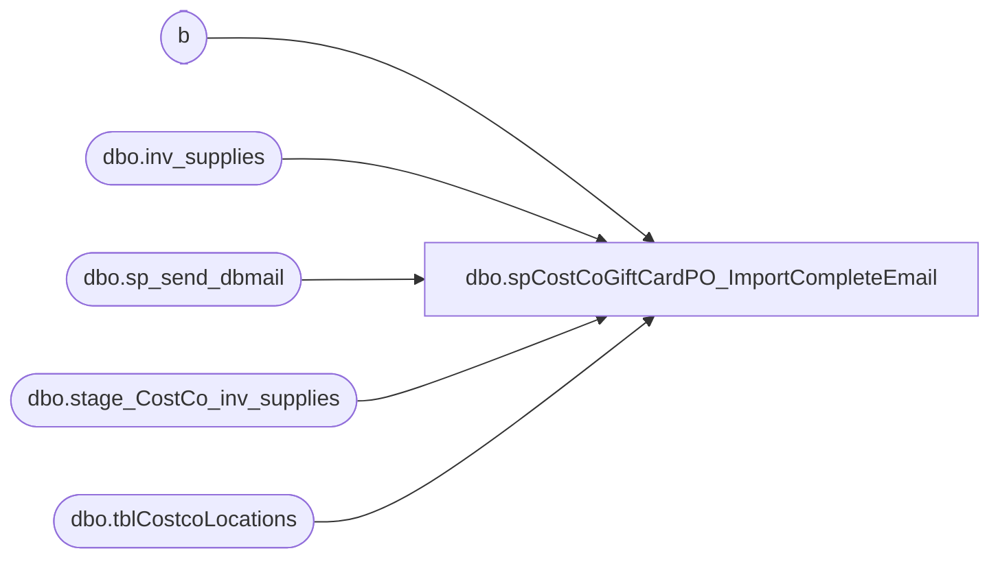

# dbo.spCostCoGiftCardPO_ImportCompleteEmail

**Database:** dw  
**Server:** papamart  

## Architecture Diagram



## Table Dependencies

| Referenced Table |
|---|
| b |
| dbo.inv_supplies |
| dbo.sp_send_dbmail |
| dbo.stage_CostCo_inv_supplies |
| dbo.tblCostcoLocations |

## Stored Procedure Code

```sql
CREATE PROCEDURE [dbo].[spCostCoGiftCardPO_ImportCompleteEmail]
AS
-- =============================================================================================================
-- Name: usp_NotificationOfProductUpdate
--
-- Description:	This procedure notifies of POs imported into KODIAK.beardata.dbo.inv_supplies from SSIS package
--		GiftCard - CostCo PO Import.dtsx
--
-- Output: Email notification.
-- 
-- Available actions: 
--
-- Dependency: 
--
-- Revision History
--		Name:			Date:			Comments:
--		Mike Pelikan	10/17/2013		Created

-- =============================================================================================================
DECLARE @Revision DATETIME
SET @Revision = '10/17/2013'
-- =============================================================================================================

BEGIN

	SET NOCOUNT ON;

	IF OBJECT_ID('tempdb.dbo.#B') IS NOT NULL DROP TABLE #B

	SELECT DISTINCT
	[Ship To Location] WHSE, ' ' REGION, ISNULL(location_name,' ') Name, ISNULL(address_line1,' ')  Address, 
	ISNULL(address_city,' ')  city, ISNULL(address_state,' ')  ST, ISNULL(address_zip_code,' ')  ZIP,
	[Qty Ordered] [Floor Set PO Qty],  [Qty Ordered] * 2  [total cards], ([Qty Ordered] * 2 / 25) [card pkgs], ([Qty Ordered] * 2 / 50) [holder pkgs],
	s.[PO Number],
	CASE 
	WHEN location_name IS NULL THEN 'tblCostCoLocations is missing location_code ' + '9' + RIGHT(s.[Ship To Location],4)
	WHEN sup.Comments IS NULL THEN 'PO did not import into inv_supplies successfully'
	ELSE 'Good' END Status 
	INTO #B
	FROM KODIAK.beardata.dbo.[stage_CostCo_inv_supplies] s
	LEFT JOIN KODIAK.beardata.dbo.inv_supplies sup ON s.[PO Number] = sup.Comments AND sup.style IN (18191, 50188)
	LEFT JOIN KODIAK.beardata.dbo.tblCostcoLocations c ON '9' + RIGHT(s.[Ship To Location],4) = c.location_code
	WHERE (s.[Record Type] = 'D' OR s.[PO Type] = 'D') AND s.isProcessed = 1 
	AND CONVERT(varchar(10),sup.date,101) = CONVERT(varchar(10),GETDATE(),101)
	ORDER BY 1

	WHILE (SELECT COUNT(*) FROM #B) > 0
	BEGIN
		IF OBJECT_ID('tempdb.dbo.##A') IS NOT NULL DROP TABLE ##A
		SELECT TOP 25 * INTO ##A FROM #B ORDER BY WHSE, [PO Number]
		
		--Email notification
		DECLARE @recipients VARCHAR(1000), @copy_recipients VARCHAR(1000), @subject VARCHAR(1000), @query  VARCHAR(2000)

		Declare @Body varchar(8000),
			  @TableHead varchar(8000),
			  @TableTail varchar(8000)
		 
		
		 
		Set @TableTail = '</table><br><br><br>This email has been generated from PAPAMART.dw.dbo.spCostCoGiftCardPO_ImportCompleteEmail</font></body></html>';
		Set @TableHead = '<html><head>' +
						  '<style>' +
						  'td {border: solid black 0px;padding-left:5px;padding-right:5px;padding-top:1px;padding-bottom:1px;font-size:10pt;font-family: arial;} ' +
						  '</style>' +
						  '</head>' +
						  '<body>
						  The following product(s) have been updated:
						  <br><br>
						  <table cellpadding=0 cellspacing=0 border=0>' +
						  '<tr bgcolor=#FFEFD8>' +
						  '<td align=center><b>WHSE</b></td>' +
						  '<td align=center><b>Name</b></td>' +
						  '<td align=center><b>Region</b></td>' +
						  '<td align=center><b>Address</b></td>' +
						  '<td align=center><b>City</b></td>' +
						  '<td align=center><b>ST</b></td>' +
						  '<td align=center><b>Zip</b></td>' +
						  '<td align=center><b>H</b></td>' +
						  '<td align=center><b>I</b></td>' +
						  '<td align=center><b>J</b></td>' +
						  '<td align=center><b>K</b></td>' +
						  '<td align=center><b>L</b></td>' +
						  '<td align=center><b>M</b></td>' +
						  '<td align=center><b>PO Qty</b></td>' +
						  '<td align=center><b>total cards</b></td>' +
						  '<td align=center><b>card pkgs</b></td>' +
						  '<td align=center><b>holder pkgs</b></td>' +
						  '<td align=center><b>po#</b></td>' +
						  '<td align=center><b>status</b></td></tr>';
		 
		Select @Body = (Select Row_Number() Over(Order By [PO Number]) % 2 As [TRRow],
			WHSE TD, Name TD, Region TD, Address TD, city TD, ST TD, ZIP TD, '' TD, '' TD, '' TD, '' TD, '' TD, '' TD, 
			[Floor Set PO Qty] TD,  [total cards] TD, [card pkgs] TD, [holder pkgs] TD, [PO Number] TD,
		Status TD
			FROM ##A 
			FOR XML raw('tr'), Elements)
		 
		-- Replace the entity codes and row numbers
		Set @Body = Replace(@Body, '_x0020_', space(1))
		Set @Body = Replace(@Body, '_x003D_', '=')
		Set @Body = Replace(@Body, '<tr><TRRow>1</TRRow>', '<tr bgcolor=#C6CFFF>')
		Set @Body = Replace(@Body, '<TRRow>0</TRRow>', '')
		 
		Select @Body = @TableHead + @Body + @TableTail

		
		SELECT @recipients  = 'annaa@buildabear.com', @copy_recipients = 'lindak@buildabear.com;databears@buildabear.com', 
		@subject = 'CostCo GiftCard PO has been imported.'
		EXEC msdb.dbo.sp_send_dbmail @recipients = @recipients, @copy_recipients = @copy_recipients, @subject = @subject, @body = @Body , @body_format = 'HTML'
		--@query = @query
		DELETE FROM b FROM #B b INNER JOIN ##A a ON b.[PO Number] = a.[PO Number] and b.WHSE = a.WHSE 
	END
END
```

