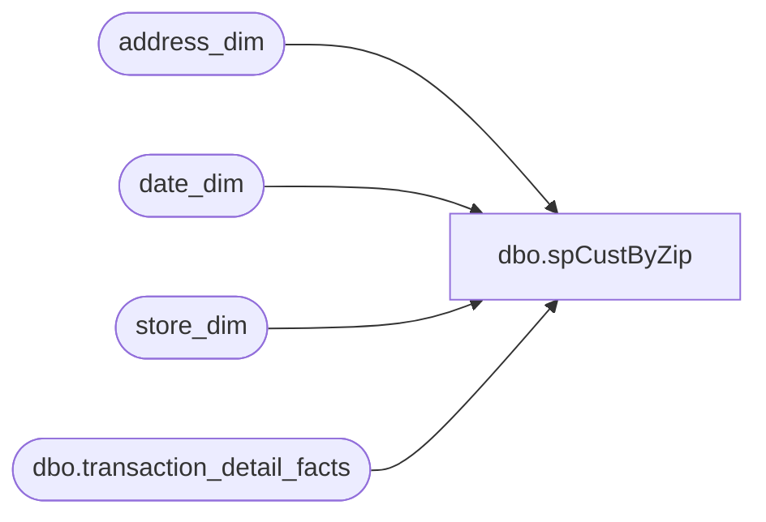

# dbo.spCustByZip

**Database:** dw  
**Server:** papamart  

## Architecture Diagram



## Table Dependencies

| Referenced Table |
|---|
| address_dim |
| date_dim |
| store_dim |
| dbo.transaction_detail_facts |

## Stored Procedure Code

```sql
/******created by Cece on 2/2/2005; use by Strategic Planning to calc trade areas******/
--EXEC spCustByZip '4/4/2004', '4/4/2004'

CREATE  
PROCEDURE dbo.spCustByZip
	/* ===== ARGUMENTS ===== */
	@FromDate 		DATETIME	= NULL,
	@ToDate 		DATETIME	= NULL
	
AS

SET NOCOUNT ON
SET QUOTED_IDENTIFIER OFF
	
	

/* ============================================================================= */
/* ================================  BEGIN  ==================================== */
/* ============================================================================= */


/**** GET all cust keys for visits in the specified time range (separate recips and senders for query performance *****/
IF object_id('tempdb.dbo.#SenderCustomer') IS NOT NULL DROP TABLE dbo.#SenderCustomer

--gift senders
SELECT 	tdf.store_key,
	tdf.date_key,
	tdf.sender_customer_key as cust_key,
	--sender_address_key as address_key,
	ad.postal_code
INTO dbo.#SenderCustomer
FROM dbo.transaction_detail_facts tdf
JOIN store_dim sd ON tdf.store_key = sd.store_key
JOIN date_dim dd ON tdf.date_key = dd.date_key
JOIN address_dim ad ON tdf.sender_address_key = ad.address_key
WHERE tdf.transaction_line_seq < 0
and store_id NOT IN (8,13,17,136,119,124,130,150)
and store_id >= 1 and store_id <= 500
--and store_id in (30, 62, 75,76)
and dd.actual_date BETWEEN @FromDate AND @ToDate --'4/4/2004' AND '4/8/2004 23:59' 
and sender_customer_key <> 0
and sender_address_key <> 0
and ad.country = 'US'
--select count(*) from #SenderCust --15473
CREATE  CLUSTERED INDEX IX_TMPsendCustomer on #SenderCustomer (store_key, date_key, cust_key)


IF object_id('tempdb.dbo.#RecipCustomer') IS NOT NULL DROP TABLE dbo.#RecipCustomer

--self recipients
SELECT 	tdf.store_key,
	tdf.date_key,
	tdf.recipient_customer_key as cust_key,
	--recipient_address_key as address_key,
	ad.postal_code
INTO #RecipCustomer
FROM dbo.transaction_detail_facts tdf
JOIN store_dim sd ON tdf.store_key = sd.store_key
JOIN date_dim dd ON tdf.date_key = dd.date_key
JOIN address_dim ad ON tdf.recipient_address_key = ad.address_key
WHERE tdf.transaction_line_seq < 0
and store_id NOT IN (8,13,17,136,119,124,130,150)
and store_id >= 1 and store_id <= 500 
--and store_id in (30, 62, 75,76)
AND dd.actual_date BETWEEN @FromDate AND @ToDate  -- BETWEEN '4/4/2004' AND '4/8/2004 23:59'
AND tdf.purpose_key = 1 
and recipient_customer_key <> 0
and recipient_address_key <> 0
and ad.country = 'US'
CREATE  CLUSTERED INDEX IX_TMPrecipcust on #RecipCustomer (store_key, date_key, cust_key)


--select count(*) from #RecipCust --72507


/*********MERGE GUESTS**********/

SELECT a.postal_code,sd.store_id,
	count(cust_key) as GuestCount
FROM (

	SELECT 	store_key,
		date_key,
		cust_key,
		postal_code
	FROM 	#SenderCustomer
	
	UNION 
	
	SELECT 	store_key,
		date_key,
		cust_key,
		postal_code
	FROM 	#RecipCustomer

     ) a
JOIN store_dim sd on a.store_key = sd.store_key
GROUP BY a.postal_code, store_id


/***FINAL RESULTS**/

-- /**** GET visit history for customers (1 year up to and including last visit date in the original selection) ****/
-- 
-- IF object_id('tempdb.dbo.#SenderCustHistory') IS NOT NULL DROP TABLE dbo.#SenderCustHistory
-- 
-- SELECT 	a.cust_key, 
-- 	a.postal_code,
-- 	tdf.date_key,
-- 	tdf.store_key
-- 
-- INTO 	#SenderCustHistory
-- 
-- FROM (	SELECT 	sc.cust_key,
-- 		sc.ly_date_key,
-- 		sc.postal_code,
-- 		max(date_key) as lastVisitDate_key
--  	FROM #SenderCust sc
-- 	GROUP BY cust_key, ly_date_key, postal_code
--      ) a
-- JOIN dbo.transaction_detail_facts tdf ON a.cust_key = tdf.sender_customer_key
-- WHERE tdf.date_key >= ly_date_key AND tdf.date_key <= a.lastVisitDate_key
-- --(17626 row(s) affected)	
-- 
-- CREATE  CLUSTERED INDEX IX_TMPsendhist on #SenderCustHistory (store_key, date_key, cust_key)
-- 
-- IF object_id('tempdb.dbo.#RecipCustHistory') IS NOT NULL DROP TABLE dbo.#RecipCustHistory
-- 
-- SELECT 	a.cust_key, 
-- 	a.postal_code,
-- 	tdf.date_key,
-- 	tdf.store_key
-- 
-- INTO 	#RecipCustHistory
-- 
-- FROM (	SELECT 	rc.cust_key,
-- 		rc.ly_date_key,
-- 		rc.postal_code,
-- 		max(date_key) as lastVisitDate_key
--  	FROM #RecipCust rc
-- 	GROUP BY cust_key, ly_date_key, postal_code
--      ) a
-- JOIN dbo.transaction_detail_facts tdf ON a.cust_key = tdf.recipient_customer_key
-- WHERE tdf.date_key >= ly_date_key AND tdf.date_key <= a.lastVisitDate_key
-- AND tdf.purpose_key = 1 
-- 
-- 
-- CREATE  CLUSTERED INDEX IX_TMPrechist on #RecipCustHistory (store_key, date_key, cust_key)
-- --(104633 row(s) affected)
-- 
-- /**** GET customers with a history of 2 or more visits *****/
-- IF object_id('tempdb.dbo.#custbyzip') IS NOT NULL DROP TABLE dbo.#custbyzip
-- 
-- 
-- 	SELECT 	cust_key, 
-- 		postal_code,
-- 		count(*) as visitCount
-- 	INTO dbo.#custbyzip
-- 	FROM 	(
-- 		SELECT  cust_key, 
-- 			date_key,
-- 			store_key,
-- 			postal_code
-- 	
-- 		FROM #SenderCustHistory
-- 	
-- 		UNION
-- 	
-- 		SELECT  cust_key, 
-- 			date_key,
-- 			store_key,
-- 			postal_code
-- 	
-- 		FROM #RecipCustHistory 
-- 		)a
-- 	GROUP BY cust_key,postal_code


-- /***FINAL RESULTS**/
-- SELECT postal_code,
-- 	count(cust_key) as GuestCount
-- FROM dbo.#custbyzip
-- WHERE visitCount > 1
-- GROUP BY postal_code

 


 


	
	


SET NOCOUNT OFF
SET QUOTED_IDENTIFIER ON
```

