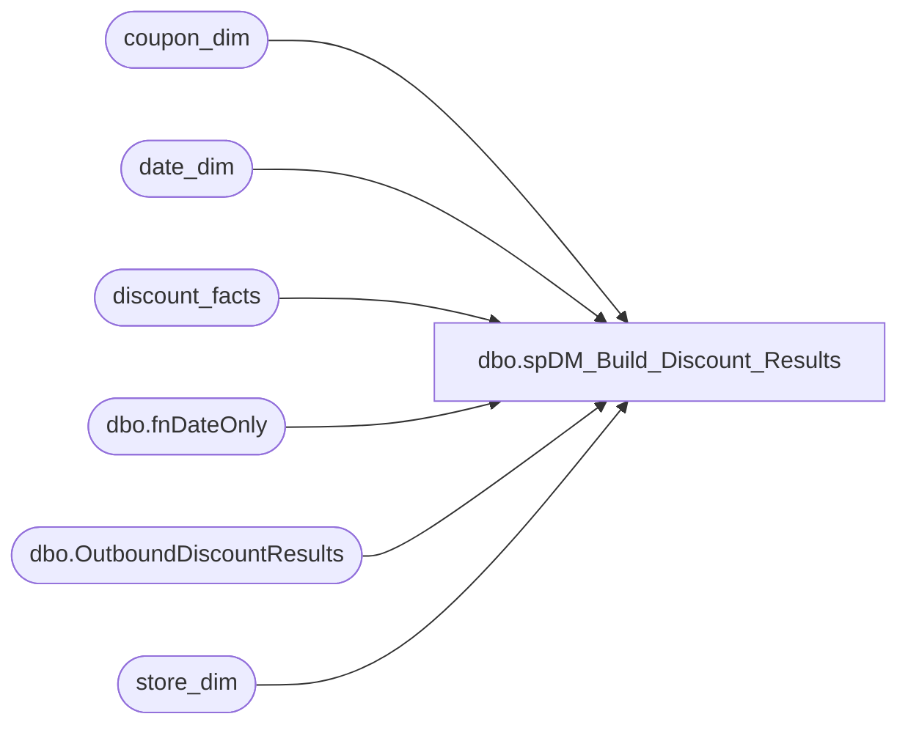

# dbo.spDM_Build_Discount_Results

**Database:** dw  
**Server:** papamart  

## Architecture Diagram



## Table Dependencies

| Referenced Table |
|---|
| coupon_dim |
| date_dim |
| discount_facts |
| dbo.fnDateOnly |
| dbo.OutboundDiscountResults |
| store_dim |

## Stored Procedure Code

```sql
-- =============================================================================================================
-- Name: [dbo].[spDM_Build_Discount_Results]
--
-- Description: 
-- Extracts the information from Discount Facts for import into Discount Manager DiscountResults
--
--
--	Parameters:
--		DaysHorizon = The number of days to go back to retrive the data. The application
--						will go back to the start of the month (period) since Discount Manager is
--						stored at the month level
--
-- Dependencies: 
--
-- Revision History
--		Name:				Date:			Comments:
--		Gary Murrish			9/11/2014		Removed specific logic for SFS Certificates
--		Gary Murrish			8/22/2013		Changed the Channel and Category for SFS Certificates
--		Gary Murrish			8/1/2013		Removed upsell from this procedure, they are now in discount_facts.
--		Gary Murrish			6/21/2013		Changed to have this just build the extract to the table DWStaging.dbo.OutboundDiscountResults
--		Gary Murrish			6/19/2013		Added upsell from giftcards Redeemed. Temp until Upsell Discounts are posted to discount_facts
--		Gary Murrish			6/19/2013		Added block for those categoryTypeID <= 0 (Not Applicable)
--		Gary Murrish			6/12/2013		Initial Creation
-- =============================================================================================================


CREATE PROC [dbo].[spDM_Build_Discount_Results]
	@DaysHorizon int
AS
	SET FMTONLY OFF;
	SET NOCOUNT ON;

	DECLARE @minDate AS datetime
	SET @minDate = DATEADD(DAY, @DaysHorizon * -1, dbo.fnDateOnly(GETDATE()))
	-- Never go back before the 2013 period 6
	IF @minDate < '5/26/2013'
		SET @minDate = '5/26/2013'

	-- Get the min date for the period
	DECLARE @minDate_Key AS int
	DECLARE @minYear AS int
	DECLARE @minPeriod AS int

	SELECT
		@minYear = dd.fiscal_year,
		@minPeriod = dd.fiscal_period
	FROM
		date_dim dd WITH (NOLOCK)
	WHERE
		dd.actual_date = @minDate

	SELECT
		@minDate_Key = MIN(date_key)
	FROM
		date_dim dd WITH (NOLOCK)
	WHERE
		dd.fiscal_year = @minYear
		AND dd.fiscal_period = @minPeriod

	TRUNCATE TABLE DWStaging.dbo.OutboundDiscountResults

	-- Get all of the discounts from Discount Facts for this period of time
	INSERT INTO DWStaging.dbo.OutboundDiscountResults
		(	fiscal_year,
			fiscal_period,
			dmDiscountID,
			categoryTypeID,
			isExpired,
			transaction_id,
			country,
			unit_gross_amount,
			numRedeemed)
	SELECT
		dd.fiscal_year,
		dd.fiscal_period,
		ISNULL(cd.dmDiscountID, -1) AS dmDiscountID,
		df.categoryTypeID,
		df.isExpired,
		df.transaction_id,
		sd.country,
		CAST(SUM(df.unit_Gross_Amount * -1) AS money) AS unit_Gross_Amount,
		SUM(1) AS numRedeemed
	FROM
		discount_facts df WITH (NOLOCK)
		LEFT JOIN coupon_dim cd WITH (NOLOCK)
			ON df.coupon_key = cd.coupon_key
		INNER JOIN date_dim dd WITH (NOLOCK)
			ON df.date_key = dd.date_key
		INNER JOIN store_dim sd WITH (NOLOCK)
			ON df.store_key = sd.store_key
	WHERE
		df.date_key >= @minDate_Key
		AND df.categoryTypeID > 0
	GROUP BY	dd.fiscal_year,
				dd.fiscal_period,
				ISNULL(cd.dmDiscountID, -1),
				df.categoryTypeID,
				df.isExpired,
				df.transaction_id,
				sd.country
	-- (76727 row(s) affected) 1:28

	---- Get the SFS Certificates category
	---- REMOVED: This is now coming over as a 'standard' discount from discount_facts
	--DECLARE @SFSCertCategory int

	--SELECT
	--	@SFSCertCategory = dcd.categoryTypeID
	--FROM
	--	Discount_Category_DIM dcd WITH (NOLOCK)
	--WHERE
	--	dcd.channelType = 'Stuff Fur Stuff'
	--	AND dcd.categoryType = 'SFS Certificates'

	---- Append the SFS Certificates
	--INSERT INTO DWStaging.dbo.OutboundDiscountResults
	--	(	fiscal_year,
	--		fiscal_period,
	--		dmDiscountID,
	--		categoryTypeID,
	--		isExpired,
	--		transaction_id,
	--		country,
	--		unit_gross_amount,
	--		numRedeemed)
	--	SELECT
	--		dd.fiscal_year,
	--		dd.fiscal_period,
	--		CAST(-1 AS int) AS dmDiscountID,
	--		@SFSCertCategory AS categoryTypeID,
	--		CAST(0 AS bit) AS isExpired,
	--		tf.transaction_id,
	--		sd.country,
	--		CAST(SUM(tf.tender_amt * -1) AS money) AS unit_Gross_Amount,
	--		COUNT(tf.tender_facts_key) AS numRedeemed
	--	FROM
	--		tender_facts tf WITH (NOLOCK)
	--		INNER JOIN tender_dim td WITH (NOLOCK)
	--			ON tf.tender_key = td.tender_key
	--		INNER JOIN date_dim dd WITH (NOLOCK)
	--			ON tf.date_key = dd.date_key
	--		INNER JOIN store_dim sd WITH (NOLOCK)
	--			ON tf.store_key = sd.store_key
	--	WHERE
	--		td.tender_code = '640'
	--		AND tf.date_key >= @minDate_Key
	--	GROUP BY	dd.fiscal_year,
	--				dd.fiscal_period,
	--				tf.transaction_id,
	--				sd.country

	---- Get the Upsell category
	---- REMOVED: This is now coming over as a 'standard' discount from discount_facts
	--DECLARE @UpsellCategory int

	--SELECT
	--	@UpsellCategory = dcd.categoryTypeID
	--FROM
	--	Discount_Category_DIM dcd WITH (NOLOCK)
	--WHERE
	--	dcd.channelType = 'Other Discounts'
	--	AND dcd.categoryType = 'Up Sell'

	---- Append the Upsell
	--INSERT INTO DWStaging.dbo.OutboundDiscountResults
	--	(	fiscal_year,
	--		fiscal_period,
	--		dmDiscountID,
	--		categoryTypeID,
	--		isExpired,
	--		transaction_id,
	--		country,
	--		unit_gross_amount,
	--		numRedeemed)

	--	SELECT
	--		dd.fiscal_year,
	--		dd.fiscal_period,
	--		CAST(-1 AS int) AS dmDiscountID,
	--		ISNULL(@UpsellCategory, -1) AS categoryTypeID,
	--		CAST(0 AS bit) AS isExpired,
	--		gr.transaction_id,
	--		sd.country,
	--		CAST(SUM(gr.activation_discount_amount) AS money) AS unit_Gross_Amount,
	--		COUNT(gr.recID) AS numRedeemed
	--	FROM
	--		giftcards_redeemed gr WITH (NOLOCK)
	--		INNER JOIN store_dim sd WITH (NOLOCK)
	--			ON gr.store_key = sd.store_key
	--		INNER JOIN date_dim dd WITH (NOLOCK)
	--			ON gr.date_key = dd.date_key
	--	WHERE
	--		gr.date_key >= @minDate_Key
	--		AND gr.activation_discount_amount <> 0
	--	GROUP BY	dd.fiscal_year,
	--				dd.fiscal_period,
	--				gr.transaction_id,
	--				sd.country


dbo,spGuestLoad_Pull_Raw_CRM_Addresses,-- =============================================================================================================
-- Name: spGuestLoad_Pull_Raw_CRM_Addresses
--
-- Description:	
--		Take the staged crm addresses and merge them with the raw_addr_dim to see if we have matches
--
-- Input:
--		@etl_log_id			int	
--			Current load to process
--
-- Output: 
--		data will be loaded into dw.dbo.GuestLoad_Pull_Raw_CRM_Addresses 
--
-- Dependencies: 
--
-- EXAMPLE:
--		exec dw.dbo.spGuestLoad_Pull_Raw_CRM_Addresses 1
--
-- Revision History
--		Name:			Date:			Comments:
--		Dave Rice		7/19/2010		created
--		Dave Rice		01/13/2010		changed opt-in options
--		Dave Rice		04/14/2011		speed up first pull be doing function after the pull, went from 9 minutes to 16 seconds
-- =============================================================================================================
CREATE PROCEDURE [dbo].[spGuestLoad_Pull_Raw_CRM_Addresses](@etl_log_id int)
AS
BEGIN
-- SET NOCOUNT ON added to prevent extra result sets from
-- interfering with SELECT statements.
SET NOCOUNT ON;

----exec dbo.[spGuestLoad_Pull_Raw_CRM_Addresses] 13957
--select top 1 etl_log_id from dwstaging.dbo.load_rec_id_cntrl with (nolock)
--declare @etl_log_id int
--set @etl_log_id = 14146

--exec dw.dbo.spGuestLoad_Pull_Raw_CRM_Addresses 43802

IF (Object_ID('tempdb..#staging_crm') IS NOT NULL) DROP TABLE #staging_crm
select distinct 
	addr_chksum,
	CRM_STG_ID,

	isnull(SND_MAIL_CD,'') CRM_SND_MAIL_CD,
	isnull(MAIL_OPT_IN_CD,'') CRM_MAIL_OPT_IN_CD,

	case 
		when MAIL_OPT_IN_CD not in ('2') THEN 'Y'
		else 'N' 
	end DRVD_MAIL_STAT_CD,

--	case 
--		when SND_MAIL_CD NOT IN ('1') and MAIL_OPT_IN_CD NOT IN ('2') THEN 'Y'
--		else 'N' 
--	end DRVD_MAIL_STAT_CD,

	cast(''	as varchar(1)) KSK_SNDR_SND_MAIL_CD,

	-- for those folks that ncoa'd or have an invalid address, then do not allow the address to 
	-- come through.  this is great for ncoa because we might actually have a valid address, but 
	-- we can not associate that to someone again, because in dw, we moved them off to -1
	-- if someone modifies the address, then they MUST also change the indicator
	-- other "invalid" addresses can flow through, we will simply regeocode them.  the only 
	-- problem will be making sure that the indicator gets reset to "MAILABLE" in crm on the
	-- pass up through garym's code

-- ******************************************************************************************************
-- this is much faster
	case 
		when SND_MAIL_CD IN ('4') and substring(ADDR_LN_1_TXT, 1, 4) = 'NCOA' then '' 
		else isnull(ADDR_LN_1_TXT,'')	
	end ADDR_LN_1_TXT, 

	isnull(ADDR_LN_2_TXT,'')	ADDR_LN_2_TXT,
	cast(''	as varchar(1)) APT_UNIT_NBR,
	isnull(CTY_NM,'')	CTY_NM, 
	isnull(PSTL_CD,'')	PSTL_CD, 
	isnull(ST_PRVNC_TXT,'')	ST_PRVNC_TXT, 
	isnull(CNTRY_ABBRV,'')	CNTRY_TXT,

-- ******************************************************************************************************
--	case 
--		when SND_MAIL_CD IN ('4') and substring(ADDR_LN_1_TXT, 1, 4) = 'NCOA' then '' 
--		else isnull(dw.dbo.fnRemoveASCIIChar(ADDR_LN_1_TXT, 0),'')	
--	end ADDR_LN_1_TXT, 
----	isnull(dw.dbo.fnRemoveASCIIChar(ADDR_LN_1_TXT, 0),'')	ADDR_LN_1_TXT, 
--
--	isnull(dw.dbo.fnRemoveASCIIChar(ADDR_LN_2_TXT, 0),'')	ADDR_LN_2_TXT,
--	cast(''	as varchar(1)) APT_UNIT_NBR,
--	isnull(dw.dbo.fnRemoveASCIIChar(CTY_NM, 0),'')	CTY_NM, 
--	isnull(dw.dbo.fnRemoveASCIIChar(PSTL_CD, 0),'')	PSTL_CD, 
--	isnull(dw.dbo.fnRemoveASCIIChar(ST_PRVNC_TXT, 0),'')	ST_PRVNC_TXT, 
--	isnull(dw.dbo.fnRemoveASCIIChar(CNTRY_ABBRV, 0),'')	CNTRY_TXT,

-- ******************************************************************************************************

	case 
		when st.statename is not null and st.US_BABW = 'Y' then 'US'
		when st.statename is not null and st.US_BABW = 'N' then 'CA'
		when st2.abrev is not null and len(s.PSTL_CD) = 5 and st2.US_BABW = 'Y' then 'US'
		when st2.abrev is not null and st2.US_BABW = 'N' then 'CA'
 		when kcm.sCountry is not null then '' + kcm.sCountry
-- 		when kcm2.sCountry is not null then '' + kcm.sCountry
		when uk.postcode is not null then 'GB'
		when sd.country is not null then case when sd.country = 'UK' then 'GB' else sd.country end
		else 'US'
	end DRVD_CNTRY_ABBRV
into #staging_crm
from dwStaging.dbo.CRM_STG s
	left join dw.dbo.tblKioskCountryMapping kcm with (nolock)
	on kcm.sKioskCountry = s.CNTRY_ABBRV
	left join dw.dbo.tblstates st with (nolock)
	on st.statename = rtrim(s.ST_PRVNC_TXT)
	left join dw.dbo.tblstates st2 with (nolock)
	on st2.abrev = s.ST_PRVNC_TXT 
	left join dw.dbo.tblUKPostalCodes_new uk with (nolock)
	on uk.postcodecompressed = replace(s.PSTL_CD, ' ','')
	left join dw.dbo.store_dim sd with (nolock)
	on sd.store_id = s.str_nbr
where s.[etl_log_id] = @etl_log_id
create index ix_tmp_addr_chksum on #staging_crm(addr_chksum)

-- you have to spell out the a-z and 0-9 due to quirks in patindex and testing of extra chars
update #staging_crm set ADDR_LN_1_TXT = dw.dbo.fnRemoveASCIIChar(ADDR_LN_1_TXT, 0)
--select ADDR_LN_1_TXT,* from #staging_crm
where PATINDEX('%[^!abcdefghijklmnopqrstuvwxyz0123456789,-./"''&_# ]%', ADDR_LN_1_TXT) > 0

update #staging_crm set ADDR_LN_2_TXT = dw.dbo.fnRemoveASCIIChar(ADDR_LN_2_TXT, 0)
--select ADDR_LN_2_TXT,* from #staging_crm
where PATINDEX('%[^!abcdefghijklmnopqrstuvwxyz0123456789,-./"''&_# ]%', ADDR_LN_2_TXT) > 0

update #staging_crm set CTY_NM = dw.dbo.fnRemoveASCIIChar(CTY_NM, 0)
--select CTY_NM,* from #staging_crm
where PATINDEX('%[^!abcdefghijklmnopqrstuvwxyz0123456789,-./"''&_# ]%', CTY_NM) > 0

update #staging_crm set PSTL_CD = dw.dbo.fnRemoveASCIIChar(PSTL_CD, 0)
--select PSTL_CD,* from #staging_crm
where PATINDEX('%[^!abcdefghijklmnopqrstuvwxyz0123456789,-./"''&_# ]%', PSTL_CD) > 0

update #staging_crm set ST_PRVNC_TXT = dw.dbo.fnRemoveASCIIChar(ST_PRVNC_TXT, 0)
--select ST_PRVNC_TXT,* from #staging_crm
where PATINDEX('%[^!abcdefghijklmnopqrstuvwxyz0123456789,-./"''&_# ]%', ST_PRVNC_TXT) > 0

update #staging_crm set CNTRY_TXT = dw.dbo.fnRemoveASCIIChar(CNTRY_TXT, 0)
--select CNTRY_TXT,* from #staging_crm
where PATINDEX('%[^!abcdefghijklmnopqrstuvwxyz0123456789,-./"''&_# ]%', CNTRY_TXT) > 0


-- strip out the distinct chksums
IF (Object_ID('tempdb..#addr_chksum') IS NOT NULL) DROP TABLE #addr_chksum
select distinct addr_chksum
into #addr_chksum
from #staging_crm
create index ix_tmp_addr_chksum on #addr_chksum(addr_chksum)

IF (Object_ID('tempdb..#rad') IS NOT NULL) DROP TABLE #rad
select rad.raw_addr_id,
	rad.addr_chksum,
	isnull(rad.addr_ln_1_txt,'') addr_ln_1_txt,
	isnull(rad.addr_ln_2_txt, '') addr_ln_2_txt,
	isnull(rad.apt_unit_nbr, '') apt_unit_nbr,
	isnull(rad.cty_nm, '') cty_nm,
	isnull(rad.st_prvnc_txt, '') st_prvnc_txt,
	isnull(rad.pstl_cd,'') pstl_cd,
	isnull(rad.cntry_txt,'') cntry_txt,
	isnull(rad.drvd_cntry_abbrv, '') drvd_cntry_abbrv,
	isnull(rad.drvd_mail_stat_cd, '') drvd_mail_stat_cd,
	isnull(rad.ksk_sndr_snd_mail_cd, '') ksk_sndr_snd_mail_cd,
	isnull(rad.crm_snd_mail_cd, '') crm_snd_mail_cd,
	isnull(rad.crm_mail_opt_in_cd, '') crm_mail_opt_in_cd
into #rad
from #addr_chksum a
	join dw.dbo.raw_addr_dim rad
	on rad.addr_chksum = a.addr_chksum
create index ix_rad_addr_chksum on #rad(addr_chksum)

truncate table GuestLoad_Pull_Raw_CRM_Addresses

insert into GuestLoad_Pull_Raw_CRM_Addresses (
	CRM_STG_ID,
	CRM_SND_MAIL_CD, CRM_MAIL_OPT_IN_CD, DRVD_MAIL_STAT_CD, 
	ADDR_LN_1_TXT, ADDR_LN_2_TXT, CTY_NM, PSTL_CD, ST_PRVNC_TXT, CNTRY_TXT,
	DRVD_CNTRY_ABBRV,
	addr_chksum,
	raw_addr_id)
select
	distinct 
	s.CRM_STG_ID,

	s.CRM_SND_MAIL_CD, s.CRM_MAIL_OPT_IN_CD, s.DRVD_MAIL_STAT_CD, 
	s.ADDR_LN_1_TXT, s.ADDR_LN_2_TXT, s.CTY_NM, s.PSTL_CD, s.ST_PRVNC_TXT, s.CNTRY_TXT,
	s.DRVD_CNTRY_ABBRV,
	s.addr_chksum,
	r.raw_addr_id
from #staging_crm s
	left join #rad r with (nolock)
	on r.addr_chksum = s.addr_chksum
	and r.addr_ln_1_txt = s.addr_ln_1_txt
	and r.addr_ln_2_txt = s.addr_ln_2_txt
	and r.apt_unit_nbr = s.apt_unit_nbr
	and r.cty_nm = s.cty_nm
	and r.st_prvnc_txt = s.st_prvnc_txt
	and r.pstl_cd = s.pstl_cd
	and r.cntry_txt = s.cntry_txt

	and r.DRVD_CNTRY_ABBRV = s.DRVD_CNTRY_ABBRV
	and r.DRVD_MAIL_STAT_CD = s.DRVD_MAIL_STAT_CD

	and r.ksk_sndr_snd_mail_cd = s.KSK_SNDR_SND_MAIL_CD
	and r.crm_snd_mail_cd = s.CRM_SND_MAIL_CD
	and r.crm_mail_opt_in_cd = s.CRM_MAIL_OPT_IN_CD
END
```

