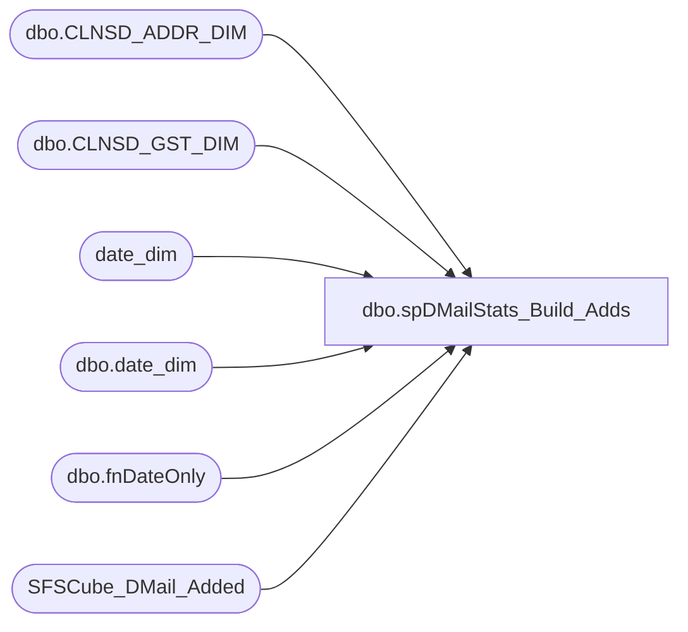

# dbo.spDMailStats_Build_Adds

**Database:** dw  
**Server:** papamart  

## Architecture Diagram



## Table Dependencies

| Referenced Table |
|---|
| dbo.CLNSD_ADDR_DIM |
| dbo.CLNSD_GST_DIM |
| date_dim |
| dbo.date_dim |
| dbo.fnDateOnly |
| SFSCube_DMail_Added |

## Stored Procedure Code

```sql
-- =============================================================================================================
-- Revision History
--		Name:				Date:			Comments:
--		Shawn Burge		05/01/2012		created
-- =============================================================================================================
CREATE PROCEDURE [dbo].[spDMailStats_Build_Adds]
-- These are the number of days to go back and regenerate information
@numDays INT = 5
AS
BEGIN
	-- SET NOCOUNT ON added to prevent extra result sets from
	-- interfering with SELECT statements.
	SET NOCOUNT ON;
	DECLARE
	   @effDate DATETIME;
	SET @effDate = DATEADD(d,-1 * @numDays, dbo.fnDateOnly(GETDATE()))
	DECLARE
	   @effDate_Key INT;
	SET @effDate_Key = (SELECT
							   date_key
						  FROM date_dim WITH (NOLOCK)
						  WHERE actual_date = @effDate);
	DELETE FROM queries..SFSCube_DMail_Added
	  WHERE
			date_key >= @effDate_Key;

	INSERT INTO queries..SFSCube_DMail_Added(
				date_key
			  , ORIG_SRC_SYS_CD
			  , isSFSMember
			  , CNTRY_ABBRV
			  , numDmailsAdded)
	SELECT
		   date_key
		 , ORIG_SRC_SYS_CD
		 , isSFSMember
		 , CNTRY_ABBRV
		 , COUNT(1)AS numAddresses
	  FROM(
		   SELECT
				  DTE.date_key AS date_key
				, ISNULL(DM.ORIG_SRC_SYS_CD, 'UNK') AS ORIG_SRC_SYS_CD
				, CASE
				  WHEN LEN((
		   SELECT
				  MIN(LYLTY_GST_NBR)AS LYLTY_GST_NBR
			 FROM dbo.CLNSD_GST_DIM GSTR WITH (NOLOCK)
			 WHERE GSTR.CLNSD_ADDR_ID = DM.CLNSD_ADDR_ID
			 GROUP BY
					  GSTR.CLNSD_ADDR_ID)) > 0 THEN 1
					  ELSE 0
				  END AS isSFSMember
				, ISNULL(DM.CNTRY_ABBRV, 'USA') AS CNTRY_ABBRV
			 FROM
				  dbo.CLNSD_ADDR_DIM DM WITH (NOLOCK)
				  INNER JOIN dbo.date_dim DTE WITH (NOLOCK)
					  ON DTE.actual_date = dbo.fnDateOnly(DM.INS_DT)
			 WHERE DM.INS_DT >= @effDate) AS BASE
	  GROUP BY
			   date_key
			 , ORIG_SRC_SYS_CD
			 , isSFSMember
			 , CNTRY_ABBRV
	  ORDER BY
			   date_key, ORIG_SRC_SYS_CD, isSFSMember, CNTRY_ABBRV;

-- 4:05 Minutes to generate 110 records    
END;
```

