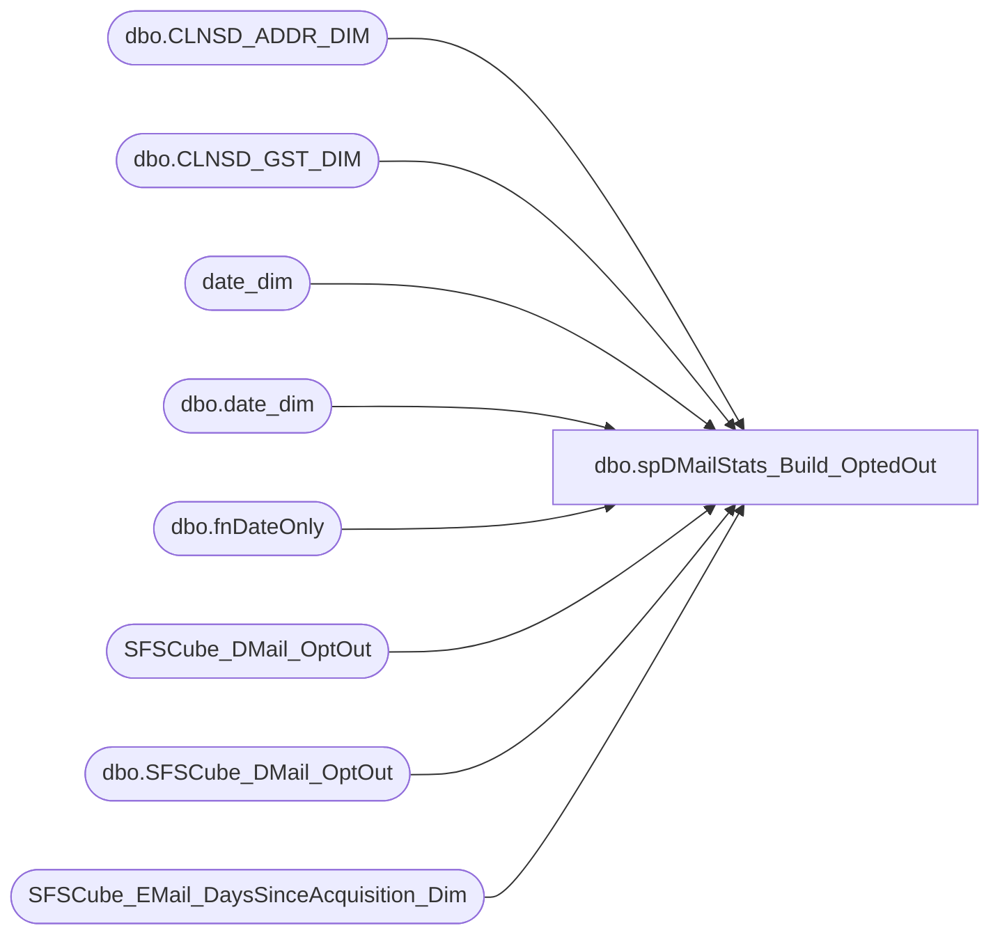

# dbo.spDMailStats_Build_OptedOut

**Database:** dw  
**Server:** papamart  

## Architecture Diagram



## Table Dependencies

| Referenced Table |
|---|
| dbo.CLNSD_ADDR_DIM |
| dbo.CLNSD_GST_DIM |
| date_dim |
| dbo.date_dim |
| dbo.fnDateOnly |
| SFSCube_DMail_OptOut |
| dbo.SFSCube_DMail_OptOut |
| SFSCube_EMail_DaysSinceAcquisition_Dim |

## Stored Procedure Code

```sql
-- =============================================================================================================
-- Revision History
--		Name:				Date:			Comments:
--		Shawn Burge		05/01/2012		created
-- =============================================================================================================
 CREATE PROCEDURE [dbo].[spDMailStats_Build_OptedOut]
-- These are the number of days to go back and regenerate information
 @numDays INT = 5 
 AS
 BEGIN
	-- SET NOCOUNT ON added to prevent extra result sets from
	-- interfering with SELECT statements.
	SET NOCOUNT ON;
	DECLARE @effDate DATETIME;
	SET @effDate = DATEADD(d, -1 * @numDays, dbo.fnDateOnly(GETDATE()));

	DECLARE @effDate_Key INT;
	SET @effDate_Key = (SELECT date_key FROM date_dim WITH (NOLOCK) WHERE actual_date = @effDate);
	-- Truncate table queries..SFSCube_DMail_OptOut

	 DELETE FROM queries..SFSCube_DMail_OptOut
	  WHERE
			date_key >= @effDate_Key;

	 INSERT INTO queries.dbo.SFSCube_DMail_OptOut
			(
				date_key
			  , ORIG_SRC_SYS_CD
			  , daysSinceID
			  , isSFSMember
			  , CNTRY_ABBRV
			  , numDmailsOptOut
			  , numDaysSinceAcquisition)
	
SELECT
	   BASE.date_key
	 , BASE.ORIG_SRC_SYS_CD
	 , DYA.daysSinceID
	 , BASE.isSFSMember
	 , BASE.CNTRY_ABBRV
	 , COUNT(1)AS numAddresses
	 , SUM(CASE
		   WHEN base.DaysSinceAcquisition < 0 THEN 0
			   ELSE base.DaysSinceAcquisition
		   END)AS numDaysSinceAcquisition
  FROM
	  (
	   SELECT
			  DTE.date_key AS date_key
			, ISNULL(DM.ORIG_SRC_SYS_CD, 'UNK') AS ORIG_SRC_SYS_CD
			, CAST(DATEDIFF(DAY, DM.INS_DT, DM.[GLBL_OPT_IN_DT])AS BIGINT)AS DaysSinceAcquisition
			, CASE
			  WHEN LEN((
	   SELECT
			  MIN(GSTR.LYLTY_GST_NBR)AS LYLTY_GST_NBR
		 FROM dbo.CLNSD_GST_DIM GSTR WITH (NOLOCK)
		 WHERE GSTR.CLNSD_ADDR_ID = DM.CLNSD_ADDR_ID
		 GROUP BY
				  GSTR.CLNSD_ADDR_ID)) > 0 THEN 1
				  ELSE 0
			  END AS isSFSMember
			, ISNULL(DM.CNTRY_ABBRV, 'USA') AS CNTRY_ABBRV
		 FROM
			  dbo.CLNSD_ADDR_DIM DM WITH (NOLOCK)
			  INNER JOIN dbo.date_dim DTE WITH (NOLOCK)
				  ON DTE.actual_date = dbo.fnDateOnly(DM.[GLBL_OPT_IN_DT])
		 WHERE DM.[MAIL_STAT_CD] = 'OPT-OUT'
		   AND DM.[GLBL_OPT_IN_DT] > @effDate) AS BASE
	  INNER JOIN queries..SFSCube_EMail_DaysSinceAcquisition_Dim DYA WITH (NOLOCK)
		  ON BASE.DaysSinceAcquisition BETWEEN DYA.minDays AND DYA.maxDays
  GROUP BY
		   BASE.date_key
		 , BASE.ORIG_SRC_SYS_CD
		 , BASE.CNTRY_ABBRV
		 , DYA.daysSinceID
		 , BASE.isSFSMember
  ORDER BY
		   BASE.date_key, BASE.ORIG_SRC_SYS_CD, BASE.CNTRY_ABBRV, DYA.daysSinceID, BASE.isSFSMember;

-- Run took 4:44 Minutes		   
 END;
```

