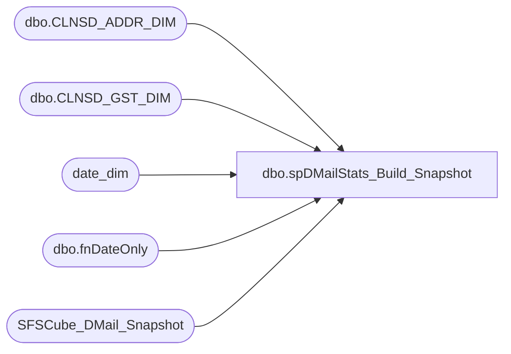

# dbo.spDMailStats_Build_Snapshot

**Database:** dw  
**Server:** papamart  

## Architecture Diagram



## Table Dependencies

| Referenced Table |
|---|
| dbo.CLNSD_ADDR_DIM |
| dbo.CLNSD_GST_DIM |
| date_dim |
| dbo.fnDateOnly |
| SFSCube_DMail_Snapshot |

## Stored Procedure Code

```sql
-- =============================================================================================================
-- Revision History
--		Name:				Date:			Comments:
--		Shawn Burge		05/01/2012		created
-- =============================================================================================================
CREATE PROCEDURE [dbo].[spDMailStats_Build_Snapshot]
AS
BEGIN
	-- SET NOCOUNT ON added to prevent extra result sets from
	SET NOCOUNT ON;
	DECLARE
	   @Curr_Date_Key INT;
	SET @Curr_Date_Key = (SELECT
								 date_key
							FROM date_dim
							WHERE actual_date = dbo.fnDateOnly(GETDATE()));

	DELETE FROM queries..SFSCube_DMail_Snapshot
	  WHERE
			date_key = @Curr_Date_Key;

	INSERT INTO queries..SFSCube_DMail_Snapshot(
				date_key
			  , cntry_abbrv
			  , isSFSMember
			  , DMail_stat_cd
			  , numAddresses)
SELECT
	   @Curr_Date_Key
	 , BASE.CNTRY_ABBRV
	 , BASE.isSFSMember
	 , BASE.MAIL_STAT_CD
	 , COUNT(1)AS numAddresses
  FROM (
	   SELECT
			  DM.CLNSD_ADDR_ID
			, ISNULL(DM.MAIL_STAT_CD, 'UNK') AS MAIL_STAT_CD
			, ISNULL(DM.CNTRY_ABBRV, 'USA') AS CNTRY_ABBRV
			, CASE
			  WHEN LEN((
	   SELECT
			  MIN(LYLTY_GST_NBR)AS LYLTY_GST_NBR
		 FROM dbo.CLNSD_GST_DIM GSTR WITH (NOLOCK)
		 WHERE GSTR.CLNSD_ADDR_ID = DM.CLNSD_ADDR_ID
		 GROUP BY
				  GSTR.CLNSD_ADDR_ID)) > 0 THEN 1
				  ELSE 0
			  END AS isSFSMember
		 FROM
			  dbo.CLNSD_ADDR_DIM DM WITH (NOLOCK)) AS BASE
  GROUP BY
		   BASE.CNTRY_ABBRV
		 , BASE.isSFSMember
		 , BASE.MAIL_STAT_CD
  ORDER BY
		   BASE.CNTRY_ABBRV, BASE.isSFSMember, BASE.MAIL_STAT_CD;

-- Takes around 6:30 minutes	       
END;
```

