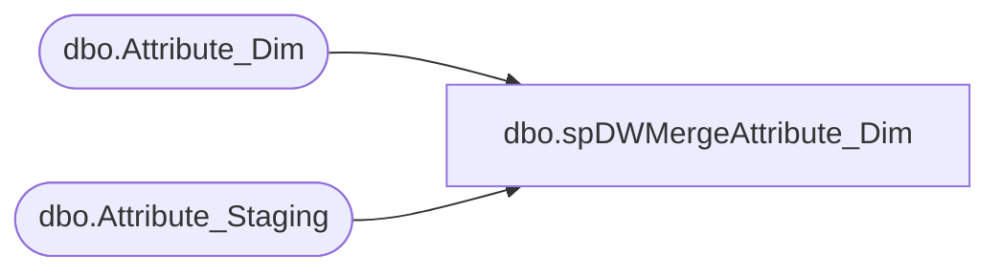

# dbo.spDWMergeAttribute_Dim

**Database:** dw  
**Server:** papamart  

## Architecture Diagram



## Table Dependencies

| Referenced Table |
|---|
| dbo.Attribute_Dim |
| dbo.Attribute_Staging |

## Stored Procedure Code

```sql
-- =============================================================================================================
-- Name: spDWMergeAttribute_Dim
--
-- Description:	
--		Pull together the list of custom properties and attributes from merch
--
--
-- Output: 
--		data will be loaded into dw.dbo.Attribute_Dim
--
-- Dependencies: 
--
-- EXAMPLE:
--		exec dw.dbo.spDWMergeAttribute_Dim
--
-- Revision History
--		Name:			Date:			Comments:
--		Tim Bytnar		4/13/2018		created							
--		Tim Bytnar		2019-9-03		Update view, changed merge to allow for inserts and deletes since the ssis takes a full load
-- =============================================================================================================
CREATE PROCEDURE [dbo].[spDWMergeAttribute_Dim]
AS
BEGIN

	SET NOCOUNT ON

	--MERGE dw.dbo.Attribute_Dim t
	--Using DWStaging.dbo.Attribute_Staging s
	--ON  t.entity_key = s.entity_key
	--WHEN MATCHED
	--	AND (ISNULL(t.AttributeValue,'') <> ISNULL(s.AttributeValue,''))
	--THEN UPDATE
	--	SET t.AttributeValue = s.AttributeValue,
	--		t.UPDT_DT = GETDATE()
	--WHEN NOT MATCHED BY TARGET
	--THEN INSERT (entity_key,style_code,AttributeName,AttributeValue,INS_DT)
	--		VALUES (s.entity_key,s.style_code,s.AttributeName,s.AttributeValue,GETDATE());


	MERGE dw.dbo.Attribute_Dim target
	Using DWStaging.dbo.Attribute_Staging source
		on target.style_code=source.style_code
		and target.attributeName=source.AttributeName
		and target.AttributeValue=source.AttributeValue
	when not matched by target
		then insert 
			(
				entity_key, 
				style_code,
				AttributeName,
				AttributeValue,
				INS_DT
			)
		values
			(
				source.entity_key, 
				source.style_code,
				source.AttributeName,
				source.AttributeValue,
				getdate()
			)
	when not matched by source
	then 
		Delete 
	;

END
```

