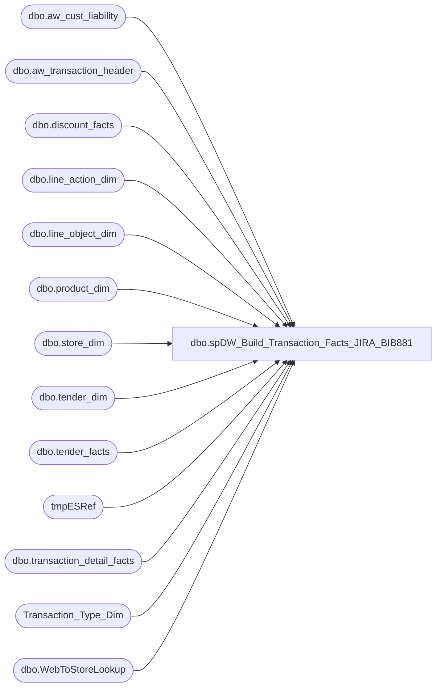

# dbo.spDW_Build_Transaction_Facts_JIRA_BIB881

**Database:** dw  
**Server:** papamart  

## Architecture Diagram



## Table Dependencies

| Referenced Table |
|---|
| dbo.aw_cust_liability |
| dbo.aw_transaction_header |
| dbo.discount_facts |
| dbo.line_action_dim |
| dbo.line_object_dim |
| dbo.product_dim |
| dbo.store_dim |
| dbo.tender_dim |
| dbo.tender_facts |
| tmpESRef |
| dbo.transaction_detail_facts |
| Transaction_Type_Dim |
| dbo.WebToStoreLookup |

## Stored Procedure Code

```sql
-- =============================================================================================================
-- Name: [dbo].[spDW_Build_Transaction_Facts]
--
-- Description: 
-- Aggregates POS transactions sales and product group metrics by store and date into Transaction_Facts
--
--	NOTE: IF YOU CHANGE THIS, YOU WILL PROBABLY HAVE TO ALSO CHANGE vwDW_Transactions
--
-- Dependencies: 
--
-- Revision History
--		Name:				Date:			Comments:
--		Gary Murrish			12/29/2011		Removed subclass '48-06-01' from Merchandise Units
--		Gary Murrish			3/5/2012		Changed definition of GAAP Transactions
--		Gary Murrish			8/1/2012		Ensured that department R-B-Z is in Other only
--												and that subclass ending in 25 is in skins only
--		Gary Murrish			5/10/2013		Changed to utilize the Transaction Trigger table
--		Gary Murrish			7/1/2013		Added the Upsell Discount and the Financial GAAP Sales
--		Gary Murrish			7/10/2013		Added Batch Logic
--		Gary Murrish			7/16/2013		Fix calculation of Net amounts when both UGA and Disc are negative
--		Gary Murrish			12/3/2013		Added Cashier_key
--		Gary Murrish			12/20/2013		Corrrected GAAP Sales calculation for Credit Card Returns
--		Gary Murrish			5/2/2014		Moved 640 from Tender to discounts
--		Gary Murrish			5/5/2014		Added costs to record
--		Gary Murrish			5/6/2014		Changed the Net calculation to remove an old Case Statement
--		Kevin Shyr				1/13/2014		Change logic to use ScorecardCategory field on product_dim to determine sales category
--		Kevin Shyr				2/3/2015		Add in scents
--		Kevin Shyr				3/27/2016		Add in line_objects for Corporate sales (115, 215, 1660)
--		Dan Tweedie				06/08/2016		Altered proc to handle Enterprise Selling data, we now use line_action to distinguish between Gaap and new Store Sales
--		Dan Tweedie				06/28/2016		Added handling for new Enterprise Selling Discount line_objects / line_actions
--		Dan Tweedie				07/28/2016		Added + ISNULL(cte.STORE_shipping_UGA, 0) to Store_Sales_Amount and Fin_Store_Sales_Amount
--		Dan Tweedie				08/04/2016		Enterprise Selling Returns will now count as both Gaap AND Store Sale, will continue to post to the location where Return transaction occurred.
--												Enterprise Selling Fulfillments will now post to the original Order location's Gaap.
--												In order to handle Returns and Fulfillments differently, we need to separate them out for all associated staging Discount and Transaction Detail measures and make the changes to final build query.
--												Additional transaction_facts columns:
--													New Transaction Facts Columns
--													•	Enterprise_selling_amount = Sale amount associated with ES Order, Cancel, or Return
--													•	Enterprise_selling_only_flag = Transaction contains only ES Order, Cancel or Return
--													•	Gaap_units = Units associated with Gaap part of transaction only (includes ES Fulfillment)
--													•	Enterprise_selling_units = Units associated with ES Order, Cancel or Return
--												NOTE: Presently, Enterprise Selling Fulfillments are only coming from the WEB, as 990 in Auditworks, but otherwise store 13. 
--													  As stated above, these will post to the Original ES ORDER location.
--													  ES Cancels also posting to original location.
--													  In the future, fulfillments will also come from a store location. 
--														If we need to post that to the Original ES ORDER location, and assuming the transaction may also contain non ES,
--														then we would have to break out a single transaction to pull out the Fulfillment to post it to the Original ES Order location, posting the rest of the transaction to the store.
--														This means what would otherwise be one transaction_fact, will now be two transaction_facts. Same transaction_id, different store_key. 
--								8/05/2016		Where noted, Each measure is broken out by:
--																Non-ES
--																Enterprise Selling Order / Cancel 
--																Enterprise Selling Fulfillments
--																Enterprise Selling Returns
--		Dan Tweedie			2018-02-12	-- Added to transaction_facts:
--												EmployeeDiscountUGA -- Added new column to staged discounts, included in final insert to transaction_facts
--												ReturnUGA -- Added new column to temp table staged transaction_detail_facts -- filter for line action 2,99, included in final insert to transaction_facts
--												ReturnUnits-- Added new column to temp table staged transaction_detail_facts -- filter for line action 2,99, included in final insert to transaction_facts
--		Tim Bytnar			2018-4-19		Added party_key to the process
--		Dan Tweedie			2020-05-28		Added isShipFromStore and isPickupFromStore
--		Dan Tweedie			2020-07-08		Added logic for isPickupFromStore
--		Dan Tweedie			2020-01-11		Added isCurbside, isSameDayShipt, updated so isShipFromStore, isPickupFromStore use same source data as isCurbside, isSameDayShipt
--		Dan Tweedie			2021-08-02		Removed query into tmpESRef, that is now handled earlier in the process, via the flash gaap email usp_FlashGAAPSales
--		Dan Tweedie			2021-08-29		Updated to use merge instead of delete / insert
--		Dan Tweedie			2021-10-05		Updated to stop after staging for the merge. The next step will now be to run spMergeTransaction_facts from SSIS
--		Tim Callahan		2024-04-04		Pre Deployment Check In: Added additional handling related to bag fees and GAAP -- See JIRA BIB881
--		Tim Callahan		2024-05-06		Deployment Check In: Added additional handling related to bag fees and GAAP -- See JIRA BIB881
-- =============================================================================================================

CREATE PROC [dbo].[spDW_Build_Transaction_Facts_JIRA_BIB881]
AS
	SET NOCOUNT ON;

--STAGE PICKUP FROM STORE TRANSACTION IDS -- REMOVED CODE 2020-01-11
--IF OBJECT_ID('tempdb..#PickupFromStore') IS NOT NULL drop table #PickupFromStore
--select transaction_id 
--into #PickupFromStore
--from vwWebPickupFromStoreTransactionID


--====================================
-- STAGE ENTERPRISE SELLING REFERENCE --see also usp_FlashGAAPSales EARLIER IN THE PROCESS, but commented out because it is too soon in the process
--====================================

IF OBJECT_ID('dw..tmpESRef') IS NOT NULL
BEGIN
	DROP TABLE dw..tmpESRef
END

--this table is to enable us to post Enterprise Selling Fulfillments and Cancellations to the original Order location, which is the issuing_store_no from aw_cust_liability
select acl.reference_no, acl.issuing_store_no, acl.store_key, tdf.transaction_id
into tmpESRef
from dwstaging.dbo.aw_cust_liability acl
join dw.dbo.transaction_detail_facts tdf with (nolock) on acl.reference_no = tdf.reference_no 
join dw.dbo.line_object_dim lod with (nolock) on tdf.line_object_key = lod.line_object_key
join dw.dbo.line_action_dim lad with (nolock) on tdf.line_action_key = lad.line_action_key
join dwstaging.dbo.aw_transaction_header ath on tdf.transaction_id = ath.transaction_id
where lod.line_object = 106 --enterprise selling
and lad.line_action in (90, 142, 8) --fulfillment or cancel
group by acl.reference_no, acl.issuing_store_no, acl.store_key, tdf.transaction_id

--==========================
-- SET BATCH NUMBER
--==========================

--LET'S NOT USE BATCHES...
	--DECLARE @numBatches int
	--SELECT
	--	@numBatches = MAX(batchNumber)
	--FROM
	--	DWStaging.dbo.aw_Transaction_Header ath WITH (NOLOCK)

	--DECLARE @batchNumber int
	--SET @batchNumber = 1
	--WHILE @batchNumber <= @numBatches
	--BEGIN

	--	IF OBJECT_ID('tempdb..#tmpTrans') IS NOT NULL
	--	BEGIN
	--		DROP TABLE #tmpTrans
	--	END

		SELECT
			transaction_id
		INTO #tmpTrans
		FROM
			DWStaging.dbo.aw_Transaction_Header WITH (NOLOCK)
	--	WHERE 
	--		batchNumber = @batchNumber

--===========================================================================================
--== STAGE DISCOUNTS - SEPARATING ENTERPRISE SELLING ORDER VS NON ENTERPRISE SELLING ORDER ==
--===========================================================================================
/*  
	ES LINE_ACTIONS
	91	deducted on order -- ORDER
	92	reversed on order cancellation --CANCEL
	93	deducted on order delivery -- FULFILLMENT 
	160	deducted on order pickup --FULFILLMENT 
	94	reversed on delivery return --RETURN
*/
		IF OBJECT_ID('tempdb..#tmpDiscounts') IS NOT NULL
		BEGIN
			DROP TABLE #tmpDiscounts
		END
		
		SELECT
			df.transaction_id,
			SUM(ISNULL(df.unit_gross_amount, 0)) AS discount_amount,
			
	
			--EXCLUDES ES
			SUM(CASE
				WHEN lo.Line_Object IN (-1617, 640) THEN 0
				WHEN 
					( 
						lo.Line_Object IN (290, 295, 1841, 1842, 1843, 1846, 1849, 1860, 1600, 1610, 1611, 1615, 1618, 1630, 1636, 1641, 1642, 1643, 1646, 1649, 1802, 1803, 1806, 1809, 1830, 1187, 1199) --coupons
						and (lad.line_action NOT in (91,92,93,94,160) or lad.line_action is null) --null is because we recently added line_action to table, not updating old records.
					)
					THEN ISNULL(df.unit_gross_amount, 0) 
				ELSE 0
			END) AS coupon_discount_amount,
				
					-- INCLUDES ES ORDER / CANCEL
						SUM(CASE
						WHEN lo.Line_Object IN (-1617, 640) THEN 0
						WHEN 
							(
								lo.Line_Object IN (290, 295, 1841, 1842, 1843, 1846, 1849, 1860, 1600, 1610, 1611, 1615, 1618, 1630, 1636, 1641, 1642, 1643, 1646, 1649, 1802, 1803, 1806, 1809, 1830, 1187, 1199) --coupons
								and lad.line_action in (91,92) 
							)
							THEN ISNULL(df.unit_gross_amount, 0) 
						ELSE 0
					END) AS StoreOrder_coupon_discount_amount,

					--INCLUDES ES FULFILLMENT 
					SUM(CASE
						WHEN lo.Line_Object IN (-1617, 640) THEN 0
						WHEN 
							(
								lo.Line_Object IN (290, 295, 1841, 1842, 1843, 1846, 1849, 1860, 1600, 1610, 1611, 1615, 1618, 1630, 1636, 1641, 1642, 1643, 1646, 1649, 1802, 1803, 1806, 1809, 1830, 1187, 1199) --coupons
								and lad.line_action in (93,160) 
							)
							THEN ISNULL(df.unit_gross_amount, 0) 
						ELSE 0
					END) AS StoreFulfillment_coupon_discount_amount,

					--INCLUDES ES RETURN
					SUM(CASE
						WHEN lo.Line_Object IN (-1617, 640) THEN 0
						WHEN 
							(
								lo.Line_Object IN (290, 295, 1841, 1842, 1843, 1846, 1849, 1860, 1600, 1610, 1611, 1615, 1618, 1630, 1636, 1641, 1642, 1643, 1646, 1649, 1802, 1803, 1806, 1809, 1830, 1187, 1199) --coupons
								and lad.line_action in (94) 
							)
							THEN ISNULL(df.unit_gross_amount, 0) 
						ELSE 0
					END) AS StoreReturn_coupon_discount_amount,

			--EXCLUDES ES
			SUM(CASE
				WHEN lo.Line_Object IN (-1617, 640) THEN 0
				WHEN 
					(
						lo.Line_Object IN (290, 295, 1841, 1842, 1843, 1846, 1849, 1860, 1600, 1610, 1611, 1615, 1618, 1630, 1636, 1641, 1642, 1643, 1646, 1649, 1802, 1803, 1806, 1809, 1830, 1187, 1199)
						and (lad.line_action NOT in (91,92,93,94,160) or lad.line_action is null) 
					)
					THEN ISNULL(df.units, 0)
				ELSE 0
			END) AS coupon_discount_units,
						
						-- INCLUDES ES ORDER, CANCEL
						SUM(CASE
							WHEN lo.Line_Object IN (-1617, 640) THEN 0
							WHEN 
								(
									lo.Line_Object IN (290, 295, 1841, 1842, 1843, 1846, 1849, 1860, 1600, 1610, 1611, 1615, 1618, 1630, 1636, 1641, 1642, 1643, 1646, 1649, 1802, 1803, 1806, 1809, 1830, 1187, 1199)
									and lad.line_action in (91,92) 
								)
								THEN ISNULL(df.units, 0)
							ELSE 0
						END) AS StoreOrder_coupon_discount_units,

						--INCLUDES ES FULFILLMENT 
						SUM(CASE
							WHEN lo.Line_Object IN (-1617, 640) THEN 0
							WHEN 
								(
									lo.Line_Object IN (290, 295, 1841, 1842, 1843, 1846, 1849, 1860, 1600, 1610, 1611, 1615, 1618, 1630, 1636, 1641, 1642, 1643, 1646, 1649, 1802, 1803, 1806, 1809, 1830, 1187, 1199)
									and lad.line_action in (93,160) 
								)
								THEN ISNULL(df.units, 0)
							ELSE 0
						END) AS StoreFulfillment_coupon_discount_units,

						--INCLUDES ES RETURN 
						SUM(CASE
							WHEN lo.Line_Object IN (-1617, 640) THEN 0
							WHEN 
								(
									lo.Line_Object IN (290, 295, 1841, 1842, 1843, 1846, 1849, 1860, 1600, 1610, 1611, 1615, 1618, 1630, 1636, 1641, 1642, 1643, 1646, 1649, 1802, 1803, 1806, 1809, 1830, 1187, 1199)
									and lad.line_action in (94) 
								)
								THEN ISNULL(df.units, 0)
							ELSE 0
						END) AS StoreReturn_coupon_discount_units,
			
			--EXCLUDES ES
			SUM(CASE
				WHEN lo.Line_Object IN (-1617, 640) THEN 0
				WHEN 
					(
						lo.Line_Object NOT IN (290, 295, 1841, 1842, 1843, 1846, 1849, 1860, 1600, 1610, 1611, 1615, 1618, 1630, 1636, 1641, 1642, 1643, 1646, 1649, 1802, 1803, 1806, 1809, 1830, 1187, 1199) --excludes coupons
						and (lad.line_action NOT in (91,92,93,94,160) or lad.line_action is null) 
					)
					THEN ISNULL(df.unit_gross_amount, 0)
				ELSE 0
			END) AS total_discount_amount,

						-- INCLUDES ES ORDER, CANCEL
						SUM(CASE
							WHEN lo.Line_Object IN (-1617, 640) THEN 0
							WHEN 
								(
									lo.Line_Object NOT IN (290, 295, 1841, 1842, 1843, 1846, 1849, 1860, 1600, 1610, 1611, 1615, 1618, 1630, 1636, 1641, 1642, 1643, 1646, 1649, 1802, 1803, 1806, 1809, 1830, 1187, 1199) --excludes coupons
									and lad.line_action  in (91,92) 
								)
								THEN ISNULL(df.unit_gross_amount, 0)
							ELSE 0
						END) AS StoreOrder_total_discount_amount,

						--INCLUDES ES FULFILLMENT
						SUM(CASE
							WHEN lo.Line_Object IN (-1617, 640) THEN 0
							WHEN 
								(
									lo.Line_Object NOT IN (290, 295, 1841, 1842, 1843, 1846, 1849, 1860, 1600, 1610, 1611, 1615, 1618, 1630, 1636, 1641, 1642, 1643, 1646, 1649, 1802, 1803, 1806, 1809, 1830, 1187, 1199) --excludes coupons
									and lad.line_action in (93,160)  
								)
								THEN ISNULL(df.unit_gross_amount, 0)
							ELSE 0
						END) AS StoreFulfillment_total_discount_amount,

						--INCLUDES ES RETURN
						SUM(CASE
							WHEN lo.Line_Object IN (-1617, 640) THEN 0
							WHEN 
								(
									lo.Line_Object NOT IN (290, 295, 1841, 1842, 1843, 1846, 1849, 1860, 1600, 1610, 1611, 1615, 1618, 1630, 1636, 1641, 1642, 1643, 1646, 1649, 1802, 1803, 1806, 1809, 1830, 1187, 1199) --excludes coupons
									and lad.line_action in (94)  
								)
								THEN ISNULL(df.unit_gross_amount, 0)
							ELSE 0
						END) AS StoreReturn_total_discount_amount,
			
			--EXCLUDES ES
			SUM(CASE
				WHEN 
					(
						lo.Line_Object = -1617 --no ES equivalent found 
						AND (lad.line_action NOT in (91,92,93,94,160) or lad.line_action is null) 
					)
				THEN ISNULL(df.unit_gross_amount, 0) 
				ELSE 0
			END) AS upsell_discount_amount,
				
						-- INCLUDES ES ORDER, CANCEL
						SUM(CASE
							WHEN 
								(
									lo.Line_Object = -1617 --no ES equivalent found 
									AND lad.line_action in (91,92) -- INCLUDES ES ORDER DEDUCTED / REVERSED  
								)
							THEN ISNULL(df.unit_gross_amount, 0) 
							ELSE 0
						END) AS StoreOrder_upsell_discount_amount,
				
						--INCLUDES ES FULFILLMENT
						SUM(CASE
							WHEN 
								(
									lo.Line_Object = -1617 --no ES equivalent found 
									AND lad.line_action in (93,160)
								)
							THEN ISNULL(df.unit_gross_amount, 0) 
							ELSE 0
						END) AS StoreFulfillment_upsell_discount_amount,

						--INCLUDES ES RETURN
						SUM(CASE
							WHEN 
								(
									lo.Line_Object = -1617 --no ES equivalent found 
									AND lad.line_action in (94)
								)
							THEN ISNULL(df.unit_gross_amount, 0) 
							ELSE 0
						END) AS StoreReturn_upsell_discount_amount,

			--EXCLUDES ES
			SUM(CASE
				WHEN 
					(
						lo.Line_Object = 640 --no ES equivalent found
						and (lad.line_action NOT in (91,92,93,94,160) or lad.line_action is null) 
					)
				THEN ISNULL(df.unit_gross_amount, 0) 
				ELSE 0
			END) AS reward_certificate_amount,

						-- INCLUDES ES ORDER, CANCEL
						SUM(CASE
							WHEN 
								(
									lo.Line_Object = 640 --no ES equivalent found
									and lad.line_action in (91,92) 
								)
							THEN ISNULL(df.unit_gross_amount, 0) 
							ELSE 0
						END) AS StoreOrder_reward_certificate_amount,

						--INCLUDES ES FULFILLMENT
						SUM(CASE
							WHEN 
								(
									lo.Line_Object = 640 --no ES equivalent found
									and lad.line_action in (93,160)  
								)
							THEN ISNULL(df.unit_gross_amount, 0) 
							ELSE 0
						END) AS StoreFulfillment_reward_certificate_amount,

						--INCLUDES ES RETURN
						SUM(CASE
							WHEN 
								(
									lo.Line_Object = 640 --no ES equivalent found
									and lad.line_action in (94) 
								)
							THEN ISNULL(df.unit_gross_amount, 0) 
							ELSE 0
						END) AS StoreReturn_reward_certificate_amount,
			---	EMPLOYEE DISCOUNTS --
		SUM(CASE
					WHEN 
						(
							lo.Line_Object IN (1700,1740,1750,1900)
						)
					THEN ISNULL(df.unit_gross_amount, 0) 
					ELSE 0
				END) AS EmployeeDiscount
		INTO #tmpDiscounts
		FROM
			dbo.discount_facts df WITH (NOLOCK)
			INNER JOIN dbo.line_object_dim lo
				ON df.Line_Object_Key = lo.Line_Object_Key
			INNER JOIN #tmpTrans t
				ON df.transaction_id = t.transaction_id
			INNER JOIN dbo.line_action_dim lad 
				ON df.line_action_key = lad.line_action_key
		GROUP BY df.transaction_id


--===========================================================================================
--== END STAGE DISCOUNTS ====================================================================
--===========================================================================================

--------> keep going

--===========================================================================================
--== STAGE TENDER - no special handling for Non-ES vs ES == IF we do end up circling back to break out tender, there's other procs to consider, will need to review job.
--===========================================================================================	

		IF OBJECT_ID('tempdb..#tmpTender') IS NOT NULL
		BEGIN
			DROP TABLE #tmpTender
		END

		SELECT
			tf.transaction_id,
			SUM(CASE
				WHEN t.tender_code = 690 THEN ISNULL(tf.tender_amt, 0)
				ELSE 0
			END) AS buy_stuff_amount,
			SUM(CASE
				WHEN t.tender_code = -1 THEN ISNULL(tf.tender_amt, 0)
				ELSE 0
			END) AS tax_amount,
			SUM(CASE
				WHEN t.tender_code IN (621, 633, 690) THEN ISNULL(tf.tender_amt, 0)
				ELSE 0
			END) AS redemption_amount
		INTO #tmpTender
		FROM
			dbo.tender_facts tf WITH (NOLOCK)
			INNER JOIN dbo.tender_dim t WITH (NOLOCK)
				ON t.tender_key = tf.tender_key
			INNER JOIN #tmpTrans t1
				ON tf.transaction_id = t1.transaction_id
		WHERE
			t.tender_code IN (-1, 621, 633, 690)
		GROUP BY tf.transaction_id

--===========================================================================================
--== END STAGE TENDER ====================================================================
--===========================================================================================

--------> keep going

--========================================================================--
--===STAGE TRANSACTION_DETAIL_FACTS=======================================--
--========================================================================--


		IF OBJECT_ID('tempdb..#tmpTDF') IS NOT NULL
		BEGIN
			DROP TABLE #tmpTDF
		END

		SELECT
			tdf.transaction_id,
			COUNT(*) AS line_count,
			------------------------------------------------------------------------------------
			--these columns are from 'store sale' perspective (gaap + es order/cancel + es return) --EXCLUDES ES FULFILLMENTS
			--these columns are not used to create other measures beyond themselves
			Sum(Case
					when (lo.line_object = 106 and lad.line_action in (90,142)) 
						then 0
					else ISNULL(tdf.units, 0)
				end) as total_units,
			Sum(Case
					when (lo.line_object = 106 and lad.line_action in (90,142))
						then 0
					else ISNULL(tdf.unit_gross_amount - tdf.unit_disc_amount, 0)
				end) as  unit_net_amount, 

			Sum(Case
					when (lo.line_object = 106 and lad.line_action in (90,142))
						then 0
					else ISNULL(tdf.unit_disc_amount, 0)
				end) as unit_discount_amount,
						
			Sum(Case
					when (lo.line_object = 106 and lad.line_action in (90,142))
						then 0
					else ISNULL(tdf.unit_gross_amount, 0)
				end) as unit_gross_amount, 

			SUM(CASE
				WHEN 
					(lo.Line_Object IN (202, 204, 205, 206, 296) AND lad.line_action in (97,147))
					 then 0 
				ELSE ISNULL(tdf.units, 0)
				END) AS other_fees_units,

			------------------------------------------------------------------------------------
			--THESE LINE OBJECTS DO NOT HAVE ES VS NON-ES LINE ACTIONS, SO NO WAY TO BREAK OUT
			SUM(CASE
				WHEN lo.Line_Object IN (101, 294, 400, 401, 402, 403, 404, 410) THEN ISNULL(tdf.unit_disc_amount, 0) * CASE
					WHEN ISNULL(tdf.unit_gross_amount, 0) >= 0 THEN -1
					ELSE -1
				END
				ELSE 0
			END) AS giftcard_discount_amount,

			SUM(CASE
				WHEN lo.Line_Object IN (101, 294, 400, 401, 402, 403, 404, 410) THEN (ISNULL(tdf.unit_disc_amount, 0) - ISNULL(tdf.upsell_disc_allocated, 0)) * CASE
					WHEN ISNULL(tdf.unit_gross_amount, 0) >= 0 THEN -1
					ELSE -1
				END
				ELSE 0
			END) AS giftcard_discount_amount_Less_Upsell,

			SUM(CASE
				WHEN lo.Line_Object IN (101, 292) THEN ISNULL(tdf.unit_gross_amount - tdf.unit_disc_amount, 0)
				ELSE 0
			END) AS donations_UGA,
			SUM(CASE
				WHEN lo.Line_Object IN (101, 292) THEN ISNULL(tdf.units, 0)
				ELSE 0
			END) AS donations_units,
			SUM(CASE
				WHEN tdf.product_key = -18 THEN ISNULL(tdf.unit_gross_amount - tdf.unit_disc_amount, 0)
				ELSE 0
			END) AS party_deposit_UGA,
			SUM(CASE
				WHEN tdf.product_key = -18 THEN ISNULL(tdf.units, 0)
				ELSE 0
			END) AS party_deposit_units,
			SUM(CASE
				WHEN lo.Line_Object IN (294, 400, 401, 402, 403, 404, 410, 1625) THEN ISNULL(tdf.unit_gross_amount, 0)
				ELSE 0
			END) AS giftcard_UGA,
			SUM(CASE
				WHEN lo.Line_Object IN (294, 400, 401, 402, 403, 404, 410, 1625) THEN ISNULL(tdf.units, 0)
				ELSE 0
			END) giftcard_units,

			SUM(CASE
				WHEN lo.Line_Object = 291 THEN ISNULL(tdf.unit_gross_amount, 0)
				ELSE 0
			END) AS cub_cash_UGA,
			SUM(CASE
				WHEN lo.Line_Object = 291 THEN ISNULL(tdf.units, 0)
				ELSE 0
			END) AS cub_cash_units,
			SUM(CASE
				WHEN lo.Line_Object IN (700, 701, 710, 711, 712, 713, 714) THEN ISNULL(tdf.unit_gross_amount, 0) * -1
				ELSE 0
			END) AS paid_outs_UGA,
			SUM(CASE
				WHEN lo.Line_Object IN (700, 701, 710, 711, 712, 713, 714) THEN ISNULL(tdf.units, 0)
				ELSE 0
			END) * -1 AS paid_outs_units,
			SUM(CASE
				WHEN lo.Line_Object IN (210, 250) THEN ISNULL(tdf.unit_gross_amount - tdf.unit_disc_amount, 0)
				ELSE 0
			END) AS stuffing_supplies_UGA,
			SUM(CASE
				WHEN lo.Line_Object IN (210, 250) THEN ISNULL(tdf.units, 0)
				ELSE 0
			END) AS stuffing_supplies_units,

			------------------------------------------------------------------------------------


----NEXT BATCH OF MEASURES ARE ALL GAAP / STORE SALES RELATED
/*
		ES LINE_ACTIONS:
		7	ordered -- ORDER
		8	order cancelled -- CANCEL
		90	order delivered -- FULFILLMENT
		142	order picked up -- FULFILLMENT
		99	delivery returned -- RETURN
*/

--======== BEGIN NON ES --=================
			--SUM(CASE
			--	WHEN lo.Line_Object IN (100, 102, 103, 104, 115) AND
			--	RIGHT(p.subclass_code, 8) NOT IN ('57-01-01') THEN ISNULL(tdf.unit_gross_amount, 0)
			--	ELSE 0
			--END) AS merchandise_UGA, -- Replaced on 4/4/2024
			SUM(CASE
				WHEN lo.Line_Object IN (100, 102, 103, 104, 115)
					AND
				RIGHT(p.subclass_code, 8) NOT IN ('57-01-01') 									
					THEN ISNULL(tdf.unit_gross_amount, 0) -- Original Case Statement 
				WHEN lo.Line_Object IN (100, 102, 103, 104, 115)
					AND
				RIGHT(p.subclass_code, 8) IN ('57-01-01')
					AND
				p.style_code in ('098088')
					AND
				sd.store_id not in ('31','47','88','100','110','207','210','216','309','332','363','384','417','476')
				THEN ISNULL(tdf.unit_gross_amount, 0) -- New Additional Case Statement
				ELSE 0 -- Original Else Statement 
			END) AS merchandise_UGA, -- Replaced merchandise_UGA calc above on 4/4/2024 as related to JIRA BIB881
			SUM(CASE
				WHEN lo.Line_Object IN (100, 102, 103, 104, 115) AND
				RIGHT(p.subclass_code, 8) NOT IN ('57-01-01') THEN ISNULL(tdf.unit_gross_amount - tdf.unit_disc_amount, 0)
				ELSE 0
			END) AS merchandise_NetAmount,
			SUM(CASE
				WHEN lo.Line_Object IN (100, 102, 103, 104, 115) AND
				RIGHT(p.department_code, 2) NOT IN ('45', '46', '47', '49', '50', '51', '55', '60', '70', '75', '80', '85') AND
				RIGHT(p.subclass_code, 8) NOT IN ('48-06-01', '57-01-01') THEN ISNULL(tdf.units, 0)
				ELSE 0
			END) AS merchandise_units,
			SUM(CASE
				WHEN lo.Line_Object IN (100, 102, 103, 104, 115) AND
				RIGHT(p.department_code, 2) NOT IN ('45', '46', '47', '49', '50', '51', '55', '60', '70', '75', '80', '85') AND
				RIGHT(p.subclass_code, 8) NOT IN ('48-06-01', '57-01-01') THEN ISNULL(tdf.ext_cost, 0)
				ELSE 0
			END) AS merchandise_cost,
			SUM(CASE
				WHEN lo.Line_Object IN (100, 102, 103, 104, 115) AND
				RIGHT(p.department_code, 2) NOT IN ('45', '46', '47', '49', '50', '51', '55', '60', '70', '75', '80', '85') AND
				RIGHT(p.subclass_code, 8) NOT IN ('48-06-01', '57-01-01') AND
				ISNULL(tdf.units, 0) <> 0 THEN 1
				ELSE 0
			END) AS hasGAAPUnits,
--======== END NON ES =================--

--======== BEGIN ES ORDERS / CANCELS --=================
			SUM(CASE
				WHEN (
						 (lo.line_object = 106 and (lad.line_action in (7,8))) 
					 )	
						AND
				RIGHT(p.subclass_code, 8) NOT IN ('57-01-01') THEN ISNULL(tdf.unit_gross_amount, 0)
				ELSE 0
			END) AS ES_Order_UGA,
			SUM(CASE
				WHEN (
						 (lo.line_object = 106 and (lad.line_action in (7,8)))
					 )	
						AND
				RIGHT(p.subclass_code, 8) NOT IN ('57-01-01') THEN ISNULL(tdf.unit_gross_amount - tdf.unit_disc_amount, 0)
				ELSE 0
			END) AS ES_Order_NetAmount,
			SUM(CASE
				WHEN (
						 (lo.line_object = 106 and (lad.line_action in (7,8)))
					 )	
						AND
				RIGHT(p.department_code, 2) NOT IN ('45', '46', '47', '49', '50', '51', '55', '60', '70', '75', '80', '85') AND
				RIGHT(p.subclass_code, 8) NOT IN ('48-06-01', '57-01-01') THEN ISNULL(tdf.units, 0)
				ELSE 0
			END) AS ES_Order_units,
			SUM(CASE
				WHEN (
						 (lo.line_object = 106 and (lad.line_action in (7,8)))
					 )	
						AND
				RIGHT(p.department_code, 2) NOT IN ('45', '46', '47', '49', '50', '51', '55', '60', '70', '75', '80', '85') AND
				RIGHT(p.subclass_code, 8) NOT IN ('48-06-01', '57-01-01') THEN ISNULL(tdf.ext_cost, 0)
				ELSE 0
			END) AS ES_Order_cost,
			SUM(CASE
				WHEN (
						 (lo.line_object = 106 and (lad.line_action in (7,8)))
					 )	
						AND
				RIGHT(p.department_code, 2) NOT IN ('45', '46', '47', '49', '50', '51', '55', '60', '70', '75', '80', '85') AND
				RIGHT(p.subclass_code, 8) NOT IN ('48-06-01', '57-01-01')
				then 1
				else 0
			END) AS hasESOrderUnits,

--======== END ES ORDERS / CANCELS --=================

--======== BEGIN ES FULFILLMENTS --=================

		--SUM(CASE
		--		WHEN (
		--				 (lo.line_object = 106 and (lad.line_action in (90,142))) 
		--			 )	
		--				AND
		--		RIGHT(p.subclass_code, 8) NOT IN ('57-01-01') THEN ISNULL(tdf.unit_gross_amount, 0)
		--		ELSE 0
		--	END) AS ES_Fulfillment_UGA, -- Replaced on 4/4/2024
		SUM(CASE
				WHEN (
						 (lo.line_object = 106 and (lad.line_action in (90,142))) 
					 )	
						AND
				RIGHT(p.subclass_code, 8) NOT IN ('57-01-01') 
					THEN ISNULL(tdf.unit_gross_amount, 0)
				WHEN (
						 (lo.line_object = 106 and (lad.line_action in (90,142))) 
					 )	
						AND
				RIGHT(p.subclass_code, 8) IN ('57-01-01') 
						AND
				p.style_code in ('098088')
						AND
				sd.store_id not in ('31','47','88','100','110','207','210','216','309','332','363','384','417','476')
					THEN ISNULL(tdf.unit_gross_amount, 0)
				ELSE 0
			END) AS ES_Fulfillment_UGA, -- Replaced Above ES_Fulfillment_UGA, on 4/4/2024 as related to JIRA BIB881

			SUM(CASE
				WHEN (
						 (lo.line_object = 106 and (lad.line_action in (90,142))) 
					 )	
						AND
				RIGHT(p.subclass_code, 8) NOT IN ('57-01-01') THEN ISNULL(tdf.unit_gross_amount - tdf.unit_disc_amount, 0)
				ELSE 0
			END) AS ES_Fulfillment_NetAmount,
			SUM(CASE
				WHEN (
						 (lo.line_object = 106 and (lad.line_action in (90,142))) 
					 )	
						AND
				RIGHT(p.department_code, 2) NOT IN ('45', '46', '47', '49', '50', '51', '55', '60', '70', '75', '80', '85') AND
				RIGHT(p.subclass_code, 8) NOT IN ('48-06-01', '57-01-01') THEN ISNULL(tdf.units, 0)
				ELSE 0
			END) AS ES_Fulfillment_units,
			SUM(CASE
				WHEN (
						 (lo.line_object = 106 and (lad.line_action in (90,142))) 
					 )	
						AND
				RIGHT(p.department_code, 2) NOT IN ('45', '46', '47', '49', '50', '51', '55', '60', '70', '75', '80', '85') AND
				RIGHT(p.subclass_code, 8) NOT IN ('48-06-01', '57-01-01') THEN ISNULL(tdf.ext_cost, 0)
				ELSE 0
			END) AS ES_Fulfillment_cost,
			SUM(CASE
				WHEN (
						(lo.line_object = 106 and (lad.line_action in (90,142))) 
					 )
						AND
				RIGHT(p.department_code, 2) NOT IN ('45', '46', '47', '49', '50', '51', '55', '60', '70', '75', '80', '85') AND
				RIGHT(p.subclass_code, 8) NOT IN ('48-06-01', '57-01-01') AND
				ISNULL(tdf.units, 0) <> 0 THEN 1
				ELSE 0
			END) AS hasESFulfillmentUnits,

--======== END ES FULFILLMENT --=================

--======== BEGIN ES RETURNS --===========

		--SUM(CASE
		--		WHEN (
		--				 (lo.line_object = 106 and (lad.line_action in (99))) 
		--			 )	
		--				AND
		--		RIGHT(p.subclass_code, 8) NOT IN ('57-01-01') THEN ISNULL(tdf.unit_gross_amount, 0)
		--		ELSE 0
		--	END) AS ES_Return_UGA, -- Replaced on 4/4/2024
		SUM(CASE
				WHEN (
						 (lo.line_object = 106 and (lad.line_action in (99))) 
					 )	
						AND
				RIGHT(p.subclass_code, 8) NOT IN ('57-01-01') 
					THEN ISNULL(tdf.unit_gross_amount, 0)
				WHEN (
						 (lo.line_object = 106 and (lad.line_action in (99))) 
					 )	
						AND
				RIGHT(p.subclass_code, 8) IN ('57-01-01') 
						AND
				p.style_code in ('098088')
					AND
				sd.store_id not in ('31','47','88','100','110','207','210','216','309','332','363','384','417','476')
					THEN ISNULL(tdf.unit_gross_amount, 0)
				ELSE 0
			END) AS ES_Return_UGA, -- -- Replaced Above ES_Return_UGA on 4/4/2024 as related to JIRA BIB881

			SUM(CASE
				WHEN (
						 (lo.line_object = 106 and (lad.line_action in (99))) 
					 )	
						AND
				RIGHT(p.subclass_code, 8) NOT IN ('57-01-01') THEN ISNULL(tdf.unit_gross_amount - tdf.unit_disc_amount, 0)
				ELSE 0
			END) AS ES_Return_NetAmount,
			SUM(CASE
				WHEN (
						 (lo.line_object = 106 and (lad.line_action in (99))) 
					 )	
						AND
				RIGHT(p.department_code, 2) NOT IN ('45', '46', '47', '49', '50', '51', '55', '60', '70', '75', '80', '85') AND
				RIGHT(p.subclass_code, 8) NOT IN ('48-06-01', '57-01-01') THEN ISNULL(tdf.units, 0)
				ELSE 0
			END) AS ES_Return_units,
			SUM(CASE
				WHEN (
						 (lo.line_object = 106 and (lad.line_action in (99))) 
					 )	
						AND
				RIGHT(p.department_code, 2) NOT IN ('45', '46', '47', '49', '50', '51', '55', '60', '70', '75', '80', '85') AND
				RIGHT(p.subclass_code, 8) NOT IN ('48-06-01', '57-01-01') THEN ISNULL(tdf.ext_cost, 0)
				ELSE 0
			END) AS ES_Return_cost,
			SUM(CASE
				WHEN (
						(lo.line_object = 106 and (lad.line_action in (99))) 
					 )
						AND
				RIGHT(p.department_code, 2) NOT IN ('45', '46', '47', '49', '50', '51', '55', '60', '70', '75', '80', '85') AND
				RIGHT(p.subclass_code, 8) NOT IN ('48-06-01', '57-01-01') AND
				ISNULL(tdf.units, 0) <> 0 THEN 1
				ELSE 0
			END) AS hasESReturnUnits,
--======== END ES RETURNS ===========--
			
			------------------------------------------------------------------------------------------------------------------------
			--these columns are from 'store sale' perspective (gaap + es order/cancel + es return) (---EXCLUDES ES FULFILLMENT---)
			------------------------------------------------------------------------------------------------------------------------
			SUM(ISNULL(CASE WHEN p.ScorecardCategory = 'Animal' and (lo.line_object <> 106 and lad.line_action NOT in (90,142) )
								THEN ISNULL(tdf.unit_gross_amount - tdf.unit_disc_amount, 0)
						ELSE 0
						END, 0)) AS animal_UGA,
			SUM(CASE WHEN p.ScorecardCategory = 'Animal' and (lo.line_object <> 106 and lad.line_action NOT in (90,142) )
							THEN ISNULL(tdf.units, 0)
					ELSE 0
					END) AS animal_units,
			SUM(CASE WHEN p.ScorecardCategory = 'Animal' and (lo.line_object <> 106 and lad.line_action NOT in (90,142) ) 
						THEN ISNULL(tdf.ext_cost, 0)
					ELSE 0
					END) AS animal_cost,
			SUM(ISNULL(CASE WHEN  p.ScorecardCategory = 'Footwear' and (lo.line_object <> 106 and lad.line_action NOT in (90,142) )
								THEN ISNULL(tdf.unit_gross_amount - tdf.unit_disc_amount, 0)
					ELSE 0
					END, 0)) AS footwear_UGA,
			SUM(CASE WHEN p.ScorecardCategory = 'Footwear' and (lo.line_object <> 106 and lad.line_action NOT in (90,142) ) 
						THEN ISNULL(tdf.units, 0)
					ELSE 0
					END) AS footwear_units,
			SUM(CASE WHEN p.ScorecardCategory = 'Footwear' and (lo.line_object <> 106 and lad.line_action NOT in (90,142) ) 
						THEN ISNULL(tdf.ext_cost, 0)
					ELSE 0
					END) AS footwear_cost,
			SUM(ISNULL(CASE WHEN p.ScorecardCategory = 'Accessories' and (lo.line_object <> 106 and lad.line_action NOT in (90,142) )
								THEN ISNULL(tdf.unit_gross_amount - tdf.unit_disc_amount, 0)
					ELSE 0
					END, 0)) AS accessories_UGA,
			SUM(CASE WHEN p.ScorecardCategory = 'Accessories' and (lo.line_object <> 106 and lad.line_action NOT in (90,142) ) 
						THEN ISNULL(tdf.units, 0)
					ELSE 0
					END) AS accessories_units,
			SUM(CASE WHEN p.ScorecardCategory = 'Accessories' and (lo.line_object <> 106 and lad.line_action NOT in (90,142) ) 
							THEN ISNULL(tdf.ext_cost, 0)
					ELSE 0
					END) AS accessories_cost,
			SUM(ISNULL(CASE WHEN p.ScorecardCategory = 'Sounds' and (lo.line_object <> 106 and lad.line_action NOT in (90,142) )
							THEN ISNULL(tdf.unit_gross_amount - tdf.unit_disc_amount, 0)
					ELSE 0
					END, 0)) AS sounds_UGA,
			SUM(CASE WHEN p.ScorecardCategory = 'Sounds' and (lo.line_object <> 106 and lad.line_action NOT in (90,142) )
							THEN ISNULL(tdf.units, 0)
					ELSE 0
					END) AS sounds_units,
			SUM(CASE WHEN p.ScorecardCategory = 'Sounds' and (lo.line_object <> 106 and lad.line_action NOT in (90,142) )
						THEN ISNULL(tdf.ext_cost, 0)
					ELSE 0
					END) AS sounds_cost,
			SUM(ISNULL(CASE WHEN p.ScorecardCategory = 'Scents' and (lo.line_object <> 106 and lad.line_action NOT in (90,142) )
							THEN ISNULL(tdf.unit_gross_amount - tdf.unit_disc_amount, 0)
					ELSE 0
					END, 0)) AS Scents_UGA,
			SUM(CASE WHEN p.ScorecardCategory = 'Scents' and (lo.line_object <> 106 and lad.line_action NOT in (90,142) )
						THEN ISNULL(tdf.units, 0)
					ELSE 0
					END) AS Scents_units,
			SUM(CASE WHEN p.ScorecardCategory = 'Scents' and (lo.line_object <> 106 and lad.line_action NOT in (90,142) )
							THEN ISNULL(tdf.ext_cost, 0)
					ELSE 0
					END) AS Scents_cost,
			SUM(ISNULL(CASE WHEN p.ScorecardCategory = 'Clothing' and (lo.line_object <> 106 and lad.line_action NOT in (90,142) )
								THEN ISNULL(tdf.unit_gross_amount - tdf.unit_disc_amount, 0)
					ELSE 0
					END, 0)) AS clothing_UGA,
			SUM(CASE WHEN p.ScorecardCategory = 'Clothing' and (lo.line_object <> 106 and lad.line_action NOT in (90,142) )
						THEN ISNULL(tdf.units, 0)
					ELSE 0
					END) AS clothing_units,
			SUM(CASE WHEN p.ScorecardCategory = 'Clothing' and (lo.line_object <> 106 and lad.line_action NOT in (90,142) )
							THEN ISNULL(tdf.ext_cost, 0)
					ELSE 0
					END) AS clothing_cost,
			SUM(ISNULL(CASE WHEN p.ScorecardCategory = 'Sports' and (lo.line_object <> 106 and lad.line_action NOT in (90,142) )
						THEN ISNULL(tdf.unit_gross_amount - tdf.unit_disc_amount, 0)
					ELSE 0
					END, 0)) AS sports_UGA,
			SUM(ISNULL(CASE WHEN p.ScorecardCategory = 'Sports' and (lo.line_object <> 106 and lad.line_action NOT in (90,142) )
							THEN ISNULL(tdf.units, 0)
					ELSE 0
					END, 0)) AS sports_units,
			SUM(ISNULL(CASE WHEN p.ScorecardCategory = 'Sports' and (lo.line_object <> 106 and lad.line_action NOT in (90,142) )
							THEN ISNULL(tdf.ext_cost, 0)
					ELSE 0
					END, 0)) AS sports_cost,
			SUM(ISNULL(CASE WHEN p.ScorecardCategory = 'Prestuffed' and (lo.line_object <> 106 and lad.line_action NOT in (90,142) )
						THEN ISNULL(tdf.unit_gross_amount - tdf.unit_disc_amount, 0)
					ELSE 0
					END, 0)) AS prestuffed_UGA,
			SUM(ISNULL(CASE WHEN p.ScorecardCategory = 'Prestuffed' and (lo.line_object <> 106 and lad.line_action NOT in (90,142) )
						THEN ISNULL(tdf.units, 0)
					ELSE 0
					END, 0)) AS prestuffed_units,
			SUM(ISNULL(CASE WHEN p.ScorecardCategory = 'Prestuffed' and (lo.line_object <> 106 and lad.line_action NOT in (90,142) )
						THEN ISNULL(tdf.ext_cost, 0)
					ELSE 0
					END, 0)) AS prestuffed_cost,

			------------------------------------------------------------------------------------------------------------------------
			-- OTHER UGA and Units are computed below
/*
	LINE_ACTIONS
	95	charged on order --ORDER
	96	refunded on order cancellation --CANCEL
	97	recognized on order delivery --FULFILLMENT
	147	recognized on order pickup --FULFILLMENT
	98	refunded on delivery return --RETURN

*/

			--EXCLUDES ES 
			SUM(CASE
				WHEN 
					(
						lo.Line_Object IN (200, 203, 215) 
					and lad.line_action NOT in (95,96,97,98,147)
					) THEN ISNULL(tdf.unit_gross_amount, 0)
				ELSE 0
			END) AS shipping_UGA,
					
					-- INCLUDES ES ORDER, CANCEL
					SUM(CASE
						WHEN 
							(
								lo.Line_Object IN (200, 203, 215) 
							and lad.line_action in (95,96)
							) THEN ISNULL(tdf.unit_gross_amount, 0)
						ELSE 0
					END) AS StoreOrder_shipping_UGA,

					--INCLUDES ES FULFILLMENT
					SUM(CASE
						WHEN 
							(
								lo.Line_Object IN (200, 203, 215) 
							and lad.line_action in (97,147)
							) THEN ISNULL(tdf.unit_gross_amount, 0)
						ELSE 0
					END) AS StoreFulfillment_shipping_UGA,

					--INCLUDES ES RETURN
					SUM(CASE
						WHEN 
							(
								lo.Line_Object IN (200, 203, 215) 
							and lad.line_action in (98)
							) THEN ISNULL(tdf.unit_gross_amount, 0)
						ELSE 0
					END) AS StoreReturn_shipping_UGA,

			--EXCLUDES ES
			SUM(CASE
				WHEN 
					(
						lo.Line_Object IN (200, 203, 215) 
					and lad.line_action NOT in (95,96,97,98,147)
					) THEN ISNULL(tdf.units, 0)
				ELSE 0
			END) AS shipping_units,
					
					-- INCLUDES ES ORDER, CANCEL
					SUM(CASE
						WHEN 
							(
								lo.Line_Object IN (200, 203, 215) 
							and lad.line_action in (95,96)
							) THEN ISNULL(tdf.units, 0)
						ELSE 0
					END) AS StoreOrder_shipping_units,

					--INCLUDES ES FULFILLMENT
					SUM(CASE
						WHEN 
							(
								lo.Line_Object IN (200, 203, 215) 
							and lad.line_action in (97,147)
							) THEN ISNULL(tdf.units, 0)
						ELSE 0
					END) AS StoreFulfillment_shipping_units,
					
					--INCLUDES ES RETURN 
					SUM(CASE
						WHEN 
							(
								lo.Line_Object IN (200, 203, 215) 
							and lad.line_action in (98)
							) THEN ISNULL(tdf.units, 0)
						ELSE 0
					END) AS StoreReturn_shipping_units,

			--EXCLUDES ES
			SUM(CASE
				WHEN 
					(
						lo.Line_Object IN (202, 204, 205, 206, 296) 
					and lad.line_action NOT in (95,96,97,98,147)
					) THEN ISNULL(tdf.unit_gross_amount, 0)
				ELSE 0 
			END) AS other_fees_UGA,
					
					-- INCLUDES ES ORDER, CANCEL
					SUM(CASE	
						WHEN 
							(
								lo.Line_Object IN (202, 204, 205, 206, 296) 
							and lad.line_action in (95,96)
							) THEN ISNULL(tdf.unit_gross_amount, 0)
						ELSE 0
					END) AS StoreOrder_other_fees_UGA,

					--INCLUDES ES FULFILLMENT
					SUM(CASE	
						WHEN 
							(
								lo.Line_Object IN (202, 204, 205, 206, 296) 
							and lad.line_action in (97,147)
							) THEN ISNULL(tdf.unit_gross_amount, 0)
						ELSE 0
					END) AS StoreFulfillment_other_fees_UGA,

					--INCLUDES ES RETURN
					SUM(CASE	
						WHEN 
							(
								lo.Line_Object IN (202, 204, 205, 206, 296) 
							and lad.line_action in (98)
							) THEN ISNULL(tdf.unit_gross_amount, 0)
						ELSE 0
					END) AS StoreReturn_other_fees_UGA,
				------------------
				--ALL RETURNS - SIMPLY LOOKING AT LINE ACTION 2 AND 99
				SUM(CASE	
						WHEN 
							(
								lad.line_action in (2,99)
							) THEN ISNULL(tdf.unit_gross_amount, 0)
						ELSE 0
					END) AS ReturnUGA,
				SUM(CASE
						WHEN 
							(
								lad.line_action in (2,99)
							) THEN ISNULL(tdf.units, 0)
						ELSE 0
					END) AS ReturnUnits

		INTO #tmpTDF
		FROM
			dbo.transaction_detail_facts tdf WITH (NOLOCK)
			INNER JOIN #tmpTrans stg ON	tdf.transaction_id = stg.transaction_id  --load only transactions added or updated in tdf
			LEFT OUTER JOIN dbo.line_object_dim lo WITH (NOLOCK) ON lo.Line_Object_Key = tdf.Line_Object_Key
			LEFT OUTER JOIN dbo.product_dim p WITH (NOLOCK) ON p.product_key = tdf.product_key
			LEFT OUTER JOIN dbo.line_action_dim lad with (nolock) on tdf.line_action_key = lad.line_action_key
			INNER JOIN dbo.store_dim sd with (nolock) on sd.store_key = tdf.store_key -- Added Join on 4/4/2024 as related to JIRA BIB881
		WHERE
			tdf.transaction_line_seq > 0
		GROUP BY tdf.transaction_id

--========================================================--
--====BUILD TRANSACTION FACTS======================--
--========================================================--

IF OBJECT_ID('dwstaging..transaction_facts_stage') IS NOT NULL DROP TABLE dwstaging.dbo.transaction_facts_stage
SELECT
		t.transaction_id,
		isnull(es.store_key, ath.store_key) as store_key,
		ath.date_key,
		ath.time_key,
		ISNULL(ttd.transaction_key, 0) AS transaction_type_key,
		ath.currency_key,
		CAST(ath.transaction_id AS varchar) + '-' + CAST(ath.store_key AS varchar) + '-' + CAST(ath.date_key AS varchar) AS transaction_key,
		ath.transaction_no,
		ath.register_no,
		ISNULL(cte.line_count, 0) as line_count,
		CASE
			WHEN ath.party_y_n = 'y' THEN 1
			ELSE 0
		END AS party_flag,

		CASE
			WHEN cte.hasGAAPUnits > 0 or cte.hasESFulfillmentUnits > 0 or cte.hasESReturnUnits > 0 
				THEN 1
			ELSE 0
		END AS GAAP_transaction_flag,

		CASE
			WHEN cte.hasGAAPUnits > 0 or cte.hasESOrderUnits > 0 or cte.hasESReturnUnits > 0 
				THEN 1
			ELSE 0
		END AS Store_transaction_flag,

		CASE
			WHEN cte.hasGAAPUnits = 0 and (cte.hasESOrderUnits > 0 or cte.hasESReturnUnits > 0) 
				THEN 1
			ELSE 0
		END AS Enterprise_selling_only_flag,

		CASE
			WHEN cte.Merchandise_UGA = 0 AND
			cte.Donations_UGA <> 0 AND
			cte.giftcard_UGA = 0 AND
			cte.Party_Deposit_UGA = 0 THEN 1
			ELSE 0
		END AS donation_only_flag,
		CASE
			WHEN cte.Merchandise_UGA = 0 AND
			cte.Donations_UGA = 0 AND
			cte.giftcard_UGA <> 0 AND
			cte.Party_Deposit_UGA = 0 THEN 1
			ELSE 0
		END AS giftcard_only_flag,
		CASE
			WHEN cte.Merchandise_UGA = 0 AND
			cte.Donations_UGA = 0 AND
			cte.giftcard_UGA = 0 AND
			cte.Party_Deposit_UGA <> 0 THEN 1
			ELSE 0
		END AS party_deposit_only_flag,

		--GAAP INCLUDES ES FULFILLMENTS AND RETURNS
		ISNULL(cte.Merchandise_UGA, 0) + ISNULL(cte.ES_Fulfillment_UGA, 0) + ISNULL(cte.ES_Return_UGA, 0)
			+ ISNULL(df.coupon_discount_amount, 0) + ISNULL(df.StoreFulfillment_coupon_discount_amount, 0) + ISNULL(df.StoreReturn_coupon_discount_amount, 0)
			+ ISNULL(df.total_discount_amount, 0) + ISNULL(df.StoreFulfillment_total_discount_amount, 0) + ISNULL(df.StoreReturn_total_discount_amount, 0)
			- ISNULL(cte.giftcard_discount_amount_Less_Upsell, 0) --no es vs non-es line action breakout possible
			+ ISNULL(cte.Cub_Cash_UGA, 0) --no es vs non-es line action breakout possible
			+ ISNULL(df.reward_certificate_amount, 0) + ISNULL(df.StoreFulfillment_reward_certificate_amount, 0) + ISNULL(df.StoreReturn_reward_certificate_amount, 0)
			+ ISNULL(tender.buy_stuff_amount, 0) --no es vs non-es line action breakout possible
			+ ISNULL(cte.Shipping_UGA, 0) + ISNULL(cte.StoreFulfillment_shipping_UGA, 0) + ISNULL(cte.StoreReturn_shipping_UGA, 0)
			+ ISNULL(cte.Other_Fees_UGA, 0) + ISNULL(cte.StoreFulfillment_other_fees_UGA, 0) + ISNULL(cte.StoreReturn_other_fees_UGA, 0)
			+ ISNULL(cte.stuffing_supplies_UGA, 0) --no es vs non-es line action breakout possible
		AS GAAP_sales_amount,

		ISNULL(cte.Merchandise_UGA, 0) + ISNULL(cte.ES_Order_UGA, 0) + ISNULL(cte.ES_Return_UGA, 0)
			+ ISNULL(df.coupon_discount_amount, 0) + ISNULL(df.StoreOrder_coupon_discount_amount, 0) + ISNULL(df.StoreReturn_coupon_discount_amount, 0)
			+ ISNULL(df.total_discount_amount, 0) + ISNULL(df.StoreOrder_total_discount_amount, 0) + ISNULL(df.StoreReturn_total_discount_amount, 0)
			- ISNULL(cte.giftcard_discount_amount_Less_Upsell, 0) --no es vs non-es line action breakout possible
			+ ISNULL(cte.Cub_Cash_UGA, 0) --no es vs non-es line action breakout possible
			+ ISNULL(df.reward_certificate_amount, 0) + ISNULL(df.StoreOrder_reward_certificate_amount, 0) + ISNULL(df.StoreReturn_reward_certificate_amount, 0)
			+ ISNULL(tender.buy_stuff_amount, 0) --no es vs non-es line action breakout possible
			+ ISNULL(cte.Shipping_UGA, 0) + ISNULL(cte.StoreOrder_shipping_UGA, 0) + ISNULL(cte.StoreReturn_shipping_UGA, 0)
			+ ISNULL(cte.Other_Fees_UGA, 0) + ISNULL(cte.StoreOrder_other_fees_UGA, 0) + ISNULL(cte.StoreReturn_other_fees_UGA, 0)
			+ ISNULL(cte.stuffing_supplies_UGA, 0) --no es vs non-es line action breakout possible
		AS Store_sales_amount,

		ISNULL(cte.ES_Order_UGA, 0) + ISNULL(cte.ES_Return_UGA, 0)
			+ ISNULL(df.StoreOrder_coupon_discount_amount, 0) + ISNULL(df.StoreReturn_coupon_discount_amount, 0)
			+ ISNULL(df.StoreOrder_total_discount_amount, 0) + ISNULL(df.StoreReturn_total_discount_amount, 0)
			--- ISNULL(cte.giftcard_discount_amount_Less_Upsell, 0) --no es vs non-es line action breakout possible
			--+ ISNULL(cte.Cub_Cash_UGA, 0) --no es vs non-es line action breakout possible
			+ ISNULL(df.StoreOrder_reward_certificate_amount, 0) + ISNULL(df.StoreReturn_reward_certificate_amount, 0)
			--+ ISNULL(tender.buy_stuff_amount, 0) --no es vs non-es line action breakout possible
			+ ISNULL(cte.StoreOrder_shipping_UGA, 0) + ISNULL(cte.StoreReturn_shipping_UGA, 0)
			+ ISNULL(cte.StoreOrder_other_fees_UGA, 0) + ISNULL(cte.StoreReturn_other_fees_UGA, 0)
			--+ ISNULL(cte.stuffing_supplies_UGA, 0) --no es vs non-es line action breakout possible
		AS Enterprise_selling_amount,

		--HANDLED AS STORE SALE, SO WILL INCLUDE ES ORDER, CANCELS AND RETURN
		ISNULL(cte.Merchandise_UGA, 0) + ISNULL(cte.ES_Order_UGA, 0) + ISNULL(cte.ES_Return_UGA, 0)
			+ ISNULL(df.coupon_discount_amount, 0) + ISNULL(df.StoreOrder_coupon_discount_amount, 0) + ISNULL(df.StoreReturn_coupon_discount_amount, 0)
			+ ISNULL(df.total_discount_amount, 0) + ISNULL(df.StoreOrder_total_discount_amount, 0) + ISNULL(df.StoreReturn_total_discount_amount, 0)
			+ ISNULL(tender.redemption_amount, 0) --no tender breakout
			+ ISNULL(df.reward_certificate_amount, 0) + ISNULL(df.StoreOrder_reward_certificate_amount, 0) + ISNULL(df.StoreReturn_reward_certificate_amount, 0)
			+ ISNULL(cte.giftcard_UGA, 0) --no es vs non-es line action breakout possible
			+ ISNULL(cte.Cub_Cash_UGA, 0) --no es vs non-es line action breakout possible
			+ ISNULL(cte.Party_Deposit_UGA, 0) --no es vs non-es line action breakout possible
			+ ISNULL(cte.Shipping_UGA, 0) + ISNULL(cte.StoreOrder_shipping_UGA, 0) + ISNULL(cte.StoreReturn_shipping_UGA, 0)
			+ ISNULL(cte.Other_Fees_UGA, 0) + ISNULL(cte.StoreOrder_other_fees_UGA, 0) + ISNULL(cte.StoreReturn_other_fees_UGA, 0)
			+ ISNULL(cte.stuffing_supplies_UGA, 0) --no es vs non-es line action breakout possible
		AS net_sales_amount,

		ISNULL(cte.total_units, 0) as total_units,
		ISNULL(cte.unit_net_amount, 0) as unit_net_amount,
		ISNULL(cte.unit_gross_amount, 0) as unit_gross_amount,
		ISNULL(df.reward_certificate_amount, 0) + ISNULL(df.StoreOrder_reward_certificate_amount, 0) + ISNULL(df.StoreReturn_reward_certificate_amount, 0) as reward_certificate_amount,
		ISNULL(tender.buy_stuff_amount, 0) as buy_stuff_amount ,
		ISNULL(tender.tax_amount, 0) as tax_amount,

		ISNULL(tender.redemption_amount, 0) 
			+ ISNULL(df.reward_certificate_amount, 0) + ISNULL(df.StoreOrder_reward_certificate_amount, 0) + ISNULL(df.StoreReturn_reward_certificate_amount, 0) as redemption_amount,

		ISNULL(cte.unit_discount_amount, 0) as unit_discount_amount,
		ISNULL(df.coupon_discount_amount, 0) + ISNULL(df.StoreOrder_coupon_discount_amount, 0) + ISNULL(df.StoreReturn_coupon_discount_amount, 0) as coupon_discount_amount,
		ISNULL(df.coupon_discount_units, 0) + ISNULL(df.StoreOrder_coupon_discount_units, 0) + ISNULL(df.StoreReturn_coupon_discount_units, 0) as coupon_discount_units,
		ISNULL(cte.giftcard_discount_amount, 0) as giftcard_discount_amount,
		ISNULL(df.total_discount_amount, 0) + ISNULL(df.StoreOrder_total_discount_amount, 0) + ISNULL(df.StoreReturn_total_discount_amount, 0) as total_discount_amount,
		 
		(ISNULL(cte.Merchandise_UGA, 0) + ISNULL(cte.ES_Order_UGA, 0) + ISNULL(cte.ES_Return_UGA, 0)
			+ ISNULL(cte.giftcard_UGA, 0) 
			+ ISNULL(cte.Donations_UGA, 0) 
			+ ISNULL(cte.stuffing_supplies_UGA, 0) 
			+ ISNULL(df.coupon_discount_amount, 0) + ISNULL(df.StoreOrder_coupon_discount_amount, 0) + ISNULL(df.StoreReturn_coupon_discount_amount, 0)
			+ ISNULL(df.total_discount_amount, 0) + ISNULL(df.StoreOrder_total_discount_amount, 0) + ISNULL(df.StoreReturn_total_discount_amount, 0)
			+ ISNULL(cte.Party_Deposit_UGA, 0) 
			+ ISNULL(tender.tax_amount, 0) 
			+ ISNULL(tender.redemption_amount, 0) 
			+ ISNULL(df.reward_certificate_amount, 0) + ISNULL(df.StoreOrder_reward_certificate_amount, 0) + ISNULL(df.StoreReturn_reward_certificate_amount, 0)
			+ ISNULL(cte.Shipping_UGA, 0) + ISNULL(cte.StoreOrder_shipping_UGA, 0) + ISNULL(cte.StoreReturn_shipping_UGA, 0)
			+ ISNULL(cte.Other_Fees_UGA, 0) + ISNULL(cte.StoreOrder_other_fees_UGA, 0) + ISNULL(cte.StoreReturn_other_fees_UGA, 0)) 
		AS receipt_total_amount,

		ISNULL(cte.Merchandise_UGA, 0) + ISNULL(cte.ES_Order_UGA, 0) + ISNULL(cte.ES_Return_UGA, 0) as merchandise_uga,

		ISNULL(cte.merchandise_units, 0) + ISNULL(cte.ES_Order_units, 0) + ISNULL(cte.ES_Return_units, 0) as merchandise_units,
		ISNULL(cte.merchandise_units, 0) + ISNULL(cte.ES_Order_units, 0) + ISNULL(cte.ES_Return_units, 0) as Store_units,
		ISNULL(cte.merchandise_units, 0) + ISNULL(cte.ES_Fulfillment_units, 0) + ISNULL(cte.ES_Return_units, 0) as Gaap_units,
		ISNULL(cte.ES_Order_units, 0) as Enterprise_selling_units,

		ISNULL(cte.Donations_UGA, 0) as Donations_UGA,
		ISNULL(cte.donations_units, 0) as donations_units,
		ISNULL(cte.Party_Deposit_UGA, 0) as Party_Deposit_UGA,
		ISNULL(cte.party_deposit_units, 0) as party_deposit_units,
		ISNULL(cte.giftcard_UGA, 0) as giftcard_UGA,
		ISNULL(cte.giftcard_units, 0) as giftcard_units,
		ISNULL(cte.animal_UGA, 0) as animal_UGA,
		ISNULL(cte.animal_units, 0) as animal_units,

		ISNULL(cte.merchandise_NetAmount, 0) + ISNULL(cte.ES_Order_NetAmount, 0) + ISNULL(cte.ES_Return_NetAmount, 0)
			- ISNULL(cte.animal_UGA, 0) 
		AS non_animal_UGA,

		ISNULL(cte.merchandise_units, 0) + ISNULL(cte.ES_Order_units, 0) + ISNULL(cte.ES_Return_units, 0)
			- ISNULL(cte.animal_units, 0) 
		AS non_animal_units,

		ISNULL(cte.Footwear_UGA, 0) as Footwear_UGA,
		ISNULL(cte.footwear_units, 0) as footwear_units,
		ISNULL(cte.accessories_UGA, 0) as accessories_UGA,
		ISNULL(cte.accessories_units, 0) as accessories_units,
		ISNULL(cte.sounds_UGA, 0) as sounds_UGA,
		ISNULL(cte.sounds_units, 0) as sounds_units,
		ISNULL(cte.Scents_UGA, 0) as Scents_UGA,
		ISNULL(cte.Scents_units, 0) as Scents_units,
		ISNULL(cte.Clothing_UGA, 0) as Clothing_UGA,
		ISNULL(cte.clothing_units, 0) as clothing_units,

		(ISNULL(merchandise_NetAmount, 0) + ISNULL(cte.ES_Order_NetAmount, 0) + ISNULL(cte.ES_Return_NetAmount, 0)
			- ISNULL(cte.animal_UGA, 0) 
			- ISNULL(accessories_UGA, 0)
			- ISNULL(Clothing_UGA, 0) 
			- ISNULL(Footwear_UGA, 0) 
			- ISNULL(sounds_UGA, 0) 
			- ISNULL(sports_UGA, 0)) 
		AS other_UGA,

		(ISNULL(merchandise_units, 0) + ISNULL(cte.ES_Order_units, 0) + ISNULL(cte.ES_Return_units, 0)
			- ISNULL(animal_units, 0) 
			- ISNULL(accessories_units, 0)
			- ISNULL(clothing_units, 0) 
			- ISNULL(footwear_units, 0) 
			- ISNULL(sounds_units, 0) 
			- ISNULL(sports_units, 0)) 
		AS other_units,

		ISNULL(cte.Shipping_UGA, 0) + ISNULL(cte.StoreFulfillment_shipping_UGA, 0) + ISNULL(cte.StoreReturn_shipping_UGA, 0) as Shipping_UGA,
		ISNULL(cte.shipping_units, 0) + ISNULL(cte.StoreOrder_shipping_units, 0) + ISNULL(cte.StoreReturn_shipping_units, 0) as shipping_units,
		ISNULL(cte.Other_Fees_UGA, 0) + ISNULL(cte.StoreFulfillment_other_fees_UGA, 0) + ISNULL(cte.StoreReturn_other_fees_UGA, 0) as Other_Fees_UGA,
		ISNULL(cte.other_fees_units, 0) as other_fees_units,
		ISNULL(cte.Cub_Cash_UGA, 0) as Cub_Cash_UGA,
		ISNULL(cte.cub_cash_units, 0) as cub_cash_units,
		ISNULL(cte.paid_outs_UGA, 0) as paid_outs_UGA,
		ISNULL(cte.paid_outs_units, 0) as paid_outs_units,
		ISNULL(cte.stuffing_supplies_UGA, 0) as stuffing_supplies_UGA,
		ISNULL(cte.stuffing_supplies_units, 0) as stuffing_supplies_units,
		ISNULL(cte.sports_UGA, 0) as sports_UGA,
		ISNULL(cte.sports_units, 0) as sports_units,
		ISNULL(cte.Prestuffed_UGA, 0) as Prestuffed_UGA,
		ISNULL(cte.prestuffed_units, 0) as prestuffed_units,
		ISNULL(df.upsell_discount_amount, 0) + ISNULL(df.StoreOrder_upsell_discount_amount, 0) + ISNULL(df.StoreReturn_upsell_discount_amount, 0) as upsell_discount_amount,

		ISNULL(cte.Merchandise_UGA, 0) + ISNULL(cte.ES_Fulfillment_UGA, 0) + ISNULL(cte.ES_Return_UGA, 0)
			+ ISNULL(df.coupon_discount_amount, 0) + ISNULL(df.StoreFulfillment_coupon_discount_amount, 0) + ISNULL(df.StoreReturn_coupon_discount_amount, 0)
			+ ISNULL(df.total_discount_amount, 0) + ISNULL(df.StoreFulfillment_total_discount_amount, 0) + ISNULL(df.StoreReturn_total_discount_amount, 0)
			- ISNULL(cte.giftcard_discount_amount_Less_Upsell, 0) --no es vs non-es line action breakout possible
			+ ISNULL(cte.Cub_Cash_UGA, 0) --no es vs non-es line action breakout possible
			+ ISNULL(df.reward_certificate_amount, 0) + ISNULL(df.StoreFulfillment_reward_certificate_amount, 0) + ISNULL(df.StoreReturn_reward_certificate_amount, 0)
			+ ISNULL(tender.buy_stuff_amount, 0) --no es vs non-es line action breakout possible
			+ ISNULL(cte.Shipping_UGA, 0) + ISNULL(cte.StoreFulfillment_shipping_UGA, 0) + ISNULL(cte.StoreReturn_shipping_UGA, 0)
			+ ISNULL(cte.Other_Fees_UGA, 0) + ISNULL(cte.StoreFulfillment_other_fees_UGA, 0) + ISNULL(cte.StoreReturn_other_fees_UGA, 0)
			+ ISNULL(cte.stuffing_supplies_UGA, 0) --no es vs non-es line action breakout possible
			+ ISNULL(df.upsell_discount_amount, 0) + ISNULL(df.StoreFulfillment_upsell_discount_amount, 0) + ISNULL(df.StoreReturn_upsell_discount_amount, 0)
		AS fin_GAAP_sales_amount,

		ISNULL(cte.Merchandise_UGA, 0) + ISNULL(cte.ES_Order_UGA, 0) + ISNULL(cte.ES_Return_UGA, 0)
			+ ISNULL(df.coupon_discount_amount, 0) + ISNULL(df.StoreOrder_coupon_discount_amount, 0) + ISNULL(df.StoreReturn_coupon_discount_amount, 0)
			+ ISNULL(df.total_discount_amount, 0) + ISNULL(df.StoreOrder_total_discount_amount, 0) + ISNULL(df.StoreReturn_total_discount_amount, 0)
			- ISNULL(cte.giftcard_discount_amount_Less_Upsell, 0) --no es vs non-es line action breakout possible
			+ ISNULL(cte.Cub_Cash_UGA, 0) --no es vs non-es line action breakout possible
			+ ISNULL(df.reward_certificate_amount, 0) + ISNULL(df.StoreOrder_reward_certificate_amount, 0) + ISNULL(df.StoreReturn_reward_certificate_amount, 0)
			+ ISNULL(tender.buy_stuff_amount, 0) --no es vs non-es line action breakout possible
			+ ISNULL(cte.Shipping_UGA, 0) + ISNULL(cte.StoreOrder_shipping_UGA, 0) + ISNULL(cte.StoreReturn_shipping_UGA, 0)
			+ ISNULL(cte.Other_Fees_UGA, 0) + ISNULL(cte.StoreOrder_other_fees_UGA, 0) + ISNULL(cte.StoreReturn_other_fees_UGA, 0)
			+ ISNULL(cte.stuffing_supplies_UGA, 0) --no es vs non-es line action breakout possible
			+ ISNULL(df.upsell_discount_amount, 0) + ISNULL(df.StoreFulfillment_upsell_discount_amount, 0) + ISNULL(df.StoreReturn_upsell_discount_amount, 0)
		AS fin_Store_sales_amount,

		ath.cashier_key,
		ISNULL(cte.merchandise_cost, 0) + ISNULL(cte.ES_Order_cost, 0) + ISNULL(cte.ES_Return_cost, 0) as merchandise_cost,
		ISNULL(cte.animal_cost, 0) as animal_cost,

		ISNULL(cte.merchandise_cost, 0) 
			- ISNULL(cte.animal_cost, 0) 
		AS non_animal_cost,

		ISNULL(cte.footwear_cost, 0) as footwear_cost,
		ISNULL(cte.accessories_cost, 0) as accessories_cost,
		ISNULL(cte.sounds_cost, 0) as sounds_cost,
		ISNULL(cte.Scents_cost, 0) as Scents_cost,
		ISNULL(cte.clothing_cost, 0) as clothing_cost,

		(ISNULL(merchandise_cost, 0) + ISNULL(cte.ES_Order_cost, 0) + ISNULL(cte.ES_Return_cost, 0)
			- ISNULL(animal_cost, 0) 
			- ISNULL(accessories_cost, 0)
			- ISNULL(clothing_cost, 0) 
			- ISNULL(footwear_cost, 0) 
			- ISNULL(sounds_cost, 0) 
			- ISNULL(sports_cost, 0)) 
		AS other_cost,

		ISNULL(cte.sports_cost, 0) as sports_cost,
		ISNULL(cte.prestuffed_cost, 0) as prestuffed_cost,
		ISNULL(ath.party_master, 0) as party_master,
		ISNULL(df.EmployeeDiscount,0) as EmployeeDiscountUGA,
		ISNULL(cte.ReturnUGA,0) as ReturnUGA,
		ISNULL(cte.ReturnUnits,0) as ReturnUnits,
		ISNULL(ath.party_key, 0) as party_key,
		w.OrderNum as WebOrderNumber,
		isnull(w.isPickupFromStore,0) as isPickupFromStore,
		isnull(w.isShipFromStore,0) as isShipFromStore,
		isnull(w.isCurbside,0) as isCurbside,
		isnull(w.isSameDay,0) as isSameDayShipt
	into dwstaging.dbo.transaction_facts_stage
	FROM
		#tmpTrans t WITH (NOLOCK)
		INNER JOIN DWStaging.dbo.aw_Transaction_Header ath WITH (NOLOCK)
			ON t.transaction_id = ath.transaction_id
		LEFT JOIN #tmpTDF cte WITH (NOLOCK)
			ON cte.transaction_id = t.transaction_id
		LEFT OUTER JOIN #tmpDiscounts df
			ON df.transaction_id = t.transaction_id
		LEFT OUTER JOIN #tmpTender tender
			ON t.transaction_id = tender.transaction_id
		LEFT JOIN Transaction_Type_Dim ttd WITH (NOLOCK)
			ON ath.transaction_type = ttd.transaction_type
		LEFT OUTER JOIN tmpESRef es
			ON t.transaction_id = es.transaction_id
		left join DWStaging.dbo.WebToStoreLookup w on ath.transaction_id=w.transaction_id

--STOP

--; --deletes are already handled in proc spAWImport_150_Delete_OldTransactions
--Merge into transaction_facts as target
--using dwstaging.dbo.transaction_facts_stage as source
--on 
--	target.transaction_id=source.transaction_id
--when not matched by target
--then 
--	INSERT 
--		(	
--			transaction_id,
--			store_key,
--			date_key,
--			time_key,
--			transaction_type_key,
--			currency_key,
--			transaction_key,
--			transaction_no,
--			register_no,
--			line_count,
--			Party_Flag,
--			GAAP_transaction_flag,
--			Store_transaction_flag,
--			Enterprise_selling_only_flag,
--			donation_only_flag,
--			giftcard_only_flag,
--			party_deposit_only_flag,
--			GAAP_sales_amount,
--			Store_sales_amount,
--			Enterprise_selling_amount,	
--			net_sales_amount,
--			total_units,
--			unit_net_amount,
--			unit_gross_amount,
--			reward_certificate_amount,
--			buy_stuff_amount,
--			tax_amount,
--			redemption_amount,
--			unit_discount_amount,
--			coupon_discount_amount,
--			coupon_discount_units,
--			giftcard_discount_amount,
--			total_discount_amount,
--			receipt_total_amount,
--			Merchandise_UGA,
--			merchandise_units,
--			Store_units,
--			Gaap_units,
--			Enterprise_selling_units,
--			Donations_UGA,
--			donations_units,
--			Party_Deposit_UGA,
--			party_deposit_units,
--			giftcard_UGA,
--			giftcard_units,
--			animal_UGA,
--			animal_units,
--			non_animal_UGA,
--			non_animal_units,
--			Footwear_UGA,
--			footwear_units,
--			accessories_UGA,
--			accessories_units,
--			sounds_UGA,
--			sounds_units,
--			Scents_UGA,
--			Scents_units,
--			Clothing_UGA,
--			clothing_units,
--			Other_UGA,
--			other_units,
--			Shipping_UGA,
--			shipping_units,
--			Other_Fees_UGA,
--			other_fees_units,
--			Cub_Cash_UGA,
--			cub_cash_units,
--			paid_outs_UGA,
--			paid_outs_units,
--			stuffing_supplies_UGA,
--			stuffing_supplies_units,
--			sports_UGA,
--			sports_units,
--			Prestuffed_UGA,
--			prestuffed_units,
--			upsell_discount_amount,	
--			fin_GAAP_sales_amount,
--			fin_Store_Sales_amount,		
--			cashier_key,
--			merchandise_cost,
--			animal_cost,
--			non_animal_cost,
--			footwear_cost,
--			accessories_cost,
--			sounds_cost,
--			Scents_cost,
--			clothing_cost,
--			other_cost,
--			sports_cost,
--			prestuffed_cost,
--			party_master,
--			EmployeeDiscountUGA,
--			ReturnUGA,
--			ReturnUnits,
--			party_key,
--			WebOrderNumber,
--			isPickupFromStore,
--			isShipfromStore,
--			isCurbside,
--			isSameDayShipt
--		)
--	values
--		(	
--			source.transaction_id,
--			source.store_key,
--			source.date_key,
--			source.time_key,
--			source.transaction_type_key,
--			source.currency_key,
--			source.transaction_key,
--			source.transaction_no,
--			source.register_no,
--			source.line_count,
--			source.Party_Flag,
--			source.GAAP_transaction_flag,
--			source.Store_transaction_flag,
--			source.Enterprise_selling_only_flag,
--			source.donation_only_flag,
--			source.giftcard_only_flag,
--			source.party_deposit_only_flag,
--			source.GAAP_sales_amount,
--			source.Store_sales_amount,
--			source.Enterprise_selling_amount,	
--			source.net_sales_amount,
--			source.total_units,
--			source.unit_net_amount,
--			source.unit_gross_amount,
--			source.reward_certificate_amount,
--			source.buy_stuff_amount,
--			source.tax_amount,
--			source.redemption_amount,
--			source.unit_discount_amount,
--			source.coupon_discount_amount,
--			source.coupon_discount_units,
--			source.giftcard_discount_amount,
--			source.total_discount_amount,
--			source.receipt_total_amount,
--			source.Merchandise_UGA,
--			source.merchandise_units,
--			source.Store_units,
--			source.Gaap_units,
--			source.Enterprise_selling_units,
--			source.Donations_UGA,
--			source.donations_units,
--			source.Party_Deposit_UGA,
--			source.party_deposit_units,
--			source.giftcard_UGA,
--			source.giftcard_units,
--			source.animal_UGA,
--			source.animal_units,
--			source.non_animal_UGA,
--			source.non_animal_units,
--			source.Footwear_UGA,
--			source.footwear_units,
--			source.accessories_UGA,
--			source.accessories_units,
--			source.sounds_UGA,
--			source.sounds_units,
--			source.Scents_UGA,
--			source.Scents_units,
--			source.Clothing_UGA,
--			source.clothing_units,
--			source.Other_UGA,
--			source.other_units,
--			source.Shipping_UGA,
--			source.shipping_units,
--			source.Other_Fees_UGA,
--			source.other_fees_units,
--			source.Cub_Cash_UGA,
--			source.cub_cash_units,
--			source.paid_outs_UGA,
--			source.paid_outs_units,
--			source.stuffing_supplies_UGA,
--			source.stuffing_supplies_units,
--			source.sports_UGA,
--			source.sports_units,
--			source.Prestuffed_UGA,
--			source.prestuffed_units,
--			source.upsell_discount_amount,	
--			source.fin_GAAP_sales_amount,
--			source.fin_Store_Sales_amount,		
--			source.cashier_key,
--			source.merchandise_cost,
--			source.animal_cost,
--			source.non_animal_cost,
--			source.footwear_cost,
--			source.accessories_cost,
--			source.sounds_cost,
--			source.Scents_cost,
--			source.clothing_cost,
--			source.other_cost,
--			source.sports_cost,
--			source.prestuffed_cost,
--			source.party_master,
--			source.EmployeeDiscountUGA,
--			source.ReturnUGA,
--			source.ReturnUnits,
--			source.party_key,
--			source.WebOrderNumber,
--			source.isPickupFromStore,
--			source.isShipfromStore,
--			source.isCurbside,
--			source.isSameDayShipt
--		)
--when matched 
--	then update
--		set
--			target.store_key=source.store_key,
--			target.date_key=source.date_key,
--			target.time_key=source.time_key,
--			target.transaction_type_key=source.transaction_type_key,
--			target.currency_key=source.currency_key,
--			target.transaction_key=source.transaction_key,
--			target.transaction_no=source.transaction_no,
--			target.register_no=source.register_no,
--			target.line_count=source.line_count,
--			target.party_flag=source.party_flag,
--			target.GAAP_transaction_flag=source.GAAP_transaction_flag,
--			target.donation_only_flag=source.donation_only_flag,
--			target.giftcard_only_flag=source.giftcard_only_flag,
--			target.party_deposit_only_flag=source.party_deposit_only_flag,
--			target.GAAP_sales_amount=source.GAAP_sales_amount,
--			target.net_sales_amount=source.net_sales_amount,
--			target.total_units=source.total_units,
--			target.unit_net_amount=source.unit_net_amount,
--			target.unit_gross_amount=source.unit_gross_amount,
--			target.reward_certificate_amount=source.reward_certificate_amount,
--			target.buy_stuff_amount=source.buy_stuff_amount,
--			target.tax_amount=source.tax_amount,
--			target.redemption_amount=source.redemption_amount,
--			target.unit_discount_amount=source.unit_discount_amount,
--			target.coupon_discount_amount=source.coupon_discount_amount,
--			target.coupon_discount_units=source.coupon_discount_units,
--			target.giftcard_discount_amount=source.giftcard_discount_amount,
--			target.total_discount_amount=source.total_discount_amount,
--			target.receipt_total_amount=source.receipt_total_amount,
--			target.merchandise_UGA=source.merchandise_UGA,
--			target.merchandise_units=source.merchandise_units,
--			target.donations_UGA=source.donations_UGA,
--			target.donations_units=source.donations_units,
--			target.party_deposit_UGA=source.party_deposit_UGA,
--			target.party_deposit_units=source.party_deposit_units,
--			target.giftcard_UGA=source.giftcard_UGA,
--			target.giftcard_units=source.giftcard_units,
--			target.animal_UGA=source.animal_UGA,
--			target.animal_units=source.animal_units,
--			target.non_animal_UGA=source.non_animal_UGA,
--			target.non_animal_units=source.non_animal_units,
--			target.footwear_UGA=source.footwear_UGA,
--			target.footwear_units=source.footwear_units,
--			target.accessories_UGA=source.accessories_UGA,
--			target.accessories_units=source.accessories_units,
--			target.sounds_UGA=source.sounds_UGA,
--			target.sounds_units=source.sounds_units,
--			target.clothing_UGA=source.clothing_UGA,
--			target.clothing_units=source.clothing_units,
--			target.other_UGA=source.other_UGA,
--			target.other_units=source.other_units,
--			target.shipping_UGA=source.shipping_UGA,
--			target.shipping_units=source.shipping_units,
--			target.other_fees_UGA=source.other_fees_UGA,
--			target.other_fees_units=source.other_fees_units,
--			target.cub_cash_UGA=source.cub_cash_UGA,
--			target.cub_cash_units=source.cub_cash_units,
--			target.paid_outs_UGA=source.paid_outs_UGA,
--			target.paid_outs_units=source.paid_outs_units,
--			target.stuffing_supplies_UGA=source.stuffing_supplies_UGA,
--			target.stuffing_supplies_units=source.stuffing_supplies_units,
--			target.sports_UGA=source.sports_UGA,
--			target.sports_units=source.sports_units,
--			target.prestuffed_UGA=source.prestuffed_UGA,
--			target.prestuffed_units=source.prestuffed_units,
--			target.fin_GAAP_sales_amount=source.fin_GAAP_sales_amount,
--			target.upsell_discount_amount=source.upsell_discount_amount,
--			target.cashier_key=source.cashier_key,
--			target.merchandise_cost=source.merchandise_cost,
--			target.animal_cost=source.animal_cost,
--			target.non_animal_cost=source.non_animal_cost,
--			target.footwear_cost=source.footwear_cost,
--			target.accessories_cost=source.accessories_cost,
--			target.sounds_cost=source.sounds_cost,
--			target.clothing_cost=source.clothing_cost,
--			target.other_cost=source.other_cost,
--			target.sports_cost=source.sports_cost,
--			target.prestuffed_cost=source.prestuffed_cost,
--			target.Scents_UGA=source.Scents_UGA,
--			target.Scents_units=source.Scents_units,
--			target.Scents_cost=source.Scents_cost,
--			target.Store_transaction_flag=source.Store_transaction_flag,
--			target.Store_Sales_Amount=source.Store_Sales_Amount,
--			target.Store_Units=source.Store_Units,
--			target.fin_Store_Sales_Amount=source.fin_Store_Sales_Amount,
--			target.Enterprise_Selling_Amount=source.Enterprise_Selling_Amount,
--			target.Enterprise_Selling_Only_Flag=source.Enterprise_Selling_Only_Flag,
--			target.Gaap_Units=source.Gaap_Units,
--			target.Enterprise_Selling_Units=source.Enterprise_Selling_Units,
--			target.party_master=source.party_master,
--			target.EmployeeDiscountUGA=source.EmployeeDiscountUGA,
--			target.ReturnUGA=source.ReturnUGA,
--			target.ReturnUnits=source.ReturnUnits,
--			target.party_key=source.party_key,
--			target.isShipFromStore=source.isShipFromStore,
--			target.isPickupFromStore=source.isPickupFromStore,
--			target.isCurbside=source.isCurbside,
--			target.isSameDayShipt=source.isSameDayShipt,
--			target.webOrderNumber=source.webOrderNumber
--;
```

