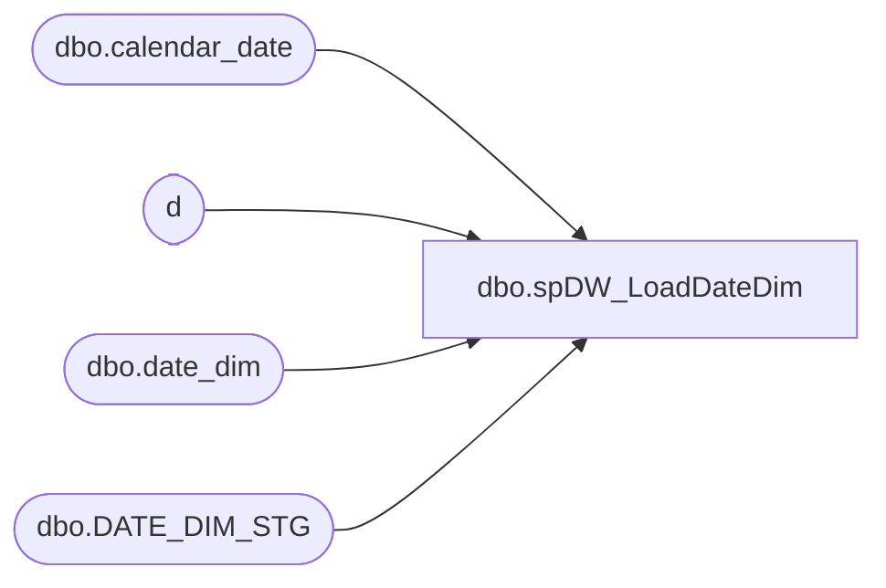

# dbo.spDW_LoadDateDim

**Database:** dw  
**Server:** papamart  

## Architecture Diagram



## Table Dependencies

| Referenced Table |
|---|
| dbo.calendar_date |
| d |
| dbo.date_dim |
| dbo.DATE_DIM_STG |

## Stored Procedure Code

```sql
CREATE PROC [dbo].[spDW_LoadDateDim]
-- =====================================================================================================
-- Name: spDW_LoadDateDim
--
-- Description:	loads date_dim
--
-- Input: NO Input
--
-- Output: Resultset with the following columns:
--			
--
-- Dependencies: None
--
-- Revision History
--		Name:			Date:			Comments:
--		Gary Murrish	12/26/2013		Changed the Date_Key calculation.
--		NEED TO CHANGE TO NOT CREATE A NEW DATE KEY, THIS SHOULD BE A SEQUENTIAL KEY FOR THE DATE DIFFERENCES
--		Keith Missey	10/09/2012		saved to subversion and removed oursmarchand for bedrockdb02
-- =====================================================================================================

AS

	SET NOCOUNT ON

	DECLARE @MaxMWYear int
	DECLARE @MaxDWYear int
	DECLARE @DayId int
	DECLARE @WeekId int
	DECLARE @PeriodId int
	DECLARE @QuarterID int

	SET @MaxDWYear = (SELECT
			MAX(Fiscal_Year)
		FROM
			dbo.date_dim)
	SET @MaxMWYear = (SELECT
			MAX(merch_year)
		FROM
			bedrockdb02.me_01.dbo.calendar_date)

	IF @MaxMWYear = @MaxDWYear
		RETURN
	ELSE
	BEGIN

		SET @DayId = (SELECT
				MAX(day_id)
			FROM
				dw.dbo.date_dim dd WITH (NOLOCK))
		SET @WeekId = (SELECT
				MAX(week_id)
			FROM
				dw.dbo.date_dim dd WITH (NOLOCK))
		SET @PeriodId = (SELECT
				MAX(period_id)
			FROM
				dw.dbo.date_dim dd WITH (NOLOCK))
		SET @QuarterId = (SELECT
				MAX(dd.quarter_id)
			FROM
				dw.dbo.date_dim dd WITH (NOLOCK))

		TRUNCATE TABLE DWStaging.dbo.DATE_DIM_STG;

		WITH DateCTE
		AS (SELECT
				calendar_date,
				merch_year,
				merch_week,
				merch_period
			FROM
				bedrockdb02.me_01.dbo.calendar_date cal
			WHERE
				cal.merch_year BETWEEN @MaxDWYear + 1 AND @MaxMWYear)

		INSERT DWStaging.dbo.DATE_DIM_STG
			(	actual_date,
				Fiscal_Year,
				season,
				fiscal_quarter,
				fiscal_period,
				fiscal_week,
				Month,
				year,
				month_name,
				day_of_month,
				day_of_year,
				day_name,
				weekend_y_n,
				day_of_week,
				week_of_period,
				week_of_quarter,
				period_of_quarter,
				day_id,
				holiday_period_code,
				week_id,
				period_id,
				quarter_id,
				org_fiscal_quarter,
				org_fiscal_period,
				org_fiscal_week,
				org_week_of_period,
				org_week_of_quarter,
				org_period_of_quarter)
			SELECT
				calendar_date AS actual_date,
				merch_year AS fiscal_year,
				CASE
					WHEN DATEPART(mm, calendar_date) < 7 THEN 'Spring'
					ELSE 'Fall'
				END AS season,
				CASE merch_period
					WHEN 1 THEN 1
					WHEN 2 THEN 1
					WHEN 3 THEN 1
					WHEN 4 THEN 2
					WHEN 5 THEN 2
					WHEN 6 THEN 2
					WHEN 7 THEN 3
					WHEN 8 THEN 3
					WHEN 9 THEN 3
					ELSE 4
				END AS fiscal_quarter,
				merch_period AS fiscal_period,
				merch_week AS fiscal_week,
				MONTH(calendar_date) AS [month],
				YEAR(calendar_date) AS [year],
				DATENAME(MONTH, calendar_date) AS month_name,
				DATEPART(DAY, calendar_date) AS day_of_month,
				DATEPART(DAYOFYEAR, calendar_date) AS day_of_year,
				DATENAME(WEEKDAY, calendar_date) AS day_name,
				CASE DATEPART(dw, calendar_date)
					WHEN 1 THEN 'Y'
					WHEN 7 THEN 'Y'
					ELSE 'N'
				END AS weekend_y_n,
				DATEPART(dw, calendar_date) AS day_of_week,
				DATEDIFF(wk, CAST(CAST(DATEPART(mm, calendar_date) AS nvarchar(2)) + '/01/' + CAST(DATEPART(yyyy, calendar_date) AS nvarchar(4)) AS smalldatetime), calendar_date) + 1 AS week_of_period,
				0 AS week_of_quarter,
				0 AS period_of_quarter,
				0 AS day_id,
				NULL AS holiday_period_code,
				0 AS week_id,
				0 AS period_id,
				0 AS quarter_id,
				CASE merch_period
					WHEN 1 THEN 1
					WHEN 2 THEN 1
					WHEN 3 THEN 1
					WHEN 4 THEN 2
					WHEN 5 THEN 2
					WHEN 6 THEN 2
					WHEN 7 THEN 3
					WHEN 8 THEN 3
					WHEN 9 THEN 3
					ELSE 4
				END AS org_fiscal_quarter,
				0 AS org_fiscal_period,
				0 AS org_fiscal_week,
				0 AS org_week_of_period,
				0 AS org_week_of_quarter,
				0 AS org_period_of_quarter
			FROM
				DateCTE


		IF OBJECT_ID('tempdb..#week') IS NOT NULL
			DROP TABLE #week
		SELECT DISTINCT
			Fiscal_Year,
			fiscal_period,
			fiscal_week,
			0 AS week_id
		INTO #week
		FROM
			DWStaging.dbo.DATE_DIM_STG
		ORDER BY	Fiscal_Year,
					fiscal_week

		ALTER TABLE #week
		ADD sequence int NOT NULL IDENTITY (1, 1)

		IF OBJECT_ID('tempdb..#period') IS NOT NULL
			DROP TABLE #period
		SELECT DISTINCT
			Fiscal_Year,
			fiscal_period,
			MIN(actual_date) period_begin,
			MAX(actual_date) period_end,
			0 AS period_id
		INTO #period
		FROM
			DWStaging.dbo.DATE_DIM_STG
		GROUP BY	Fiscal_Year,
					fiscal_period
		ORDER BY	Fiscal_Year,
					fiscal_period

		ALTER TABLE #period
		ADD sequence int NOT NULL IDENTITY (1, 1)

		IF OBJECT_ID('tempdb..#quarter') IS NOT NULL
			DROP TABLE #quarter
		SELECT DISTINCT
			Fiscal_Year,
			fiscal_quarter,
			MIN(actual_date) quarter_begin,
			MAX(actual_date) quarter_end,
			0 AS quarter_id
		INTO #quarter
		FROM
			DWStaging.dbo.DATE_DIM_STG
		GROUP BY	Fiscal_Year,
					fiscal_quarter
		ORDER BY	Fiscal_Year,
					fiscal_quarter

		ALTER TABLE #quarter
		ADD sequence int NOT NULL IDENTITY (1, 1)

		UPDATE #week
			SET week_id = sequence + @WeekId
		UPDATE #period
			SET period_id = sequence + @PeriodId
		UPDATE #quarter
			SET quarter_id = sequence + @QuarterID

		UPDATE DWStaging.dbo.DATE_DIM_STG
			SET day_id = sequence + @DayId

		UPDATE d
			SET week_id = w.week_id
		FROM
			DWStaging.dbo.DATE_DIM_STG d
			INNER JOIN #week w
				ON d.Fiscal_Year = w.Fiscal_Year
				AND d.fiscal_week = w.fiscal_week

		UPDATE d
			SET period_id = p.period_id
		FROM
			DWStaging.dbo.DATE_DIM_STG d
			INNER JOIN #period p
				ON d.Fiscal_Year = p.Fiscal_Year
				AND d.fiscal_period = p.fiscal_period

		UPDATE d
			SET quarter_id = q.quarter_id
		FROM
			DWStaging.dbo.DATE_DIM_STG d
			INNER JOIN #quarter q
				ON d.Fiscal_Year = q.Fiscal_Year
				AND d.fiscal_quarter = q.fiscal_quarter

		UPDATE d
			SET week_of_period = DATEDIFF(wk, period_begin, actual_date) + 1
		FROM
			DWStaging.dbo.DATE_DIM_STG d
			INNER JOIN #period p
				ON d.Fiscal_Year = p.Fiscal_Year
				AND d.fiscal_period = p.fiscal_period

		UPDATE d
			SET week_of_quarter = DATEDIFF(wk, quarter_begin, actual_date) + 1
		FROM
			DWStaging.dbo.DATE_DIM_STG d
			INNER JOIN #quarter q
				ON d.Fiscal_Year = q.Fiscal_Year
				AND d.fiscal_quarter = q.fiscal_quarter

		UPDATE d
			SET period_of_quarter = (d.period_id - qs.minPeriod_ID + 1)
		FROM
			DWStaging.dbo.DATE_DIM_STG d
			INNER JOIN (SELECT
					quarter_id,
					MIN(d.period_id) AS minPeriod_ID
				FROM
					DWStaging.dbo.DATE_DIM_STG d WITH (NOLOCK)
				GROUP BY d.quarter_id) qs
				ON d.quarter_id = qs.quarter_id


		-- calculate holiday_period_code
		IF OBJECT_ID('tempdb..#holiday') IS NOT NULL
			DROP TABLE #holiday
		SELECT DISTINCT
			d.Fiscal_Year,
			'Christmas' AS holiday,
			hb.holiday_begin,
			he.holiday_end
		INTO #holiday
		FROM
			DWStaging.dbo.DATE_DIM_STG d
			INNER JOIN (SELECT
					Fiscal_Year,
					actual_date AS holiday_begin
				FROM
					DWStaging.dbo.DATE_DIM_STG
				WHERE
					[Month] = 11
					AND day_name = 'Friday'
					AND week_of_period = 4) hb
				ON d.Fiscal_Year = hb.Fiscal_Year
			INNER JOIN (SELECT
					Fiscal_Year,
					actual_date AS holiday_end
				FROM
					DWStaging.dbo.DATE_DIM_STG
				WHERE
					[Month] = 12
					AND day_of_month = 25) he
				ON d.Fiscal_Year = he.Fiscal_Year

		UNION

		SELECT DISTINCT
			d.Fiscal_Year,
			'Post Christmas' AS holiday,
			hb.holiday_begin,
			he.holiday_end
		FROM
			DWStaging.dbo.DATE_DIM_STG d
			INNER JOIN (SELECT
					Fiscal_Year,
					actual_date AS holiday_begin
				FROM
					DWStaging.dbo.DATE_DIM_STG
				WHERE
					fiscal_period = 12
					AND day_of_month = 26) hb
				ON d.Fiscal_Year = hb.Fiscal_Year
			INNER JOIN (SELECT
					Fiscal_Year,
					MAX(actual_date) AS holiday_end
				FROM
					DWStaging.dbo.DATE_DIM_STG
				WHERE
					fiscal_period = 12
				GROUP BY Fiscal_Year) he
				ON d.Fiscal_Year = he.Fiscal_Year

		UNION

		SELECT DISTINCT
			d.Fiscal_Year,
			'Post Christmas' AS holiday,
			hb.holiday_begin,
			he.holiday_end
		FROM
			DWStaging.dbo.DATE_DIM_STG d
			INNER JOIN (SELECT
					Fiscal_Year,
					MIN(actual_date) AS holiday_begin
				FROM
					DWStaging.dbo.DATE_DIM_STG
				WHERE
					fiscal_period = 1
				GROUP BY Fiscal_Year) hb
				ON d.Fiscal_Year = hb.Fiscal_Year
			INNER JOIN (SELECT
					Fiscal_Year,
					actual_date AS holiday_end
				FROM
					DWStaging.dbo.DATE_DIM_STG
				WHERE
					fiscal_period = 1
					AND day_name = 'Sunday'
					AND week_of_period = 3) he
				ON d.Fiscal_Year = he.Fiscal_Year

		UNION

		SELECT DISTINCT
			d.Fiscal_Year,
			'Valentines Day' AS holiday,
			hb.holiday_begin,
			he.holiday_end
		FROM
			DWStaging.dbo.DATE_DIM_STG d
			INNER JOIN (SELECT
					Fiscal_Year,
					actual_date AS holiday_begin
				FROM
					DWStaging.dbo.DATE_DIM_STG
				WHERE
					[Month] = 1
					AND day_name = 'Monday'
					AND week_of_period = 3) hb
				ON d.Fiscal_Year = hb.Fiscal_Year
			INNER JOIN (SELECT
					Fiscal_Year,
					actual_date AS holiday_end
				FROM
					DWStaging.dbo.DATE_DIM_STG
				WHERE
					[Month] = 2
					AND day_of_month = 14) he
				ON d.Fiscal_Year = he.Fiscal_Year

		UPDATE d
			SET holiday_period_code = h.holiday
		FROM
			DWStaging.dbo.DATE_DIM_STG d
			INNER JOIN #holiday h
				ON d.actual_date BETWEEN h.holiday_begin AND h.holiday_end

		INSERT INTO dbo.date_dim
			(	date_key,
				actual_date,
				Fiscal_Year,
				season,
				fiscal_quarter,
				fiscal_period,
				fiscal_week,
				[Month],
				[year],
				month_name,
				day_of_month,
				day_of_year,
				day_name,
				weekend_y_n,
				day_of_week,
				week_of_period,
				week_of_quarter,
				period_of_quarter,
				day_id,
				holiday_period_code,
				week_id,
				period_id,
				quarter_id,
				org_fiscal_quarter,
				org_fiscal_period,
				org_fiscal_week,
				org_week_of_period,
				org_week_of_quarter,
				org_period_of_quarter)

			SELECT
				day_id AS date_key,
				actual_date,
				Fiscal_Year,
				season,
				fiscal_quarter,
				fiscal_period,
				fiscal_week,
				[Month],
				[year],
				month_name,
				day_of_month,
				day_of_year,
				day_name,
				weekend_y_n,
				day_of_week,
				week_of_period,
				week_of_quarter,
				period_of_quarter,
				day_id,
				holiday_period_code,
				week_id,
				period_id,
				quarter_id,
				org_fiscal_quarter,
				fiscal_period AS org_fiscal_period,
				fiscal_week AS org_fiscal_week,
				week_of_period AS org_week_of_period,
				week_of_quarter AS org_week_of_quarter,
				period_of_quarter AS org_period_of_quarter
			FROM
				DWStaging.dbo.DATE_DIM_STG
	END
```

