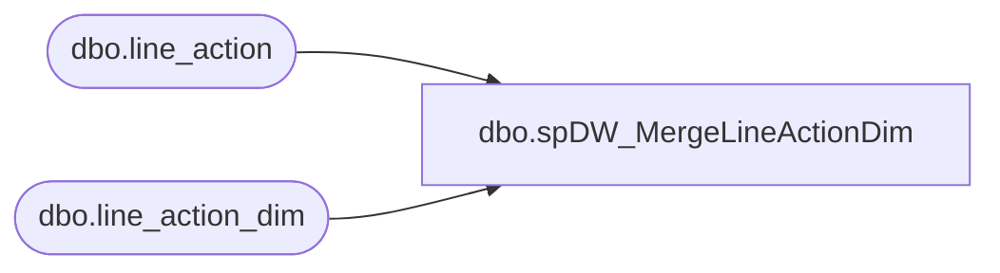

# dbo.spDW_MergeLineActionDim

**Database:** dw  
**Server:** papamart  

## Architecture Diagram



## Table Dependencies

| Referenced Table |
|---|
| dbo.line_action |
| dbo.line_action_dim |

## Stored Procedure Code

```sql
create proc spDW_MergeLineActionDim

as

set nocount on

-- =============================================================================================================
-- Name: spDW_MergeLineActionDim
--
-- Description: Merges bedrockdb02.auditworks.dbo.line_action to DW.dbo.line_action_dim
-- 
-- Revision History
--		Name:				Date:			Comments:
--		Dan Tweedie			04/11/2016		Created Proc
-- =============================================================================================================

Merge into DW.dbo.line_action_dim as target
Using 
	(
		select 
			line_action as Line_Action_Key,
			Line_Action,
			line_action_display_descr as Line_Action_Description,
			getdate() as INS_DT,
			getdate() as UPDT_DT
		from bedrockdb01.auditworks.dbo.line_action
	) as source
On (target.Line_Action_Key = source.Line_Action_Key)
When Matched 
	Then 
		Update 
			Set target.Line_Action_Description = source.Line_Action_Description,
				target.UPDT_DT = 
					case when target.Line_Action_Description COLLATE SQL_Latin1_General_CP1_CI_AS <> source.Line_Action_Description 
						then source.UPDT_DT else target.UPDT_DT end
When Not Matched By Target 
	Then 
		Insert (Line_Action_Key, Line_Action, Line_Action_Description, INS_DT, UPDT_DT)
		Values (source.Line_Action_Key, source.Line_Action, source.Line_Action_Description, source.INS_DT, UPDT_DT);
```

