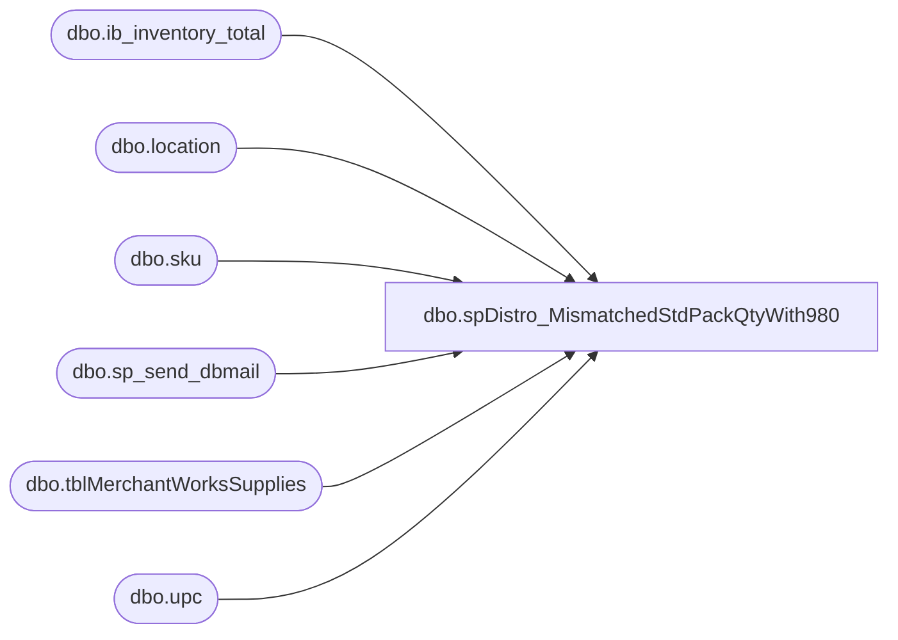

# dbo.spDistro_MismatchedStdPackQtyWith980

**Database:** dw  
**Server:** papamart  

## Architecture Diagram



## Table Dependencies

| Referenced Table |
|---|
| dbo.ib_inventory_total |
| dbo.location |
| dbo.sku |
| dbo.sp_send_dbmail |
| dbo.tblMerchantWorksSupplies |
| dbo.upc |

## Stored Procedure Code

```sql
CREATE PROCEDURE [dbo].[spDistro_MismatchedStdPackQtyWith980] AS
-- =============================================================================================================
-- Name: spDistro_MismatchedStdPackQtyWith980
--
-- Description:	

--
-- Input:		
--				
--
--
-- Output: 
--
-- Dependencies: 
--
-- Revision History
--		Name:			Date:			Comments:
--		GaryD			20090914		Update recipients
--		GaryD			20091105		Remove ansi_attach reference from sendmail
--		MikeP			20130315		Added ISNUMERIC(style) = 1 to WMDB01 query
--		MikeP			20140114		Removed MegH and HeatherS from email
--		MikeP			20140724		converted email to use sp_send_dbmail
--		MikeP			20140223		Changed OPENROWSET to OPENQUERY
-- =============================================================================================================


declare @sql varchar(8000)

-- go get the stats for the skus assigned to the warehouse
-- 10.0.0.161 = bedrockdb02
IF (Object_ID('tempdb..##onhand_T31') IS NOT NULL) DROP TABLE ##onhand_T31
SELECT CAST(CAST(upc_number AS BIGINT) AS VARCHAR) upc_number, 
	SUM(ISNULL(total_on_hand_units,0)) as total_on_hand_units
into ##onhand_T31
FROM bedrockdb02.me_01.dbo.upc u with (nolock)
	INNER JOIN bedrockdb02.me_01.dbo.sku sku with (nolock) 		ON u.sku_id=sku.sku_id 
	INNER JOIN bedrockdb02.me_01.dbo.ib_inventory_total inv with (nolock) ON inv.sku_id=u.sku_id
	INNER JOIN bedrockdb02.me_01.dbo.location loc with (nolock) 		ON inv.location_id=loc.location_id
WHERE 1=1
  	and len(cast(cast(upc_number as bigint) as varchar)) < 9
 	and location_code in ('0980')  
	and inventory_status_id = 1
group by upc_number

create index ix_onhand on ##onhand_T31(upc_number)

-- go get the stats for the skus in the warehouse
IF (Object_ID('tempdb..##warehouse_style_T31') IS NOT NULL) DROP TABLE ##warehouse_style_T31

select * 
INTO ##warehouse_style_T31
FROM OPENQUERY(WMDB01,
'SELECT CAST(style AS BIGINT) style, sku_desc, std_pack_qty, std_case_qty, std_sub_pack_qty, cube_mult_qty, user_id, mod_date_time 
FROM wmprod.dbo.item_master WHERE ISNUMERIC(style) = 1')


IF (Object_ID('tempdb..##mismatched_T31') IS NOT NULL) DROP TABLE ##mismatched_T31
select wh.style, mws.long_desc, 
	wh.std_pack_qty wh_std_pack_qty, mws.std_pack_qty mw_std_pack_qty, 
	user_id wh_user_id, mod_date_time wh_mod_date_time, total_on_hand_units wh_total_on_hand_units, substring(hierarchy_group_code,1,8) hierarchy_group_code
into ##mismatched_T31
from ##warehouse_style_T31 wh
	join kodiak.beardata.dbo.tblMerchantWorksSupplies mws
	on cast(mws.upc_number as bigint) = wh.style
	left join ##onhand_T31 oh
	on oh.upc_number = wh.style
where (wh.std_pack_qty != mws.std_pack_qty)
--	and total_on_hand_units != 0

-- *******************************************************
-- * OUTPUT
-- *******************************************************
-- OUTPUT FILE:  UnprocessedDistros.csv
-- set nocount on
-- select  groupinglabel, rec_type, reasoncode, documentnumber, linenumber, sourceid, destid, upc_number, p.style_desc, 

if (select count(*) from ##mismatched_T31) > 0
begin

	--declare @sql varchar(8000)
	set @sql = '
	select style, long_desc, 
		wh_std_pack_qty, mw_std_pack_qty, 
		wh_user_id, wh_mod_date_time, wh_total_on_hand_units
	from ##mismatched_T31
	order by case when hierarchy_group_code like ''R-B-%-60%'' then 1 else 0 end, style
	'

	declare @filename  varchar(100)
	declare @char_separator varchar(12)
	declare @message varchar(200)
	set @filename='Mismatched std_pack_qty.xls'
	set @char_separator = char(9)
	set @message = 'The attached list contains mismatched std_pack_qtys between 980 and merchantworks.'
	
	EXEC msdb.dbo.sp_send_dbmail 
		@recipients = 'purchasing@buildabear.com',
		@body = @message, 
		@subject = 'Mismatched std_pack_qty at 980',
		@query_result_width = 500,
		@query = @sql,
		@attach_query_result_as_file = 'TRUE',
		@query_result_separator = @char_separator,
		@query_attachment_filename  = @filename
	
end
```

