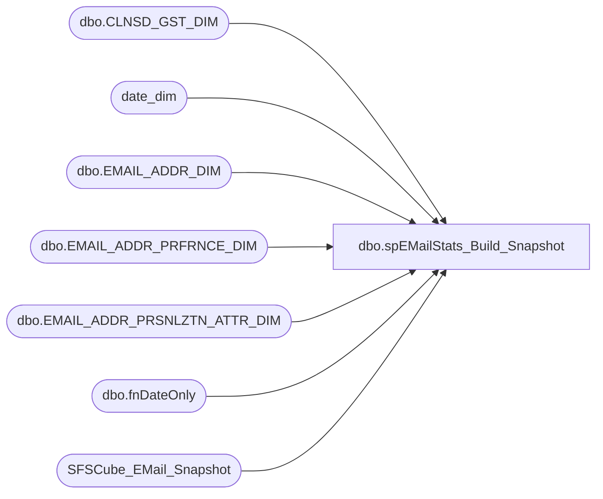

# dbo.spEMailStats_Build_Snapshot

**Database:** dw  
**Server:** papamart  

## Architecture Diagram



## Table Dependencies

| Referenced Table |
|---|
| dbo.CLNSD_GST_DIM |
| date_dim |
| dbo.EMAIL_ADDR_DIM |
| dbo.EMAIL_ADDR_PRFRNCE_DIM |
| dbo.EMAIL_ADDR_PRSNLZTN_ATTR_DIM |
| dbo.fnDateOnly |
| SFSCube_EMail_Snapshot |

## Stored Procedure Code

```sql
-- =============================================================================================================
-- Name: spEMailStats_Build_Snapshot
--
-- Description:	
--		This procedure will generate the snapshot information for the EMail Statistics
--		
-- Input:
--
-- Output: 
--
-- Dependencies: 
--
-- EXAMPLE:
--		exec dw.dbo.spEMailStats_Build_Snapshot
--
-- Revision History
--		Name:				Date:			Comments:
--		Gary Murrish		6/16/2011		created
-- =============================================================================================================
CREATE PROCEDURE dbo.spEMailStats_Build_Snapshot
AS
BEGIN
	-- SET NOCOUNT ON added to prevent extra result sets from
	SET NOCOUNT ON;
	DECLARE
	   @Curr_Date_Key INT;
	SET @Curr_Date_Key = (SELECT
								 date_key
							FROM date_dim
							WHERE actual_date = dbo.fnDateOnly(GETDATE()));

	DELETE FROM queries..SFSCube_EMail_Snapshot
	  WHERE
			date_key = @Curr_Date_Key;

	INSERT INTO queries..SFSCube_EMail_Snapshot(
				date_key
			  , cntry_abbrv
			  , isSFSMember
			  , email_stat_cd
			  , promo_pref
			  , numAddresses)
	SELECT
		   @Curr_Date_Key
		 , BASE.CNTRY_ABBRV
		 , base.isSFSMember
		 , base.email_stat_cd
		 , base.PROMO_PREF
		 , COUNT(*)AS numAddresses
	  FROM(
		   SELECT --TOP 1000
				  EM.email_addr_id
				, EM.email_stat_cd
				, EMF.PROMO_PREF
				, ISNULL(pers.CNTRY_ABBRV, 'USA')AS CNTRY_ABBRV
				, CASE
				  WHEN LEN((
		   SELECT
				  MIN(LYLTY_GST_NBR)AS LYLTY_GST_NBR
			 FROM dbo.CLNSD_GST_DIM GSTR WITH (NOLOCK)
			 WHERE GSTR.EMAIL_ADDR_ID = em.EMAIL_ADDR_ID
			 GROUP BY
					  GSTR.EMAIL_ADDR_ID)) > 0 THEN 1
					  ELSE 0
				  END AS isSFSMember
				, CASE
				  WHEN em.EMAIL_STAT_CD = 'VALID'
				   AND EMF.PROMO_PREF = 'Y' THEN 1
					  ELSE 0
				  END AS isMailable
			 FROM
				  dbo.EMAIL_ADDR_DIM EM WITH (NOLOCK)
				  INNER JOIN dbo.EMAIL_ADDR_PRFRNCE_DIM EMF WITH (NOLOCK)
					  ON EM.email_addr_id = EMF.EMAIL_ADDR_ID
				  INNER JOIN dbo.EMAIL_ADDR_PRSNLZTN_ATTR_DIM PERS WITH (NOLOCK)
					  ON PERS.EMAIL_ADDR_ID = EM.EMAIL_ADDR_ID)AS BASE
	  GROUP BY
			   BASE.CNTRY_ABBRV
			 , base.isSFSMember
			 , base.email_stat_cd
			 , base.PROMO_PREF
	  ORDER BY
			   BASE.CNTRY_ABBRV, base.isSFSMember, base.email_stat_cd, base.PROMO_PREF;

-- Takes around 6:30 minutes	       
END;
```

