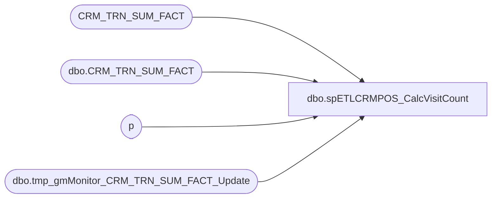

# dbo.spETLCRMPOS_CalcVisitCount

**Database:** dw  
**Server:** papamart  

## Architecture Diagram



## Table Dependencies

| Referenced Table |
|---|
| CRM_TRN_SUM_FACT |
| dbo.CRM_TRN_SUM_FACT |
| p |
| dbo.tmp_gmMonitor_CRM_TRN_SUM_FACT_Update |

## Stored Procedure Code

```sql
CREATE PROCEDURE [dbo].[spETLCRMPOS_CalcVisitCount]
	-- =============================================================================================================
	-- Name: dbo.spETLCRMPOS_CalcVisitCount
	--
	-- Description:	
	--
	-- Input:		
	--
	-- Output: 
	--
	-- Dependencies: 
	--
	-- Revision History
	--		Name:			Date:			Comments:
	--		Drew Marco		10/24/2008		Created
	--		Keith Missey	6/3/2009		renamed
	--		Gary Murrish	4/24/2014		Rewrote to handle new criteria and new fields.
	-- =============================================================================================================
	@etl_log_id int
AS
	SET NOCOUNT ON

	-- Setup the Monitor Table
	IF OBJECT_ID('queries.dbo.tmp_gmMonitor_CRM_TRN_SUM_FACT_Update') IS NOT NULL
	BEGIN
		DROP TABLE queries.dbo.tmp_gmMonitor_CRM_TRN_SUM_FACT_Update
	END


	SELECT
		CAST('Setting -1 Defaults' AS varchar(1024)) AS status,
		GETDATE() AS statusDateTime
	INTO queries.dbo.tmp_gmMonitor_CRM_TRN_SUM_FACT_Update

	-- Set all of the -1 Guests to default Values
	UPDATE p
		SET	p.SFS_TRN_TYP_CD = 0,
			p.daysSinceLastVisit = 0,
			p.numTransToday = 0,
			p.MNTH_01_36_VST_CNT = 0,
			p.MNTH_01_24_VST_CNT = 0,
			p.MNTH_01_12_VST_CNT = 0,
			p.lifetimeVisitNumber = 0
	FROM
		CRM_TRN_SUM_FACT p
	WHERE p.lifetimeVisitNumber IS NULL
	AND p.CLNSD_GST_ID = -1
	-- (3963 row(s) affected)

	INSERT INTO queries.dbo.tmp_gmMonitor_CRM_TRN_SUM_FACT_Update
		(	status,
			statusDateTime)
	VALUES
		(	'Creating #tmpGuests',
			GETDATE())


	IF OBJECT_ID('tempdb..#tmpGuests') IS NOT NULL
	BEGIN
		DROP TABLE #tmpGuests
	END

	SELECT DISTINCT
		ctsf.CLNSD_GST_ID,
		ctsf.DT_ID,
		CAST(0 AS int) AS batchNumber
	INTO #tmpGuests
	FROM
		CRM_TRN_SUM_FACT ctsf WITH (NOLOCK)
	WHERE
		ctsf.lifetimeVisitNumber IS NULL
		AND ctsf.CLNSD_GST_ID <> -1


	DECLARE @numGuests int
	SELECT
		@numGuests = COUNT(*)
	FROM
		#tmpGuests g WITH (NOLOCK)

	INSERT INTO queries.dbo.tmp_gmMonitor_CRM_TRN_SUM_FACT_Update
		(	status,
			statusDateTime)
	VALUES
		(	'There are ' + CAST(@numGuests AS varchar) + ' #tmpGuests',
			GETDATE())

	INSERT INTO queries.dbo.tmp_gmMonitor_CRM_TRN_SUM_FACT_Update
		(	status,
			statusDateTime)
	VALUES
		(	'Assigning Batch Numbers',
			GETDATE())

	-- Set the Batch Numbers
	DECLARE	@batchNumber int,
			@recCount int
	SET @batchNumber = 1
	SET @recCount = 1

	WHILE @recCount > 0
	BEGIN
		WITH q
		AS (SELECT TOP 100000
				ath.batchNumber
			FROM
				#tmpGuests ath
			WHERE
				ath.batchNumber = 0)
		UPDATE q
			SET batchNumber = @batchNumber

		SET @batchNumber = @batchNumber + 1
		SET @recCount =
		ISNULL((SELECT
				COUNT(*)
			FROM
				#tmpGuests ath
			WHERE
				ath.batchNumber = 0)
		, 0)
	END

	DECLARE @maxBatchNumber int
	SET @maxBatchNumber = @batchNumber

	SET @batchNumber = 1

	WHILE @batchNumber <= @maxBatchNumber
	BEGIN
	BEGIN TRY
		INSERT INTO queries.dbo.tmp_gmMonitor_CRM_TRN_SUM_FACT_Update
			(	status,
				statusDateTime)
		VALUES
			(	'Processing Batch ' + CAST(@batchNumber AS varchar) + ' of ' + CAST(@maxBatchNumber AS varchar),
				GETDATE())

		BEGIN TRANSACTION

			IF OBJECT_ID('tempdb..#tmpLifetime') IS NOT NULL
			BEGIN
				DROP TABLE #tmpLifetime
			END


			SELECT
				x.CLNSD_GST_ID,
				x.DT_ID,
				COUNT(DISTINCT x.numLifetime) AS numLifetime,
				COUNT(DISTINCT x.num12) - MAX(x.adj12) AS num12,
				COUNT(DISTINCT x.num24) - MAX(x.adj24) AS num24,
				COUNT(DISTINCT x.num36) - MAX(x.adj36) AS num36,
				MAX(x.lastVisitDate) AS lastVisitDate,
				SUM(x.numTransToday) AS numTransToday
			INTO #tmpLifetime
			FROM
				(SELECT
						g.CLNSD_GST_ID,
						g.DT_ID,
						ctsf.DT_ID AS numLifetime,
						CASE
							WHEN g.DT_ID - ctsf.DT_ID <= 455 THEN ctsf.DT_ID
							ELSE 0
						END AS num12,
						CASE
							WHEN g.DT_ID - ctsf.DT_ID <= 455 THEN 0
							ELSE 1
						END AS adj12,
						CASE
							WHEN g.DT_ID - ctsf.DT_ID <= 365 * 2 THEN ctsf.DT_ID
							ELSE 0
						END AS num24,
						CASE
							WHEN g.DT_ID - ctsf.DT_ID <= 365 * 2 THEN 0
							ELSE 1
						END AS adj24,
						CASE
							WHEN g.DT_ID - ctsf.DT_ID <= 365 * 3 THEN ctsf.DT_ID
							ELSE 0
						END AS num36,
						CASE
							WHEN g.DT_ID - ctsf.DT_ID <= 365 * 3 THEN 0
							ELSE 1
						END AS adj36,
						CASE
							WHEN ctsf.DT_ID < g.DT_ID THEN ctsf.DT_ID
							ELSE 0
						END AS lastVisitDate,
						CASE
							WHEN g.DT_ID = ctsf.DT_ID THEN 1
							ELSE 0
						END AS numTransToday
					FROM
						dw.dbo.CRM_TRN_SUM_FACT ctsf WITH (NOLOCK)
						INNER JOIN #tmpGuests g WITH (NOLOCK)
							ON ctsf.CLNSD_GST_ID = g.CLNSD_GST_ID
							AND ctsf.DT_ID <= g.DT_ID
					WHERE
						g.batchNumber = @batchNumber) x
			GROUP BY	x.CLNSD_GST_ID,
						x.DT_ID


			UPDATE p
				SET	p.SFS_TRN_TYP_CD =
						CASE
							WHEN l.numLifetime = 1 THEN 1
							ELSE 2
						END,
					p.daysSinceLastVisit =
						CASE
							WHEN l.numLifetime = 1 THEN 0
							ELSE l.DT_ID - l.lastVisitDate
						END,
					p.numTransToday = l.numTransToday,
					p.MNTH_01_36_VST_CNT = l.num36,
					p.MNTH_01_24_VST_CNT = l.num24,
					p.MNTH_01_12_VST_CNT = l.num12,
					p.lifetimeVisitNumber = l.numLifetime
			FROM
				CRM_TRN_SUM_FACT p
				INNER JOIN #tmpLifetime l WITH (NOLOCK)
					ON p.CLNSD_GST_ID = l.CLNSD_GST_ID
					AND p.DT_ID = l.DT_ID
			WHERE l.numLifetime <> ISNULL(p.lifetimeVisitNumber, 0)
			OR l.num12 <> ISNULL(p.MNTH_01_12_VST_CNT, 0)
			OR l.num24 <> ISNULL(p.MNTH_01_24_VST_CNT, 0)
			OR l.num36 <> ISNULL(p.MNTH_01_36_VST_CNT, 0)
			OR l.numTransToday <> ISNULL(p.numTransToday, 0)
			OR
				CASE
					WHEN l.numLifetime = 1 THEN 0
					ELSE l.DT_ID - l.lastVisitDate
				END <> ISNULL(p.daysSinceLastVisit, 0)
			OR ISNULL(p.SFS_TRN_TYP_CD, 0) <>
				CASE
					WHEN l.numLifetime = 1 THEN 1
					ELSE 2
				END

		COMMIT TRANSACTION
		SET @batchNumber = @batchNumber + 1
	END TRY
	BEGIN CATCH
		PRINT
		'Error ' + CONVERT(varchar(50), ERROR_NUMBER()) +
		', Severity ' + CONVERT(varchar(5), ERROR_SEVERITY()) +
		', State ' + CONVERT(varchar(5), ERROR_STATE()) +
		', Line ' + CONVERT(varchar(5), ERROR_LINE())

		PRINT ERROR_MESSAGE();

		IF XACT_STATE() <> 0
		BEGIN
			ROLLBACK TRANSACTION
		END
	END CATCH;
	END

	INSERT INTO queries.dbo.tmp_gmMonitor_CRM_TRN_SUM_FACT_Update
		(	status,
			statusDateTime)
	VALUES
		(	'Completed...',
			GETDATE())
```

