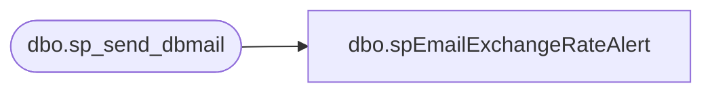

# dbo.spEmailExchangeRateAlert

**Database:** dw  
**Server:** papamart  

## Architecture Diagram



## Table Dependencies

| Referenced Table |
|---|
| dbo.sp_send_dbmail |

## Stored Procedure Code

```sql
CREATE proc [dbo].[spEmailExchangeRateAlert] 
	@recordCount int
	

--========================================================================================================================
--	2020-09-30	Ian Wallace  - Created proc 
--========================================================================================================================

as

set nocount on

declare 
	@subj varchar(52),
	@recip varchar(1000),
	@cc varchar(100),
	@body nvarchar(max),
	@priority varchar(6)

set @Subj = 'D3FO exchange rate issue'
set @recip = 'biadmin@buildabear.com'
--set @recip = 'ianw@buildabear.com'

If @recordCount = 0 
BEGIN
select @priority = 'High'

select @body = 
'Yesterday''s exchange rates were not found in the Dynamics XML file and were not found via API call to Dynamics. Please notify the Enterprise Systems team to investigate the connection to Oanda. <br> ' +
    '<br><br>' +
    '<br>
    <font face =arial size = 1><B>This report was run from SSIS as part of the ERP daily exchange rate validation job</B></font>
    <br>
    <br>
<font face =arial size = 1><i>The information in this message may be privileged, “confidential” and protected from disclosure and/or intended only for the addressee(s) named above. ' +
'If the reader of this message is not the intended recipient, or an employee or agent responsible for delivering this message to the intended recipient, ' +
'you are hereby notified that any dissemination, distribution or copying of the communication is strictly prohibited.  If you have received this communication in error, ' + 
'please notify us immediately by replying to the message and deleting it from your computer.  Thank you beary much.</i></font>'
END

if @recordCOunt > 0 
BEGIN
select @priority = 'Normal'

select @body = 
'Yesterday''s exchange rates were not found in the XML file from Dynamics, however the rates were retreived via API call to Dynamics and loaded into the datawarehouse. ' +
'Please notify the Enterprise Systems team to investigate the recurring integration scheduler job which produces the XML file in this directory: \\stl-dynsnc-p-01\BABWIntegrations\xRates <br> ' +
    '<br><br>' +
    '<br>
    <font face =arial size = 1><B>This report was run from SSIS as part of the ERP daily exchange rate validation job</B></font>
    <br>
    <br>
<font face =arial size = 1><i>The information in this message may be privileged, “confidential” and protected from disclosure and/or intended only for the addressee(s) named above. ' +
'If the reader of this message is not the intended recipient, or an employee or agent responsible for delivering this message to the intended recipient, ' +
'you are hereby notified that any dissemination, distribution or copying of the communication is strictly prohibited.  If you have received this communication in error, ' + 
'please notify us immediately by replying to the message and deleting it from your computer.  Thank you beary much.</i></font>'
END

		exec msdb.dbo.sp_send_dbmail
			@profile_name = 'BIAdmin',
			@recipients = @recip,
			@body = @body,
			@subject = @subj,
			@importance = @priority,
			@body_format = 'HTML'


dbo,dt_generateansiname,/* 
**	Generate an ansi name that is unique in the dtproperties.value column 
*/ 
create procedure dbo.dt_generateansiname(@name varchar(255) output) 
as 
	declare @prologue varchar(20) 
	declare @indexstring varchar(20) 
	declare @index integer 
 
	set @prologue = 'MSDT-A-' 
	set @index = 1 
 
	while 1 = 1 
	begin 
		set @indexstring = cast(@index as varchar(20)) 
		set @name = @prologue + @indexstring 
		if not exists (select value from dtproperties where value = @name) 
			break 
		 
		set @index = @index + 1 
 
		if (@index = 10000) 
			goto TooMany 
	end 
 
Leave: 
 
	return 
 
TooMany: 
 
	set @name = 'DIAGRAM' 
	goto Leave
```

