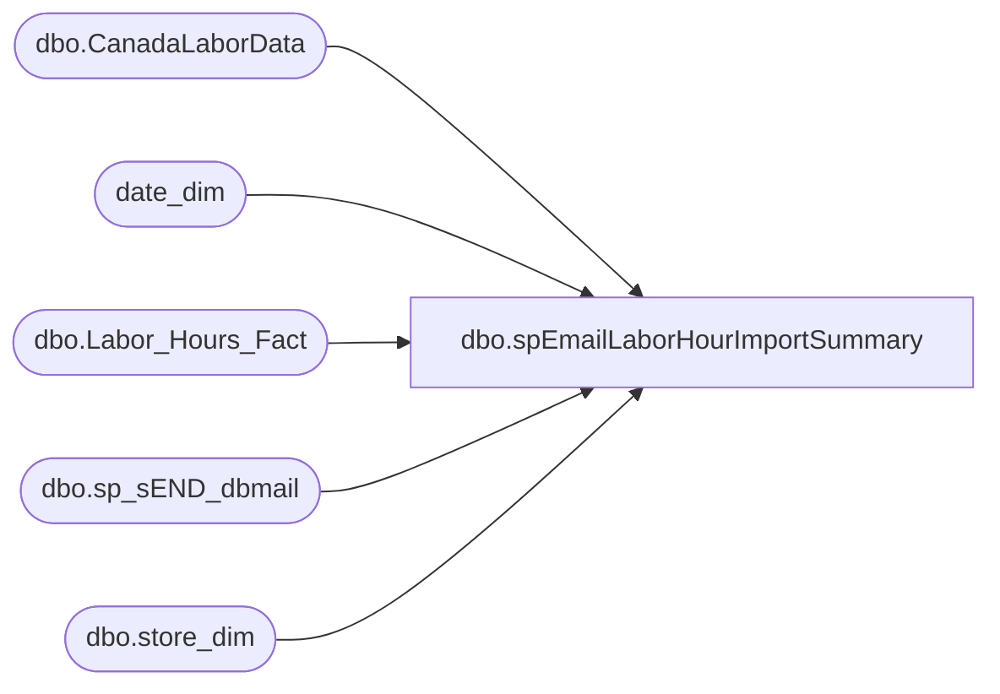

# dbo.spEmailLaborHourImportSummary

**Database:** dw  
**Server:** papamart  

## Architecture Diagram



## Table Dependencies

| Referenced Table |
|---|
| dbo.CanadaLaborData |
| date_dim |
| dbo.Labor_Hours_Fact |
| dbo.sp_sEND_dbmail |
| dbo.store_dim |

## Stored Procedure Code

```sql
CREATE PROC [dbo].[spEmailLaborHourImportSummary]
as 

-- =====================================================================================================
-- Name: spEmailLaborHourImportSummary
--
-- Description:	Sends email summary of the labor hour imported into DW
--
-- Revision History
--		Name:			Date:			Comments:
--		Brian Byas		1/21/2016		Created Proc
--		Brian Byas		7/1/2016		Fixed LaborStage day filter
--		Dan Tweedie		07/11/2017		Updated proc to handle allow for better handling of store number extraction from file names, particularly if there is no leading zero when there should be, like 215 instead of 0215
-- =====================================================================================================

SET NOCOUNT ON


IF (Object_ID('tempdb..#SUMMARY') IS NOT NULL) DROP TABLE #SUMMARY
-------------------------------------------------------------------------
-- Find Files Available Today
-------------------------------------------------------------------------

DECLARE @date VARCHAR(8)
DECLARE @dir varchar(1000)
DECLARE @empty varchar(4000)

SET @date = (SELECT CONVERT(varchar,(year(getdate()))) + REPLACE(STR(DATEPART(mm, GETDATE()),2),' ','0') + REPLACE(STR(DATEPART(dd, GETDATE()),2),' ','0'))
SET @dir = 'dir \\Kermode\FileRepository\CALaborDrop\Processed\*'+ @date +'*.txt /B'
SET @empty = 'echo off & for %A in ("\\Kermode\FileRepository\CALaborDrop\Processed\*'+ @date +'*.txt") do if %~zA LEQ 2 echo.%A'

IF (Object_ID('tempdb..#Stores') IS NOT NULL) DROP TABLE #Stores
create table #Stores
(StoreID nvarchar(max))

IF (Object_ID('tempdb..#EmptyFiles') IS NOT NULL) DROP TABLE #EmptyFiles
create table #EmptyFiles
(StoreID nvarchar(max))

INSERT #Stores
EXEC MASTER..xp_cmdshell @dir 
DELETE from #Stores WHERE StoreID IS NULL or StoreID = 'File Not Found'

INSERT #EmptyFiles
EXEC MASTER..xp_cmdshell @empty 
DELETE from #EmptyFiles WHERE StoreID IS NULL or StoreID = 'File Not Found'
-----------------------------Set First of Month Handling------------------------------------
DECLARE @FirstDayOfMonth DATETIME
DECLARE @MonthValue INT
SELECT @FirstDayOfMonth = (SELECT DATEADD(month, DATEDIFF(month, 0, GETDATE()), 0) AS StartOfMonth)

IF REPLACE(STR(DATEPART(dd, @FirstDayOfMonth),2),' ','0') = DAY(getdate())
	SET @MonthValue = '-1';

ELSE 
	SET @MonthValue = '';

-----------------------------CTE Handles Staging------------------------------------
;
WITH IncludedStores (StoreID) AS (
SELECT DISTINCT store_id 
FROM dw.dbo.store_dim WHERE country IN ('UK','CA','IE','DK')
	AND (opening_date IS NOT NULL OR opening_date >= getdate())
	AND (closing_date IS NULL OR closing_date > getdate())
	AND store_name NOT like '%Web%'
	AND (store_id <= 2065 OR store_id = 2301)
),
LaborFiles (StoreID) AS (
--SELECT SUBSTRING(LEFT(StoreID,4),PATINDEX('%[^0 ]%',LEFT(StoreID,4) + ' '), LEN(LEFT(StoreID,4))) AS Stores FROM #Stores
select 
	case
		when patindex('%[^0-9]%', StoreID) > 0
			then right((cast('0000' as varchar) + cast( substring(StoreID, 1, patindex('%[^0-9]%', StoreID)-1) as varchar)),4) 
		else StoreID
	end AS Stores 
FROM #Stores
),
EmptyLaborFiles (StoreID) AS (
--SELECT LEFT(SUBSTRING(RIGHT(StoreID,27),PATINDEX('%[^0 ]%',RIGHT(StoreID,4) + ' '), LEN(LEFT(StoreID,27))),4) AS Stores FROM #EmptyFiles
select 
	case 
		when patindex('%[^0-9]%', replace(StoreID, '\\Kermode\FileRepository\CALaborDrop\Processed\', '')) > 0
			then right((cast('0000' as varchar) + cast( substring(replace(StoreID, '\\Kermode\FileRepository\CALaborDrop\Processed\', ''), 1, patindex('%[^0-9]%', replace(StoreID, '\\Kermode\FileRepository\CALaborDrop\Processed\', ''))-1) as varchar)),4) 
		else StoreID 
	end AS Stores 
FROM #EmptyFiles
),
LaborStage (StoreID, Stage_SumHours) AS (
SELECT StoreID,SUM(DATEDIFF(hh,ClockInDate,ClockOutDate)) AS SumHours 
FROM DWStaging.dbo.CanadaLaborData WITH(NOLOCK)
WHERE LEFT(CONVERT(VARCHAR,RecordInsertedDateTime,120),10) = LEFT(CONVERT(VARCHAR,getdate(),120),10) -- todays date
AND DAY(ClockInDate) = DATEPART(dd,getdate()-1)
GROUP BY StoreID
),
LaborFact (StoreID, Fact_SumHours) AS (
SELECT 
SUBSTRING(LEFT(sd.store_id,4),PATINDEX('%[^0 ]%',LEFT(sd.store_id,4) + ' '), LEN(LEFT(sd.store_id,4))) AS StoreID,
SUM(DATEDIFF(hh,lhf.start_Time,lhf.end_Time)) AS SumHours 
FROM dw.dbo.Labor_Hours_Fact lhf WITH(NOLOCK) INNER JOIN	
	dw.dbo.Store_dim sd WITH(NOLOCK)
		ON lhf.store_key = sd.store_key
WHERE --LEFT(CONVERT(VARCHAR,lhf.INS_DT,120),10) = LEFT(CONVERT(VARCHAR,getdate(),120),10) -- todays date
date_key = (SELECT date_key FROM date_dim where actual_date = (SELECT CONVERT(DATETIME,(SELECT CONVERT(varchar,(year(getdate()))) + REPLACE(STR(DATEPART(mm, getdate()+@MonthValue),2),' ','0') + REPLACE(STR(DATEPART(dd, GETDATE()-1),2),' ','0')),112)))
GROUP BY SUBSTRING(LEFT(sd.store_id,4),PATINDEX('%[^0 ]%',LEFT(sd.store_id,4) + ' '), LEN(LEFT(sd.store_id,4)))
)


-----------------------------Summary of CTE------------------------------------

SELECT s.StoreID,
		lfi.StoreID AS [StoresWithFiles],
		elfi.StoreID AS [EmptyFiles],
		ls.Stage_SumHours,
		lfa.Fact_SumHours
INTO #SUMMARY
		FROM IncludedStores s LEFT OUTER JOIN
		LaborFiles lfi ON
			cast(s.StoreID as int) = cast(lfi.StoreID as int) LEFT OUTER JOIN
		EmptyLaborFiles elfi ON
			cast(s.StoreID as int) = cast(elfi.StoreID as int) LEFT OUTER JOIN
		LaborStage ls ON
			cast(lfi.StoreID as int) = cast(ls.StoreID as int) LEFT OUTER JOIN
		LaborFact lfa ON
			cast(lfa.StoreID as int) = cast(lfi.StoreID as int)
		
------------------------------------------------------------------------- 
-- HTML Header & Body
------------------------------------------------------------------------- 
DECLARE @col_name varchar(4000),
		@nsql nvarchar(4000),
		@query_result VARCHAR(MAX),
		@subject nvarchar(max),
        @body    nvarchar(max),
		@body1    nvarchar(max),
		@body2    nvarchar(max),
		@email   nvarchar(max),
		@datetime datetime

    
   -- SET @body = N'<table border=1 cellpadding=1 cellspacing=1>'

   
    SET @body = N'<font face = arial size = 4> ' +
				'<B>Labor Hour Import Summary For date: </B>' + convert(varchar(50),LEFT(CONVERT(VARCHAR,getdate()-1,110),10)) +
				'<BR>' +
				'<BR></font>
				<table border=1 cellpadding=1 cellspacing=1><tr>'
    SET @body = cast( @body as nvarchar(max) ) 
		+ N'<th>StoreID</th>' 
		+ N'<th>FileReceived</th>'
		+ N'<th>BlankFile</th>'  
		+ N'<th>StagedHours</th>' 
		+ N'<th>ImportedHours</th>'

		
 
	SET @body = cast( @body as nvarchar(max) ) 
              + '</tr>'
------------------------------------------------------------------------- 
-- HTML Query & Footer 
-------------------------------------------------------------------------
 SET @nsql = 'SELECT @qr = CAST((SELECT
			(SELECT  StoreID FOR  XML Path (''td''),type)
			,( SELECT  CASE WHEN StoresWithFiles IS NOT NULL THEN ''X'' END AS StoresWithFiles FOR  XML Path (''td''),type) 
			,( SELECT  CASE WHEN EmptyFiles IS NOT NULL THEN ''X'' END AS EmptyFiles FOR  XML Path (''td''),type) 
			,( SELECT  Stage_SumHours AS Stage_SumHours FOR  XML Path (''td''),type)
			,( SELECT  Fact_SumHours AS Fact_SumHours FOR  XML Path (''td''),type)
			FROM #SUMMARY order by StoreID for xml path( ''tr'' ),type) as nvarchar(max))'


    EXEC sp_EXECutesql @nsql, N'@qr nvarchar(max) output', @query_result output
	 
     SET @body = cast(@body as nvarchar(max))
              + @query_result

	SET @body = @body + cast( '</table>' as nvarchar(max) )
	  

------------------------------------------------------------------------- 
-- SEND Email
-------------------------------------------------------------------------

    --  SEND notification

SET @datetime = (SELECT CONVERT(VARCHAR,(getdate()),120))

    SET @subject = 'Labor Hour Import Summary - ' + CONVERT(VARCHAR,@datetime)
	

    EXEC msdb.dbo.sp_sEND_dbmail  @from_address = 'BIAdmin@buildabear.com',
                                  @recipients = 'biadmin@buildabear.com;ryang@buildabear.com;santiagob@buildabear.com;chadv@buildabear.com;jenniferha@buildabear.co.uk;AmyL@buildabear.co.uk',
								 -- @recipients = 'dant@buildabear.com', --TESTING
                                  @body = @body,
                                  @body_format = 'HTML',
                                  @subject = @subject


dbo,dt_getpropertiesbyid_u,/*
**	Retrieve properties by id's
**
**	dt_getproperties objid, null or '' -- retrieve all properties of the object itself
**	dt_getproperties objid, property -- retrieve the property specified
*/
create procedure dbo.dt_getpropertiesbyid_u
	@id int,
	@property varchar(64)
as
	set nocount on

	if (@property is null) or (@property = '')
		select property, version, uvalue, lvalue
			from dbo.dtproperties
			where  @id=objectid
	else
		select property, version, uvalue, lvalue
			from dbo.dtproperties
			where  @id=objectid and @property=property
```

