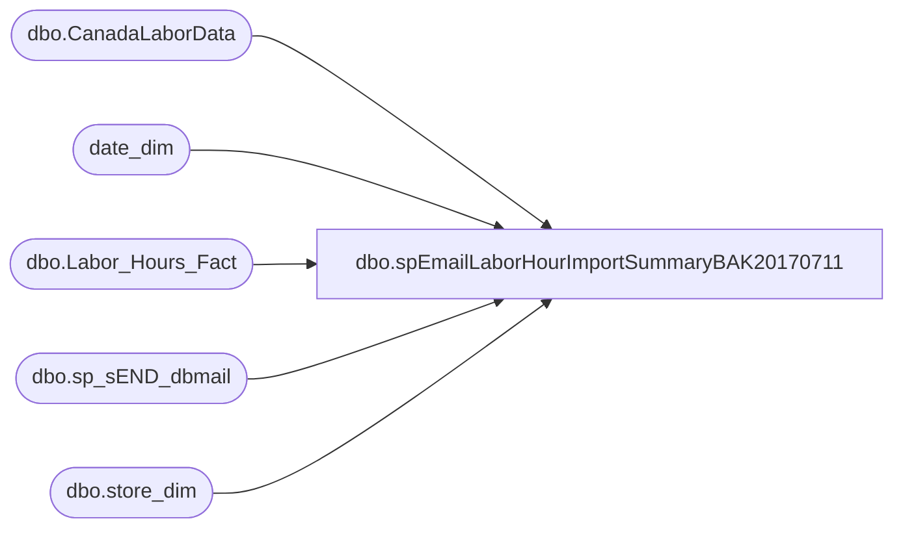

# dbo.spEmailLaborHourImportSummaryBAK20170711

**Database:** dw  
**Server:** papamart  

## Architecture Diagram



## Table Dependencies

| Referenced Table |
|---|
| dbo.CanadaLaborData |
| date_dim |
| dbo.Labor_Hours_Fact |
| dbo.sp_sEND_dbmail |
| dbo.store_dim |

## Stored Procedure Code

```sql
CREATE PROC [dbo].[spEmailLaborHourImportSummaryBAK20170711]
as 

-- =====================================================================================================
-- Name: spEmailLaborHourImportSummary
--
-- Description:	Sends email summary of the labor hour imported into DW
--
-- Revision History
--		Name:			Date:			Comments:
--		Brian Byas		1/21/2016		Created Proc
--		Brian Byas		7/1/2016		Fixed LaborStage day filter
-- =====================================================================================================

SET NOCOUNT ON


IF (Object_ID('tempdb..#SUMMARY') IS NOT NULL) DROP TABLE #SUMMARY
-------------------------------------------------------------------------
-- Find Files Available Today
-------------------------------------------------------------------------

DECLARE @date VARCHAR(8)
DECLARE @dir varchar(1000)
DECLARE @empty varchar(4000)

SET @date = (SELECT CONVERT(varchar,(year(getdate()))) + REPLACE(STR(DATEPART(mm, GETDATE()),2),' ','0') + REPLACE(STR(DATEPART(dd, GETDATE()),2),' ','0'))
SET @dir = 'dir \\Kermode\FileRepository\CALaborDrop\Processed\*'+ @date +'*.txt /B'
SET @empty = 'echo off & for %A in ("\\Kermode\FileRepository\CALaborDrop\Processed\*'+ @date +'*.txt") do if %~zA LEQ 2 echo.%A'

IF (Object_ID('tempdb..#Stores') IS NOT NULL) DROP TABLE #Stores
create table #Stores
(StoreID nvarchar(max))

IF (Object_ID('tempdb..#EmptyFiles') IS NOT NULL) DROP TABLE #EmptyFiles
create table #EmptyFiles
(StoreID nvarchar(max))

INSERT #Stores
EXEC MASTER..xp_cmdshell @dir 
DELETE from #Stores WHERE StoreID IS NULL or StoreID = 'File Not Found'

INSERT #EmptyFiles
EXEC MASTER..xp_cmdshell @empty 
DELETE from #EmptyFiles WHERE StoreID IS NULL or StoreID = 'File Not Found'
-----------------------------Set First of Month Handling------------------------------------
DECLARE @FirstDayOfMonth DATETIME
DECLARE @MonthValue INT
SELECT @FirstDayOfMonth = (SELECT DATEADD(month, DATEDIFF(month, 0, GETDATE()), 0) AS StartOfMonth)

IF REPLACE(STR(DATEPART(dd, @FirstDayOfMonth),2),' ','0') = DAY(getdate())
	SET @MonthValue = '-1';

ELSE 
	SET @MonthValue = '';

-----------------------------CTE Handles Staging------------------------------------
;
WITH IncludedStores (StoreID) AS (
SELECT DISTINCT store_id 
FROM dw.dbo.store_dim WHERE country IN ('UK','CA','IE','DK')
	AND (opening_date IS NOT NULL OR opening_date >= getdate())
	AND (closing_date IS NULL OR closing_date > getdate())
	AND store_name NOT like '%Web%'
	AND (store_id <= 2065 OR store_id = 2301)
),
LaborFiles (StoreID) AS (
SELECT SUBSTRING(LEFT(StoreID,4),PATINDEX('%[^0 ]%',LEFT(StoreID,4) + ' '), LEN(LEFT(StoreID,4))) AS Stores FROM #Stores
),
EmptyLaborFiles (StoreID) AS (
SELECT LEFT(SUBSTRING(RIGHT(StoreID,27),PATINDEX('%[^0 ]%',RIGHT(StoreID,4) + ' '), LEN(LEFT(StoreID,27))),4) AS Stores FROM #EmptyFiles
),
LaborStage (StoreID, Stage_SumHours) AS (
SELECT StoreID,SUM(DATEDIFF(hh,ClockInDate,ClockOutDate)) AS SumHours 
FROM DWStaging.dbo.CanadaLaborData WITH(NOLOCK)
WHERE LEFT(CONVERT(VARCHAR,RecordInsertedDateTime,120),10) = LEFT(CONVERT(VARCHAR,getdate(),120),10) -- todays date
AND DAY(ClockInDate) = DATEPART(dd,getdate()-1)
GROUP BY StoreID
),
LaborFact (StoreID, Fact_SumHours) AS (
SELECT SUBSTRING(LEFT(sd.store_id,4),PATINDEX('%[^0 ]%',LEFT(sd.store_id,4) + ' '), LEN(LEFT(sd.store_id,4))) AS StoreID,
SUM(DATEDIFF(hh,lhf.start_Time,lhf.end_Time)) AS SumHours 
FROM dw.dbo.Labor_Hours_Fact lhf WITH(NOLOCK) INNER JOIN	
	dw.dbo.Store_dim sd WITH(NOLOCK)
		ON lhf.store_key = sd.store_key
WHERE --LEFT(CONVERT(VARCHAR,lhf.INS_DT,120),10) = LEFT(CONVERT(VARCHAR,getdate(),120),10) -- todays date
date_key = (SELECT date_key FROM date_dim where actual_date = (SELECT CONVERT(DATETIME,(SELECT CONVERT(varchar,(year(getdate()))) + REPLACE(STR(DATEPART(mm, getdate()+@MonthValue),2),' ','0') + REPLACE(STR(DATEPART(dd, GETDATE()-1),2),' ','0')),112)))
GROUP BY SUBSTRING(LEFT(sd.store_id,4),PATINDEX('%[^0 ]%',LEFT(sd.store_id,4) + ' '), LEN(LEFT(sd.store_id,4)))
)

-----------------------------Summary of CTE------------------------------------

SELECT s.StoreID,
		lfi.StoreID AS [StoresWithFiles],
		elfi.StoreID AS [EmptyFiles],
		ls.Stage_SumHours,
		lfa.Fact_SumHours
INTO #SUMMARY
		FROM IncludedStores s LEFT OUTER JOIN
		LaborFiles lfi ON
			s.StoreID = lfi.StoreID LEFT OUTER JOIN
		EmptyLaborFiles elfi ON
			s.StoreID = elfi.StoreID LEFT OUTER JOIN
		LaborStage ls ON
			lfi.StoreID = ls.StoreID LEFT OUTER JOIN
		LaborFact lfa ON
			lfa.StoreID = lfi.StoreID 

------------------------------------------------------------------------- 
-- HTML Header & Body
------------------------------------------------------------------------- 
DECLARE @col_name varchar(4000),
		@nsql nvarchar(4000),
		@query_result VARCHAR(MAX),
		@subject nvarchar(max),
        @body    nvarchar(max),
		@body1    nvarchar(max),
		@body2    nvarchar(max),
		@email   nvarchar(max),
		@datetime datetime

    
   -- SET @body = N'<table border=1 cellpadding=1 cellspacing=1>'

   
    SET @body = N'<font face = arial size = 4> ' +
				'<B>Labor Hour Import Summary For date: </B>' + convert(varchar(50),LEFT(CONVERT(VARCHAR,getdate()-1,110),10)) +
				'<BR>' +
				'<BR></font>
				<table border=1 cellpadding=1 cellspacing=1><tr>'
    SET @body = cast( @body as nvarchar(max) ) 
		+ N'<th>StoreID</th>' 
		+ N'<th>FileReceived</th>'
		+ N'<th>BlankFile</th>'  
		+ N'<th>StagedHours</th>' 
		+ N'<th>ImportedHours</th>'

		
 
	SET @body = cast( @body as nvarchar(max) ) 
              + '</tr>'
------------------------------------------------------------------------- 
-- HTML Query & Footer 
-------------------------------------------------------------------------
 SET @nsql = 'SELECT @qr = CAST((SELECT
			(SELECT  StoreID FOR  XML Path (''td''),type)
			,( SELECT  CASE WHEN StoresWithFiles IS NOT NULL THEN ''X'' END AS StoresWithFiles FOR  XML Path (''td''),type) 
			,( SELECT  CASE WHEN EmptyFiles IS NOT NULL THEN ''X'' END AS EmptyFiles FOR  XML Path (''td''),type) 
			,( SELECT  Stage_SumHours AS Stage_SumHours FOR  XML Path (''td''),type)
			,( SELECT  Fact_SumHours AS Fact_SumHours FOR  XML Path (''td''),type)
			FROM #SUMMARY order by StoreID for xml path( ''tr'' ),type) as nvarchar(max))'


    EXEC sp_EXECutesql @nsql, N'@qr nvarchar(max) output', @query_result output
	 
     SET @body = cast(@body as nvarchar(max))
              + @query_result

	SET @body = @body + cast( '</table>' as nvarchar(max) )
	  

------------------------------------------------------------------------- 
-- SEND Email
-------------------------------------------------------------------------

    --  SEND notification

SET @datetime = (SELECT CONVERT(VARCHAR,(getdate()),120))

    SET @subject = 'Labor Hour Import Summary - ' + CONVERT(VARCHAR,@datetime)
	

    EXEC msdb.dbo.sp_sEND_dbmail  @from_address = 'BIAdmin@buildabear.com',
                                  @recipients = 'biadmin@buildabear.com;ryang@buildabear.com;santiagob@buildabear.com;samarar@buildabear.com;chadv@buildabear.com;jenniferha@buildabear.co.uk;AmyL@buildabear.co.uk',
								  --@recipients = 'brianb@buildabear.com', --TESTING
                                  @body = @body,
                                  @body_format = 'HTML',
                                  @subject = @subject


dbo,spGuestLoad_Pull_Misc_Lookups,-- =============================================================================================================
-- Name: spGuestLoad_Pull_Misc_Lookups
--
-- Description:	
--		Pull odds and ends that make up a tkf record
--
-- Input:
--		@etl_log_id			int	
--			Current load to process
--
-- Output: 
--		data will be loaded into dw.dbo.GuestLoad_Pull_Misc_Lookups 
--
-- Dependencies: 
--
-- EXAMPLE:
--		exec crm.dbo.spGuestLoad_Pull_Misc_Lookups 1
--
-- Revision History
--		Name:			Date:			Comments:
--		Dave Rice		7/19/2010		created
-- =============================================================================================================
CREATE PROCEDURE [dbo].[spGuestLoad_Pull_Misc_Lookups](@etl_log_id int)
AS
BEGIN
-- SET NOCOUNT ON added to prevent extra result sets from
-- interfering with SELECT statements.
SET NOCOUNT ON;

----exec dbo.spGuestLoad_Pull_Misc_Lookups 14629
--select top 1 etl_log_id from dwstaging.dbo.load_rec_id_cntrl with (nolock)
--declare @etl_log_id int
--set @etl_log_id = 14629

IF (Object_ID('tempdb..#staging_ksk') IS NOT NULL) DROP TABLE #staging_ksk
select 
	krs.ksk_regis_stg_id, 
	lric.stg_dta_set_cd, 
	convert(varchar(10), krs.trn_start_dt, 101) actual_date, 
	datepart(HH, krs.trn_start_dt) hour, 
	datepart(MI, krs.trn_start_dt) minute,
	case when isnumeric(anml_nbr) = 1 then cast(anml_nbr as bigint) else -1 end anml_nbr, 
	str_nbr, 
	lric.clnsd_addr_id
into #staging_ksk
from dwstaging.dbo.ksk_regis_stg krs with (nolock)
	INNER JOIN dwstaging.dbo.load_rec_id_cntrl lric with (nolock)
	ON krs.ksk_regis_stg_id = lric.stg_id
	AND lric.stg_dta_set_cd = 'KSK'
WHERE lric.etl_log_id = @etl_log_id

truncate table GuestLoad_Pull_Misc_Lookups

--select * from GuestLoad_Pull_Misc_Lookups
--select * from dwstaging.dbo.load_rec_id_cntrl

insert into GuestLoad_Pull_Misc_Lookups (stg_id, stg_dta_set_cd, date_key, time_key, product_key, store_key, nrst_str_id)
SELECT 
	krs.ksk_regis_stg_id
	, krs.stg_dta_set_cd
	, IsNull(dd.date_key, -1)
	, IsNull(td.time_key, -1)
	, IsNull(pd.product_key, -1)
	, IsNull(sd.store_key, -1)
	, isnull(dw.dbo.fnGetNearestHistoricalStore(cad.cntry_abbrv, cad.nrst_str_pstl_cd, dd.date_key, 0), -4)
FROM #staging_ksk krs
	INNER JOIN dw.dbo.clnsd_addr_dim cad with (nolock)
	ON krs.clnsd_addr_id = cad.clnsd_addr_id
	LEFT OUTER JOIN dw.dbo.date_dim dd with (nolock)
	ON krs.actual_date = dd.actual_date
	LEFT OUTER JOIN dw.dbo.time_dim td with (nolock)
	ON krs.hour = td.hour
	AND krs.minute = td.minute
	LEFT OUTER JOIN dw.dbo.product_dim pd
	ON krs.anml_nbr = pd.sku
	LEFT OUTER JOIN dw.dbo.store_dim sd with (nolock)
	ON krs.str_nbr = sd.store_id
	LEFT OUTER JOIN dw.dbo.nrst_pstl_cd_str_dim nsd with (nolock)
	ON cad.cntry_abbrv = nsd.cntry_abbrv
	AND cad.nrst_str_pstl_cd = nsd.pstl_cd
END
```

