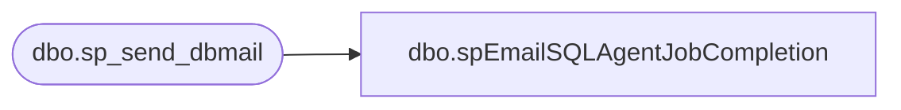

# dbo.spEmailSQLAgentJobCompletion

**Database:** dw  
**Server:** papamart  

## Architecture Diagram



## Table Dependencies

| Referenced Table |
|---|
| dbo.sp_send_dbmail |

## Stored Procedure Code

```sql
CREATE proc [dbo].[spEmailSQLAgentJobCompletion]
	@ProcessName varchar(1000),
	@SQLAgent varchar(100),
	@Recipients varchar(1000)

as

-------------------------------------------------------------------------------------------------
-------------------------------------------------------------------------------------------------
--2017-07-11   Dan Tweedie -- Created proc to be reused for SQL Agent job completion emails.
--  Proc can be called like this:
											--exec spEmailSQLAgentJobCompletion 
											--@ProcessName = 'Web Product Catalog Exports', 
											--@SQLAgent = 'WebProductCatalogExports',
											--@Recipients = 'BIAdmin@buildabear.com'
-------------------------------------------------------------------------------------------------
-------------------------------------------------------------------------------------------------

set nocount on


declare
	@Statement varchar(4000),
	@Subject varchar(1000)

select 
	@Statement = '
<font face=arial size=2> '  +
	'The <b>' + @ProcessName + '</b> process has completed.' +
    '<br><br>This process runs SQL Agent Job on STL-SSIS-P-01: ' + @SQLAgent + 
    '</font>',
	@Subject = 'Process Completion Notice:  --->  ' + @ProcessName 
    
   
exec msdb.dbo.sp_send_dbmail
	@profile_name = 'BIAdmin',
    @recipients = @Recipients,
    @body = @Statement,
	@subject = @Subject,
	@body_format = 'HTML'
```

