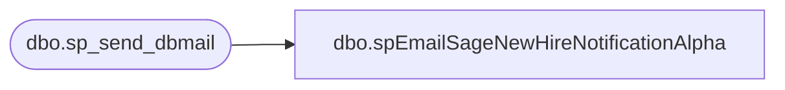

# dbo.spEmailSageNewHireNotificationAlpha

**Database:** dw  
**Server:** papamart  

## Architecture Diagram



## Table Dependencies

| Referenced Table |
|---|
| dbo.sp_send_dbmail |

## Stored Procedure Code

```sql
CREATE proc [dbo].[spEmailSageNewHireNotificationAlpha] 
	@EmployeeID nvarchar(7),
	@EecLocation nvarchar(50),
	@EepNameFirst nvarchar(50),
	@EepNameLast nvarchar(50),
	@JbcJobCode nvarchar(50),
	@EecOrgLvl1Code nvarchar(50),
	@samaccountname nvarchar(50),
	@managerEmail nvarchar(100),
	@personalEmail nvarchar(100)

--========================================================================================================================
--	2020-05-06	Ian Wallace - Created proc 
--========================================================================================================================

as

set nocount on

declare 
	@provisionText varchar(20),
	@subj varchar(100),
	@recip varchar(1000),
	@copy_recip varchar(1000),
	@hr_recip varchar(100),
	@cc_line varchar(1000),
	@cc varchar(100),
	@part1 nvarchar(max),
	@part2 nvarchar(max),
	@part3 nvarchar(max),
	@both nvarchar(max),
	@pics nvarchar(max)
	


set @pics = '\\stl-ssis-p-01\IntegrationStaging\HR\SageAutomation\pw_station_1.jpg;\\stl-ssis-p-01\IntegrationStaging\HR\SageAutomation\pw_station_2.jpg;' + 
			'\\stl-ssis-p-01\IntegrationStaging\HR\SageAutomation\pw_station_3.jpg;\\stl-ssis-p-01\IntegrationStaging\HR\SageAutomation\pw_station_4.jpg;' +
			'\\stl-ssis-p-01\IntegrationStaging\HR\SageAutomation\pw_station_5.jpg;\\stl-ssis-p-01\IntegrationStaging\HR\SageAutomation\pw_station_6.jpg;' +
			'\\stl-ssis-p-01\IntegrationStaging\HR\SageAutomation\sage_1.jpg;\\stl-ssis-p-01\IntegrationStaging\HR\SageAutomation\sage_2.jpg;' +
			'\\stl-ssis-p-01\IntegrationStaging\HR\SageAutomation\sage_3.jpg;\\stl-ssis-p-01\IntegrationStaging\HR\SageAutomation\sage_4.jpg;' +
			'\\stl-ssis-p-01\IntegrationStaging\HR\SageAutomation\sage_5.jpg'


select @Subj = 'Sage New Hire Instructions'
	--select @recip = 'ianw@buildabear.com'
	--SET @recip = 'IT-ServiceDesk@buildabear.com;heatherv@buildabear.com;ianw@buildabear.com'
	--set @copy_recip = @managerEmail
	--select @recip = @personalEmail
	select @recip = @personalEmail
	select @hr_recip = 'MiriamB@buildabear.com'
	set @cc_line = @managerEmail+';'+@hr_recip
	--select @copy_recip = 'ian.david.wallace@gmail.com'
	select @ProvisionText = 'H'


select @part1 =  '

<table><tr><td valign="top" align="left"><font face =arial size = 3 color = "blue" ><i>Welcome,</i></td></tr></table> <br>
<table><tr><td valign="top" align="left"><font face =arial size = 3 color = "blue" ><i>We’re excited to welcome you to the team! </i></td></tr></table> <br>
<table><tr><td valign="top" align="left"><font face =arial size = 3 color = "blue" ><i>Build-A-Bear Workshop would like to introduce you to My BABW Hub, our online HR Platform.</i></td></tr></table> <br>
<table><tr><td valign="top" align="left"><font face =arial size = 3 color = "blue" ><i>Please read through the instructions below and once logged in take some time to read through the policies and Handbook in your first week.</i></td></tr></table> <br>
<table><tr><td valign="top" align="left"><font face =arial size = 3 color = "blue" ><i>Your manager will show you how to use the system during your induction.</i></td></tr></table> <br>

<table><tr><td valign="top" align="left"><font face =arial size = 2 color = "blue" ><B><u>Please note you will be able to follow the instructions below on your first day when you arrive to your store, but not before then</u></B></td></tr></table><br>

<table><tr><td valign="top" align="left"><font face =arial size = 2 color = "blue" >The following details will be required in order for you to access SAGE:</td></tr></table><br>

<table><tr><td valign="top" align="left"><font face =arial size = 2 color = "blue" ><B>Employee Number: ' + @samaccountname + ' </B></td></tr></table> 

<table><tr><td valign="top" align="left"><font face =arial size = 2 color = "blue" ><B>Default Password: B-BW&[DOB]! (please note, you will need to replace [DOB] with your date of birth using yyyy-mm-dd format)</B></td></tr></table> 
<table><tr><td valign="top" align="left"><font face =arial size = 2 color = "blue" ><B>Example: B-BW&1975-04-11!</B></td></tr></table><br>

<table><tr><td valign="top" align="left"><font face =arial size = 2 color = "blue" >Firstly you will need to change reset your password <b><u>once you are in your store</u></b>, in order to do this you will need to:</td></tr></table> <br>

<table><tr><td valign="top" align="left"><font face =arial size = 2 color = "blue" >1.	Go to password station by clicking this Password Station link in the POS, </td></tr>
<tr><td valign="top" align="left"></td></tr>
</table>
   
   <table><tr><td valign="top" align="left"><font face =arial size = 2 color = "blue" >which will open the site below </td></tr>
<tr><td valign="top" align="left"></td></tr>
</table>


<table><tr><td valign="top" align="left"><font face =arial size = 2 color = "blue" >2.	Now enter your Employee Number in the User ID field and click ‘I Agree’</td></tr>
<tr><td valign="top" align="left"></td></tr>
</table>


'

set @part2 = '


<table><tr><td valign="top" align="left"><font face =arial size = 2 color = "blue" >3.	On the next screen, enter the below and click continue once completed
<br>Old password: Default Password provided (please remember to replace [DOB] with your date of birth using yyyy-mm-dd format)
<br>New Password: enter a new password
<br>Confirm: re-enter the new password
<br>IMPORTANT!
<br>Please note new passwords:
<br>-Must be at least 14 characters long
<br>-Must Not contain your user account name.
<br>-Must Not contain part of your account display name.
<br>-Must contain at least one character from three of the following five categories:
<br>-An uppercase character (A through Z).
<br>-A lowercase character (a through z).
<br>-An alphabetic character in a language that does not have case.
<br>-A number (0 through 9).
<br>-A special non-alphanumeric character (for example, !, $, #, %), extended ASCII, or symbol.
</td></tr>
<tr><td valign="top" align="left"></td></tr>
</table>

<table><tr><td valign="top" align="left"><font face =arial size = 2 color = "blue" >Example</td></tr>
<tr><td valign="top" align="left"></td></tr>
</table>

<table><tr><td valign="top" align="left"><font face =arial size = 2 color = "blue" >4. Once this has been completed successfully on the next window, click continue and close the browser.
You have now successfully changed your password.</td></tr>
<tr><td valign="top" align="left"></td></tr>
</table>

'

set @part3 = '


<table><tr><td valign="top" align="left"><font face =arial size = 2 color = "blue" >5. 	In order to login to SAGE, click the Sage link in the POS,</td></tr>
<tr><td valign="top" align="left"></td></tr>
</table>

<table><tr><td valign="top" align="left"><font face =arial size = 2 color = "blue" > </td></tr>
<tr><td valign="top" align="left"></td></tr>
</table>


<table><tr><td valign="top" align="left"><font face =arial size = 2 color = "blue" >It could alternatively look this this when multiple users are logging in, as it will be in the stores, in which case the user should pick their account here, or if it is their first login, choose “Use another account” and proceed.</td></tr>
<tr><td valign="top" align="left"></td></tr>
</table>


<table><tr><td valign="top" align="left"><font face =arial size = 2 color = "blue" >6.	Your sign in details are EmployeeNumber@buildabear.com for example 1234567@buildabear.com and click Next
</td></tr>
<tr><td valign="top" align="left"></td></tr>
</table>

<table><tr><td valign="top" align="left"><font face =arial size = 2 color = "blue" >7.	Next enter your new password and click Sign in</td></tr>
<tr><td valign="top" align="left"></td></tr>
</table>

<table><tr><td valign="top" align="left"><font face =arial size = 2 color = "blue" >If you have any questions please email ukhr@buildabear.co.uk</td></tr></table> 

<br><br>
   <font face =arial size = 1><B>This report was run from SSIS as part of the Sage to Active Directory ETL. </B></font>
    <br>
    <br>
<font face =arial size = 1><i>The information in this message may be privileged, “confidential” and protected from disclosure and/or intended only for the addressee(s) named above.  If the reader of this message is not the intended recipient, or an employee or agent responsible for delivering this message to the intended recipient, you are hereby notified that any dissemination, distribution or copying of the communication is strictly prohibited.  If you have received this communication in error, please notify us immediately by replying to the message and deleting it from your computer.  Thank you beary much.</i></font>

'


set @both = @part1 + @part2 + @part3

		exec msdb.dbo.sp_send_dbmail
			@profile_name = 'BIAdmin',
			@from_address = 'ukhr@buildabear.co.uk',
			@recipients = @recip,
			@copy_recipients =@cc_line,
			--@copy_recipients = 'ianw@buildabear.com',
			--@copy_recipients =@copy_recip,
			@blind_copy_recipients ='ianw@buildabear.com',
			@file_attachments = @pics,
			@body = @both,
			@subject = @subj,
			@body_format = 'HTML'
```

