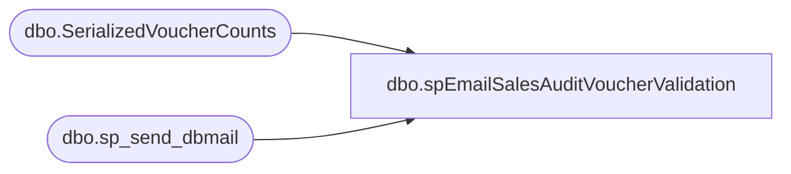

# dbo.spEmailSalesAuditVoucherValidation

**Database:** dw  
**Server:** papamart  

## Architecture Diagram



## Table Dependencies

| Referenced Table |
|---|
| dbo.SerializedVoucherCounts |
| dbo.sp_send_dbmail |

## Stored Procedure Code

```sql
CREATE proc [dbo].[spEmailSalesAuditVoucherValidation] 

--========================================================================================================================

as

set nocount on

IF (Object_ID('tempdb..#voucherDayCount') IS NOT NULL) DROP TABLE #voucherDayCount;

--declare @count int

select processDate as importedDate,isnull(vouchersSent,0) as 'vouchersSentToSalesAudit', isnull(vouchersProcessed,0)  as 'vouchersProcessedInSalesAudit' ,isnull(vouchersSentXML,0) as 'vouchersSentToServiceCloud'
into #voucherDayCount
from [dbo].[SerializedVoucherCounts] where cast(processDate as date) >= cast(getdate()-7 as date) 

--select @Count =  sum(vouchersSentToSalesAudit-vouchersProcessedInSalesAudit-vouchersSentToServiceCloud) from  #voucherDayCount


declare @num1 float,@num2 float,@num3 float, @num4 float, @num5 float

set @num2 = (select vouchersProcessed + 1 from [dbo].[SerializedVoucherCounts] where cast(processDate as date) = cast(getdate() as date) )
set @num1 = (select ABS(vouchersProcessed-vouchersSent) from [dbo].[SerializedVoucherCounts] where cast(processDate as date) = cast(getdate() as date) )
set @num3 = (select @num1/@num2)*100
set @num4 = (select vouchersSentXML + 1 from [dbo].[SerializedVoucherCounts] where cast(processDate as date) = cast(getdate() as date) )
set @num5 =  (select @num1/@num4)*100

--select @num3
--select @num5 


declare @text nvarchar(max)

select @text = '<font face = arial size = 2> ' +
				'<B>Previous Day Voucher Counts</B>' + 
				'<BR>' +
				'<BR>' +
				'<table border="1">' +
				'<font face =arial size = 2>' +
				'<tr><th>importedDate</th><th>vouchersSentToSalesAudit</th><th>vouchersProcessedInSalesAudit</th><th>vouchersSentToServiceCloud</th></tr>'+
					CAST ( ( SELECT td = importedDate, '',
									td = vouchersSentToSalesAudit, '',
									td = vouchersProcessedInSalesAudit, '',
									td = vouchersSentToServiceCloud, ''
								from #voucherDayCount
								order by 
									importedDate
								FOR XML PATH('tr'), TYPE 
					) AS NVARCHAR(MAX) ) +
					'</font></table></font></p></p>
					<br>
					<br>
					<br>

	Run from papamart.dw.spEmailSalesAuditVoucherValidation'

if @num3 > 1 or @num5 > 1 

Begin

exec msdb.dbo.sp_send_dbmail
	@profile_name = 'biadmin',
	--@recipients = 'biadmin@buildabear.com;heatherv@buildabear.com',
	@recipients = 'ianw@buildabear.com',
	@body = @text,
	@subject= 'Sales Audit Voucher Validation - PROBLEM', 
	@body_format = 'HTML'

	End
	
if @num3 < 1 and @num5 < 1

Begin

exec msdb.dbo.sp_send_dbmail
	@profile_name = 'biadmin',
	--@recipients = 'biadmin@buildabear.com;heatherv@buildabear.com',
	@recipients = 'ianw@buildabear.com',
	@body = @text,
	@subject= 'Sales Audit Voucher Validation - NO PROBLEM', 
	@body_format = 'HTML'

	End
```

