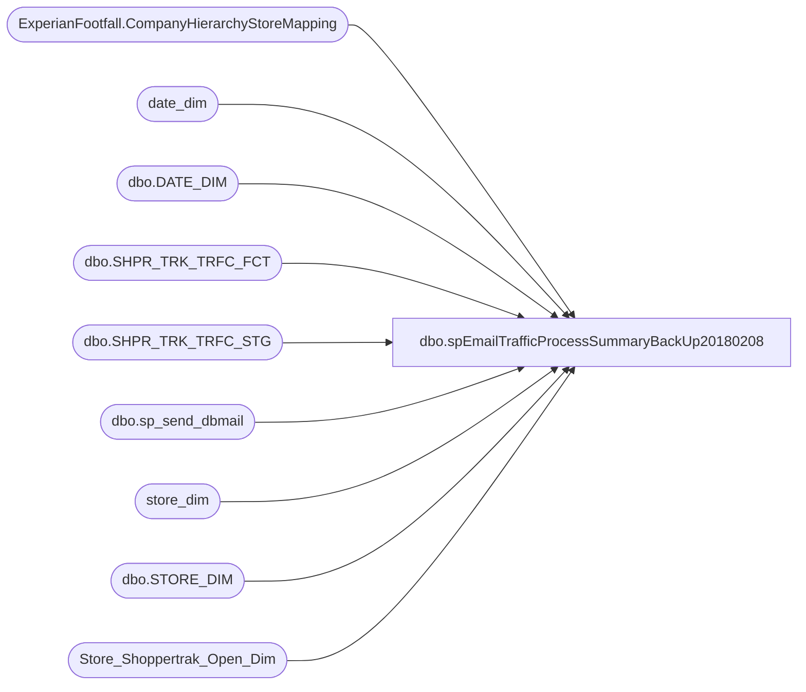

# dbo.spEmailTrafficProcessSummaryBackUp20180208

**Database:** dw  
**Server:** papamart  

## Architecture Diagram



## Table Dependencies

| Referenced Table |
|---|
| ExperianFootfall.CompanyHierarchyStoreMapping |
| date_dim |
| dbo.DATE_DIM |
| dbo.SHPR_TRK_TRFC_FCT |
| dbo.SHPR_TRK_TRFC_STG |
| dbo.sp_send_dbmail |
| store_dim |
| dbo.STORE_DIM |
| Store_Shoppertrak_Open_Dim |

## Stored Procedure Code

```sql
CREATE proc [dbo].[spEmailTrafficProcessSummaryBackUp20180208]


as 

-- =====================================================================================================
-- Name: spEmailTrafficProcessSummary
--
-- Description:	Sends email summary of the traffic data processed from Experian and Shoppertrack
--
-- Revision History
--		Name:			Date:			Comments:
--		Dan Tweedie		11/02/2015		Created Proc
--		Brian Byas		9/8/2016		Added Actual vs Inputed percentages
-- =====================================================================================================

set nocount on


IF (Object_ID('tempdb..#TrafficSummary') IS NOT NULL) DROP TABLE #TrafficSummary


DECLARE @ActualDate AS DATE;
SET @ActualDate=GETDATE()-1;
DECLARE @DT AS INT;
SELECT @DT=convert(int, convert(varchar(10), @ActualDate, 112));

WITH Data_Ind_Nm (StoreID, InputedInd) AS (
		SELECT DISTINCT sd.STORE_ID, tf.Data_Ind_Nm
		FROM [dw].[dbo].[SHPR_TRK_TRFC_FCT] tf
		INNER JOIN [dw].[dbo].[STORE_DIM] sd
			ON sd.STORE_KEY=tf.STR_KEY
		INNER JOIN [dw].[dbo].[DATE_DIM] dd
			ON dd.DATE_KEY=tf.DT_KEY
		WHERE dd.ACTUAL_DATE=@ActualDate
		AND tf.Data_Ind_Nm='Inputed'
		),
	TrafficFact (StoreID, SumEnters, SumExits) AS (
		SELECT sd.STORE_ID, sum(t.enters), sum(t.exits)
		FROM [dw].[dbo].[SHPR_TRK_TRFC_FCT] t
		INNER JOIN [dw].[dbo].[STORE_DIM] sd
			ON sd.STORE_KEY=t.STR_KEY
		INNER JOIN [dw].[dbo].[DATE_DIM] dd
			ON dd.DATE_KEY=t.DT_KEY
		WHERE dd.ACTUAL_DATE=@ActualDate
		GROUP BY sd.STORE_ID
		),
		MaxStaged as 
		(
		select cust_id, dt, tm, max(etl_log_id) as LogID
		from dwstaging.dbo.[SHPR_TRK_TRFC_STG] 
		group by cust_id, dt, tm
		),
	 TrafficSTG (StoreID, SumEnters, SumExits) AS (
		SELECT t.CUST_ID, sum(t.enters), sum(t.exits)
		FROM [DWStaging].[dbo].[SHPR_TRK_TRFC_STG] t
		join MaxStaged ms on t.cust_id = ms.cust_id and t.dt = ms.dt and t.tm = ms.tm and t.etl_log_id = ms.LogID
		WHERE t.DT =@DT
		AND t.SHPR_TRK_ORG_ID not like '4____'
		GROUP BY t.CUST_ID
		),
	TrafficVendor (StoreID, IsShopperTrak, IsFootFall) AS (
		SELECT DISTINCT SiteIdentity, IsShopperTrak, IsFootFall 
		FROM  DWStaging.ExperianFootfall.CompanyHierarchyStoreMapping
		),
	IncludedStores (StoreID) AS (
		SELECT DISTINCT sd.store_id
		FROM store_dim sd
		INNER JOIN Store_Shoppertrak_Open_Dim sod
			ON sod.store_key=sd.store_key
		LEFT OUTER JOIN date_dim dd1
			ON dd1.date_key=sod.date_key_from
		LEFT OUTER JOIN date_dim dd2
			ON dd2.date_key=sod.date_key_thru
		WHERE GETDATE() BETWEEN ISNULL(dd1.actual_date,'1/1/1900') AND ISNULL(dd2.actual_date,'12/31/2999')
		AND (sd.closing_date>GETDATE() OR sd.closing_date IS NULL)
		),
	PercentActuals (storeID,PctActuals,PctInputed)AS (
	SELECT 
      sd.store_id  
	  ,CAST(CAST(COUNT(CASE WHEN DATA_IND_NM = 'Actual' THEN 1 ELSE NULL END)AS numeric) / CAST(COUNT(EXITS) AS int)AS decimal(18,2)) AS PctAcutals
	  ,CAST(CAST(COUNT(CASE WHEN DATA_IND_NM = 'Inputed' THEN 1 ELSE NULL END)AS numeric) / CAST(COUNT(EXITS) AS int)AS decimal(18,2)) AS PctInputed
		FROM [dw].[dbo].[SHPR_TRK_TRFC_FCT] SF INNER JOIN
			[dw].[dbo].[store_dim] sd ON
				sf.STR_KEY = sd.store_key
			INNER JOIN [dw].[dbo].[DATE_DIM] dd
			ON dd.DATE_KEY=sf.DT_KEY
		WHERE dd.ACTUAL_DATE= @ActualDate
	GROUP BY sd.store_id)

SELECT	DISTINCT 
		inc.StoreID AS AllStores
		,CASE	WHEN tv.IsFootFall=1 THEN 'FootFall'
				WHEN tv.IsShopperTrak=1 THEN 'ShopperTrack'
		 END AS DataSource
		,ts.StoreID AS StageStore
		,ts.SumEnters AS StageSumEnters
		,ts.SumExits AS StageSumExits
		,tf.StoreID AS FactStore
		,tf.SumEnters AS FactSumEnters
		,tf.SumExits AS FactSumExits
		,ts.SumEnters-tf.SumEnters AS MissingEnters
		,ts.SumExits-tf.SumExits AS MissingExits
		,CASE WHEN di.InputedInd IS NULL THEN 'Actual' ELSE di.InputedInd END AS InputedInd
		,pa.PctActuals
		,pa.PctInputed
INTO #TrafficSummary
FROM IncludedStores inc
LEFT OUTER JOIN TrafficSTG ts
		ON ts.StoreID=inc.StoreID
LEFT OUTER JOIN TrafficFact tf
		ON tf.StoreID=inc.StoreID
LEFT OUTER JOIN TrafficVendor tv
		ON tv.StoreID=inc.StoreID
LEFT OUTER JOIN Data_Ind_Nm di
		ON di.StoreID=inc.StoreID
LEFT OUTER JOIN PercentActuals pa
		ON pa.StoreID=inc.StoreID
ORDER BY inc.StoreID; 

declare @text nvarchar(max)

select @text = '<font face = arial size = 2> ' +
				'<B>TRAFFIC PROCESS SUMMARY - (SHOPPERTRACK AND EXPERIAN)</B>' + 
				'<BR>' +
				'<BR>' +
				'<table border="1">' +
				'<font face =arial size = 2>' +
				'<tr><th>LOCATION</th><th>TRAFFIC SOURCE</th><th>STAGED ENTERS</th><th>STAGED EXITS</th><th>POSTED FACT ENTERS</th><th>POSTED FACT EXITS</th><th>MISSING ENTERS</th><th>MISSING EXITS</th><th>INPUT METHOD</th><th>ACTUAL %</th><th>INPUTED %</th></tr>'+
					CAST ( ( SELECT td = right(('0000' + cast (AllStores as varchar)), 4), '',
									td = DataSource, '',
									td = isnull(StageSumEnters,0), '',
									td = isnull(StageSumExits,0), '',
									td = isnull(FactSumEnters,0), '',
									td = isnull(FactSumExits,0), '',
									td = isnull(MissingEnters,0), '',
									td = isnull(MissingExits,0), '',
									td = isnull(InputedInd, 'NULL'), '',
									td = isnull(CAST(CAST(PctActuals*100 AS decimal(18,0)) AS varchar(4)),''), '',
									td = isnull(CAST(CAST( PctInputed*100 AS decimal(18,0)) AS varchar(4)),''),''
								from #TrafficSummary
								order by 
									CASE WHEN (isnull(FactSumExits,0)=0 OR isnull(FactSumExits,0) IS NULL) 
										THEN 'No' 
										ELSE 'Yes' 
									END, 
									right(('0000' + cast (AllStores as varchar)), 4)
								FOR XML PATH('tr'), TYPE 
					) AS NVARCHAR(MAX) ) +
					'</font></table></font></p></p>
					<br>
					<br>
					<br>'


exec msdb.dbo.sp_send_dbmail
	@profile_name = 'biadmin',
	@recipients = 'biadmin@buildabear.com;SantiagoB@buildabear.com;SamaraR@buildabear.com;ChadV@buildabear.com;RyanG@buildabear.co.uk;justinc@buildabear.co.uk;DeannaS@buildabear.com',
	@body = @text,
	@subject= 'Traffic Process Summary', 
	@body_format = 'HTML'


	


dbo,spCosell_Report_ForStore_ForClassOrSubclass_ExceptSkus,-- =============================================================================================================
-- Name: spCosell_Report_ForStore_ForClassOrSubclass_ExceptSkus
--
-- Description:	
--		Extract the sales for the items in the class or subclass requested and the other items on those transactions
--			The list of exceptSKUs will be ignored.
--
-- Input:
--		@fromDate	The starting date to retrieve
--		@thruDate	The ending date to retrieve
--		@onlyUseSingelAnimalTransactions	1 = get only transactions with 1 animal, 0 = All transactions
--		@forStoreID	A comma delimited list of the target stores, '' = All Stores
--		@forClassOrSubclass The class or subclass which was requested
--		@exceptSKUS		A comma delimited list of skus which are to be omitted
--
-- Output: 
--		dataset which unions together all of the target and other skus. This is in one dataset
--		because SSRS only allows one dataset to be recognized
--		The column target_result_ind indicates whether this was a target item (0),an other item (1)
--			, or a summary of other Items grouped by department (2)
--
-- Dependencies: 
--
-- EXAMPLE:
--		EXEC	spCosell_Report_ForStore_ForClassOrSubclass_ExceptSkus
--			@fromDate = '11/1/2012',
--			@thruDate = '11/15/2012',
--			@onlyUseSingleAnimalTransactions = 1,
--			@forStoreID = '105,1',
--			@forClassOrSubclass = 'R-B-D-05-01'
--			@exceptSKUS = '020083, 020084, 017487, 018106, 019122, 018775'
--
-- Revision History
--		Name:				Date:			Comments:
--		Gary Murrish		11/13/2012		created
--		Gary Murrish		11/19/2012		Changed Transaction_ID counting
--		Gary Murrish		12/10/2012		Changed department selection to be department code instead of department
--		Gary Murrish		12/18/2012		Changed to omit R-B-Z in department Summary
--		Gary Murrish		7/26/2013		Changed to add a Store Parameter, if -1 then all stores
--		Gary Murrish		9/19/2013		Added Currency Code
--		Gary Murrish		1/30/2014		Force Euros to GBP
-- =============================================================================================================
CREATE PROCEDURE [dbo].[spCosell_Report_ForStore_ForClassOrSubclass_ExceptSkus]
	@fromDate datetime,
	@thruDate datetime,
	@onlyUseSingleAnimalTransactions bit,
	@forStoreID varchar(max),
	@forClassOrSubclass varchar(50),
	@exceptSKUS varchar(MAX)
AS
BEGIN
	-- SET NOCOUNT ON added to prevent extra result sets from
	-- interfering with SELECT statements.
	SET NOCOUNT ON;


	-- Get the Date Keys
	DECLARE @fromDateKey int
	DECLARE @thruDateKey int
	SELECT
		@fromDateKey = date_key
	FROM
		date_dim dd WITH (NOLOCK)
	WHERE
		actual_date = @fromDate
	SELECT
		@thruDateKey = date_key
	FROM
		date_dim dd WITH (NOLOCK)
	WHERE
		actual_date = @thruDate


	-- Parse out the stores requested.
	IF OBJECT_ID('tempdb..#stores') IS NOT NULL
	BEGIN
		DROP TABLE #stores
	END

	SELECT
		store_key,
		store_id
	INTO #stores
	FROM
		store_dim sd WITH (NOLOCK)

	IF NOT @forStoreID IS NULL
		AND @forStoreID <> ''
	BEGIN
		DELETE s
			FROM #stores s WITH (NOLOCK)
			LEFT JOIN dbo.fn_String_To_Table(@forStoreID, ',', 1)
				ON Val = s.store_id
		WHERE Val IS NULL

	END

	SELECT
		product_key, pd.sku
	INTO #targetSKUS
	FROM
		product_dim pd WITH (NOLOCK)
		LEFT JOIN dbo.fn_String_To_Table(@exceptSKUS, ',', 1)
				ON Val = pd.sku
		
	WHERE
		@forClassOrSubclass =
			CASE
				WHEN LEN(@forClassOrSubclass) = 8 THEN LEFT(pd.subclass_code, 8)
				WHEN LEN(@forClassOrSubclass) = 11 THEN LEFT(pd.subclass_code, 11)
				WHEN LEN(@forClassOrSubclass) = 14 THEN pd.subclass_code
				ELSE ''
			END
		AND Val IS NULL

	-- Get the transactions for the requested skus
	IF OBJECT_ID('tempdb..#targetSOLD') IS NOT NULL
	BEGIN
		DROP TABLE #targetSOLD
	END
	SELECT
		base.*,
		tf.GAAP_sales_amount,
		tf.animal_units
	INTO #targetSOLD
	FROM
		(SELECT
				tdf.product_key,
				tdf.transaction_id,
				SUM(tdf.Units) AS Units,
				tdf.currency_key,
				tdf.date_key
			FROM
				transaction_detail_facts tdf WITH (NOLOCK)
				INNER JOIN #targetSKUS s
					ON s.product_key = tdf.product_key
				INNER JOIN #stores s1 WITH (NOLOCK)
					ON tdf.store_key = s1.store_key
			WHERE
				tdf.date_key BETWEEN @fromDateKey AND @thruDateKey
			GROUP BY	tdf.product_key,
						tdf.transaction_id,
						tdf.currency_key,
						tdf.date_key) base
		INNER JOIN Transaction_Facts tf WITH (NOLOCK)
			ON base.transaction_id = tf.transaction_id

	-- Delete all transactions with more than one animal
	IF @onlyUseSingleAnimalTransactions = 1
	BEGIN
		DELETE FROM #targetSOLD
		WHERE animal_units <> 1
	END

	-- Now get all of the skus which were sold on these transactions
	IF OBJECT_ID('tempdb..#otherSOLD') IS NOT NULL
	BEGIN
		DROP TABLE #otherSOLD
	END
	SELECT
		tdf.product_key,
		SUM(tdf.Units) AS Units,
		SUM(tdf.unit_gross_amount - tdf.unit_disc_amount) AS NetAmount,
		tdf.transaction_id,
		tdf.currency_key,
		tdf.date_key
	INTO #otherSOLD
	FROM
		(SELECT DISTINCT
				transaction_id
			FROM
				#targetSOLD s) trans
		INNER JOIN transaction_detail_facts tdf WITH (NOLOCK)
			ON trans.transaction_id = tdf.transaction_id
	WHERE
		product_key > 0
	GROUP BY	tdf.product_key,
				tdf.transaction_id,
				tdf.currency_key,
				tdf.date_key

	-- Convert all of the Euros to Pounds in the detail files
	UPDATE s
		SET	GAAP_sales_amount = s.GAAP_sales_amount * erf.fiscal_month_ave_rate,
			currency_key = erf.to_currency_key
	FROM
		#targetSOLD s
		INNER JOIN exchange_rate_facts erf WITH (NOLOCK)
			ON s.currency_key = erf.from_currency_key
			AND s.date_key = erf.date_key
		INNER JOIN currency_dim fmCurr WITH (NOLOCK)
			ON erf.from_currency_key = fmCurr.currency_key
		INNER JOIN currency_dim toCurr WITH (NOLOCK)
			ON erf.to_currency_key = erf.to_currency_key
	WHERE fmCurr.currency_code = 'EUR'
	AND toCurr.currency_code = 'GBP'

	UPDATE s
		SET	NetAmount = s.NetAmount * erf.fiscal_month_ave_rate,
			currency_key = erf.to_currency_key
	FROM
		#otherSOLD s
		INNER JOIN exchange_rate_facts erf WITH (NOLOCK)
			ON s.currency_key = erf.from_currency_key
			AND s.date_key = erf.date_key
		INNER JOIN currency_dim fmCurr WITH (NOLOCK)
			ON erf.from_currency_key = fmCurr.currency_key
		INNER JOIN currency_dim toCurr WITH (NOLOCK)
			ON erf.to_currency_key = erf.to_currency_key
	WHERE fmCurr.currency_code = 'EUR'
	AND toCurr.currency_code = 'GBP'


	SELECT
		data.target_result_ind,
		data.sku,
		data.department,
		data.class,
		data.subclass,
		data.style_desc,
		data.units,
		data.gaapsales,
		data.numTrans,
		cd.currency_code
	FROM
		(-- Return the Target Items
			SELECT
				0 AS target_result_ind,
				pd.sku,
				pd.department,
				pd.class,
				pd.subclass,
				pd.style_desc,
				base.units,
				base.gaapsales,
				base.numTrans,
				base.currency_key
			FROM
				(SELECT
						s.product_key,
						SUM(s.Units) AS Units,
						SUM(s.GAAP_sales_amount) AS GAAPSales,
						COUNT(DISTINCT transaction_id) AS numTrans,
						s.currency_key
					FROM
						#targetSOLD s
					GROUP BY	s.product_key,
								s.currency_key) base
				INNER JOIN product_dim pd WITH (NOLOCK)
					ON pd.product_key = base.product_key
			UNION ALL
			-- Return the Other Items		
			SELECT
				1 AS target_result_ind,
				pd.sku,
				pd.department,
				pd.class,
				pd.subclass,
				pd.style_desc,
				s.units,
				s.NetAmount,
				s.numTrans,
				s.currency_key
			FROM
				(SELECT
						product_key,
						SUM(Units) AS Units,
						SUM(netAmount) AS netAmount,
						COUNT(DISTINCT transaction_id) AS numTrans,
						currency_key
					FROM
						#otherSOLD
					GROUP BY	product_key,
								currency_key) s
				INNER JOIN product_dim pd WITH (NOLOCK)
					ON pd.product_key = s.product_key

			UNION ALL
			-- Return the Other Items summarized by selected departments
			SELECT
				2 AS target_result_ind,
				'' AS sku,
				s.department,
				'' AS class,
				'' AS subclass,
				'' AS style_desc,
				(s.Units) AS Units,
				(s.NetAmount) AS NetAmount,
				(s.numTrans) AS numTrans,
				s.currency_key
			FROM
				(SELECT
						pd.department AS department,
						SUM(Units) AS Units,
						SUM(netAmount) AS netAmount,
						COUNT(DISTINCT transaction_id) AS numTrans,
						s.currency_key
					FROM
						#otherSOLD s
						INNER JOIN product_dim pd WITH (NOLOCK)
							ON pd.product_key = s.product_key
					WHERE
						pd.ScorecardCategory IN ('Clothing', 'Footwear', 'Animal', 'Accessories', 'Sounds', 'Buddies', 'Licensing', 'Prestuffed')
					GROUP BY	pd.department,
								pd.department_code,
								s.currency_key) s) data
		INNER JOIN currency_dim cd WITH (NOLOCK)
			ON data.currency_key = cd.currency_key

END
```

