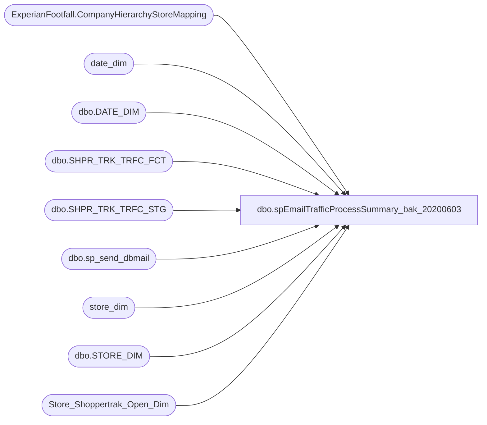

# dbo.spEmailTrafficProcessSummary_bak_20200603

**Database:** dw  
**Server:** papamart  

## Architecture Diagram



## Table Dependencies

| Referenced Table |
|---|
| ExperianFootfall.CompanyHierarchyStoreMapping |
| date_dim |
| dbo.DATE_DIM |
| dbo.SHPR_TRK_TRFC_FCT |
| dbo.SHPR_TRK_TRFC_STG |
| dbo.sp_send_dbmail |
| store_dim |
| dbo.STORE_DIM |
| Store_Shoppertrak_Open_Dim |

## Stored Procedure Code

```sql
CREATE proc [dbo].[spEmailTrafficProcessSummary_bak_20200603]


as 

-- =====================================================================================================
-- Name: spEmailTrafficProcessSummary
--
-- Description:	Sends email summary of the traffic data processed from Experian and Shoppertrack
--
-- Revision History
--		Name:			Date:			Comments:
--		Dan Tweedie		11/02/2015		Created Proc
--		Brian Byas		9/8/2016		Added Actual vs Inputed percentages
-- =====================================================================================================

set nocount on


IF (Object_ID('tempdb..#TrafficSummary') IS NOT NULL) DROP TABLE #TrafficSummary;


--DECLARE @ActualDate AS DATE;
--SET @ActualDate=GETDATE()-1;
--DECLARE @DT AS INT;
--SELECT @DT=convert(int, convert(varchar(10), @ActualDate, 112));

WITH Data_Ind_Nm (StoreID, InputedInd) AS (
		SELECT DISTINCT sd.STORE_ID, tf.Data_Ind_Nm
		FROM [dw].[dbo].[SHPR_TRK_TRFC_FCT] tf
		INNER JOIN [dw].[dbo].[STORE_DIM] sd
			ON sd.STORE_KEY=tf.STR_KEY
		INNER JOIN [dw].[dbo].[DATE_DIM] dd
			ON dd.DATE_KEY=tf.DT_KEY
		WHERE datediff(dd, dd.actual_date, getdate()-1) = 0
		--dd.ACTUAL_DATE=@ActualDate
		AND tf.Data_Ind_Nm='Inputed'
		),
	TrafficFact (StoreID, SumEnters, SumExits) AS (
		SELECT sd.STORE_ID, sum(t.enters), sum(t.exits)
		FROM [dw].[dbo].[SHPR_TRK_TRFC_FCT] t
		INNER JOIN [dw].[dbo].[STORE_DIM] sd
			ON sd.STORE_KEY=t.STR_KEY
		INNER JOIN [dw].[dbo].[DATE_DIM] dd
			ON dd.DATE_KEY=t.DT_KEY
		WHERE datediff(dd, dd.actual_date, getdate()-1) = 0
		--dd.ACTUAL_DATE=@ActualDate
		GROUP BY sd.STORE_ID
		),
		MaxStaged as 
		(
		select cust_id, dt, tm, max(etl_log_id) as LogID
		from dwstaging.dbo.[SHPR_TRK_TRFC_STG] 
		group by cust_id, dt, tm
		),
	 TrafficSTG (StoreID, SumEnters, SumExits) AS (
		SELECT t.CUST_ID, sum(t.enters), sum(t.exits)
		FROM [DWStaging].[dbo].[SHPR_TRK_TRFC_STG] t
		join MaxStaged ms on t.cust_id = ms.cust_id and t.dt = ms.dt and t.tm = ms.tm and t.etl_log_id = ms.LogID
		WHERE t.DT =convert(int, convert(varchar(10), getdate()-1, 112))
		AND t.SHPR_TRK_ORG_ID not like '4____'
		GROUP BY t.CUST_ID
		),
	TrafficVendor (StoreID, IsShopperTrak, IsFootFall) AS (
		SELECT DISTINCT SiteIdentity, IsShopperTrak, IsFootFall 
		FROM  DWStaging.ExperianFootfall.CompanyHierarchyStoreMapping
		),
	IncludedStores (StoreID) AS (
		SELECT DISTINCT sd.store_id
		FROM store_dim sd
		INNER JOIN Store_Shoppertrak_Open_Dim sod
			ON sod.store_key=sd.store_key
		LEFT OUTER JOIN date_dim dd1
			ON dd1.date_key=sod.date_key_from
		LEFT OUTER JOIN date_dim dd2
			ON dd2.date_key=sod.date_key_thru
		WHERE GETDATE() BETWEEN ISNULL(dd1.actual_date,'1/1/1900') AND ISNULL(dd2.actual_date,'12/31/2999')
		AND (sd.closing_date>GETDATE() OR sd.closing_date IS NULL)
		),
	PercentActuals (storeID,PctActuals,PctInputed)AS (
	SELECT 
      sd.store_id  
	  ,CAST(CAST(COUNT(CASE WHEN DATA_IND_NM = 'Actual' THEN 1 ELSE NULL END)AS numeric) / CAST(COUNT(EXITS) AS int)AS decimal(18,2)) AS PctAcutals
	  ,CAST(CAST(COUNT(CASE WHEN DATA_IND_NM = 'Inputed' THEN 1 ELSE NULL END)AS numeric) / CAST(COUNT(EXITS) AS int)AS decimal(18,2)) AS PctInputed
		FROM [dw].[dbo].[SHPR_TRK_TRFC_FCT] SF INNER JOIN
			[dw].[dbo].[store_dim] sd ON
				sf.STR_KEY = sd.store_key
			INNER JOIN [dw].[dbo].[DATE_DIM] dd
			ON dd.DATE_KEY=sf.DT_KEY
		WHERE datediff(dd, dd.actual_date, getdate()-1) = 0
		--dd.ACTUAL_DATE= @ActualDate
	GROUP BY sd.store_id)

SELECT	DISTINCT 
		inc.StoreID AS AllStores
		,CASE	WHEN tv.IsFootFall=1 THEN 'FootFall'
				WHEN tv.IsShopperTrak=1 THEN 'ShopperTrack'
		 END AS DataSource
		,ts.StoreID AS StageStore
		,ts.SumEnters AS StageSumEnters
		,ts.SumExits AS StageSumExits
		,tf.StoreID AS FactStore
		,tf.SumEnters AS FactSumEnters
		,tf.SumExits AS FactSumExits
		,ts.SumEnters-tf.SumEnters AS MissingEnters
		,ts.SumExits-tf.SumExits AS MissingExits
		,CASE WHEN di.InputedInd IS NULL THEN 'Actual' ELSE di.InputedInd END AS InputedInd
		,pa.PctActuals
		,pa.PctInputed
INTO #TrafficSummary
FROM IncludedStores inc
LEFT OUTER JOIN TrafficSTG ts
		ON ts.StoreID=inc.StoreID
LEFT OUTER JOIN TrafficFact tf
		ON tf.StoreID=inc.StoreID
LEFT OUTER JOIN TrafficVendor tv
		ON tv.StoreID=inc.StoreID
LEFT OUTER JOIN Data_Ind_Nm di
		ON di.StoreID=inc.StoreID
LEFT OUTER JOIN PercentActuals pa
		ON pa.StoreID=inc.StoreID
ORDER BY inc.StoreID; 

declare @text nvarchar(max)

select @text = '<font face = arial size = 2> ' +
				'<B>TRAFFIC PROCESS SUMMARY - (SHOPPERTRACK AND EXPERIAN)</B>' + 
				'<BR>' +
				'<BR>' +
				'<table border="1">' +
				'<font face =arial size = 2>' +
				'<tr><th>LOCATION</th><th>TRAFFIC SOURCE</th><th>STAGED ENTERS</th><th>STAGED EXITS</th><th>POSTED FACT ENTERS</th><th>POSTED FACT EXITS</th><th>MISSING ENTERS</th><th>MISSING EXITS</th><th>INPUT METHOD</th><th>ACTUAL %</th><th>INPUTED %</th></tr>'+
					CAST ( ( SELECT td = right(('0000' + cast (AllStores as varchar)), 4), '',
									td = DataSource, '',
									td = isnull(StageSumEnters,0), '',
									td = isnull(StageSumExits,0), '',
									td = isnull(FactSumEnters,0), '',
									td = isnull(FactSumExits,0), '',
									td = isnull(MissingEnters,0), '',
									td = isnull(MissingExits,0), '',
									td = isnull(InputedInd, 'NULL'), '',
									td = isnull(CAST(CAST(PctActuals*100 AS decimal(18,0)) AS varchar(4)),''), '',
									td = isnull(CAST(CAST( PctInputed*100 AS decimal(18,0)) AS varchar(4)),''),''
								from #TrafficSummary
								order by 
									CASE WHEN (isnull(FactSumExits,0)=0 OR isnull(FactSumExits,0) IS NULL) 
										THEN 'No' 
										ELSE 'Yes' 
									END, 
									right(('0000' + cast (AllStores as varchar)), 4)
								FOR XML PATH('tr'), TYPE 
					) AS NVARCHAR(MAX) ) +
					'</font></table></font></p></p>
					<br>
					<br>
					<br>'


exec msdb.dbo.sp_send_dbmail
	@profile_name = 'biadmin',
	@recipients = 'biadmin@buildabear.com;SantiagoB@buildabear.com;ChadV@buildabear.com;scottp@buildabear.com;ColleenD@buildabear.co.uk;AnnieS@buildabear.com;IT-ServiceDesk@buildabear.com',
	@body = @text,
	@subject= 'Traffic Process Summary', 
	@body_format = 'HTML'
```

