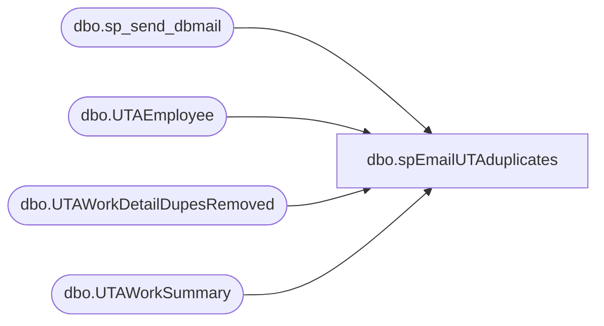

# dbo.spEmailUTAduplicates

**Database:** dw  
**Server:** papamart  

## Architecture Diagram



## Table Dependencies

| Referenced Table |
|---|
| dbo.sp_send_dbmail |
| dbo.UTAEmployee |
| dbo.UTAWorkDetailDupesRemoved |
| dbo.UTAWorkSummary |

## Stored Procedure Code

```sql
CREATE proc [dbo].[spEmailUTAduplicates] 
	
--========================================================================================================================

as

set nocount on

IF (Object_ID('tempdb..#UTAdupes') IS NOT NULL) DROP TABLE #UTAdupes;

declare @count int

---- dupe detail info for email 
select e.Emp_Name, wd.Wrkd_Start_Time, wd.Wrkd_End_Time, wd.Wrkd_Minutes, wd.Wbt_ID, wd.Tcode_ID, convert(varchar(10), wd.Wrkd_Work_Date, 126) as 'Work_Date', wd.Job_ID, wd.Dept_ID
into #UTAdupes
from [dbo].[UTAWorkDetailDupesRemoved] wd
join [dbo].[UTAWorkSummary] ws on wd.Wrks_ID = ws.Wrks_ID
join [dbo].[UTAEmployee] e on ws.Emp_ID = e.Emp_ID
where cast(wd.DupeInsertDate as date) = cast(getdate() as date) 

declare @text nvarchar(max)

select @text = '<font face = arial size = 2> ' +
				'<B>UTA duplicate shifts deleted</B>' + 
				'<BR>' +
				'<BR>' +
				'<table border="1">' +
				'<font face =arial size = 2>' +
				'<tr><th>Emp_Name</th><th>Wrkd_Start_Time</th><th>Wrkd_End_Time</th><th>Wrkd_Minutes</th><th>Wbt_ID</th><th>Tcode_ID</th><th>Work_Date</th><th>Job_ID</th><th>Dept_ID</th><th></tr>'+
					CAST ( ( SELECT td = isnull(Emp_Name, 'NULL'), '',
									td = Wrkd_Start_Time, '',
									td = Wrkd_End_Time, '',
									td = Wrkd_Minutes, '',
									td = Wbt_ID, '',
									td = Tcode_ID, '',
									td = Work_Date, '',
									td = Job_ID, '',
									td = Dept_ID, ''
								from #UTAdupes
								order by 
									Emp_Name
								FOR XML PATH('tr'), TYPE 
					) AS NVARCHAR(MAX) ) +
					'</font></table></font></p></p>
					<br>
					<br>
					<br>'


select @Count = count(*) from #UTAdupes


if @Count > 0

Begin

exec msdb.dbo.sp_send_dbmail
	@profile_name = 'biadmin',
	@recipients = 'biadmin@buildabear.com;heatherv@buildabear.com',
	--@recipients = 'TimC@buildabear.com',
	@body = @text,
	@subject= 'UTA shift duplicates found and removed', 
	@body_format = 'HTML'

	End
```

