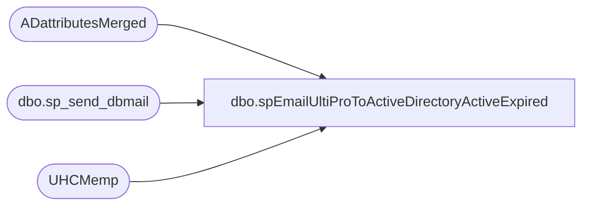

# dbo.spEmailUltiProToActiveDirectoryActiveExpired

**Database:** dw  
**Server:** papamart  

## Architecture Diagram



## Table Dependencies

| Referenced Table |
|---|
| ADattributesMerged |
| dbo.sp_send_dbmail |
| UHCMemp |

## Stored Procedure Code

```sql
CREATE proc [dbo].[spEmailUltiProToActiveDirectoryActiveExpired] 

--========================================================================================================================
--	2023-12-09	Ian Wallace	- Created proc 
--========================================================================================================================

as

set nocount on


IF (Object_ID('tempdb..#ActiveExpired') IS NOT null) DROP TABLE #ActiveExpired;


with 
allStoreAssociates as
(
select GivenName, LastName, EmployeeID, samaccountname, UserPrincipalName, Enabled  from ADattributesMerged where AdsPath like '%OU=SelfServe%' or AdsPath like '%OU=CWMs%'
union
select GivenName, LastName, EmployeeID, samaccountname, UserPrincipalName, Enabled  from ADattributesMerged where AdsPath like '%OU=Disabled%' --and 

),
expirationDates as
(

SELECT EmployeeID, samaccountname ,  UserPrincipalName ,
case when accountExpires   = '9223372036854775807' then NULL 
when  accountExpires   = '0' then null 
else CAST((convert(bigint, accountExpires) / 864000000000.0 - 109207) AS DATETIME) end  as accountExpires  
from  ADattributesMerged 
--where samaccountname in ('test10','ianw','CitrixServices')
)
,
ultiproStatus as
(
select EepEEID, samaccountname, EecEmplStatus, TerminationDate from UHCMemp
)
select  a.GivenName, a.LastName, a.EmployeeID, a.samaccountname, a.UserPrincipalName  , u.EecEmplStatus, cast(e.accountExpires as date) as 'ExpirationDate',
case when a.Enabled = 0 then 'Disabled'
when a.Enabled = '-1' then 'Enabled' 
else 'unknown' end as 'ADaccount_current_state' 
into #ActiveExpired
from allStoreAssociates a
join expirationDates e on a.UserPrincipalName = e.UserPrincipalName  
join ultiproStatus u on a.EmployeeID = u.EepEEID
where u.EecEmplStatus not in ('Terminated','Leave of Absence')
and cast(e.accountExpires as date) is not null
and cast(e.accountExpires as date) <> '2031-01-01'
and (u.TerminationDate is null or cast(u.TerminationDate as date) < cast(getdate() as date))
order by  cast(e.accountExpires as date) asc


if (select count(*) from #ActiveExpired) > 0

begin

declare 
	@text nvarchar(max)

	set @text = 
		'<font face =arial size = 2><B>Ultipro AD - Active users with expiration date</B><br><br></font>' +
			'<table border="1">' +
				'<tr><th><font face =arial size = 2>GivenName</font></th>' +
					'<th><font face =arial size = 2>LastName</font></th>' +
					'<th><font face =arial size = 2>EmployeeID</font></th>' +
					'<th><font face =arial size = 2>samaccountname</font></th>' +
					'<th><font face =arial size = 2>UserPrincipalName</font></th>' + 
					'<th><font face =arial size = 2>EecEmplStatus</font></th>' + 
					'<th><font face =arial size = 2>ExpirationDate</font></th>' +
					'<th><font face =arial size = 2>ADaccount_current_state</font></th></tr>' +
		'<font face =arial size = 2>' +
			CAST ( ( SELECT td = GivenName,'',
							td = LastName, '',
							td = EmployeeID, '',
							td = samaccountname, '',
							td = UserPrincipalName, '',
							td = EecEmplStatus, '',
							td = ExpirationDate, '',
							td = ADaccount_current_state, ''
					  from #ActiveExpired
					  FOR XML PATH('tr'), TYPE 
					) AS NVARCHAR(MAX) ) +
			'</font></table></font></p></p>
			<br>
			<font face =arial size = 1><B>This report was run from papamart.dw.spEmailUltiProToActiveDirectoryActiveExpired.</B></font>
			<br>
			<br>
		<font face =arial size = 1><i>The information in this message may be privileged, “confidential” and protected from disclosure and/or intended only for the addressee(s) named above.  If the reader of this message is not the intended recipient, or an employee or agent responsible for delivering this message to the intended recipient, you are hereby notified that any dissemination, distribution or copying of the communication is strictly prohibited.  If you have received this communication in error, please notify us immediately by replying to the message and deleting it from your computer.  Thank you beary much.</i></font>'

		exec msdb.dbo.sp_send_dbmail
		@profile_name = 'biadmin',
		--@recipients = 'ianw@buildabear.com; heatherv@buildabear.com',
		@recipients = 'ianw@buildabear.com; sarahme@buildabear.com',
		@blind_copy_recipients = 'ianw@buildabear.com',
		@body = @text,
		@subject = 'Ultipro to AD - Active with expiration date',
		@body_format = 'HTML'

		end
```

