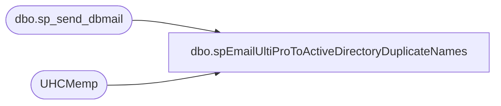

# dbo.spEmailUltiProToActiveDirectoryDuplicateNames

**Database:** dw  
**Server:** papamart  

## Architecture Diagram



## Table Dependencies

| Referenced Table |
|---|
| dbo.sp_send_dbmail |
| UHCMemp |

## Stored Procedure Code

```sql
CREATE proc [dbo].[spEmailUltiProToActiveDirectoryDuplicateNames] 

--========================================================================================================================
--	2023-12-09	Ian Wallace	- Created proc 
--========================================================================================================================

as

set nocount on


IF (Object_ID('tempdb..#dupNames') IS NOT null) DROP TABLE #dupNames;


with
duplicateNames as
(
select cast(isnull(nullif (e.eepNamePreferred, ''), e.EepNameFirst)  + ' ' + e.EepNameLast as Nvarchar) as [Display Name], count(*) as count
from UHCMemp e 
where e.EecEmplStatus <> 'Terminated'
group by cast(isnull(nullif (e.eepNamePreferred, ''), e.EepNameFirst)  + ' ' + e.EepNameLast as Nvarchar)
having count(*) > 1
),
uniqueIdentifiers as
(
select EepEEID, cast(isnull(nullif (e.eepNamePreferred, ''), e.EepNameFirst)  + ' ' + e.EepNameLast as Nvarchar) as [Display Name] 
,EecLocation as Store
,EepNameMiddle
,samaccountname
from UHCMemp e where e.EecEmplStatus <> 'Terminated'
),
combinedResults as
(
select u.*
from duplicateNames d
join uniqueIdentifiers u on d.[Display Name] = u.[Display Name]
--where (samaccountname = '' or samaccountname is null)
--order by d.[Display Name] asc 
), 
missingAD as
(
select * from combinedResults where (samaccountname = '' or samaccountname is null)
)
--select cr.* 
select distinct cr.EepEEID, cr.[Display Name], cr.Store, cr.EepNameMiddle, cr.samaccountname
into #dupNames
from combinedResults cr
join missingAD ma on cr.[Display Name] = ma.[Display Name]


if (select count(*) from #dupNames) > 0

begin

declare 
	@text nvarchar(max)

	set @text = 
		'<font face =arial size = 2><B>Ultipro AD - duplicate full name</B><br><br></font>' +
			'<table border="1">' +
				'<tr><th><font face =arial size = 2>EepEEID</font></th>' +
					'<th><font face =arial size = 2>Display Name</font></th>' +
					'<th><font face =arial size = 2>Store</font></th>' +
					'<th><font face =arial size = 2>EepNameMiddle</font></th>' +
					'<th><font face =arial size = 2>samaccountname</font></th>' + 
		'<font face =arial size = 2>' +
			CAST ( ( SELECT td = EepEEID,'',
							td = [Display Name], '',
							td = Store, '',
							td = EepNameMiddle, '',
							td = samaccountname, ''
					  from #dupNames
					  FOR XML PATH('tr'), TYPE 
					) AS NVARCHAR(MAX) ) +
			'</font></table></font></p></p>
			<br>
			<font face =arial size = 1><B>This report was run from papamart.dw.spEmailUltiProToActiveDirectoryDuplicateNames.</B></font>
			<br>
			<br>
		<font face =arial size = 1><i>The information in this message may be privileged, “confidential” and protected from disclosure and/or intended only for the addressee(s) named above.  If the reader of this message is not the intended recipient, or an employee or agent responsible for delivering this message to the intended recipient, you are hereby notified that any dissemination, distribution or copying of the communication is strictly prohibited.  If you have received this communication in error, please notify us immediately by replying to the message and deleting it from your computer.  Thank you beary much.</i></font>'

		exec msdb.dbo.sp_send_dbmail
		@profile_name = 'biadmin',
		@recipients = 'sarahme@buildabear.com',
		@blind_copy_recipients = 'ianw@buildabear.com',
		@body = @text,
		@subject = 'Ultipro to AD - duplicate full name detected',
		@body_format = 'HTML'

		end
```

