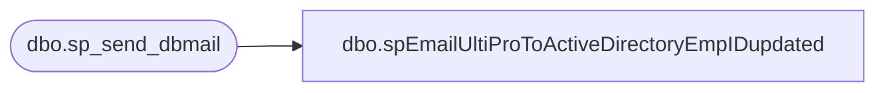

# dbo.spEmailUltiProToActiveDirectoryEmpIDupdated

**Database:** dw  
**Server:** papamart  

## Architecture Diagram



## Table Dependencies

| Referenced Table |
|---|
| dbo.sp_send_dbmail |

## Stored Procedure Code

```sql
CREATE proc [dbo].[spEmailUltiProToActiveDirectoryEmpIDupdated] 
	@EmployeeID nvarchar(7),
	@email nvarchar(50)
	

--========================================================================================================================
--	2020-01-06	Ian Wallace  - Created proc 
--========================================================================================================================

as


set nocount on

declare 
	@subj varchar(52),
	@recip varchar(1000),
	@cc varchar(100),
	@body nvarchar(max)


set @Subj = 'UltiPro employee ID written to Active Directory'
	--@recip = 'heatherv@buildabear.com;dant@buildabear.com;ianw@buildabear.com',
set @recip = 'ianw@buildabear.com'


select @body = 
'<font face =arial size = 2><B>UltiPro to Active Directory Employee ID entered</B><br>' +
'A "named" account in AD has been matched to a new Ultipro record and the corresponding EepEEID will be assigned. <br> ' +
'</font>' +
	'<table border="1">' +
		'<tr><th><font face =arial size = 2>EmployeeID</font></th>' +
			'<th><font face =arial size = 2>Email</font></th>' +
'<font face =arial size = 2>' +
    CAST ( ( SELECT td = @EmployeeID, '',
                    td = @Email, ''
              FOR XML PATH('tr'), TYPE 
    ) AS NVARCHAR(MAX) ) +
    '</font></table></font></p></p>
    <br><br>' +
    '<br>
    <font face =arial size = 1><B>This report was run from SSIS as part of the UltiPro to Active Directory ETL. </B></font>
    <br>
    <br>
<font face =arial size = 1><i>The information in this message may be privileged, “confidential” and protected from disclosure and/or intended only for the addressee(s) named above.  If the reader of this message is not the intended recipient, or an employee or agent responsible for delivering this message to the intended recipient, you are hereby notified that any dissemination, distribution or copying of the communication is strictly prohibited.  If you have received this communication in error, please notify us immediately by replying to the message and deleting it from your computer.  Thank you beary much.</i></font>'


		exec msdb.dbo.sp_send_dbmail
			@profile_name = 'BIAdmin',
			@recipients = @recip,
			@body = @body,
			@subject = @subj,
			@body_format = 'HTML'
```

