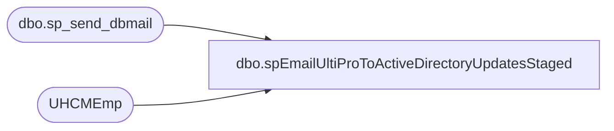

# dbo.spEmailUltiProToActiveDirectoryUpdatesStaged

**Database:** dw  
**Server:** papamart  

## Architecture Diagram



## Table Dependencies

| Referenced Table |
|---|
| dbo.sp_send_dbmail |
| UHCMEmp |

## Stored Procedure Code

```sql
CREATE proc [dbo].[spEmailUltiProToActiveDirectoryUpdatesStaged] 
	@ProvisioningEvent nvarchar(1),
	@EmployeeID nvarchar(7),
	@DisplayName nvarchar(52),
	@Department nvarchar(52),
	@Role nvarchar(52),
	@managerID nvarchar(7)

--========================================================================================================================
--	2019-05-17	Dan Tweedie	- Created proc 
--								Runs with SSIS dataflow, accepting parameters to send email per employee staged for AD
--								exec spEmailUltiProToActiveDirectoryUpdatesStaged 
--									@ProvisioningEvent = ?,
--									@provisionText = ?,
--									@EmployeeID = ?,
--									@DisplayName = ?,
--									@Department = ?,
--									@Role = ?,
--									@managerID = ?
--========================================================================================================================

as


set nocount on

declare 
	@provisionText varchar(20),
	@ManagerName varchar(52),
	@subj varchar(52),
	@recip varchar(1000),
	@cc varchar(100),
	@body nvarchar(max)

	if @managerID is null
	begin
	set @managerID = 0
	set @Subj = 'UltiPro to Active Directory Employee Updates Pending'
	set @recip = 'ianw@buildabear.com'
	set @ProvisionText = case @ProvisioningEvent when 'H' then 'Hire' when 'P' then 'Update Push' when 'C' then 'Change' when 'T' then 'Termination' end
	set @ManagerName = 'no manager defind'
	end

	if @managerID = ''
	begin
	set @managerID = 0
	set @Subj = 'UltiPro to Active Directory Employee Updates Pending'
	set @recip = 'ianw@buildabear.com'
	set @ProvisionText = case @ProvisioningEvent when 'H' then 'Hire' when 'P' then 'Update Push' when 'C' then 'Change' when 'T' then 'Termination' end
	set @ManagerName = 'no manager defined'
	end

	if @managerID is not null and @managerID <> ''
	begin
select 
	@Subj = 'UltiPro to Active Directory Employee Updates Pending',
	@recip = 'ianw@buildabear.com',
	--@recip = 'dant@buildabear.com',
	@ProvisionText = case @ProvisioningEvent when 'H' then 'Hire' when 'P' then 'Update Push' when 'C' then 'Change' when 'T' then 'Termination' end,
	@ManagerName = concat(EepNameFirst, ' ', EepNameLast)
from UHCMEmp 
where @ManagerID = EepEEID
end

select @body = 
'<font face =arial size = 2><B>UltiPro to Active Directory Employee Staged</B><br>' +
'A new Employee Provisioning Event has been staged from UltiPro for Active Directory for a NON Bear Builder. <br> ' +
'</font>' +
	'<table border="1">' +
		'<tr><th><font face =arial size = 2>ProvisioningEvent</font></th>' +
			'<th><font face =arial size = 2>EmployeeID</font></th>' +
			'<th><font face =arial size = 2>DisplayName</font></th>' +
			'<th><font face =arial size = 2>Department</font></th>' +
			'<th><font face =arial size = 2>ProvisioningRole</font></th>' +
			'<th><font face =arial size = 2>ManagerID</font></th>' +
			'<th><font face =arial size = 2>ManagerName</font></th></tr>' +
'<font face =arial size = 2>' +
    CAST ( ( SELECT td = @provisionText,'',
                    td = @EmployeeID, '',
                    td = @DisplayName, '',
                    td = @Department, '',
                    td = @Role, '',
                    td = @managerID, '',
					td = @ManagerName, ''
			  
              FOR XML PATH('tr'), TYPE 
    ) AS NVARCHAR(MAX) ) +
    '</font></table></font></p></p>
    <br><br>' +
    '<br>
    <font face =arial size = 1><B>This report was run from SSIS as part of the UltiPro to Active Directory ETL. </B></font>
    <br>
    <br>
<font face =arial size = 1><i>The information in this message may be privileged, “confidential” and protected from disclosure and/or intended only for the addressee(s) named above.  If the reader of this message is not the intended recipient, or an employee or agent responsible for delivering this message to the intended recipient, you are hereby notified that any dissemination, distribution or copying of the communication is strictly prohibited.  If you have received this communication in error, please notify us immediately by replying to the message and deleting it from your computer.  Thank you beary much.</i></font>'

			if @Role = 'US Chief Workshop Manager' and @provisionText <> 'Termination'
			set @recip = 'dant@buildabear.com;ianw@buildabear.com;'

		exec msdb.dbo.sp_send_dbmail
			@profile_name = 'BIAdmin',
			@recipients = @recip,
			@body = @body,
			@subject = @subj,
			@body_format = 'HTML'
```

