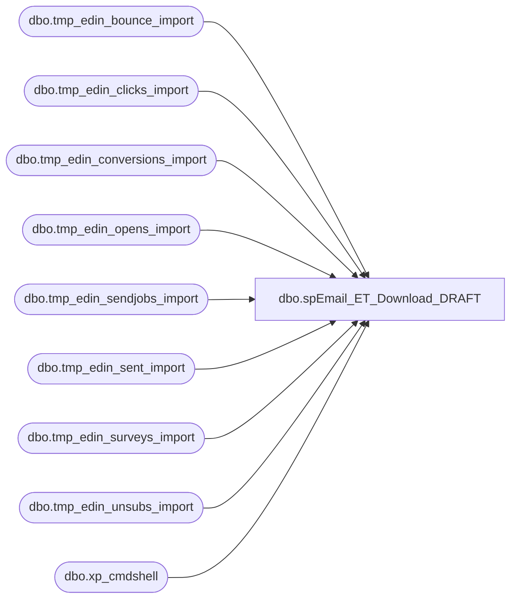

# dbo.spEmail_ET_Download_DRAFT

**Database:** dw  
**Server:** papamart  

## Architecture Diagram



## Table Dependencies

| Referenced Table |
|---|
| dbo.tmp_edin_bounce_import |
| dbo.tmp_edin_clicks_import |
| dbo.tmp_edin_conversions_import |
| dbo.tmp_edin_opens_import |
| dbo.tmp_edin_sendjobs_import |
| dbo.tmp_edin_sent_import |
| dbo.tmp_edin_surveys_import |
| dbo.tmp_edin_unsubs_import |
| dbo.xp_cmdshell |

## Stored Procedure Code

```sql
CREATE proc [dbo].[spEmail_ET_Download_DRAFT]
	@Path VARCHAR(100)
as

declare @filename VARCHAR(1000)
declare @zipfilename VARCHAR(1000)
DECLARE @cmd VARCHAR(800) -- stores the dynamically created DOS command
declare @RowCnt int

IF (Object_ID('tempdb.dbo.#FilesToProcess') IS NOT NULL) DROP TABLE #FilesToProcess
CREATE TABLE #FilesToProcess
(
FilesToProcess VARCHAR(7000)
)

-- Build the command that will list out all of the files in a directory
SELECT @cmd = 'dir ' + @Path + '*.csv /B'

  -- Run the dir command and put the results into a temp table
INSERT INTO #FilesToProcess
EXEC master.dbo.xp_cmdshell @cmd

-- Delete null row
  DELETE
  FROM #FilesToProcess
  WHERE FilesToProcess is null
 
--select * from #FilesToProcess

--BOUNCE files import
IF (Object_ID('dw.dbo.tmp_edin_bounce_import') IS NOT NULL) DROP TABLE tmp_edin_bounce_import
create table dw.dbo.tmp_edin_bounce_import
(
ClientID int,
SendID int,
SubscriberKey int,
EmailAddress varchar(200),
SubscriberID int,
ListID int,
EventDate datetime,
EventType varchar(100),
BounceCategory varchar(200),
SMTPCode varchar(50),
BounceReason varchar(200),
BatchID int,
TriggeredSendExternalKey varchar(200)
)

select top 1 @filename = FilesToProcess
from #FilesToProcess
where FilesToProcess like 'Bounce%.csv'

SET @RowCnt = @@ROWCOUNT
while @RowCnt <> 0
begin
	SELECT @cmd = 'bcp dw.dbo.tmp_edin_bounce_import in "' + @path + @filename + '" -t, -c -F 2 -T'
	--select @cmd
	EXEC master.dbo.xp_cmdshell @cmd, NO_OUTPUT
	
	delete from #FilesToProcess
	where FilesToProcess = @filename
	
	select @cmd = 'del ' + @path + @filename + ' /Q /F'
	--select @cmd
	EXEC master.dbo.xp_cmdshell @cmd, NO_OUTPUT
	
	select top 1 @filename = FilesToProcess
	from #FilesToProcess
	where FilesToProcess like 'Bounce%.csv'
	
	SET @RowCnt = @@ROWCOUNT
end

select * from dw.dbo.tmp_edin_bounce_import


--UNSUBS files import
IF (Object_ID('dw.dbo.tmp_edin_unsubs_import') IS NOT NULL) DROP TABLE dw.dbo.tmp_edin_unsubs_import
create table dw.dbo.tmp_edin_unsubs_import
(
ClientID int,
SendID int,
SubscriberKey int,
EmailAddress varchar(200),
SubscriberID int,
ListID int,
EventDate datetime,
EventType varchar(100),
BatchID int,
TriggeredSendExternalKey varchar(200)
)

select top 1 @filename = FilesToProcess
from #FilesToProcess
where FilesToProcess like 'Unsubs%.csv'

SET @RowCnt = @@ROWCOUNT
while @RowCnt <> 0
begin
	SELECT @cmd = 'bcp dw.dbo.tmp_edin_unsubs_import in "' + @path + @filename + '" -t, -c -F 2 -T'
	--select @cmd
	EXEC master.dbo.xp_cmdshell @cmd, NO_OUTPUT
	
	delete from #FilesToProcess
	where FilesToProcess = @filename
	
	select @cmd = 'del ' + @path + @filename + ' /Q /F'
	--select @cmd
	EXEC master.dbo.xp_cmdshell @cmd, NO_OUTPUT
	
	select top 1 @filename = FilesToProcess
	from #FilesToProcess
	where FilesToProcess like 'Unsubs%.csv'
	
	SET @RowCnt = @@ROWCOUNT
end

select * from dw.dbo.tmp_edin_unsubs_import

--OPENS files import
IF (Object_ID('dw.dbo.tmp_edin_opens_import') IS NOT NULL) DROP TABLE dw.dbo.tmp_edin_opens_import
create table dw.dbo.tmp_edin_opens_import
(
ClientID int,
SendID int,
SubscriberKey int,
EmailAddress varchar(200),
SubscriberID int,
ListID int,
EventDate datetime,
EventType varchar(100),
BatchID int,
TriggeredSendExternalKey varchar(200)
)

select top 1 @filename = FilesToProcess
from #FilesToProcess
where FilesToProcess like 'Opens%.csv'

SET @RowCnt = @@ROWCOUNT
while @RowCnt <> 0
begin
	SELECT @cmd = 'bcp dw.dbo.tmp_edin_opens_import in "' + @path + @filename + '" -t, -c -F 2 -T'
	--select @cmd
	EXEC master.dbo.xp_cmdshell @cmd, NO_OUTPUT
	
	delete from #FilesToProcess
	where FilesToProcess = @filename
	
	select @cmd = 'del ' + @path + @filename + ' /Q /F'
	--select @cmd
	EXEC master.dbo.xp_cmdshell @cmd, NO_OUTPUT
	
	select top 1 @filename = FilesToProcess
	from #FilesToProcess
	where FilesToProcess like 'Opens%.csv'
	
	SET @RowCnt = @@ROWCOUNT
end

select * from dw.dbo.tmp_edin_opens_import

--CLICKS files import
IF (Object_ID('dw.dbo.tmp_edin_clicks_import') IS NOT NULL) DROP TABLE dw.dbo.tmp_edin_clicks_import
create table dw.dbo.tmp_edin_clicks_import
(
ClientID int,
SendID int,
SubscriberKey int,
EmailAddress varchar(200),
SubscriberID int,
ListID int,
EventDate datetime,
EventType varchar(100),
SendURLID int,
URLID int,
URL varchar(4000),
Alias varchar(200),
BatchID int,
TriggeredSendExternalKey varchar(200)
)

select top 1 @filename = FilesToProcess
from #FilesToProcess
where FilesToProcess like 'Clicks%.csv'

SET @RowCnt = @@ROWCOUNT
while @RowCnt <> 0
begin

	SELECT @cmd = 'bcp dw.dbo.tmp_edin_clicks_import in "' + @path + @filename + '" -t, -c -F 2 -T'
	--select @cmd
	EXEC master.dbo.xp_cmdshell @cmd, NO_OUTPUT
	
	delete from #FilesToProcess
	where FilesToProcess = @filename
	
	select @cmd = 'del ' + @path + @filename + ' /Q /F'
	--select @cmd
	EXEC master.dbo.xp_cmdshell @cmd, NO_OUTPUT
	
	select top 1 @filename = FilesToProcess
	from #FilesToProcess
	where FilesToProcess like 'Clicks%.csv'
	
	SET @RowCnt = @@ROWCOUNT
end

select * from dw.dbo.tmp_edin_clicks_import

--SENDJOBS files import
IF (Object_ID('dw.dbo.tmp_edin_sendjobs_import') IS NOT NULL) DROP TABLE dw.dbo.tmp_edin_sendjobs_import
create table dw.dbo.tmp_edin_sendjobs_import
(
ClientID int,
SendID int,
FromName varchar(100),
FromEmail varchar(100),
SchedTime datetime,
SentTime datetime,
[Subject] varchar(100),
EmailName varchar(500),
TriggeredSendExternalKey varchar(200),
SendDefinitionExternalKey varchar(200),
JobStatus varchar(50),
PreviewURL varchar(4000),
IsMultipart varchar(50),
Additional varchar(200)
)

select top 1 @filename = FilesToProcess
from #FilesToProcess
where FilesToProcess like 'SendJobs%.csv'

SET @RowCnt = @@ROWCOUNT
while @RowCnt <> 0
begin

	SELECT @cmd = 'bcp dw.dbo.tmp_edin_sendjobs_import in "' + @path + @filename + '" -t, -c -F 2 -T'
	--select @cmd
	EXEC master.dbo.xp_cmdshell @cmd, NO_OUTPUT
	
	delete from #FilesToProcess
	where FilesToProcess = @filename
	
	select @cmd = 'del ' + @path + @filename + ' /Q /F'
	--select @cmd
	EXEC master.dbo.xp_cmdshell @cmd, NO_OUTPUT
	
	select top 1 @filename = FilesToProcess
	from #FilesToProcess
	where FilesToProcess like 'SendJobs%.csv'
	
	SET @RowCnt = @@ROWCOUNT
end

select * from dw.dbo.tmp_edin_sendjobs_import

--SENT files import
IF (Object_ID('dw.dbo.tmp_edin_sent_import') IS NOT NULL) DROP TABLE dw.dbo.tmp_edin_sent_import
create table dw.dbo.tmp_edin_sent_import
(
ClientID int,
SendID int,
SubscriberKey int,
EmailAddress varchar(200),
SubscriberID int,
ListID int,
EventDate datetime,
EventType varchar(100),
BatchID int,
TriggeredSendExternalKey varchar(200)
)

select top 1 @filename = FilesToProcess
from #FilesToProcess
where FilesToProcess like 'Sent%.csv'

SET @RowCnt = @@ROWCOUNT
while @RowCnt <> 0
begin

	SELECT @cmd = 'bcp dw.dbo.tmp_edin_sent_import in "' + @path + @filename + '" -t, -c -F 2 -T'
	--select @cmd
	EXEC master.dbo.xp_cmdshell @cmd, NO_OUTPUT
	
	delete from #FilesToProcess
	where FilesToProcess = @filename
	
	select @cmd = 'del ' + @path + @filename + ' /Q /F'
	--select @cmd
	EXEC master.dbo.xp_cmdshell @cmd, NO_OUTPUT
	
	select top 1 @filename = FilesToProcess
	from #FilesToProcess
	where FilesToProcess like 'Sent%.csv'
	
	SET @RowCnt = @@ROWCOUNT
end

select * from dw.dbo.tmp_edin_sent_import

--CONVERSIONS files import
IF (Object_ID('dw.dbo.tmp_edin_conversions_import') IS NOT NULL) DROP TABLE dw.dbo.tmp_edin_conversions_import
create table dw.dbo.tmp_edin_conversions_import
(
ClientID int,
SendID int,
SubscriberKey int,
EmailAddress varchar(200),
SubscriberID int,
ListID int,
EventDate datetime,
EventType varchar(100),
ReferringURL varchar(4000),
LinkAlias varchar(200),
ConversionData varchar(200),
BatchID int,
TriggeredSendExternalKey varchar(200),
URLID int
)

select top 1 @filename = FilesToProcess
from #FilesToProcess
where FilesToProcess like 'Conversions%.csv'

SET @RowCnt = @@ROWCOUNT
while @RowCnt <> 0
begin

	SELECT @cmd = 'bcp dw.dbo.tmp_edin_conversions_import in "' + @path + @filename + '" -t, -c -F 2 -T'
	--select @cmd
	EXEC master.dbo.xp_cmdshell @cmd, NO_OUTPUT
	
	delete from #FilesToProcess
	where FilesToProcess = @filename
	
	select @cmd = 'del ' + @path + @filename + ' /Q /F'
	--select @cmd
	EXEC master.dbo.xp_cmdshell @cmd, NO_OUTPUT
	
	select top 1 @filename = FilesToProcess
	from #FilesToProcess
	where FilesToProcess like 'Conversions%.csv'
	
	SET @RowCnt = @@ROWCOUNT
end

select * from dw.dbo.tmp_edin_conversions_import

--SURVEYS files import
IF (Object_ID('dw.dbo.tmp_edin_surveys_import') IS NOT NULL) DROP TABLE dw.dbo.tmp_edin_surveys_import
create table dw.dbo.tmp_edin_surveys_import
(
ClientID int,
SendID int,
SubscriberKey int,
EmailAddress varchar(200),
SubscriberID int,
ListID int,
EventDate datetime,
EventType varchar(100),
Question varchar(2000),
Answer varchar(2000),
BatchID int,
TriggeredSendExternalKey varchar(200),
URLID int
)

select top 1 @filename = FilesToProcess
from #FilesToProcess
where FilesToProcess like 'Surveys%.csv'

SET @RowCnt = @@ROWCOUNT
while @RowCnt <> 0
begin

	SELECT @cmd = 'bcp dw.dbo.tmp_edin_surveys_import in "' + @path + @filename + '" -t, -c -F 2 -T'
	--select @cmd
	EXEC master.dbo.xp_cmdshell @cmd, NO_OUTPUT
	
	delete from #FilesToProcess
	where FilesToProcess = @filename
	
	select @cmd = 'del ' + @path + @filename + ' /Q /F'
	--select @cmd
	EXEC master.dbo.xp_cmdshell @cmd, NO_OUTPUT
	
	select top 1 @filename = FilesToProcess
	from #FilesToProcess
	where FilesToProcess like 'Surveys%.csv'
	
	SET @RowCnt = @@ROWCOUNT
end

select * from dw.dbo.tmp_edin_surveys_import
```

