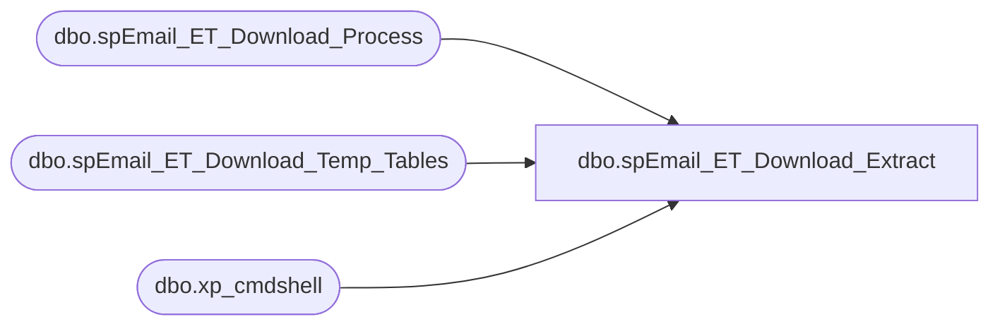

# dbo.spEmail_ET_Download_Extract

**Database:** dw  
**Server:** papamart  

## Architecture Diagram



## Table Dependencies

| Referenced Table |
|---|
| dbo.spEmail_ET_Download_Process |
| dbo.spEmail_ET_Download_Temp_Tables |
| dbo.xp_cmdshell |

## Stored Procedure Code

```sql
CREATE proc [dbo].[spEmail_ET_Download_Extract]
as

declare @Path VARCHAR(100)
--declare @filename VARCHAR(1000)
declare @zipfilename VARCHAR(50)
DECLARE @cmd VARCHAR(800) -- stores the dynamically created DOS command
declare @RowCnt int

--select @path = '\\papamart\responsys\ExactTarget\Download\'

select @path = '\\kermode\FileRepository\Responsys\ExactTarget\Download\'

--create temp tables
exec dw.dbo.spEmail_ET_Download_Temp_Tables

IF (Object_ID('tempdb.dbo.#FilesToExtract') IS NOT NULL) DROP TABLE #FilesToExtract
CREATE TABLE #FilesToExtract
(
FilesToExtract VARCHAR(7000)
)

-- Build the command that will list out all of the files in a directory
SELECT @cmd = 'dir ' + @Path + 'BABW_Tracking_*.zip /B'

  -- Run the dir command and put the results into a temp table
INSERT INTO #FilesToExtract
EXEC master.dbo.xp_cmdshell @cmd

-- Delete null row
  DELETE
  FROM #FilesToExtract
  WHERE FilesToExtract is null

SELECT TOP 1 @zipfilename = FilesToExtract
  FROM #FilesToExtract
  
SET @RowCnt = @@ROWCOUNT
WHILE @RowCnt <> 0
begin
	
	-- extract command
	--SELECT @cmd = 'c:\"Program Files"\7-zip\7z.exe x ' + @path + @zipfilename + ' -o\\papamart\Responsys\ExactTarget\Download -aou'
	SELECT @cmd = 'c:\"Program Files"\7-zip\7z.exe x ' + @path + @zipfilename + ' -o\\kermode\FileRepository\Responsys\ExactTarget\Download -aou'
	EXEC master.dbo.xp_cmdshell @cmd, NO_OUTPUT
	
	--process extracted files
	exec dw.dbo.spEmail_ET_Download_Process @path, @zipfilename
	
	--move zip file to archive folder
	select @cmd = 'move ' + @path + @zipfilename + ' \\kermode\FileRepository\Responsys\ExactTarget\Download\Archive'
	--select @cmd
	EXEC master.dbo.xp_cmdshell @cmd, NO_OUTPUT
   
	--delete processed file from temp table
	DELETE
	FROM #FilesToExtract
	where FilesToExtract = @zipfilename
   
	--grab next filename to process
	SELECT TOP 1 @zipfilename = FilesToExtract
	FROM #FilesToExtract
	
	SET @RowCnt = @@ROWCOUNT
end

/*
select * from dw.dbo.tmp_edin_bounce_import
select * from dw.dbo.tmp_edin_unsubs_import
select * from dw.dbo.tmp_edin_opens_import
select * from dw.dbo.tmp_edin_clicks_import
select * from dw.dbo.tmp_edin_sendjobs_import
select * from dw.dbo.tmp_edin_sent_import
select * from dw.dbo.tmp_edin_conversions_import
select * from dw.dbo.tmp_edin_surveys_import

select * from kodiak.ESPStaging.dbo.ET_Bounce
select * from kodiak.ESPStaging.dbo.ET_Unsubs
select * from kodiak.ESPStaging.dbo.ET_Clicks
select * from kodiak.ESPStaging.dbo.ET_Conversions
select * from kodiak.ESPStaging.dbo.ET_Opens
select * from kodiak.ESPStaging.dbo.ET_SendJobs
select * from kodiak.ESPStaging.dbo.ET_Sent
select * from kodiak.ESPStaging.dbo.ET_Surveys
*/
dbo,spHPGbyItemSingle,-- =============================================
-- Author:		Morgan
-- Create date: 
-- Description:	BO report query
-- name		date			change
-- garyd	20081111		comment out index
-- =============================================

--EXEC spHPGbyItemSingle '11/15/2004', '11/16/2004', 7067
CREATE  PROCEDURE [dbo].[spHPGbyItemSingle]
	/* ===== ARGUMENTS ===== */
	@BeginDate 	datetime, 
	@EndDate 	datetime,
	@iItem	INT

AS

set nocount on

-- this report is designed to pull summarize all the transactions that contain
-- a desired sku.  That sku should be a skin because we then remove any transactions
-- where there are more than one skin on the purchase.
--
-- the goal is to see what is selling with a recently released skin so that we can
-- get its HPG.  We do not want to include purchases of 2 or more skins because it will
-- skew the HPG.

declare @product_key int

set @product_key = (select product_key from product_dim where sku = @iItem)

IF (Object_ID('tempdb..#date_keys') IS NOT NULL) DROP TABLE #date_keys
select d.date_key,
	d.actual_date,
	d.fiscal_week,
	d.fiscal_period,
	d.fiscal_year
into #date_keys
from dbo.date_dim d 
where actual_date BETWEEN @BeginDate AND @EndDate

-- pull all the transactions with our desired sku
IF (Object_ID('tempdb..#trans') IS NOT NULL) DROP TABLE #trans
select distinct t.transaction_id, t.store_key, d.date_key, d.fiscal_period, d.fiscal_year, tsf.Net_Sale, tsf.GAAP_Sale
into #trans
from transaction_detail_facts t  (nolock) 
	join #date_keys d
	on d.date_key = t.date_key
	join transaction_summary_facts tsf
	on tsf.transaction_id = t.transaction_id
	and tsf.store_key = t.store_key
	and tsf.date_key = t.date_key
where t.product_key = @product_key
	and t.transaction_line_seq >=0 

-- of the transactions we just pulled, figure out which ones only have one skin
IF (Object_ID('tempdb.dbo.#tmpItemCoSell_Single') IS NOT NULL) DROP TABLE dbo.#tmpItemCoSell_Single
select  t.transaction_id,
	s.store_id, 
	d.fiscal_period, d.fiscal_year, 
	d.Net_Sale, d.GAAP_Sale
into dbo.#tmpItemCoSell_Single
from #trans d
	join transaction_detail_facts t 
	on t.transaction_id = d.transaction_id
	and t.store_key = d.store_key
	and t.date_key = d.date_key
	join dbo.product_dim p 
	on p.product_key = t.product_key 
	join store_dim s
	on s.store_key = t.store_key
where p.department in ('dolls')  --('dolls')
	or p.ScorecardCategory IN ('Animal', 'Sports', 'Licensing')
group by t.transaction_id,
	s.store_id, d.fiscal_period, d.fiscal_year, d.Net_Sale, d.GAAP_Sale
having sum(t.units) = 1

--summarize what we found
select 	store_id,
	fiscal_period,
	fiscal_year,
	count(transaction_id) as ttlTrans,
	sum(isnull(GAAP_Sale,0)) as ttlGAAPSale,
	sum(isnull(Net_Sale,0)) as ttlCashSale	
from #tmpItemCoSell_Single
group by fiscal_year,
	 fiscal_period,
	 store_id
--order by fiscal_year, fiscal_period, store_id

set nocount off
```

