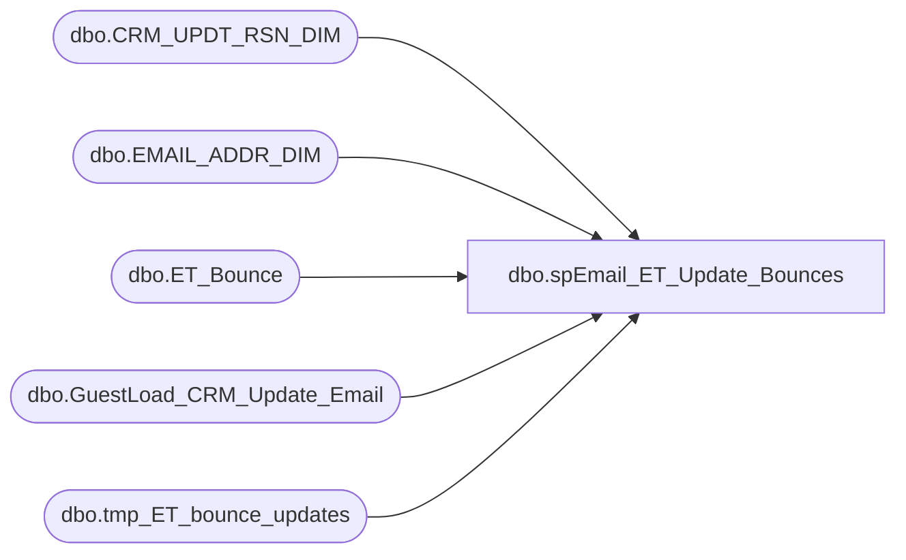

# dbo.spEmail_ET_Update_Bounces

**Database:** dw  
**Server:** papamart  

## Architecture Diagram



## Table Dependencies

| Referenced Table |
|---|
| dbo.CRM_UPDT_RSN_DIM |
| dbo.EMAIL_ADDR_DIM |
| dbo.ET_Bounce |
| dbo.GuestLoad_CRM_Update_Email |
| dbo.tmp_ET_bounce_updates |

## Stored Procedure Code

```sql
CREATE PROC [dbo].[spEmail_ET_Update_Bounces]
-- =============================================================================================================
-- Name: [dbo].[spEmail_ET_Update_Bounces]
--
-- Description:	updates e-mail status on email_addr_dim from ESP 
--
-- Revision History
--		Name:			Date:			Comments:
--		EdinP			4/15/2014		created from spEmail_Update_ESPStatusV6
--
-- =============================================================================================================
AS 
	
SET nocount ON

declare @logid int
DECLARE @crm_updt_rsn_id int

select @logid = -5 --using this value for Exact Target changes
SET @crm_updt_rsn_id = (SELECT crm_updt_rsn_id FROM dw.dbo.CRM_UPDT_RSN_DIM WHERE crm_updt_rsn_cd = 'email_status_updt')

/*
select * from dbo.ET_Bounce

select bouncecategory,  count(*) from dbo.ET_Bounce
group by bouncecategory

--Bounce types and counts
Block bounce	488347
Hard bounce	173116
Soft bounce	12034
Technical/Other bounce	274688
Unknown bounce	373435

Soft Bounce: A soft bounce may be one of the most common bounce types and occurs when the email server rejects the email due to a seemingly temporary condition, such as a full inbox. When that happens, the application will retry sending the email to the subscriber eight more times over 72 hours. 
 
Hard Bounce: A hard bounce occurs when the email server rejects the email due to permanent conditions (this typically results when "user unknown" or "domain not found" errors occur). When this happens, a variety of scenarios can play out. See the Hard Bounce documentation for more information. 
 
Block Bounce: A block bounce occurs when the email server rejects the email due to filter issues, such as URL blocks, lack of proper authentication, or the domain or IP address is found on a blacklist utilized by the receiving domain. A subscriber who receives a block bounce will be re-tried in the next email send.
 
Technical Bounce: A technical bounce occurs when the email server rejects the email due to technical errors, such as a data format or network error. When a subscriber experiences a technical bounce they will be re-tried in the next email send.

From: http://www.exacttarget.com/blog/why-did-my-email-bounce/
*/

--grab email_ids needing updating
IF (Object_ID('dw.dbo.tmp_ET_bounce_updates') IS NOT NULL) DROP TABLE tmp_ET_bounce_updates
select
	emailaddress,
	upper(eventtype) as eventtype,
	min(eventdate) as eventdate,
	min(load_id) as load_id
into dw.dbo.tmp_ET_bounce_updates
from kodiak.espstaging.dbo.ET_Bounce
where processdate is null
	and bouncecategory = 'Hard bounce'
group by
	emailaddress,
	upper(eventtype)

UPDATE dw.dbo.[EMAIL_ADDR_DIM]
SET [EMAIL_STAT_CD] = e.eventtype,
	email_stat_dt = e.eventdate,
	[UPDT_DT] = GETDATE(),
	[ETL_LOG_ID] = @logid,
	[ETL_EVNT_ID] = e.load_id
from dw.dbo.tmp_ET_bounce_updates e
	join dw.dbo.email_addr_dim ead on e.emailaddress = ead.email_addr_txt
--where e.eventtype <> ead.EMAIL_STAT_CD

--INSERT INTO EMAIL CHANGE TABLE
INSERT dw.dbo.GuestLoad_CRM_Update_Email
SELECT NULL, ead.email_addr_id, @crm_updt_rsn_id, NULL, email_addr_txt, email_addr_txt,
NULL, 'VALID', ead.EMAIL_STAT_CD, NULL, NULL, NULL, NULL, NULL, NULL, NULL,
NULL, NULL, NULL, GETDATE(), @logid
FROM dw.dbo.tmp_ET_bounce_updates e
	join dw.dbo.email_addr_dim ead on e.emailaddress = ead.email_addr_txt
	
update kodiak.espstaging.dbo.ET_Bounce
set processdate = getdate()
from dw.dbo.tmp_ET_bounce_updates d
	join kodiak.espstaging.dbo.ET_Bounce e on d.emailaddress = e.emailaddress
where e.processdate is null

--select * from dw.dbo.GuestLoad_CRM_Update_Email
--select * from kodiak.espstaging.dbo.ET_Bounce
```

