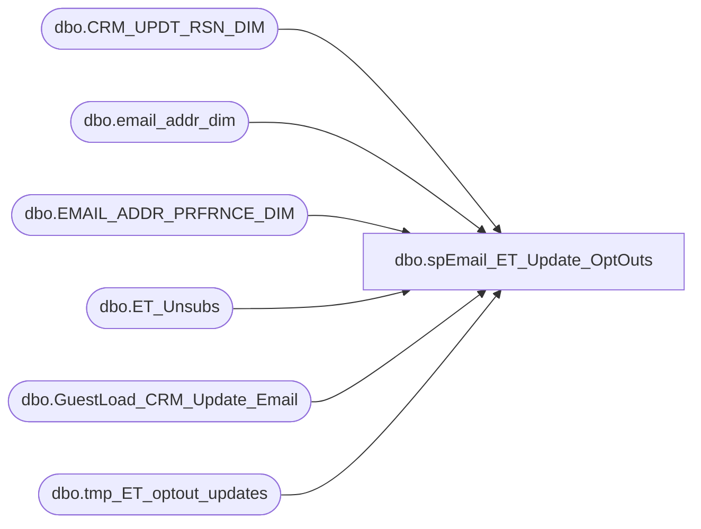

# dbo.spEmail_ET_Update_OptOuts

**Database:** dw  
**Server:** papamart  

## Architecture Diagram



## Table Dependencies

| Referenced Table |
|---|
| dbo.CRM_UPDT_RSN_DIM |
| dbo.email_addr_dim |
| dbo.EMAIL_ADDR_PRFRNCE_DIM |
| dbo.ET_Unsubs |
| dbo.GuestLoad_CRM_Update_Email |
| dbo.tmp_ET_optout_updates |

## Stored Procedure Code

```sql
CREATE PROC [dbo].[spEmail_ET_Update_OptOuts]
-- =============================================================================================================
-- Name: [dbo].[spEmail_ET_Update_OptOuts]
--
-- Description:	updates e-mail opt-outs in email_addr_dim from ESP
--
-- Revision History
--		Name:			Date:			Comments:
--		EdinP			4/15/2014		created from spEmail_Update_ESPPrfrnceV6
--
-- =============================================================================================================
AS 

SET nocount ON

declare @logid int
DECLARE @crm_updt_rsn_id int

select @logid = -5 --using this value for Exact Target changes
set @crm_updt_rsn_id = (SELECT crm_updt_rsn_id FROM dw.dbo.CRM_UPDT_RSN_DIM WHERE crm_updt_rsn_cd = 'email_optout_updt')

--grab email_ids needing updating
IF (Object_ID('dw.dbo.tmp_ET_optout_updates') IS NOT NULL) DROP TABLE tmp_ET_optout_updates
select
	emailaddress,
	min(eventdate) as eventdate,
	min(load_id) as load_id
into dw.dbo.tmp_ET_optout_updates
from kodiak.espstaging.dbo.ET_Unsubs
where processdate is null
group by
	emailaddress
	
--select * from kodiak.espstaging.dbo.ET_Unsubs

--select * from dw.dbo.EMAIL_ADDR_PRFRNCE_DIM

--UPDATE PREFERENCES
UPDATE dw.dbo.[EMAIL_ADDR_PRFRNCE_DIM]
SET
	updt_src_sys_cd = 'ESP',
	promo_pref = 'N',
	PROMO_UPDT_DT = e.eventdate,
	--SFSPNTS_PREF = 'N',
	--SFSPNTS_UPDT_DT = e.eventdate,
	[UPDT_DT] = GETDATE(),
	etl_log_id = @logid, 
	[ETL_EVNT_ID] = e.load_id
FROM dw.dbo.EMAIL_ADDR_PRFRNCE_DIM p
	join dw.dbo.email_addr_dim ead on ead.email_addr_id = p.email_addr_id
	join dw.dbo.tmp_ET_optout_updates e ON ead.email_addr_txt = e.emailaddress

		--UPDATE CHANGE TABLE
	INSERT dw.dbo.GuestLoad_CRM_Update_Email
		(CLNSD_GST_ID, 
		EMAIL_ADDR_ID, 
		CRM_UPDT_RSN_ID, 
		CRM_GST_NBR, 
		EMAIL_ADDR_TXT_OLD, 
		EMAIL_ADDR_TXT_NEW, 
		CLEANSABLE, 
		EMAIL_STAT_CD_OLD, 
		EMAIL_STAT_CD_NEW, 
		PROMO_PREF_OLD, 
		PROMO_PREF_NEW, 
		SFSCERT_PREF_OLD, 
		SFSCERT_PREF_NEW, 
		SFSPNTS_PREF_OLD, 
		SFSPNTS_PREF_NEW, 
		BATCH_ID, 
		PROCESS_DT, 
		EMAIL_SENT_DT, 
		UPDT_CONFIRMED_DT, 
		INS_DT, 
		ETL_LOG_ID)
	SELECT 
		NULL, 
		ead.email_addr_id, 
		@crm_updt_rsn_id, 
		NULL, 
		e.emailaddress, 
		e.emailaddress,
		NULL, 
		NULL, 
		NULL, 
		NULL, 
		'N', 
		NULL, 
		NULL, 
		NULL, 
		'N',
		NULL, 
		NULL, 
		NULL, 
		NULL, 
		GETDATE(), 
		@logid
	FROM dw.dbo.email_addr_dim ead
		join dw.dbo.tmp_ET_optout_updates e ON ead.email_addr_txt = e.emailaddress
				
update kodiak.espstaging.dbo.ET_Unsubs
set processdate = getdate()
from dw.dbo.tmp_ET_optout_updates d
	join kodiak.espstaging.dbo.ET_Unsubs e on d.emailaddress = e.emailaddress
where e.processdate is null
```

