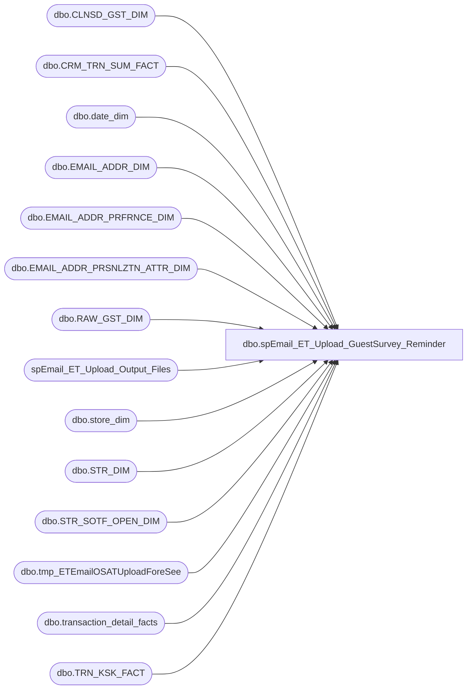

# dbo.spEmail_ET_Upload_GuestSurvey_Reminder

**Database:** dw  
**Server:** papamart  

## Architecture Diagram



## Table Dependencies

| Referenced Table |
|---|
| dbo.CLNSD_GST_DIM |
| dbo.CRM_TRN_SUM_FACT |
| dbo.date_dim |
| dbo.EMAIL_ADDR_DIM |
| dbo.EMAIL_ADDR_PRFRNCE_DIM |
| dbo.EMAIL_ADDR_PRSNLZTN_ATTR_DIM |
| dbo.RAW_GST_DIM |
| spEmail_ET_Upload_Output_Files |
| dbo.store_dim |
| dbo.STR_DIM |
| dbo.STR_SOTF_OPEN_DIM |
| dbo.tmp_ETEmailOSATUploadForeSee |
| dbo.transaction_detail_facts |
| dbo.TRN_KSK_FACT |

## Stored Procedure Code

```sql
CREATE PROC [dbo].[spEmail_ET_Upload_GuestSurvey_Reminder]
    @ad_date DATETIME = NULL
AS
-- =============================================================================================================
-- Name: [dbo].[spEmail_ET_Upload_GuestSurvey_Reminder]
--
-- Description:	selects data to build OSAT survey link and sends to Exact Target via SFTP text file
--				This will send out a link for each transaction/registration, but ET should only send one e-mail.
--				In addition, these links won't match the links on the receipt, but the chance of duplication isn't very high
--
-- Input:	N/A
--
-- Output: N/A
--
-- Dependencies: 
/*
URL LINK:
http://www.surveyURL.com

***
RECEIPT CODE DEFINITION 
9999-999999-9999-999999
Digits 1 - 4 =		store number with leading 0s
Digits 5 - 10 =		transaction number
Digits 11 - 12		00
Digits 13 - 14 =	NonSOTF (01) or SOTF (02)
Digits 15 - 16 =	day (1 - 31)
Digits 17 - 18 =	register (02 - 05)
Digits 19 - 20 =	month (01 - 12)

RECEIPT ID INCLUDES THE MMDDYYYY at the beginning of the receipt code
*/
--
-- Revision History
--		Name:			Date:			Comments:
--		Edin Pehilj		3/29/2014		created
--		Mike Pelikan	04/29/2014		Changed BABWMSTRDATA linked server reference
--		Mike Pelikan	10/23/2014		changed name of procedure

--
/*
declare @indate datetime
set @indate = dateadd(day, -3, getdate())
exec spEmail_ET_Upload_OSATSurveyForesee @ad_date = @indate
*/
-- =============================================================================================================

	SET NOCOUNT ON

	IF @ad_date IS NULL
		SET @ad_date = convert(VARCHAR, dateadd(DAY, -1, getdate()), 101)

	--CREATE STORE LIST
SELECT store_id
	INTO #tmpstore
FROM dw.dbo.store_dim 
WHERE --bearritory IN ('mid atlantic','upper midwest','UK - The North')AND 
store_id NOT IN (13,2013) AND bearritory NOT IN ('US Corporate','US-Corporate', 'Canada Corporate',
'Canada Pool Points','Corporate UK','Ridemakerz' ) AND
opening_date <= GETDATE() AND (closing_date >= GETDATE() OR closing_date IS NULL)


	--GRAB UPDATED SALES DATA	
	SELECT DISTINCT e.email_addr_id
				  , g.clnsd_gst_id
				  , [transaction_no]
				  , s.store_id
				  , bearritory
				  , actual_date
				  , [register_num]
	INTO #tmptransemails
	FROM
		dw.dbo.[CRM_TRN_SUM_FACT] crm WITH (NOLOCK)
		INNER JOIN dw.dbo.[transaction_detail_facts] tdf WITH (NOLOCK)
			ON [TDF_TRN_ID] = [transaction_id]
		INNER JOIN dw.dbo.[CLNSD_GST_DIM] g WITH (NOLOCK)
			ON crm.[CLNSD_GST_ID] = g.[CLNSD_GST_ID]
		INNER JOIN dw.dbo.[EMAIL_ADDR_DIM] e WITH (NOLOCK)
			ON g.[EMAIL_ADDR_ID] = e.[EMAIL_ADDR_ID]
		INNER JOIN dw.dbo.EMAIL_ADDR_PRFRNCE_DIM ep WITH (NOLOCK)
			ON e.EMAIL_ADDR_ID = ep.EMAIL_ADDR_ID
		INNER JOIN dw.dbo.store_dim s
			ON crm.str_id = s.store_key
		INNER JOIN dw.dbo.date_dim d
			ON tdf.date_key = d.date_key
		INNER JOIN #tmpstore ts ON ts.store_id = s.store_id
	WHERE
		actual_date >= @ad_date
		AND e.email_addr_id > 0
		AND rtrim(ltrim(email_stat_cd)) = 'valid'
		AND promo_pref = 'y'
		--and e.email_addr_txt not like '%@buildabear.co%' -- should cover @buildabear.com and @buildabear.co.uk
		--AND store_id NOT IN (269, 270, 279)
		--AND (store_id BETWEEN 1 AND 350
		--OR store_id BETWEEN 600 AND 700
		--OR store_id BETWEEN 2000 AND 2100)
--testing filter
  		--and e.EMAIL_ADDR_ID in (select email_addr_id from dbo.tmp_TestCases)
--testing filter	

ALTER TABLE #tmptransemails ADD sotf CHAR(2)

--UPDATE SOTF FLAG
UPDATE #tmptransemails SET sotf = '02'
WHERE store_id IN (SELECT str_num FROM KODIAK.BABWMstrData.dbo.STR_DIM sd INNER JOIN KODIAK.BABWMstrData.dbo.STR_SOTF_OPEN_DIM sotf ON sd.STR_ID = sotf.STR_KEY)

UPDATE #tmptransemails SET sotf = '01'
WHERE sotf IS NULL

/*
select e.EMAIL_ADDR_TXT, * 
from #tmpemails t 
join dbo.EMAIL_ADDR_DIM e with (nolock)
on (t.EMAIL_ADDR_ID = e.EMAIL_ADDR_ID)
return
*/
	--RETRIEVE ALL DATA FOR SALES TRANSACTIONS
	SELECT base.*
	INTO
		#tmpfinal
	FROM
		(
		 SELECT e.email_addr_id AS email_id
			  , c.clnsd_gst_id as guest_id
			  , e.email_addr_txt AS email_address
			  , [FRST_NM] AS first_name
			  , [LAST_NM] AS last_name
			  , actual_date AS visit_date
			  , isnull(s.store_id, 0) AS store_no
			  , store_name AS store_name
			  , t.bearritory
			  , country
			  , isnull(c.gndr_cd, 'U') AS gender
			  , convert(VARCHAR(10), c.[BRTH_DT], 121) AS birth_date
			  , c.[LYLTY_GST_NBR] AS sfs_number
			  ,
		replicate('0', 2 - len(datepart (m, actual_date))) + cast(datepart (m, actual_date) AS VARCHAR)  
		+ replicate('0', 2 - len(datepart (D, actual_date))) + cast(datepart (D, actual_date) AS VARCHAR) 
		+ replicate('0', 4 - len(datepart (YYYY, actual_date))) + cast(datepart (YYYY, actual_date) AS VARCHAR) 
		+ replicate('0', 4 - len(t.store_id)) + CAST(t.store_id AS VARCHAR) --store
		+ replicate('0', 6 - len(transaction_no)) + CAST(transaction_no AS VARCHAR) --transaction_no
		--+ replicate('0', 2 - len(datepart (s, GETDATE()))) + cast(datepart (s, GETDATE()) AS VARCHAR) --seconds from current time
		+ '00'
		+ sotf --SOTF Flag
		+ replicate('0', 2 - len(datepart (D, actual_date))) + cast(datepart (D, actual_date) AS VARCHAR) --day from transaction date
		+ replicate('0', 2 - len(register_num)) + cast(register_num AS VARCHAR) --register_no
		+ replicate('0', 2 - len(datepart (m, actual_date))) + cast(datepart (m, actual_date) AS VARCHAR) --month from transaction date
			  AS receiptid,
		replicate('0', 4 - len(t.store_id)) + CAST(t.store_id AS VARCHAR) --store
		+ replicate('0', 6 - len(transaction_no)) + CAST(transaction_no AS VARCHAR) --transaction_no
		--+ replicate('0', 2 - len(datepart (s, GETDATE()))) + cast(datepart (s, GETDATE()) AS VARCHAR) --seconds from current time
		+ '00'
		+ sotf --SOTF Flag
		+ replicate('0', 2 - len(datepart (D, actual_date))) + cast(datepart (D, actual_date) AS VARCHAR) --day from transaction date
		+ replicate('0', 2 - len(register_num)) + cast(register_num AS VARCHAR) --register_no
		+ replicate('0', 2 - len(datepart (m, actual_date))) + cast(datepart (m, actual_date) AS VARCHAR) --month from transaction date
		AS receiptcode
		 FROM
			 dw.dbo.[EMAIL_ADDR_DIM] e WITH (NOLOCK)
			 INNER JOIN #tmptransemails t
				 ON e.[EMAIL_ADDR_ID] = t.email_addr_id
			 INNER JOIN dw.dbo.EMAIL_ADDR_PRFRNCE_DIM ep WITH (NOLOCK)
				 ON e.EMAIL_ADDR_ID = ep.EMAIL_ADDR_ID
			 INNER JOIN dw.dbo.[CLNSD_GST_DIM] c WITH (NOLOCK)
				 ON e.[EMAIL_ADDR_ID] = c.[EMAIL_ADDR_ID] AND c.clnsd_gst_id = t.clnsd_gst_id
			 INNER JOIN dw.dbo.store_dim s WITH (NOLOCK)
				 ON t.store_id = s.store_id
		 WHERE
			 PROMO_PREF = 'Y'
			 AND EMAIL_STAT_CD = 'VALID') base

--ADD EMAILS FROM REGISTRATIONS THAT DON'T ALREADY EXIST IN THE LIST FROM A SALES TRANSACTION
--REGISTRATIONS WILL NOT HAVE A RECEIPTCODE OR RECEIPT ID SENT IN THE EMAIL
	SELECT DISTINCT e.email_addr_id as email_id
				  , NULL AS guest_id
				  , e.email_addr_txt
				  , email_FRST_NM
				  , email_LAST_NM
				  , actual_date
				  , s.store_id
				  , store_name
				  , bearritory
				  , country
				  , 'U' AS gender
				  , convert(VARCHAR(10), [email_BRTH_DT], 121) AS email_brth_dt
				  , NULL AS sfsnumber
	INTO
		#tmpregemails
	FROM
		dw.dbo.[TRN_KSK_FACT] tkf WITH (NOLOCK)
		INNER JOIN dw.dbo.store_dim s ON tkf.str_id = s.store_key
		INNER JOIN #tmpstore ts ON ts.store_id = s.store_id
		INNER JOIN dw.dbo.date_dim d ON tkf.dt_id = d.date_key
		INNER JOIN dw.dbo.RAW_GST_DIM r WITH (NOLOCK) ON tkf.RAW_GST_ID = r.RAW_GST_ID
		INNER JOIN dw.dbo.[EMAIL_ADDR_DIM] e WITH (NOLOCK) ON r.DRVD_EMAIL_ADDR_TXT = e.EMAIL_ADDR_TXT
		INNER JOIN dw.dbo.EMAIL_ADDR_PRFRNCE_DIM ep WITH (NOLOCK) ON e.EMAIL_ADDR_ID = ep.EMAIL_ADDR_ID
		INNER JOIN dw.dbo.EMAIL_ADDR_PRSNLZTN_ATTR_DIM p WITH (NOLOCK) ON e.email_addr_id = p.email_addr_id
	WHERE
		actual_date >= @ad_date
		AND e.email_addr_id > 0
		AND rtrim(ltrim(email_stat_cd)) = 'valid'
		AND promo_pref = 'y'
		--and e.email_addr_txt not like '%@buildabear.co%' -- should cover @buildabear.com and @buildabear.co.uk
		--AND store_id NOT IN (269, 270, 279)
		--AND (store_id BETWEEN 1 AND 350
		--OR store_id BETWEEN 600 AND 700
		--OR store_id BETWEEN 2000 AND 2100)
--testing filter
  		--and e.EMAIL_ADDR_ID in (select email_addr_id from dbo.tmp_TestCases)
--testing filter		

INSERT #tmpfinal
SELECT DISTINCT email_id, -1, email_addr_txt, email_frst_nm, email_last_nm, actual_date, store_id, 
	store_name, bearritory, country, gender, email_brth_dt, NULL, NULL, NULL
FROM #tmpregemails
	WHERE email_addr_txt NOT IN (SELECT email_address FROM #tmpfinal)


--FIND VISIT COUNT AND LAST VISIT DATE FOR SFS MEMBERS
	ALTER TABLE #tmpfinal ADD visitcount VARCHAR(20)
	ALTER TABLE #tmpfinal ADD lastvisitdate DATETIME

	SELECT a.sfs_number
		 , str_id
		 , actual_date
		 , count(*) AS visit
	INTO
		#tmpsfstotal
	FROM
		#tmpfinal a
		INNER JOIN dw.dbo.crm_trn_sum_fact f WITH (NOLOCK)
			ON a.sfs_number = f.lylty_gst_nbr
		INNER JOIN dw.dbo.date_dim dd WITH (NOLOCK)
			ON dd.date_key = f.dt_id
	WHERE
		actual_date < @ad_date
	GROUP BY
		a.sfs_number
	  , str_id
	  , actual_date

	SELECT sfs_number
		 , max(actual_date) AS lastvisitdate
		 , count(*) AS visit
	INTO
		#tmpsfsrecfreq
	FROM
		#tmpsfstotal
	GROUP BY
		sfs_number

	UPDATE #tmpfinal
	SET
		visitcount = visit
	  , lastvisitdate = f.lastvisitdate
	FROM
		#tmpsfsrecfreq f
		INNER JOIN #tmpfinal a
			ON f.sfs_number = a.sfs_number

	--DELETE RECORDS WITH @buildabear.com DOMAIN
	DELETE #tmpfinal
	WHERE
		email_address LIKE '%@buildabear.co%' -- should cover @buildabear.com and @buildabear.co.uk

	--SAVE EVERYTHING TO PHYSICAL TABLE
	IF (object_id('dw.dbo.tmp_ETEmailOSATUploadForeSee') IS NOT NULL)
		DROP TABLE dw.dbo.tmp_ETEmailOSATUploadForeSee
	SELECT email_id
		 , LOWER(email_address) AS 'email_address'
		 , first_name
		 , last_name
		 , visit_date
		 , store_no
		 , store_name
		 , country
		 , gender
		 , birth_date
		 , sfs_number
		 , receiptid
		 , receiptcode
		 
		 , CASE
					WHEN country IN ('US','USA') AND receiptcode IS NOT NULL
						THEN 'http://www.BABWCares.com?type=email&cpp[country]=US&receiptid=' + receiptcode
					--	THEN 'https://survey.foreseeresults.com/store/controller?id=74709179&type=email&flow=PRE&receiptid=' + receiptcode
					WHEN country IN ('CA','CAN') AND receiptcode IS NOT NULL
						THEN 'http://www.BABWCares.com?type=email&cpp[country]=CA&receiptid=' + receiptcode
					WHEN country IN ('GBR','UK') AND receiptcode IS NOT NULL 
						THEN 'http://www.BABWCares.co.uk?type=email&cpp[country]=UK&receiptid=' + receiptcode
					--	THEN 'https://survey.foreseeresults.com/store/controller?id=74709179&locale=en_GB&type=email&receiptid=' + receiptcode
					WHEN country IN ('US','USA') AND receiptcode IS NULL
						THEN 'http://www.BABWCares.com?cpp[sstype]=ar&cpp[country]=US'
					--	THEN 'https://survey.foreseeresults.com/bab?type=receipt&cpp[sstype]=ar'
					WHEN country IN ('CA','CAN') AND receiptcode IS NULL
						THEN 'http://www.BABWCares.com?cpp[sstype]=ar&cpp[country]=CA'
					WHEN country IN ('GBR','UK') AND receiptcode IS NULL
						THEN 'http://www.BABWCares.co.uk?cpp[sstype]=ar&cpp[country]=UK'
					--	THEN 'https://survey.foreseeresults.com/bab.uk?type=receipt&cpp[sstype]=ar'

				   
			   ELSE ''
		   END AS dest_link
		 , visitcount
		 , lastvisitdate
	INTO
		dw.dbo.tmp_ETEmailOSATUploadForeSee
	FROM
		(
		 SELECT max(email_id) AS email_id
			  , email_address
			  , max(first_name) AS first_name
			  , max(last_name) AS last_name
			  , max(visit_date) AS visit_date
			  , min(store_no) AS store_no
			  , min(store_name) AS store_name
			  , max(country) AS country
			  , min(gender) AS gender
			  , max(birth_date) AS birth_date
			  , max(sfs_number) AS sfs_number
			  , min(receiptid) AS receiptid
			  , min(receiptcode) AS receiptcode
			  , max(visitcount) AS visitcount
			  , max(lastvisitdate) AS lastvisitdate
		 FROM
			 #tmpfinal
		 GROUP BY
			 email_address) e

--NA Survey
IF (object_id('dw.dbo.tmp_ETEmailOSATUploadForeSee_NA') IS NOT NULL)
		DROP TABLE dw.dbo.tmp_ETEmailOSATUploadForeSee_NA
SELECT *
into dw.dbo.tmp_ETEmailOSATUploadForeSee_NA
FROM dw.dbo.tmp_ETEmailOSATUploadForeSee WHERE country IN ('US','USA', 'CAN','CA')

--UK Survey
IF (object_id('dw.dbo.tmp_ETEmailOSATUploadForeSee_UK') IS NOT NULL)
		DROP TABLE dw.dbo.tmp_ETEmailOSATUploadForeSee_UK
SELECT *
into dw.dbo.tmp_ETEmailOSATUploadForeSee_UK
FROM dw.dbo.tmp_ETEmailOSATUploadForeSee WHERE country IN ('UK','GBR')


/* For TESTING ONLY - change email addresses to fake ones so real guests do not get emails*/
--update v
--set v.email_address = t.FakeEmailAddrTxt
--from dw.dbo.tmp_EmailOSATUploadV6 v join dbo.tmp_TestCases t on (v.customer_id = t.email_addr_id)
/* For TESTING ONLY - change email addresses to fake ones so real guests do not get emails*/

			

--SELECT t.FakeEmailAddrTxt, v.* 
--FROM dw.dbo.tmp_EmailOSATUploadV6 v 
-- join dbo.tmp_TestCases t 
-- on (v.customer_id = t.email_addr_id)
--return	
--select * from dw.dbo.tmp_EmailOSATUploadV6 return

--NA file output
exec spEmail_ET_Upload_Output_Files @path = '\\kermode\FileRepository\Responsys\ExactTarget\', @filepart = 'BABW_SURVEY_NA_', @tablename = 'tmp_ETEmailOSATUploadForeSee_NA'

--UK file output
exec spEmail_ET_Upload_Output_Files @path = '\\kermode\FileRepository\Responsys\ExactTarget\', @filepart = 'BABW_SURVEY_UK_', @tablename = 'tmp_ETEmailOSATUploadForeSee_UK'

	
/*	
	DECLARE @cmd             VARCHAR(1000),
            @filename        VARCHAR(100),
            @filename_header VARCHAR(100),
            @path            VARCHAR(200),
            @filedate        VARCHAR(20),
            @selectstmnt     VARCHAR(5000),
            @bcpsql          VARCHAR(500),
            @columnheaders   VARCHAR(4000),
            @tablename       VARCHAR(128)

	--CREATE TABLE CONTAINING COLUMN HEADERS FOR FILE EXPORT
	SET @columnheaders = ''
	SET @tablename = 'tmp_EmailOSATUploadForeSee'

	SELECT @columnheaders = @columnheaders + c.name + '| '
	FROM
		syscolumns c
		INNER JOIN sysobjects o
			ON o.id = c.id
	WHERE
		o.name = @tablename
	ORDER BY
		colid

	SELECT @columnheaders = substring(@columnheaders, 1, datalength(@columnheaders) - 2)

	IF (object_id('dw.dbo.tmp_EmailOSATUploadForeSee_Header') IS NOT NULL)
		DROP TABLE dw.dbo.tmp_EmailOSATUploadForeSee_Header

	SELECT @columnheaders AS columnheader
	INTO
		dw.dbo.tmp_EmailOSATUploadForeSee_Header

	SET @path = 'I:\Responsys\Upload\V6\'

	--US/CA FILE
	SET @filedate = convert(VARCHAR(20), getdate(), 112)
	SET @filename = 'BABW_OSATLINKFORESEE_NA_' + @filedate + '.txt'
	SET @filename_header = 'BABW_OSATLINKFORESEE_HEADER.txt'

	--CREATE FILE CONTAINING EMAILS USING BCP COMMAND
	SET @selectstmnt = 'SELECT * FROM dw.dbo.tmp_EmailOSATUploadForeSee WHERE country IN (''US'',''USA'', ''CAN'',''CA'')'
	SET @bcpsql = 'bcp "' + @selectstmnt + '" queryout "' + @path + @filename + '.data" -t "|" -T -c'
	EXEC master..xp_cmdshell @bcpsql --, no_output

	SET @selectstmnt = 'SELECT * FROM dw.dbo.tmp_EmailOSATUploadForeSee_header'
	SET @bcpsql = 'bcp "' + @selectstmnt + '" queryout "' + @path + @filename_header + '" -t "|" -T -c'
	EXEC master..xp_cmdshell @bcpsql --, no_output

	SET @cmd = 'copy ' + @path + @filename_header + '+' + @path + @filename + '.data ' + @path + @filename
	EXEC master..xp_cmdshell @cmd, no_output

	--COMPRESS FILE
	SELECT @cmd = '"C:\Program Files\7-zip\7z.exe" a -tzip ' + @path + replace(@filename, '.txt', '') + '.zip ' + @path + @filename
	EXEC master..xp_cmdshell @cmd --, no_output

	--UK FILE
	SET @filedate = convert(VARCHAR(20), getdate(), 112)
	SET @filename = 'BABW_OSATLINKFORESEE_UK_' + @filedate + '.txt'
	SET @filename_header = 'BABW_OSATLINKFORESEE_HEADER.txt'

	--CREATE FILE CONTAINING EMAILS USING BCP COMMAND
	SET @selectstmnt = 'SELECT * FROM dw.dbo.tmp_EmailOSATUploadForeSee WHERE country IN (''UK'',''GBR'')'
	SET @bcpsql = 'bcp "' + @selectstmnt + '" queryout "' + @path + @filename + '.data" -t "|" -T -c'
	EXEC master..xp_cmdshell @bcpsql --, no_output

	SET @selectstmnt = 'SELECT * FROM dw.dbo.tmp_EmailOSATUploadForeSee_header'
	SET @bcpsql = 'bcp "' + @selectstmnt + '" queryout "' + @path + @filename_header + '" -t "|" -T -c'
	EXEC master..xp_cmdshell @bcpsql --, no_output

	SET @cmd = 'copy ' + @path + @filename_header + '+' + @path + @filename + '.data ' + @path + @filename
	EXEC master..xp_cmdshell @cmd, no_output

	--COMPRESS FILE
	SELECT @cmd = '"C:\Program Files\7-zip\7z.exe" a -tzip ' + @path + replace(@filename, '.txt', '') + '.zip ' + @path + @filename
	EXEC master..xp_cmdshell @cmd --, no_output


	--DELETE TEXT FILE
	SELECT @cmd = 'del ' + @path + '*.txt /Q /F'
	EXEC master..xp_cmdshell @cmd, no_output

	SELECT @cmd = 'del ' + @path + '*.data /Q /F'
	EXEC master..xp_cmdshell @cmd, no_output
*/
```

