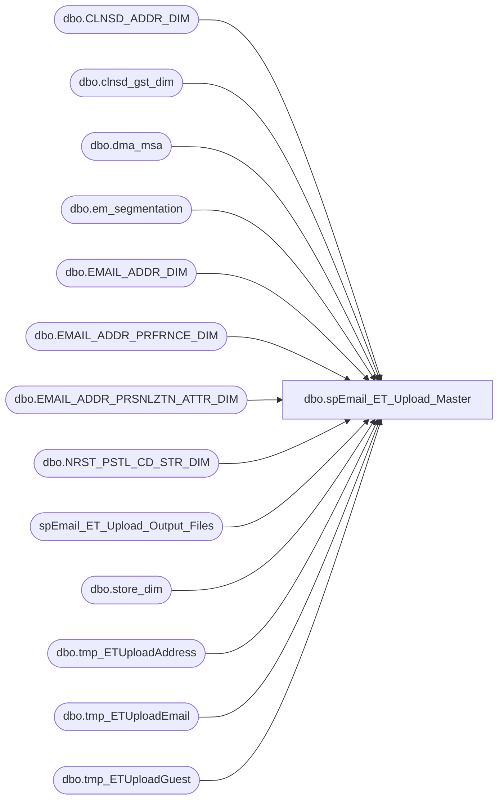

# dbo.spEmail_ET_Upload_Master

**Database:** dw  
**Server:** papamart  

## Architecture Diagram



## Table Dependencies

| Referenced Table |
|---|
| dbo.CLNSD_ADDR_DIM |
| dbo.clnsd_gst_dim |
| dbo.dma_msa |
| dbo.em_segmentation |
| dbo.EMAIL_ADDR_DIM |
| dbo.EMAIL_ADDR_PRFRNCE_DIM |
| dbo.EMAIL_ADDR_PRSNLZTN_ATTR_DIM |
| dbo.NRST_PSTL_CD_STR_DIM |
| spEmail_ET_Upload_Output_Files |
| dbo.store_dim |
| dbo.tmp_ETUploadAddress |
| dbo.tmp_ETUploadEmail |
| dbo.tmp_ETUploadGuest |

## Stored Procedure Code

```sql
--DROP PROC [dbo].[spEmail_ET_Upload_Master_DRAFT]
--GO

CREATE PROC [dbo].[spEmail_ET_Upload_Master]
-- =============================================================================================================
-- Name: [dbo].[spEmail_ET_Upload_Master]
--
-- Description:	selects data and sends to ESP via FTP text file
--
-- Input:	@ad_date	datetime		grabs records updated since this date
--			@reload		bit				if 1, reload all records
--
-- Output: N/A
--
-- Dependencies: 
--
-- Revision History
--		Name:			Date:			Comments:
--		Edin Pehilj		03/20/2014		created
--		Anthony Delgado	01/21/2016		Added indexes to improve performance with large loads

/*
DECLARE @date datetime
SET @date = CONVERT(VARCHAR, DATEADD(DAY, -1, GETDATE()), 101)
Exec spEmail_ET_Upload_Master @ad_date = @date,  @reload = 1

--daily job
DECLARE @date datetime
SET @date = CONVERT(VARCHAR, DATEADD(DAY, -3, GETDATE()), 101)
Exec spEmail_ET_Upload_Master @ad_date = @date,  @reload = 0
--WARNING: remove references to crmtest when moving to prod

*/
-- =============================================================================================================
@ad_date datetime=NULL,
@reload bit=0
AS 
    SET NOCOUNT ON

IF @ad_date IS NULL
	SET @ad_date = CONVERT(VARCHAR, DATEADD(DAY, -3, GETDATE()), 101)

/*
--for testing
declare @ad_date datetime
declare @reload bit

select @ad_date = CONVERT(VARCHAR, DATEADD(DAY, -3, GETDATE()), 101)
select @reload = 0
*/

IF (Object_ID('tempdb.dbo.#tmpemailids') IS NOT NULL) DROP TABLE #tmpemailids
CREATE TABLE #tmpemailids
(
	email_addr_id int
)

--Exclude bad emails
IF (Object_ID('tempdb.dbo.#tmp_ExcludeEmails') IS NOT NULL) DROP TABLE #tmp_ExcludeEmails
SELECT EMAIL_ADDR_ID
INTO #tmp_ExcludeEmails
FROM dbo.EMAIL_ADDR_DIM e WITH (NOLOCK)
WHERE e.email_addr_txt LIKE '%BABWTEST.com%'
--12029
    
CREATE INDEX IX_tmp_ExcludeEmails_emailaddrid
ON #tmp_ExcludeEmails (email_addr_id);

IF @reload = 0
BEGIN
--GRAB ALL UPDATED EMAIL IDS
	
	INSERT #tmpemailids
    --updated email data
    SELECT DISTINCT email_addr_id
    FROM    dw.dbo.[EMAIL_ADDR_DIM] WITH ( NOLOCK )
    WHERE  [UPDT_DT] >= @ad_date
	--and EMAIL_ADDR_ID in (select email_addr_id from dbo.tmp_TestCases)
	AND EMAIL_ADDR_ID NOT IN (SELECT email_addr_id FROM #tmp_ExcludeEmails)
    
    UNION
    --new email data
    SELECT DISTINCT email_addr_id
    FROM    dw.dbo.[EMAIL_ADDR_DIM] WITH ( NOLOCK )
    WHERE  [INS_DT] >= @ad_date
	--and EMAIL_ADDR_ID in (select email_addr_id from dbo.tmp_TestCases)
    AND EMAIL_ADDR_ID NOT IN (SELECT email_addr_id FROM #tmp_ExcludeEmails)
    
    UNION
    --GRAB E-MAILS WERE PERSONALIZATION DATA HAS CHANGED
    SELECT DISTINCT e.email_addr_id
    FROM    dw.dbo.[EMAIL_ADDR_PRSNLZTN_ATTR_DIM] p WITH ( NOLOCK )
		INNER JOIN dw.dbo.email_addr_dim e WITH (NOLOCK) ON e.email_addr_id = p.email_addr_id
    WHERE  (p.[UPDT_DT] >= @ad_date 
		AND RTRIM(LTRIM(email_stat_cd)) = 'VALID')
		--or (p.ins_dt >= @ad_date AND RTRIM(LTRIM(email_stat_cd)) = 'VALID') --we want to send recent changes even if the email is no longer valid to allow for status code changes such as bounce or don't mail.  But those are caught by the first query.
    --and e.EMAIL_ADDR_ID in (select email_addr_id from dbo.tmp_TestCases)
    AND e.EMAIL_ADDR_ID NOT IN (SELECT email_addr_id FROM #tmp_ExcludeEmails)
    
    --GRAB E-MAILS THAT HAVE CHANGED STATUS
    UNION 
    
    SELECT DISTINCT e.email_addr_id
    FROM    dw.dbo.[EMAIL_ADDR_DIM] e WITH ( NOLOCK )
    		INNER JOIN dw.dbo.EMAIL_ADDR_PRFRNCE_DIM ep WITH (NOLOCK) ON e.EMAIL_ADDR_ID = ep.EMAIL_ADDR_ID
    WHERE
		(ep.[UPDT_DT] >= @ad_date 
		AND RTRIM(LTRIM(email_stat_cd)) = 'VALID')
		--or (ep.[ins_DT] >= @ad_date AND RTRIM(LTRIM(email_stat_cd)) = 'VALID')
		--and e.EMAIL_ADDR_ID in (select email_addr_id from dbo.tmp_TestCases)
		AND e.EMAIL_ADDR_ID NOT IN (SELECT email_addr_id FROM #tmp_ExcludeEmails)

/*
	declare @min_id int
	
    select @min_id = min(tkf_id) from [TRN_KSK_FACT]
    where ins_dt >= @ad_date

   --GRAB NEW REGISTRATION DATA
    INSERT #tmpemailids
    SELECT DISTINCT
            e.email_addr_id
    FROM    dw.dbo.[TRN_KSK_FACT] tkf WITH (NOLOCK)
		INNER JOIN dw.dbo.[TKF_CLNSD_GST_BRDG] b WITH (NOLOCK) ON tkf.[TKF_ID] = b.[TKF_ID]
		INNER JOIN dw.dbo.[CLNSD_GST_DIM] g WITH (NOLOCK) ON b.[CLNSD_GST_ID] = g.[CLNSD_GST_ID]
		INNER JOIN dw.dbo.[EMAIL_ADDR_DIM] e WITH (NOLOCK) ON g.[EMAIL_ADDR_ID] = e.[EMAIL_ADDR_ID]
		INNER JOIN dw.dbo.EMAIL_ADDR_PRFRNCE_DIM ep WITH (NOLOCK) ON e.EMAIL_ADDR_ID = ep.EMAIL_ADDR_ID
    --WHERE  tkf.[INS_DT] >= @ad_date AND e.email_addr_id > 0 AND RTRIM(LTRIM(email_stat_cd)) = 'VALID' 
    WHERE  tkf.tkf_id >= @min_id AND e.email_addr_id > 0 AND RTRIM(LTRIM(email_stat_cd)) = 'VALID' 
		AND (ep.promo_pref = 'Y' OR ep.sfspnts_pref = 'Y' OR ep.sfscert_pref = 'Y')
		AND e.EMAIL_ADDR_ID NOT IN (SELECT email_addr_id FROM #tmpemailids)
	--and e.EMAIL_ADDR_ID in (select email_addr_id from dbo.tmp_TestCases)
    AND e.EMAIL_ADDR_ID NOT IN (SELECT email_addr_id FROM #tmp_ExcludeEmails)
	
	--GRAB UPDATED SALES DATA	
	INSERT #tmpemailids
    SELECT DISTINCT
            e.email_addr_id
    FROM    dw.dbo.[CRM_TRN_SUM_FACT] crm WITH (NOLOCK)
		INNER JOIN dw.dbo.[CLNSD_GST_DIM] g WITH (NOLOCK) ON crm.[CLNSD_GST_ID] = g.[CLNSD_GST_ID]
		INNER JOIN dw.dbo.[EMAIL_ADDR_DIM] e WITH (NOLOCK) ON g.[EMAIL_ADDR_ID] = e.[EMAIL_ADDR_ID]
		INNER JOIN dw.dbo.EMAIL_ADDR_PRFRNCE_DIM ep WITH (NOLOCK) ON e.EMAIL_ADDR_ID = ep.EMAIL_ADDR_ID
    WHERE  crm.[INS_DT] >= @ad_date AND e.email_addr_id > 0 AND RTRIM(LTRIM(email_stat_cd)) = 'VALID' 
		AND (ep.promo_pref = 'Y' OR ep.sfspnts_pref = 'Y' OR ep.sfscert_pref = 'Y')
		AND e.EMAIL_ADDR_ID NOT IN (SELECT email_addr_id FROM #tmpemailids)
--and e.EMAIL_ADDR_ID in (select email_addr_id from dbo.tmp_TestCases)
    AND e.EMAIL_ADDR_ID NOT IN (SELECT email_addr_id FROM #tmp_ExcludeEmails)

	--get changes to mobile data
	INSERT #tmpemailids
    SELECT DISTINCT
			e.email_addr_id
    FROM    dw.dbo.[EMAIL_ADDR_DIM] e WITH ( NOLOCK )
            INNER JOIN dw.dbo.[CLNSD_GST_DIM] c WITH ( NOLOCK ) ON e.[EMAIL_ADDR_ID] = c.[EMAIL_ADDR_ID] 
			INNER JOIN dw.dbo.MOBILE_TXT_DIM m WITH (NOLOCK) ON (c.MOBILE_TXT_ID = m.MOBILE_TXT_ID)
			--INNER JOIN dw.dbo.EMAIL_ADDR_PRFRNCE_DIM ep WITH (NOLOCK) ON e.EMAIL_ADDR_ID = ep.EMAIL_ADDR_ID
	WHERE m.UPDT_DT	>= @ad_date 
		AND e.email_addr_id > 0 
		--AND RTRIM(LTRIM(e.email_stat_cd)) = 'VALID' --send up all changes to mobile no matter the status
		--AND (ep.promo_pref = 'Y' OR ep.sfspnts_pref = 'Y' OR ep.sfscert_pref = 'Y')
		AND e.EMAIL_ADDR_ID NOT IN (SELECT email_addr_id FROM #tmpemailids)
--and e.EMAIL_ADDR_ID in (select email_addr_id from dbo.tmp_TestCases)
		AND e.EMAIL_ADDR_ID NOT IN (SELECT email_addr_id FROM #tmp_ExcludeEmails)
*/
/*	
	--one time run on 8/1/2013 to add email_addr_id for guest's whose email_country field needs to change due to new country code logic
	insert #tmpemailids
	select distinct
		email_addr_id
	from tmp_edin_country_code_change_raw_cc_derived
	where email_country <> email_country_derived
*/

END
ELSE ---start of full load section
BEGIN
	INSERT #tmpemailids
	SELECT DISTINCT e.email_addr_id
		--select top 1000 e.email_addr_id
    FROM    dw.dbo.[EMAIL_ADDR_DIM] e WITH ( NOLOCK )
		INNER JOIN dw.dbo.EMAIL_ADDR_PRFRNCE_DIM ep WITH (NOLOCK) ON e.EMAIL_ADDR_ID = ep.EMAIL_ADDR_ID
    WHERE  RTRIM(LTRIM(email_stat_cd)) = 'VALID' 
    		--AND (ep.promo_pref = 'Y' OR ep.sfspnts_pref = 'Y' OR ep.sfscert_pref = 'Y')
    		AND ep.promo_pref = 'Y' -- OR ep.sfspnts_pref = 'Y' OR ep.sfscert_pref = 'Y')
    		AND e.EMAIL_ADDR_ID NOT IN (SELECT email_addr_id FROM #tmp_ExcludeEmails)
--testing filter
  		--and e.EMAIL_ADDR_ID in (select email_addr_id from dbo.tmp_TestCases)
--testing filter
--count all 21,824,982
--count promo_pref = 'Y' 7,430,671

END

CREATE INDEX IX_tmpemailids_emailaddrid
    ON #tmpemailids (email_addr_id); 

--Remove Duplicates
IF (Object_ID('tempdb.dbo.#tmpsfsemails') IS NOT NULL) DROP TABLE #tmpsfsemails
SELECT distinct e.email_addr_id
INTO #tmpsfsemails
FROM #tmpemailids e
	
CREATE INDEX IX_tmpsfsemails_emailaddrid
    ON #tmpsfsemails (email_addr_id); 

--select * from #tmpsfsemails return

/*
--Test Data
IF (Object_ID('tempdb.dbo.#tmpsfsemails') IS NOT NULL) DROP TABLE #tmpsfsemails
SELECT 
	--DISTINCT top 100000 e.email_addr_id
	distinct e.email_addr_id
into #tmpsfsemails
    FROM    dw.dbo.[EMAIL_ADDR_DIM] e WITH ( NOLOCK )
		INNER JOIN dw.dbo.EMAIL_ADDR_PRFRNCE_DIM ep WITH (NOLOCK) ON e.EMAIL_ADDR_ID = ep.EMAIL_ADDR_ID
    WHERE  RTRIM(LTRIM(email_stat_cd)) = 'VALID' 
    		--AND (ep.promo_pref = 'Y' OR ep.sfspnts_pref = 'Y' OR ep.sfscert_pref = 'Y')
    		AND ep.promo_pref = 'Y'
    		AND e.EMAIL_ADDR_ID NOT IN (SELECT email_addr_id FROM #tmp_ExcludeEmails)
*/

--grab email data
IF (Object_ID('tempdb.dbo.#tmp_edin_email_data') IS NOT NULL) DROP TABLE #tmp_edin_email_data
select distinct
	ead.email_addr_id as email_id,
	lower(ead.email_addr_txt) as email_address,
	ead.email_stat_cd as email_channel_status,
	--COALESCE(cad.CNTRY_ABBRV,eap.cntry_abbrv,'USA') as email_country,
	eap.cntry_abbrv as email_country,
	convert(varchar(10), ead.ins_dt, 121) as email_acq_dt,
	ep.promo_pref as promo_preference,
	ep.sfscert_pref as sfscert_preference,
	ep.sfspnts_pref as sfsacct_preference,
	isnull(es.tier,0) as email_seg_tier
into #tmp_edin_email_data
from dw.dbo.email_addr_dim ead
	join #tmpsfsemails e on e.email_addr_id = ead.email_addr_id
	join dw.dbo.EMAIL_ADDR_PRFRNCE_DIM ep ON ead.EMAIL_ADDR_ID = ep.EMAIL_ADDR_ID
	left join dw.dbo.EMAIL_ADDR_PRSNLZTN_ATTR_DIM eap on eap.email_addr_id =ead.email_addr_id
	left join queries.dbo.em_segmentation es on es.email_addr_id = ead.email_addr_id
	--left join dw.dbo.clnsd_gst_dim c on ead.[EMAIL_ADDR_ID] = c.[EMAIL_ADDR_ID]
	--left join dw.dbo.CLNSD_ADDR_DIM cad on cad.clnsd_addr_id = c.clnsd_addr_id and c.clnsd_addr_id <> -1
	
--select * from #tmp_edin_email_data

IF (Object_ID('tempdb.dbo.#tmp_edin_email_data_missing_country') IS NOT NULL) DROP TABLE #tmp_edin_email_data_missing_country
select email_id
into #tmp_edin_email_data_missing_country
from #tmp_edin_email_data
where email_country is null

IF (Object_ID('tempdb.dbo.#tmp_edin_email_data_missing_country_data') IS NOT NULL) DROP TABLE #tmp_edin_email_data_missing_country_data
select
	e.email_id,
	isnull(cad.CNTRY_ABBRV,'USA') as email_country
into #tmp_edin_email_data_missing_country_data
from #tmp_edin_email_data_missing_country e
	left join dw.dbo.clnsd_gst_dim c on e.[EMAIL_ID] = c.[EMAIL_ADDR_ID]
	left join dw.dbo.CLNSD_ADDR_DIM cad on cad.clnsd_addr_id = c.clnsd_addr_id
	
update #tmp_edin_email_data
set email_country = mc.email_country
from #tmp_edin_email_data e
	join #tmp_edin_email_data_missing_country_data mc on e.email_id = mc.email_id

--delete new, not opted-in accounts ... will leave old emails whose promo_pref changes in the system
delete from #tmp_edin_email_data
where promo_preference <> 'Y'
	and email_acq_dt >= convert(varchar(10), @ad_date, 121)

--delete not valid accounts
delete from #tmp_edin_email_data
where email_channel_status not in ('VALID','BOUNCE')


/*
--research country discrepancy
select * from clnsd_addr_dim
select * from clnsd_gst_dim
select * from EMAIL_ADDR_PRSNLZTN_ATTR_DIM

select pad.cntry_abbrv as email_county, cad.cntry_abbrv as address_country
from clnsd_gst_dim cgd
	join clnsd_addr_dim cad on cad.clnsd_addr_id = cgd.clnsd_addr_id
	join email_addr_dim ead on cgd.email_addr_id = ead.email_addr_id
	join email_addr_prsnlztn_attr_dim pad on pad.email_addr_id = ead.email_addr_id
where pad.cntry_abbrv is null
	and cad.cntry_abbrv is not null
	--and pad.cntry_abbrv <> cad.cntry_abbrv

COALESCE(cad.CNTRY_ABBRV,eap.cntry_abbrv,'USA') as email_country,
*/

/*
--check for duplicates
select * from #tmp_edin_raw_data
where email_id in 
(
select email_id from #tmp_edin_raw_data
group by email_id
having count(*) <> 1
)
*/

IF (Object_ID('tempdb.dbo.#tmpguestids') IS NOT NULL) DROP TABLE #tmpguestids
CREATE TABLE #tmpguestids
(
	clnsd_gst_id int,
	email_addr_id int
)


--clnsd_gst_id's that need updating
insert into #tmpguestids
select distinct cgd.clnsd_gst_id, e.email_id
from dw.dbo.clnsd_gst_dim cgd
	join #tmp_edin_email_data e on e.email_id = cgd.email_addr_id
union
select distinct cgd.clnsd_gst_id, cgd.email_addr_id
from dw.dbo.clnsd_gst_dim cgd
	left join #tmp_edin_email_data e on e.email_id = cgd.email_addr_id
where cgd.updt_dt >= @ad_date
	and cgd.email_addr_id <> -1
--107462

--Guest data
IF (Object_ID('tempdb.dbo.#tmp_edin_guest_data') IS NOT NULL) DROP TABLE #tmp_edin_guest_data
select
	cgd.clnsd_gst_id as guest_id,
	e.email_addr_id as email_id,
	cgd.clnsd_addr_id as address_id,
	cgd.lylty_gst_nbr as lylty_nbr,
	CONVERT(varchar(10), cgd.CRM_MBRSHP_DT, 121) as lylty_date,
	cgd.frst_nm as first_name,
	cgd.last_nm as last_name,
	ISNULL(cgd.gndr_cd, 'U') AS gender,
	convert(varchar(10),cgd.brth_dt,121) as birhtday_date
into #tmp_edin_guest_data
from dw.dbo.clnsd_gst_dim cgd
	--join #tmpsfsemails e on e.email_addr_id = cgd.email_addr_id
	join #tmpguestids e on e.clnsd_gst_id = cgd.clnsd_gst_id
--11623

CREATE INDEX IX_tmp_edin_guest_data_address_id
    ON #tmp_edin_guest_data (address_id); 

--select * from #tmp_edin_guest_data

IF (Object_ID('tempdb.dbo.#tmp_edin_address_ids') IS NOT NULL) DROP TABLE #tmp_edin_address_ids
CREATE TABLE #tmp_edin_address_ids
(
	address_id int
)

insert into #tmp_edin_address_ids
select distinct address_id
from #tmp_edin_guest_data
where address_id > 0 --avoid -1 address
union
select distinct clnsd_addr_id
from dw.dbo.CLNSD_ADDR_DIM cad
	left join #tmp_edin_guest_data e on e.address_id = cad.clnsd_addr_id
where cad.updt_dt >= @ad_date
	and cad.clnsd_addr_id > 0
	and e.address_id is null	

IF (Object_ID('tempdb.dbo.#tmp_edin_address_data') IS NOT NULL) DROP TABLE #tmp_edin_address_data
select 
	e.address_id,
	cad.addr_ln_1_txt as address_1,
	cad.cty_nm as city,
	cad.cnty_nm as county,
	cad.st_prvnc_abbrv as [state],
	cad.pstl_cd as postal_code,
	cad.cntry_abbrv as postal_country,
	isnull(s.store_id,0) as nearest_store_no,
	REPLACE(d.dma_nm,',','') AS DMA,
    REPLACE(d.msa_nm,',','') AS MSA
into #tmp_edin_address_data
from #tmp_edin_address_ids e
	join dw.dbo.CLNSD_ADDR_DIM cad on e.address_id = cad.clnsd_addr_id
    LEFT JOIN dw.dbo.[NRST_PSTL_CD_STR_DIM] n WITH ( NOLOCK ) ON cad.nrst_str_pstl_cd = n.pstl_cd AND cad.[CNTRY_ABBRV] = n.[CNTRY_ABBRV]
    LEFT JOIN dw.dbo.store_dim s WITH ( NOLOCK ) ON s.store_key = n.str_id
    left join dw.dbo.dma_msa d on cad.cntry_abbrv = d.cntry_abbrv and cad.pstl_cd = d.pstl_cd

--select * from #tmp_edin_address_data

--Email Output
if (Object_ID('dw.dbo.tmp_ETUploadEmail') IS NOT NULL) DROP TABLE dw.dbo.tmp_ETUploadEmail
CREATE TABLE [dbo].[tmp_ETUploadEmail]
	(
	[email_id] [int] NOT NULL,
	[email_address] [varchar](200) NULL,
	[email_channel_status] [varchar](25) NULL,
	[email_country] [varchar](25) NULL,
	[email_acq_dt] [varchar](10) NULL,
	[promo_preference] [varchar](25) NULL,
	[sfscert_preference] [varchar](25) NULL,
	[sfsacct_preference] [varchar](25) NULL,
	[email_seg_tier] [int] NULL
	)
	
INSERT dw.dbo.tmp_ETUploadEmail
SELECT
	email_id,
	email_address,
	email_channel_status,
	email_country,
	email_acq_dt,
	promo_preference,
	sfscert_preference,
	sfsacct_preference,
	email_seg_tier
from #tmp_edin_email_data

--select * from dw.dbo.tmp_ETUploadEmail

/*
select * 
into dw.dbo.tmp_ETUploadEmail_initial
from dw.dbo.tmp_ETUploadEmail

select count(*) from dw.dbo.tmp_ETUploadEmail_initial
*/

--Email file output
exec spEmail_ET_Upload_Output_Files @path = '\\kermode\FileRepository\Responsys\ExactTarget\', @filepart = 'BABW_EMAIL_', @tablename = 'tmp_ETUploadEmail', @compress = 1

--Guest Output
if (Object_ID('dw.dbo.tmp_ETUploadGuest') IS NOT NULL) DROP TABLE dw.dbo.tmp_ETUploadGuest
CREATE TABLE [dbo].[tmp_ETUploadGuest]
	(
	[guest_id] int NOT NULL,
	[email_id] int NULL,
	address_id int NULL,
	lylty_nbr [varchar](25) NULL,
	[lylty_date] [varchar](10) NULL,
	[first_name] [varchar](60) NULL,
	[last_name] [varchar](60) NULL,
	[gender] [varchar](5) NULL,
	[birthday_date] varchar(10) NULL
	)
	
INSERT dw.dbo.tmp_ETUploadGuest
SELECT *
from #tmp_edin_guest_data

/*
select * 
into dw.dbo.tmp_ETUploadGuest_initial
from dw.dbo.tmp_ETUploadGuest
*/

--select * from dw.dbo.tmp_ETUploadEmail

--Guest file output
exec spEmail_ET_Upload_Output_Files @path = '\\kermode\FileRepository\Responsys\ExactTarget\', @filepart = 'BABW_GUEST_', @tablename = 'tmp_ETUploadGuest', @compress = 1

--Address Output
if (Object_ID('dw.dbo.tmp_ETUploadAddress') IS NOT NULL) DROP TABLE dw.dbo.tmp_ETUploadAddress
CREATE TABLE [dbo].tmp_ETUploadAddress
	(
	address_id int NOT NULL,
	address_1 varchar(60),
	city varchar(60),
	county varchar(60),
	[state] varchar(60),
	postal_code varchar(10),
	postal_country varchar(50),
	nearest_store_no int,
	DMA varchar(50),
	MSA varchar(50)
	)
	
INSERT dw.dbo.tmp_ETUploadAddress
SELECT *
from #tmp_edin_address_data

/*
select *
into dw.dbo.tmp_ETUploadAddress_initial
from dw.dbo.tmp_ETUploadAddress
*/

--select * from dw.dbo.tmp_ETUploadAddress

--Address file output
exec spEmail_ET_Upload_Output_Files @path = '\\kermode\FileRepository\Responsys\ExactTarget\', @filepart = 'BABW_ADDRESS_', @tablename = 'tmp_ETUploadAddress', @compress = 1

--Responsys process	
/*


IF (Object_ID('tempdb.dbo.#tmpemail_sfs_1') IS NOT NULL) DROP TABLE #tmpemail_sfs_1
select
	e.email_addr_id,
	c.clnsd_addr_id,
	c.clnsd_gst_id,
	c.frst_nm,
	c.last_nm,
	c.CRM_REGIS_STR_ID,
	c.MOBILE_TXT_ID,
	CASE e.email_stat_cd
		WHEN 'VALID' THEN CAST('V' as varchar(5))
		WHEN 'INVALID' THEN CAST('IV' AS varchar(5))
		WHEN 'BOUNCE' THEN CAST('B' AS varchar(5))
		WHEN 'SPAM' THEN CAST('S' AS varchar(5))
		WHEN 'INACTIVE' THEN CAST('IA' AS varchar(5))
		ELSE CAST('U' AS varchar(5))
	END AS email_channel_status,
	LOWER(e.email_addr_txt) AS email_address,
	convert(varchar(10), e.ins_dt, 121) as email_acq_dt,
	DATEPART(wk, e.ins_dt) AS email_acq_wk,
	MONTH(e.ins_dt) AS email_acq_mth,
	YEAR(e.ins_dt) AS email_acq_yr,
	DATEDIFF(wk, e.ins_dt, GETDATE()) AS email_acq_wkdiff,
	ISNULL(c.gndr_cd, 'U') AS gender,
    CONVERT(VARCHAR(10),c.[BRTH_DT],121) AS birth_date,
    CASE 
		WHEN c.lylty_gst_nbr IS NULL THEN 'NON-SFS'
	ELSE 'SFS' END AS membership_type,
    c.[LYLTY_GST_NBR] AS sfs_number,
    CONVERT(varchar(10), c.[CRM_MBRSHP_DT], 121) as membership_date,
    DATEPART(wk, CRM_MBRSHP_DT) AS membership_wk, 
    MONTH(CRM_MBRSHP_DT) AS membership_mth,
	YEAR(CRM_MBRSHP_DT) AS membership_yr,
	DATEDIFF(wk, crm_mbrshp_dt, GETDATE()) AS membership_wkdiff,
	--cast(substring(master.dbo.fn_varbintohexstr(hashbytes('sha1', lower(e.EMAIL_ADDR_TXT))), 3, 64) AS VARCHAR(50)) AS email_hashed
	'' AS email_hashed
into #tmpemail_sfs_1
FROM  dw.dbo.[EMAIL_ADDR_DIM] e WITH ( NOLOCK )
            --INNER JOIN #tmpemailids t ON e.[EMAIL_ADDR_ID] = t.email_addr_id
            INNER JOIN #tmpsfsemails se ON e.email_addr_id = se.email_addr_id
            --INNER JOIN dw.dbo.[EMAIL_ADDR_PRSNLZTN_ATTR_DIM] p WITH ( NOLOCK ) ON e.[EMAIL_ADDR_ID] = p.[EMAIL_ADDR_ID]
            --INNER JOIN dw.dbo.EMAIL_ADDR_PRFRNCE_DIM ep WITH (NOLOCK) ON e.EMAIL_ADDR_ID = ep.EMAIL_ADDR_ID
            INNER JOIN dw.dbo.[CLNSD_GST_DIM] c WITH ( NOLOCK ) ON e.[EMAIL_ADDR_ID] = c.[EMAIL_ADDR_ID] 
						AND se.clnsd_gst_id = c.clnsd_gst_id
WHERE c.lylty_gst_nbr IS NOT NULL

CREATE INDEX IX_email_addr_id_part1
    ON #tmpemail_sfs_1 (email_addr_id);

IF (Object_ID('tempdb.dbo.#tmpemail_sfs_2') IS NOT NULL) DROP TABLE #tmpemail_sfs_2
select
	ep1.*,
	p.cntry_abbrv,
	CASE
		WHEN ep.promo_pref = 'Y' OR ep.sfscert_pref = 'Y' OR ep.sfspnts_pref = 'Y' THEN 'I'
		ELSE 'O'
	END AS EMAIL_PERMISSION_STATUS,
	CASE
		WHEN ep.PROMO_UPDT_DT >= ep.SFSCERT_UPDT_DT AND ep.PROMO_UPDT_DT >= ep.SFSPNTS_UPDT_DT THEN convert(varchar(10), ep.PROMO_UPDT_DT, 121) 
		WHEN ep.SFSCERT_UPDT_DT >= ep.PROMO_UPDT_DT AND ep.SFSCERT_UPDT_DT >= ep.SFSPNTS_UPDT_DT THEN convert(varchar(10), ep.SFSCERT_UPDT_DT, 121) 
		WHEN ep.SFSPNTS_UPDT_DT >= ep.PROMO_UPDT_DT AND ep.SFSPNTS_UPDT_DT >= ep.SFSCERT_UPDT_DT THEN convert(varchar(10), ep.SFSPNTS_UPDT_DT, 121) 
		ELSE convert(varchar(10), ep.PROMO_UPDT_DT, 121)
	END AS email_pref_change_dt,
    ep.ORIG_SRC_SYS_CD AS email_acq_src,
	ep.promo_pref AS promo_preference,
	convert(varchar(10), ep.PROMO_UPDT_DT, 121) AS 'promo_change_dt',
	ep.sfscert_pref AS sfscert_preference,
	convert(varchar(10), ep.SFSCERT_UPDT_DT, 121) AS 'sfscert_change_dt',
	ep.sfspnts_pref AS sfsacct_preference,
	convert(varchar(10), ep.SFSPNTS_UPDT_DT, 121) AS 'sfsacct_change_dt',
	ep.updt_src_sys_cd AS email_upd_src, 
    convert(varchar(10), ep.UPDT_DT, 121) AS email_pref_ch_dt,
    DATEPART(wk, ep.UPDT_DT) AS email_pref_ch_wk,
    MONTH(ep.UPDT_DT) AS email_pref_ch_mth,
    YEAR(ep.UPDT_DT) AS email_pref_ch_yr,
    DATEDIFF(wk, ep.UPDT_DT, GETDATE()) AS email_pref_ch_wkdiff	
into #tmpemail_sfs_2
from #tmpemail_sfs_1 ep1
	JOIN dw.dbo.[EMAIL_ADDR_PRSNLZTN_ATTR_DIM] p WITH ( NOLOCK ) ON ep1.[EMAIL_ADDR_ID] = p.[EMAIL_ADDR_ID]
    JOIN dw.dbo.EMAIL_ADDR_PRFRNCE_DIM ep WITH (NOLOCK) ON ep1.EMAIL_ADDR_ID = ep.EMAIL_ADDR_ID

drop table #tmpemail_sfs_1

CREATE INDEX IX_clnsd_addr_id_part2
    ON #tmpemail_sfs_2 (clnsd_addr_id);
  
 --add distance to nearest store from addr_sum_fact table
IF (Object_ID('tempdb.dbo.#tmpemail_sfs_3') IS NOT NULL) DROP TABLE #tmpemail_sfs_3
select
	ep2.*,
	af.dstnc_to_str_qty AS dist_to_store
into #tmpemail_sfs_3
from #tmpemail_sfs_2 ep2
	LEFT JOIN dw.dbo.addr_sum_fact af WITH (NOLOCK) ON ep2.clnsd_addr_id = af.clnsd_addr_id

drop table #tmpemail_sfs_2

CREATE INDEX IX_clnsd_addr_id_part3
    ON #tmpemail_sfs_3 (clnsd_addr_id);

IF (Object_ID('tempdb.dbo.#tmpemail_sfs_4') IS NOT NULL) DROP TABLE #tmpemail_sfs_4
select
	ep3.*,
	COALESCE(a.CNTRY_ABBRV,ep3.cntry_abbrv,'USA') AS email_country,
	a.addr_ln_1_txt + COALESCE(' ' + a.addr_ln_2_txt, '') + COALESCE(' ' + a.addr_ln_3_txt, '')
				+ COALESCE(' ' + a.apt_unit_nbr, '') + COALESCE(' ' + a.cty_nm, '') + COALESCE(' ' + a.st_prvnc_abbrv,'')
				+ COALESCE(' ' + a.pstl_cd,'') + COALESCE(' ' + a.cntry_abbrv, '') AS postal_address,
    a.addr_ln_1_txt AS address_1,  --postal_street_1
    a.cty_nm AS city, --City
    a.cnty_nm AS county, 
    a.st_prvnc_abbrv AS state_province,  --State
    a.pstl_cd AS postal_code, 
    COALESCE(a.CNTRY_ABBRV,ep3.cntry_abbrv,'USA') AS postal_country,--Country
    CASE
		WHEN a.MAIL_STAT_CD = 'OPT-IN' THEN 'I'
		WHEN a.MAIL_STAT_CD = 'OPT-OUT' THEN 'O'
		ELSE 'U'
	END AS postal_permission_status,
	CASE
		WHEN s.store_id = 255 THEN 'SPANISH'
		WHEN s.store_id IN (269, 270, 279) THEN 'FRENCH CANADIAN'
		WHEN a.cntry_abbrv IN ('CA','CAN') THEN 'CANADIAN ENGLISH'
		WHEN a.cntry_abbrv IN ('US','USA') THEN 'AMERICAN ENGLISH'
		WHEN a.cntry_abbrv IN ('GB','UK','GBR') THEN 'UK ENGLISH'
		WHEN a.cntry_abbrv IN ('FR', 'FRA') THEN 'FRENCH'
	END AS lang_locale,
	ISNULL(s.store_id, 0) AS nearest_store_no,
    s.store_name AS nearest_store_name
into #tmpemail_sfs_4
from #tmpemail_sfs_3 ep3
	LEFT JOIN dw.dbo.[CLNSD_ADDR_DIM] a WITH ( NOLOCK ) ON ep3.clnsd_addr_id = a.clnsd_addr_id
    LEFT JOIN dw.dbo.[NRST_PSTL_CD_STR_DIM] n WITH ( NOLOCK ) ON a.nrst_str_pstl_cd = n.pstl_cd AND a.[CNTRY_ABBRV] = n.[CNTRY_ABBRV]
    LEFT JOIN dw.dbo.store_dim s WITH ( NOLOCK ) ON s.store_key = n.str_id

drop table #tmpemail_sfs_3

CREATE INDEX IX_clnsd_addr_id_part4
    ON #tmpemail_sfs_4 (clnsd_addr_id);
 
IF (Object_ID('tempdb.dbo.#tmpemail_sfs_complete') IS NOT NULL) DROP TABLE #tmpemail_sfs_complete
select ep4.*,
	REPLACE(d.dma_nm,',','') AS DMA, 
    REPLACE(d.msa_nm,',','') AS MSA,
    --af.dstnc_to_str_qty AS dist_to_store,
    m.MOBILE_TXT_NBR AS mobile_number,
	CASE
		WHEN m.MOBILE_STAT_CD = 'OPT-IN' THEN 'I'
		WHEN m.MOBILE_STAT_CD = 'OPT-OUT' THEN 'O'
		ELSE 'U'
	END AS mobile_permission_status,
	s2.store_id AS first_store_visited
into #tmpemail_sfs_complete
from #tmpemail_sfs_4 ep4
    LEFT JOIN dw.dbo.dma_msa d WITH (NOLOCK) ON ep4.cntry_abbrv = d.cntry_abbrv AND ep4.postal_code = d.[PSTL_CD]
	--LEFT JOIN dw.dbo.addr_sum_fact af WITH (NOLOCK) ON ep3.clnsd_addr_id = af.clnsd_addr_id
	LEFT JOIN dw.dbo.MOBILE_TXT_DIM m WITH (NOLOCK) ON (ep4.MOBILE_TXT_ID = m.MOBILE_TXT_ID)
	LEFT JOIN dw.dbo.store_dim s2 WITH (NOLOCK) ON (s2.store_key = ep4.CRM_REGIS_STR_ID)

insert into #tmpemail
select
	clnsd_gst_id,
	email_addr_id,
	email_address,
	frst_nm,
	last_nm,
	'H' as email_format,
	email_permission_status,
	email_pref_change_dt,
	email_channel_status,
	email_country,
	email_acq_dt,
	email_acq_wk,
	email_acq_mth,
	email_acq_yr,
	email_acq_wkdiff,
	email_acq_src,
	promo_preference,
	promo_change_dt,
	sfscert_preference,
	sfscert_change_dt,
	sfsacct_preference,
	sfsacct_change_dt,
	email_upd_src,
	email_pref_ch_dt,
	email_pref_ch_wk,
	email_pref_ch_mth,
	email_pref_ch_yr,
	email_pref_ch_wkdiff,
	postal_address,
	address_1,
	city,
	county,
	state_province,
	postal_code,
	postal_country,
	DMA,
	MSA,
	postal_permission_status,
	1 AS active_status,
	lang_locale,
	nearest_store_no,
	nearest_store_name,
	dist_to_store,
	gender,
	birth_date,
	membership_type,
	sfs_number,
	membership_date,
	membership_wk,
	membership_mth,
	membership_yr,
	membership_wkdiff,
	'N' AS optinstatus,
	mobile_number,
	mobile_permission_status,
	first_store_visited,
	email_hashed
from #tmpemail_sfs_complete


--implement country code logic based on SFS# to match certificate process logic
update #tmpemail
set email_country =
	CASE
		WHEN sfs_number BETWEEN 300000000 AND 399999999 AND email_country = 'GBR' THEN 'GBR'
		WHEN sfs_number BETWEEN 300000000 AND 399999999 AND email_country = 'USA' THEN 'GBR'
		WHEN sfs_number BETWEEN 300000000 AND 399999999 AND email_country = 'CAN' THEN 'GBR'
		WHEN sfs_number BETWEEN 300000000 AND 399999999 AND email_country = 'CAF' THEN 'GBR'
		WHEN sfs_number BETWEEN 300000000 AND 399999999 AND email_country IS NULL THEN 'GBR'

		WHEN sfs_number BETWEEN 700000000 AND 799999999 AND email_country = 'USA' THEN 'USA'
		WHEN sfs_number BETWEEN 700000000 AND 799999999 AND email_country = 'CAN' THEN 'CAN'
		WHEN sfs_number BETWEEN 700000000 AND 799999999 AND email_country = 'CAF' THEN 'CAF' 
		WHEN sfs_number BETWEEN 700000000 AND 799999999 AND email_country = 'GBR' THEN 'USA' 
		WHEN sfs_number BETWEEN 700000000 AND 799999999 AND email_country IS NULL THEN 'USA'

		WHEN sfs_number BETWEEN 800000000 AND 899999999 AND email_country = 'USA' THEN 'USA'
		WHEN sfs_number BETWEEN 800000000 AND 899999999 AND email_country = 'CAN' THEN 'CAN'
		WHEN sfs_number BETWEEN 800000000 AND 899999999 AND email_country = 'CAF' THEN 'CAF' 
		WHEN sfs_number BETWEEN 800000000 AND 899999999 AND email_country = 'GBR' THEN 'GBR' 
		WHEN sfs_number BETWEEN 800000000 AND 899999999 AND email_country IS NULL THEN 'USA'

		WHEN sfs_number BETWEEN 900000000 AND 999999999 AND email_country = 'USA' THEN 'USA'
		WHEN sfs_number BETWEEN 900000000 AND 999999999 AND email_country = 'CAN' THEN 'CAN'
		WHEN sfs_number BETWEEN 900000000 AND 999999999 AND email_country = 'CAF' THEN 'CAF' 
		WHEN sfs_number BETWEEN 900000000 AND 999999999 AND email_country = 'GBR' THEN 'GBR' 
		WHEN sfs_number BETWEEN 900000000 AND 999999999 AND email_country IS NULL THEN 'USA' 
		else email_country
	END
from #tmpemail
where membership_type = 'SFS'

--MATCH REST OF DATA WITH INFORMATION IN PERSONALIZATION DIM IF NOT A SFS MEMBER


IF (Object_ID('tempdb.dbo.#tmpemail_not_sfs_1') IS NOT NULL) DROP TABLE #tmpemail_not_sfs_1
SELECT
	ISNULL(c.clnsd_gst_id, -2) as clnsd_gst_id,
	e.email_addr_id,
	c.clnsd_addr_id,
	LOWER(e.email_addr_txt) AS email_address,
	c.MOBILE_TXT_ID,
	p.[EMAIL_FRST_NM] as first_name,
	p.[EMAIL_LAST_NM] as last_name,
	p.CNTRY_ABBRV,
	COALESCE(CONVERT(VARCHAR(10),p.[EMAIL_BRTH_DT], 121), CONVERT(VARCHAR(10),c.[BRTH_DT],121)) AS birth_date,
	--'H' AS email_format,
	CASE email_stat_cd
		WHEN 'VALID' THEN CAST('V' as varchar(5))
		WHEN 'INVALID' THEN CAST('IV' AS varchar(5))
		WHEN 'BOUNCE' THEN CAST('B' AS varchar(5))
		WHEN 'SPAM' THEN CAST('S' AS varchar(5))
		WHEN 'INACTIVE' THEN CAST('IA' AS varchar(5))
		ELSE CAST('U' AS varchar(5))
	END AS email_channel_status,
	convert(varchar(10), e.ins_dt, 121) as email_acq_dt,
	DATEPART(wk, e.ins_dt) AS email_acq_wk,
	MONTH(e.ins_dt) AS email_acq_mth,
	YEAR(e.ins_dt) AS email_acq_yr, 
	DATEDIFF(wk, e.ins_dt, GETDATE()) AS email_acq_wkdiff,
	--1 AS active_status,
	ISNULL(c.gndr_cd, 'U') AS gender,
	--c.BRTH_DT,
	CASE
		WHEN c.lylty_gst_nbr IS NULL THEN 'NON-SFS'
		ELSE 'SFS'
	END AS membership_type,
	c.[LYLTY_GST_NBR] AS sfs_number,
	CONVERT(varchar(10), c.[CRM_MBRSHP_DT], 121) as membership_date,
	DATEPART(wk, CRM_MBRSHP_DT) AS membership_wk,
	MONTH(CRM_MBRSHP_DT) AS membership_mth,
	YEAR(CRM_MBRSHP_DT) AS membership_yr,
	DATEDIFF(wk, crm_mbrshp_dt, GETDATE()) AS membership_wkdiff,
	--'N',
	--		cast(substring(master.dbo.fn_varbintohexstr(hashbytes('sha1', lower(e.EMAIL_ADDR_TXT))), 3, 64) AS VARCHAR(50)) AS email_hashed
	'' as email_hashed
into #tmpemail_not_sfs_1
FROM dw.dbo.[EMAIL_ADDR_DIM] e WITH ( NOLOCK )
	INNER JOIN #tmpemailids t ON e.[EMAIL_ADDR_ID] = t.email_addr_id
	join dw.dbo.[EMAIL_ADDR_PRSNLZTN_ATTR_DIM] p WITH ( NOLOCK ) ON e.[EMAIL_ADDR_ID] = p.[EMAIL_ADDR_ID]
	LEFT JOIN dw.dbo.[CLNSD_GST_DIM] c WITH ( NOLOCK ) ON e.[EMAIL_ADDR_ID] = c.[EMAIL_ADDR_ID]
                                                          AND p.email_frst_nm = frst_nm
                                                          AND p.email_last_nm = last_nm
WHERE 1=1
	and lylty_gst_nbr IS NULL
	AND e.email_addr_id NOT IN (SELECT customer_id FROM #tmpemail)
	
CREATE INDEX IX_email_addr_id_part1
    ON #tmpemail_not_sfs_1 (email_addr_id);

IF (Object_ID('tempdb.dbo.#tmpemail_not_sfs_2') IS NOT NULL) DROP TABLE #tmpemail_not_sfs_2
select
	ns1.*,
	CASE
		WHEN ep.promo_pref = 'Y' OR ep.sfscert_pref = 'Y' OR ep.sfspnts_pref = 'Y' THEN 'I'
		ELSE 'O'
	END AS EMAIL_PERMISSION_STATUS,
	CASE
		WHEN ep.PROMO_UPDT_DT >= ep.SFSCERT_UPDT_DT AND ep.PROMO_UPDT_DT >= ep.SFSPNTS_UPDT_DT THEN convert(varchar(10), ep.PROMO_UPDT_DT, 121) 
		WHEN ep.SFSCERT_UPDT_DT >= ep.PROMO_UPDT_DT AND ep.SFSCERT_UPDT_DT >= ep.SFSPNTS_UPDT_DT THEN convert(varchar(10), ep.SFSCERT_UPDT_DT, 121) 
		WHEN ep.SFSPNTS_UPDT_DT >= ep.PROMO_UPDT_DT AND ep.SFSPNTS_UPDT_DT >= ep.SFSCERT_UPDT_DT THEN convert(varchar(10), ep.SFSPNTS_UPDT_DT, 121) 
		ELSE convert(varchar(10), ep.PROMO_UPDT_DT, 121)
	END AS email_pref_change_dt,
	ep.ORIG_SRC_SYS_CD AS email_acq_src,
	ep.promo_pref AS promo_preference,
	convert(varchar(10), ep.PROMO_UPDT_DT, 121) AS 'promo_change_dt',
	ep.sfscert_pref AS sfscert_preference,
	convert(varchar(10), ep.SFSCERT_UPDT_DT, 121) AS 'sfscert_change_dt',
	ep.sfspnts_pref AS sfsacct_preference,
	convert(varchar(10), ep.SFSPNTS_UPDT_DT, 121) AS 'sfsacct_change_dt',
	ep.updt_src_sys_cd AS email_upd_src, 
	convert(varchar(10), ep.UPDT_DT, 121) AS email_pref_ch_dt,
	DATEPART(wk, ep.UPDT_DT) AS email_pref_ch_wk, 
	MONTH(ep.UPDT_DT) AS email_pref_ch_mth,
	YEAR(ep.UPDT_DT) AS email_pref_ch_yr,
	DATEDIFF(wk, ep.UPDT_DT, GETDATE()) AS email_pref_ch_wkdiff	
into #tmpemail_not_sfs_2
from #tmpemail_not_sfs_1 ns1
	--join dw.dbo.[EMAIL_ADDR_PRSNLZTN_ATTR_DIM] p WITH ( NOLOCK ) ON ns1.[EMAIL_ADDR_ID] = p.[EMAIL_ADDR_ID]
	join dw.dbo.EMAIL_ADDR_PRFRNCE_DIM ep WITH (NOLOCK) ON ns1.EMAIL_ADDR_ID = ep.EMAIL_ADDR_ID

drop table #tmpemail_not_sfs_1
--
CREATE INDEX IX_clnsd_addr_id_part2
    ON #tmpemail_not_sfs_2 (clnsd_addr_id);
    
--add distance to nearest store from addr_sum_fact table
IF (Object_ID('tempdb.dbo.#tmpemail_not_sfs_3') IS NOT NULL) DROP TABLE #tmpemail_not_sfs_3
select
	ns2.*,
	dstnc_to_str_qty AS dist_to_store
into #tmpemail_not_sfs_3
from #tmpemail_not_sfs_2 ns2
	LEFT JOIN dw.dbo.addr_sum_fact af WITH (NOLOCK) ON ns2.clnsd_addr_id = af.clnsd_addr_id

drop table #tmpemail_not_sfs_2

CREATE INDEX IX_clnsd_addr_id_part3
    ON #tmpemail_not_sfs_3 (clnsd_addr_id);

IF (Object_ID('tempdb.dbo.#tmpemail_not_sfs_4') IS NOT NULL) DROP TABLE #tmpemail_not_sfs_4
select
	ns3.*,
	COALESCE(ns3.CNTRY_ABBRV,a.cntry_abbrv,'USA') AS email_country,
	a.addr_ln_1_txt + COALESCE(' ' + a.addr_ln_2_txt, '') + COALESCE(' ' + a.addr_ln_3_txt, '')
				+ COALESCE(' ' + a.apt_unit_nbr, '') + COALESCE(' ' + a.cty_nm, '') + COALESCE(' ' + a.st_prvnc_abbrv,'')
				+ COALESCE(' ' + a.pstl_cd,'') + COALESCE(' ' + a.cntry_abbrv, '') AS postal_address,
	a.addr_ln_1_txt AS address_1,
	a.cty_nm AS city,
	a.cnty_nm AS county,
	a.st_prvnc_abbrv AS state_province,
	a.pstl_cd AS postal_code,
	COALESCE(a.CNTRY_ABBRV,ns3.CNTRY_ABBRV,'USA') AS postal_country,
	CASE
		WHEN a.MAIL_STAT_CD = 'OPT-IN' THEN 'I'
		WHEN a.MAIL_STAT_CD = 'OPT-OUT' THEN 'O'
		ELSE 'U'
	END AS postal_permission_status,
	CASE
		WHEN store_id = 255 THEN 'SPANISH'
		WHEN store_id IN (269, 270, 279) THEN 'FRENCH CANADIAN'
		WHEN ns3.cntry_abbrv IN ('CA','CAN') THEN 'CANADIAN ENGLISH'
		WHEN ns3.cntry_abbrv IN ('US','USA') THEN 'AMERICAN ENGLISH'
		WHEN ns3.cntry_abbrv IN ('GB','UK','GBR') THEN 'UK ENGLISH'
		WHEN ns3.cntry_abbrv IN ('FR', 'FRA') THEN 'FRENCH'
	END AS lang_locale,
	ISNULL(store_id, 0) AS nearest_store_no,
	store_name AS nearest_store_name
into #tmpemail_not_sfs_4
from #tmpemail_not_sfs_3 ns3
	LEFT JOIN dw.dbo.[CLNSD_ADDR_DIM] a WITH ( NOLOCK ) ON ns3.clnsd_addr_id = a.clnsd_addr_id
    LEFT JOIN dw.dbo.[NRST_PSTL_CD_STR_DIM] n WITH ( NOLOCK ) ON a.nrst_str_pstl_cd = n.pstl_cd AND a.[CNTRY_ABBRV] = n.[CNTRY_ABBRV]
    LEFT JOIN dw.dbo.store_dim s WITH ( NOLOCK ) ON s.store_key = n.str_id

drop table #tmpemail_not_sfs_3

CREATE INDEX IX_clnsd_addr_id_part4
    ON #tmpemail_not_sfs_4 (clnsd_addr_id);
    
IF (Object_ID('tempdb.dbo.#tmpemail_not_sfs_complete') IS NOT NULL) DROP TABLE #tmpemail_not_sfs_complete
select
	ns4.*,
	REPLACE(d.dma_nm,',','') AS DMA,
	REPLACE(d.msa_nm,',','') AS MSA,
	m.MOBILE_TXT_NBR AS mobile_number,
	CASE
		WHEN m.MOBILE_STAT_CD = 'OPT-IN' THEN 'I'
		WHEN m.MOBILE_STAT_CD = 'OPT-OUT' THEN 'O'
		ELSE 'U'
	END AS mobile_permission_status,
	NULL AS first_store_visited
into #tmpemail_not_sfs_complete
from #tmpemail_not_sfs_4 ns4
	LEFT JOIN dw.dbo.dma_msa d WITH (NOLOCK) ON ns4.cntry_abbrv = d.cntry_abbrv AND ns4.postal_code = d.[PSTL_CD]
	LEFT JOIN dw.dbo.MOBILE_TXT_DIM m WITH (NOLOCK) ON (ns4.MOBILE_TXT_ID = m.MOBILE_TXT_ID)
	
insert into #tmpemail
select 
	clnsd_gst_id,
	email_addr_id,
	email_address,
	first_name,
	last_name,
	'H' as email_format,
	email_permission_status,
	email_pref_change_dt,
	email_channel_status,
	email_country,
	email_acq_dt,
	email_acq_wk,
	email_acq_mth,
	email_acq_yr,
	email_acq_wkdiff,
	email_acq_src,
	promo_preference,
	promo_change_dt,
	sfscert_preference,
	sfscert_change_dt,
	sfsacct_preference,
	sfsacct_change_dt,
	email_upd_src,
	email_pref_ch_dt,
	email_pref_ch_wk,
	email_pref_ch_mth,
	email_pref_ch_yr,
	email_pref_ch_wkdiff,
	postal_address,
	address_1,
	city,
	county,
	state_province,
	postal_code,
	postal_country,
	DMA,
	MSA,
	postal_permission_status,
	1 AS active_status,
	lang_locale,
	nearest_store_no,
	nearest_store_name,
	dist_to_store,
	gender,
	birth_date,
	membership_type,
	sfs_number,
	membership_date,
	membership_wk,
	membership_mth,
	membership_yr,
	membership_wkdiff,
	'N' AS optinstatus,
	mobile_number,
	mobile_permission_status,
	first_store_visited,
	email_hashed
from #tmpemail_not_sfs_complete
			
CREATE INDEX IX_tmpemail_customerid
    ON #tmpemail (customer_id); 
    
   --select * from #tmpemail e left join dbo.tmp_TestCases t on (e.customer_id = t.email_addr_id) return
    
--return
--select * into tmp_gd_tmpempailPreChange from #tmpemail order by customer_id return
    

UPDATE #tmpemail SET optinstatus = 'Y' 
	WHERE promo_preference = 'Y' OR sfsacct_preference = 'Y' OR sfscert_preference = 'Y'


---get membershiptype.  Other attributes from crm..customer could be added here
SELECT customer_no, membership_type_code 
INTO #tmpsfsatts
--prod:
FROM crmdb01.crm.dbo.customer c WITH (NOLOCK) 
--------------------------------------------
--Test:
--FROM crmtest.crm.dbo.customer c WITH (NOLOCK) 
-------------------------------------------
WHERE 
	customer_no IN ( SELECT sfs_number
                             FROM   [#tmpemail]
                             WHERE  [sfs_number] IS NOT NULL AND [email_channel_status] = 'V' AND optinstatus = 'Y')


CREATE INDEX IX_tmpsfsatts_customerid
    ON #tmpsfsatts (customer_no); 


--SAVE EVERYTHING TO PHYSICAL TABLE
if (Object_ID('dw.dbo.tmp_EmailUpdateUploadV6') IS NOT NULL) DROP TABLE dw.dbo.tmp_EmailUpdateUploadV6

CREATE TABLE [dbo].[tmp_EmailUpdateUploadV6](
	[customer_id] [int] NOT NULL,
	[email_address] [varchar](100) NULL,
	[first_name] [varchar](60) NULL,
	[last_name] [varchar](60) NULL,
	[email_format] [varchar](1) NULL,
	[email_channel_status] [varchar](5) NULL,
	[email_country] [varchar](5) NULL,
	[email_acq_dt] [varchar](10) NULL,
	[email_acq_wk] [int] NULL,
	[email_acq_mth] [int] NULL,
	[email_acq_yr] [int] NULL,
[email_acq_src] [varchar](20) NULL,
[promo_preference] [char](1) NULL,
[promo_change_dt] [varchar](10) NULL,
[sfscert_preference] [char](1) NULL,
[sfscert_change_dt] [varchar](10) NULL,
[sfsacct_preference] [char](1) NULL,
[sfsacct_change_dt] [varchar](10) NULL,
[email_upd_src] [varchar](20) NULL,
[email_pref_ch_dt] [varchar](10) NULL,
[email_pref_ch_wk] [int] NULL,
[email_pref_ch_mth] [int] NULL,
[email_pref_ch_yr] [int] NULL,
[postal_address] [varchar](400) NULL,
[postal_street_1] [varchar](60) NULL,--[address_1] [varchar](60) NULL,
[city] [varchar](60) NULL,
[county] [varchar](60) NULL,
[state_province] [varchar](5) NULL,
[postal_code] [varchar](10) NULL,
[country_] [varchar](5) NULL,--[postal_country] [varchar](5) NULL,
[dma] [varchar](8000) NULL,
[msa] [varchar](8000) NULL,
[lang_locale] [varchar](16) NULL,
[gender] [varchar](5) NULL,
[birth_date] [varchar](10) NULL,
[membership_type] [varchar](7) NULL,
[sfs_number] [varchar](20) NULL,
[membership_date] [varchar](10) NULL,
[membership_wk] [int] NULL,
[membership_mth] [int] NULL,
[membership_yr] [int] NULL,
email_permission_status [char](1) NULL,
crm_membership_type [CHAR](4) NULL,
warmup				[varchar](5) NULL,
email_hashed [varchar](50) NULL
)

--Blue Marker:
INSERT dw.dbo.tmp_EmailUpdateUploadV6
SELECT e.customer_id, 
	e.email_address, 
	e.first_name, 
	e.last_name, 
	MAX(e.email_format) AS email_format,
	MAX(e.email_channel_status) AS email_channel_status, 
	MAX(e.email_country) AS email_country,
	MIN(e.email_acq_dt) AS email_acq_dt,
	MIN(e.email_acq_wk) AS email_acq_wk, MIN(email_acq_mth) AS email_acq_mth,
	MIN(e.email_acq_yr) AS email_acq_yr, 
	MAX(e.email_acq_src) AS email_acq_src, 
	MAX(e.promo_preference) AS promo_preference,
	MAX(e.promo_change_dt) AS promo_change_dt,
	MAX(e.sfscert_preference) AS sfscert_preference,
	MAX(e.sfscert_change_dt) AS sfscert_change_dt,
	MAX(e.sfsacct_preference) AS sfsacct_preference,
	MAX(e.sfsacct_change_dt) AS sfsacct_change_dt,
	MAX(e.email_upd_src) AS email_upd_src, 
	MAX(e.email_pref_ch_dt) AS email_pref_ch_dt,
	MIN(e.email_pref_ch_wk) AS email_pref_ch_wk, 
	MIN(e.email_pref_ch_mth) AS email_pref_ch_mth,
	MIN(e.email_pref_ch_yr) AS email_pref_ch_yr, 
	MAX(e.postal_address) AS postal_address, 
	MAX(e.address_1) AS address_1,
	MAX(e.city) AS city, 
	MAX(e.county) as county, 
	MAX(e.state_province) AS state_province, 
	MAX(e.postal_code) AS postal_code,
	MAX(e.postal_country) AS postal_country, 
	MAX(e.dma) AS dma, 
	MAX(e.msa) AS msa,
	MAX(e.lang_locale) AS lang_locale, 
	MIN(e.gender) as gender, MAX(birth_date) AS birth_date,
	MAX(e.membership_type) AS membership_type,
	MAX(e.sfs_number) AS sfs_number, 
	MIN(e.membership_date) AS membership_date, 
	MIN(e.membership_wk) AS membership_wk, 
	MIN(e.membership_mth) AS membership_mth,
	MIN(e.membership_yr) AS membership_yr, 
	CASE
		WHEN MAX(e.promo_preference) = 'N' AND MAX(e.sfsacct_preference) = 'N' THEN 'O'
		ELSE 'I'
	END AS 'EMAIL_PERMISSION_STATUS',
	MAX(sa.membership_type_code) AS 'crm_membership_type',
	NULL,
	MAX(e.email_hashed) AS 'email_hashed'
    FROM    #tmpemail e
			LEFT JOIN #tmpsfsatts sa ON (sa.customer_no = e.sfs_number)
GROUP BY e.customer_id, email_address, first_name, last_name

--select * from dw.dbo.tmp_EmailUpdateUploadV6 order by  customer_id return

--UPDATE COUNTRY FOR PUERTO RICO SO THESE RECORDS CAN BE MORE EASILY IDENTIFIED	
UPDATE dw.dbo.tmp_EmailUpdateUploadV6 SET email_country = 'PRO' WHERE state_province = 'PR'

--UPDATE COUNTRY FOR QUEBEC SO THESE RECORDS CAN BE MORE EASILY IDENTIFIED	
UPDATE dw.dbo.tmp_EmailUpdateUploadV6 SET email_country = 'QUE' WHERE state_province = 'QC'

--select * from dw.dbo.tmp_EmailUpdateUploadV6 v  order by  customer_id return


--DELETE OPTED-OUT NON-SFS EMAILS
IF @reload = 1
BEGIN
	DELETE FROM dw.dbo.tmp_emailupdateuploadV6 WHERE email_channel_status = 'v'
	AND promo_preference = 'n' AND membership_type = 'non-sfs'
END

--select * from dw.dbo.tmp_EmailUpdateUploadV6 return
/* For TESTING ONLY - change email addresses to fake ones so real guests do not get emails*/
--update v
--set v.email_address = t.FakeEmailAddrTxt
--from dw.dbo.tmp_EmailUpdateUploadV6 v join dbo.tmp_TestCases t on (v.customer_id = t.email_addr_id)
/* For TESTING ONLY - change email addresses to fake ones so real guests do not get emails*/


    DECLARE @cmd varchar(1000),
        @filename varchar(100),
		@filename_header varchar(100),
        @path varchar(200),
        @filedate varchar(20),
        @selectstmnt varchar(5000),
        @bcpsql varchar(500),
		@columnheaders varchar(4000), 
		@tablename varchar(128)

--CREATE TABLE CONTAINING COLUMN HEADERS FOR FILE EXPORT
SET @columnheaders = ''
SET @tablename='tmp_EmailUpdateUploadV6'

SELECT @columnheaders = @columnheaders + c.name + '| '
 FROM syscolumns c INNER JOIN sysobjects o ON o.id = c.id
 WHERE o.name = @tablename
 ORDER BY colid

SELECT @columnheaders = Substring(@columnheaders, 1, Datalength(@columnheaders) - 2)

if (Object_ID('dw.dbo.tmp_EmailUpdateUpload_HeaderV6') IS NOT NULL) DROP TABLE dw.dbo.tmp_EmailUpdateUpload_HeaderV6

SELECT @columnheaders AS columnheader
INTO dw.dbo.tmp_EmailUpdateUpload_HeaderV6

    SET @path = 'I:\Responsys\Upload\V6\'
	SET @filedate = CONVERT(VARCHAR(20), GETDATE(), 112)
    SET @filename = 'BABW_OPTINEMAILV6_' + @filedate + '.txt'
	SET @filename_header = 'BABW_OPTINEMAIL_HEADERV6.txt'

--CREATE FILE CONTAINING EMAILS USING BCP COMMAND
    SET @selectstmnt = 'SELECT * FROM dw.dbo.tmp_EmailUpdateUploadV6'
    SET @bcpsql = 'bcp "' + @selectstmnt + '" queryout "' + @path + @filename
        + '.data" -t "|" -T -c'
    EXEC master..xp_cmdshell @bcpsql--, no_output

    SET @selectstmnt = 'SELECT * FROM dw.dbo.tmp_emailupdateupload_headerV6'
    SET @bcpsql = 'bcp "' + @selectstmnt + '" queryout "' + @path + @filename_header
        + '" -t "|" -T -c'
    EXEC master..xp_cmdshell @bcpsql--, no_output

    SET @cmd = 'copy ' + @path + @filename_header + '+' + @path + @filename
            + '.data ' + @path + @filename 
    EXEC master..xp_cmdshell @cmd, no_output

--COMPRESS FILE
    SELECT  @cmd = '"C:\Program Files\7-zip\7z.exe" a -tzip '
            + @path + REPLACE(@filename, '.txt', '') + '.zip ' + @path
            + @filename 
    EXEC master..xp_cmdshell @cmd--, no_output

--DELETE TEXT FILE
    SELECT  @cmd = 'del ' + @path + '*.txt /Q /F'
    EXEC master..xp_cmdshell @cmd, no_output

	SELECT  @cmd = 'del ' + @path + '*.data /Q /F'
    EXEC master..xp_cmdshell @cmd, no_output
*/
```

