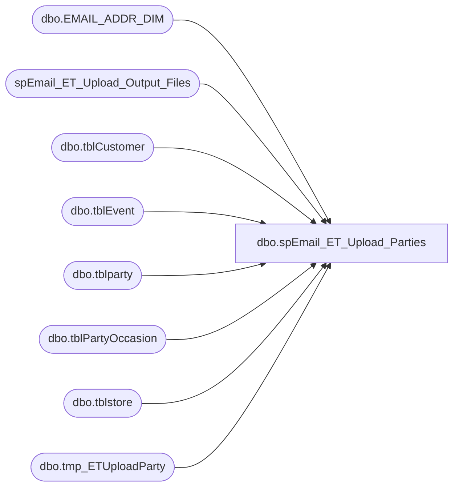

# dbo.spEmail_ET_Upload_Parties

**Database:** dw  
**Server:** papamart  

## Architecture Diagram



## Table Dependencies

| Referenced Table |
|---|
| dbo.EMAIL_ADDR_DIM |
| spEmail_ET_Upload_Output_Files |
| dbo.tblCustomer |
| dbo.tblEvent |
| dbo.tblparty |
| dbo.tblPartyOccasion |
| dbo.tblstore |
| dbo.tmp_ETUploadParty |

## Stored Procedure Code

```sql
CREATE proc [dbo].[spEmail_ET_Upload_Parties] @ad_date datetime = NULL, @reload bit=0
AS
-- =============================================================================================================
-- Name: [dbo].[spEmail_ET_Upload_Parties]
--
-- Description:	selects data and sends to ESP via FTP text file
--
-- Input:	@ad_date	datetime		grabs records created/updated since this date
--			@reload		bit				if 1, reload all records
--
-- Output: N/A
--
-- Dependencies: 
--
-- Revision History
--		Name:			Date:			Comments:
--		Edin Pehilj		04/07/2015		created

/*
DECLARE @date datetime
SET @date = CONVERT(VARCHAR, DATEADD(DAY, -1, GETDATE()), 101)
Exec spEmail_ET_Upload_Parties @ad_date = @date,  @reload = 1

--daily job
DECLARE @date datetime
SET @date = CONVERT(VARCHAR, DATEADD(DAY, -7, GETDATE()), 101)
Exec spEmail_ET_Upload_Parties @ad_date = @date,  @reload = 0
*/
-- =============================================================================================================
SET NOCOUNT ON

--declare @ad_date datetime
IF @ad_date IS NULL
	SET @ad_date = CONVERT(VARCHAR, DATEADD(DAY, -7, GETDATE()), 101)

/*
--for testing
declare @ad_date datetime
declare @reload bit

select @ad_date = CONVERT(VARCHAR, DATEADD(DAY, -3, GETDATE()), 101)
select @reload = 0
*/

IF (Object_ID('tempdb.dbo.#tmpeventids') IS NOT NULL) DROP TABLE #tmpeventids
CREATE TABLE #tmpeventids
(
	ieventid int
)

if (Object_ID('dw.dbo.tmp_ETUploadParty') IS NOT NULL) DROP TABLE dw.dbo.tmp_ETUploadParty
CREATE TABLE dw.[dbo].tmp_ETUploadParty
	(
	email_id int,
	ieventid int NOT NULL,
	party_time datetime,
	store_no int,
	sOccasion varchar(50),
	host_firstname varchar(50),
	host_lastname varchar(50),
	host_emailaddress varchar(100),
	store_country varchar(100)
	)


if @reload = 0
begin
	insert into #tmpeventids(ieventid)
	select distinct ieventid
	from kodiak.bearhouse.dbo.tblEvent e
	where e.dCreated >= @ad_date
	union
	select distinct ieventid
	from kodiak.bearhouse.dbo.tblEvent e
	where e.dLastUpdated >= @ad_date
end
else
begin
	insert into #tmpeventids(ieventid)
	select distinct ieventid
	from kodiak.bearhouse.dbo.tblEvent e
	where datepart(yyyy,e.dStart) >= 2015
end

--select * from #tmpeventids

insert into dw.dbo.tmp_ETUploadParty
select 
	case 
		when ead.email_addr_id is not null then EMAIL_ADDR_id
		else -2
	end as email_id,
	e.ieventid,
	e.dstart as party_time,
	e.istoreid as store_no,
	po.sOccasion,
	c.sFirstName as host_firstname,
	c.sLastName as host_lastname,
	c.semail as host_emailaddress,
	s.scountry as store_country
from #tmpeventids ids 
		join kodiak.bearhouse.dbo.tblEvent e with(nolock) on ids.ieventid = e.ieventid
		join kodiak.bearhouse.dbo.tblparty p WITH (NOLOCK) ON e.ieventid = p.ieventid
		join kodiak.bearhouse.dbo.tblstore s on s.istoreid = e.istoreid
		left join kodiak.bearhouse.dbo.tblPartyOccasion po on p.ioccasion = po.ipartyoccasionid
		--left JOIN (select distinct iparentstore, sCountry from tblstore) s ON e.istoreid = s.iparentstore
		join kodiak.bearhouse.dbo.tblCustomer c with (nolock) on e.iCustID = c.iCustID and c.sLastName <> 'PENDING'
		left join dw.dbo.EMAIL_ADDR_DIM ead on ead.email_addr_txt = c.semail and ead.EMAIL_STAT_CD = 'VALID'
--		left join tblPartyParam pp  with(nolock) on isnull(p.ioccasion,3) = pp.iParamID and sparamname = 'occasion'
--		join babw.dbo.date_dim dd1 on dd1.actual_date = Cast(Convert(varchar(50), e.dCreated, 101) as datetime)
--		join babw.dbo.date_dim dd2 on dd2.actual_date = Cast(Convert(varchar(50), e.dStart, 101) as datetime)
where 1=1
	--and datepart(yyyy,e.dStart) >= 2015
	AND [bCancelled] = 0 --AND [sCountry] = 'uk'	
	and iOccasion <> 23 --Hibernation
	and c.sEmail like '%@%.%'

/*
select country, count(*) from dw.dbo.store_dim
group by country

select * from dw.dbo.store_dim

select * from kodiak.bearhouse.dbo.tblstore

select * from dw.dbo.tmp_ETUploadParty e
	join kodiak.bearhouse.dbo.tblstore s on s.istoreid = e.store_no


select scountry, count(*) from dw.dbo.tmp_ETUploadParty e
	join kodiak.bearhouse.dbo.tblstore s on s.istoreid = e.store_no
group by scountry
*/

exec spEmail_ET_Upload_Output_Files @path = '\\kermode\FileRepository\Responsys\ExactTarget\', @filepart = 'BABW_PARTY_', @tablename = 'tmp_ETUploadParty', @compress = 1
dbo,spStoreCompDim_MakeSnapshot,-- =====================================================================================================
-- Name: spStoreCompDim_MakeSnapshot
--
-- Description:	Make a snapshot of the contents of StoreCompDetail_Dim so that we can intelligently
--				detect the changes that were made in spStoreCompDim_GetEarliestDateToRefresh
--
-- Input: None
--
-- Output: None
--			
--
-- Dependencies: None
--
-- Revision History
--		Name:			Date:			Comments:
--		Gary Murrish	4/30/2013		Initial Release
-- =====================================================================================================
CREATE PROCEDURE [dbo].[spStoreCompDim_MakeSnapshot]
AS
BEGIN
	SET NOCOUNT ON;


	TRUNCATE TABLE queries.Snapshot_StoreCompDetail_Dim

	INSERT INTO queries.Snapshot_StoreCompDetail_Dim
		(	store_key,
			date_key,
			isCompTY,
			isCompNY,
			isShopperTrak,
			isShopperTrakCompTY,
			isShopperTrakCompNY,
			isSOTF,
			ShopperTrakStartHour,
			ShopperTrakEndHour)
		SELECT
			scdd.store_key,
			scdd.date_key,
			scdd.isCompTY,
			scdd.isCompNY,
			scdd.isShopperTrak,
			scdd.isShopperTrakCompTY,
			scdd.isShopperTrakCompNY,
			scdd.isSOTF,
			scdd.ShopperTrakStartHour,
			scdd.ShopperTrakEndHour
		FROM
			StoreCompDetail_Dim scdd WITH (NOLOCK)

END
```

