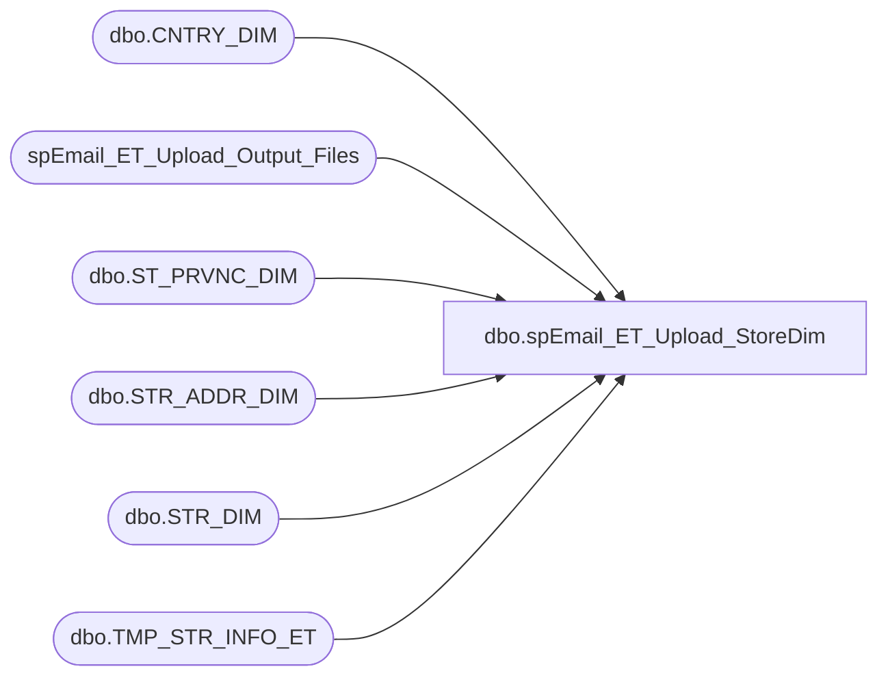

# dbo.spEmail_ET_Upload_StoreDim

**Database:** dw  
**Server:** papamart  

## Architecture Diagram



## Table Dependencies

| Referenced Table |
|---|
| dbo.CNTRY_DIM |
| spEmail_ET_Upload_Output_Files |
| dbo.ST_PRVNC_DIM |
| dbo.STR_ADDR_DIM |
| dbo.STR_DIM |
| dbo.TMP_STR_INFO_ET |

## Stored Procedure Code

```sql
CREATE PROC [dbo].[spEmail_ET_Upload_StoreDim]
-- =============================================================================================================
-- Name: [dbo].[spEmail_ET_Upload_StoreDim]
--
-- Description:	Get store data for upload to ExactTarget
--
-- Input:	
--
-- Output: Store file
--
-- Dependencies: 
--
-- Revision History
--		Name:			Date:			Comments:
--		Edin Pehilj		03/31/2014		Created
--		Mike Pelikan	04/29/2014		Changed BABWMSTRDATA linked server reference

/*

Exec spEmail_ET_Upload_StoreDim
*/
-- =============================================================================================================
AS 
    SET NOCOUNT ON

    DECLARE @cmd varchar(1000),
        @filename varchar(100),
		@filename_header varchar(100),
        @path varchar(200),
        @filedate varchar(20),
        @selectstmnt varchar(5000),
        @bcpsql varchar(500),
		@columnheaders varchar(4000), 
		@tablename varchar(128)

--CREATE TABLE CONTAINING COLUMN HEADERS FOR FILE EXPORT
IF OBJECT_ID(N'dw.dbo.TMP_STR_INFO_ET', N'U') IS NOT NULL
	DROP TABLE dw.dbo.TMP_STR_INFO_ET
	
	

CREATE TABLE dw.dbo.TMP_STR_INFO_ET(
	[STORE_NO] [int] NOT NULL,
	[STORE_NAME] [varchar](255) NOT NULL,
	[STORE_LOCATOR] [varchar](8000) NULL,
	[ADDRESS_1] [varchar](255) NULL,
	[COUNTRY] [varchar](50) NULL,
	[STATE] [varchar](50) NULL,
	[CITY] [varchar](50) NOT NULL,
	[POSTAL_CODE] [varchar](20) NOT NULL,
	[STORE_EMAIL] [varchar](255) NULL,
	[MALL_WEBSITE_URL] [varchar](255) NULL
) ON [PRIMARY]


/*
SET @columnheaders = ''
--SET @tablename='tmp_EmailStoreUploadV6'
SET @tablename='TMP_STR_INFO_ET'

SELECT @columnheaders = @columnheaders + c.name + '| '
 FROM dw.dbo.syscolumns c INNER JOIN dw.dbo.sysobjects o ON o.id = c.id
 WHERE o.name = @tablename
 ORDER BY colid
*/	

INSERT INTO dw.dbo.TMP_STR_INFO_ET
SELECT 
	s.STR_NUM AS 'STORE_NO', 
	RTRIM(s.NM_FULL) AS 'STORE_NAME', 
	RTRIM(s.LCTR) AS 'STORE_LOCATOR',--StoreLocator, 
	RTRIM(a.LINE_1) AS 'ADDRESS_1',--Address, 
	RTRIM(c.NM_ABBRV) AS 'COUNTRY',--CNTRY_NM, 
	RTRIM(p.NM_ABBRV) AS 'STATE',--ST_NM, 
	RTRIM(a.CTY_NM) AS 'CITY',--CTY_NM, 
	RTRIM(a.PSTL_CD) AS 'POSTAL_CODE',--PSTL_CD, 
	RTRIM(s.EMAIL) AS 'STORE_EMAIL',--EMAIL, 
	RTRIM(s.MALL_WEBSITE_URL) AS 'MALL_WEBSITE_URL' --MallWebsite
FROM KODIAK.BABWMstrData.dbo.STR_DIM s
	JOIN KODIAK.BABWMstrData.dbo.STR_ADDR_DIM a	ON (s.STR_ID = a.STR_ID)
	JOIN KODIAK.BABWMstrData.dbo.ST_PRVNC_DIM p ON (a.ST_PRVNC_ID = p.ST_PRVNC_ID)
	JOIN KODIAK.BABWMstrData.dbo.CNTRY_DIM c ON (p.CNTRY_ID = c.CNTRY_ID)
where s.str_num <> -1
	and a.curr_addr = 1
ORDER BY s.STR_NUM

--NA file output
exec spEmail_ET_Upload_Output_Files @path = '\\kermode\FileRepository\Responsys\ExactTarget\', @filepart = 'BABW_STORE_', @tablename = 'TMP_STR_INFO_ET'

--select @columnheaders return

/*
SELECT @columnheaders = Substring(@columnheaders, 1, Datalength(@columnheaders) - 2)

if (Object_ID('dw.dbo.tmp_EmailStoreUpload_HeaderV6') IS NOT NULL) DROP TABLE dw.dbo.tmp_EmailStoreUpload_HeaderV6

SELECT @columnheaders AS columnheader
INTO dw.dbo.tmp_EmailStoreUpload_HeaderV6

    SET @path = 'I:\Responsys\Upload\V6\'
	SET @filedate = CONVERT(VARCHAR(20), GETDATE(), 112)
    SET @filename = 'BABW_STOREV6_' + @filedate + '.txt'
	SET @filename_header = 'BABW_STORE_HEADERV6.txt'

--CREATE FILE CONTAINING EMAILS USING BCP COMMAND
    SET @selectstmnt = 'SELECT * FROM queries.dbo.TMP_STR_INFO'
    SET @bcpsql = 'bcp "' + @selectstmnt + '" queryout "' + @path + @filename
        + '.data" -t "|" -T -c'
    EXEC master..xp_cmdshell @bcpsql--, no_output

    SET @selectstmnt = 'SELECT * FROM dw.dbo.tmp_EmailStoreUpload_HeaderV6'
    SET @bcpsql = 'bcp "' + @selectstmnt + '" queryout "' + @path + @filename_header
        + '" -t "|" -T -c'
    EXEC master..xp_cmdshell @bcpsql--, no_output

    SET @cmd = 'copy ' + @path + @filename_header + '+' + @path + @filename
            + '.data ' + @path + @filename 
    EXEC master..xp_cmdshell @cmd, no_output

--COMPRESS FILE
    SELECT  @cmd = '"C:\Program Files\7-zip\7z.exe" a -tzip '
            + @path + REPLACE(@filename, '.txt', '') + '.zip ' + @path
            + @filename 
    EXEC master..xp_cmdshell @cmd--, no_output

--DELETE TEXT FILE
    SELECT  @cmd = 'del ' + @path + '*.txt /Q /F'
    EXEC master..xp_cmdshell @cmd, no_output

	SELECT  @cmd = 'del ' + @path + '*.data /Q /F'
    EXEC master..xp_cmdshell @cmd, no_output
*/
```

