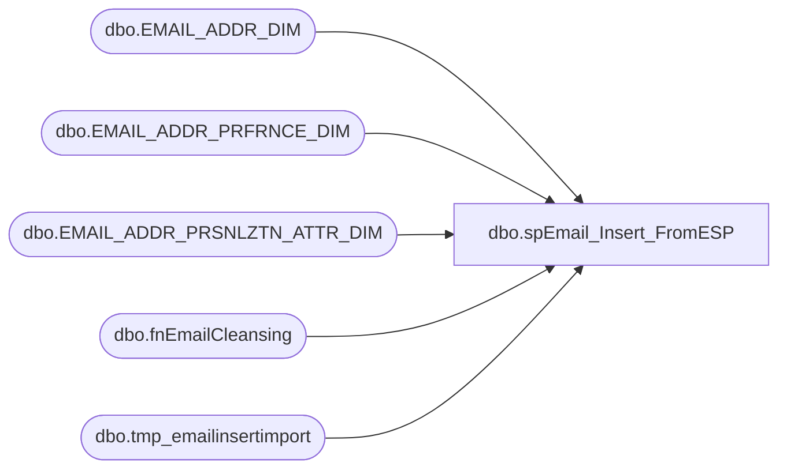

# dbo.spEmail_Insert_FromESP

**Database:** dw  
**Server:** papamart  

## Architecture Diagram



## Table Dependencies

| Referenced Table |
|---|
| dbo.EMAIL_ADDR_DIM |
| dbo.EMAIL_ADDR_PRFRNCE_DIM |
| dbo.EMAIL_ADDR_PRSNLZTN_ATTR_DIM |
| dbo.fnEmailCleansing |
| dbo.tmp_emailinsertimport |

## Stored Procedure Code

```sql
CREATE PROC [dbo].[spEmail_Insert_FromESP]
-- =============================================================================================================
-- Name: [dbo].[spEmail_Insert_FromESP]
--
-- Description:	Insert e-mail address from ESP
--
-- Input:	@logid		int						ETL log id
--			@eventid		int					ETL event id
--
-- Output: N/A
--
-- Dependencies: 
--
-- Revision History
--		Name:			Date:			Comments:
--		Keith Missey	6/10/2011		created
-- =============================================================================================================
@logid	INT,
@eventid	INT
AS 
	
    SET NOCOUNT ON

DECLARE @maxid INT,
		@sql NVARCHAR(500)

ALTER TABLE dw.dbo.[tmp_emailinsertimport] DROP COLUMN tmpid
SET @maxid = (SELECT MAX(email_addr_id) + 1 FROM dw.dbo.[EMAIL_ADDR_DIM] WITH (NOLOCK))
SET @sql = 'ALTER TABLE dw.dbo.tmp_emailinsertimport ADD tmpid INT IDENTITY (' + CAST(@maxid AS VARCHAR) + ', 1)'
EXEC sp_executesql @sql
	
	INSERT dw.dbo.[EMAIL_ADDR_DIM] (
	 email_addr_id,
		[EMAIL_ADDR_TXT],
		[EMAIL_STAT_CD],
		[EMAIL_STAT_DT],
		[INS_DT],
		[UPDT_DT],
		[BEG_EFF_DT],
		[END_EFF_DT],
		[ETL_LOG_ID],
		[ETL_EVNT_ID]
	)
	SELECT MAX(tmpid), dbo.fnEmailCleansing(email_address), 'VALID',
		MAX(statusdate), GETDATE(), GETDATE(), GETDATE(), '1/1/3000', @logid, @eventid
	FROM dw.dbo.tmp_emailinsertimport
	WHERE LEFT(email_address,1) <> '@' AND LEN(email_address) > 0 
		AND email_address  NOT IN (SELECT email_addr_txt FROM dw.dbo.[EMAIL_ADDR_DIM] WHERE email_addr_txt IS NOT NULL)
		AND dbo.fnEmailCleansing(email_address) IS NOT NULL
	GROUP BY email_address


	INSERT dw.dbo.[EMAIL_ADDR_PRSNLZTN_ATTR_DIM] (
		[EMAIL_ADDR_ID],
		[EMAIL_PRSNLZTN_ATTR_SEQ_NBR],
		[EMAIL_FRST_NM],
		[EMAIL_LAST_NM],
		[EMAIL_BRTH_DT],
		[CNTRY_ABBRV],
		[INS_DT],
		[UPDT_DT],
		[BEG_EFF_DT],
		[END_EFF_DT],
		[ETL_LOG_ID],
		[ETL_EVNT_ID]
	) 
	SELECT email_addr_id, 1, NULL, NULL, NULL, 
		CASE WHEN country IN ('USA', 'GBR', 'CAN') THEN UPPER(country)
			WHEN country IN ('CA','CANADA') THEN 'CAN'
			WHEN country IN ('UK','GB') THEN 'GBR'
			WHEN country IN ('US','united states') THEN 'USA' ELSE 'USA'
		END, GETDATE(), GETDATE(), GETDATE(),
		'1/1/3000', @logid,@eventid
	FROM dw.[dbo].[EMAIL_ADDR_DIM] e
		INNER JOIN dw.dbo.tmp_emailinsertimport ON email_addr_id = tmpid
	WHERE e.[INS_DT] >= CONVERT(VARCHAR, GETDATE(), 101) AND e.[ETL_LOG_ID] = @logid


	INSERT dw.dbo.[EMAIL_ADDR_PRFRNCE_DIM] (
		[EMAIL_ADDR_ID],
		[ORIG_SRC_SYS_CD],
		[UPDT_SRC_SYS_CD],
		[PROMO_PREF],
		[PROMO_UPDT_DT],
		[SFSCERT_PREF],
		[SFSCERT_UPDT_DT],
		[SFSPNTS_PREF],
		[SFSPNTS_UPDT_DT],
		INS_DT,
		UPDT_DT,
		[BEG_EFF_DT],
		[END_EFF_DT],
		[ETL_LOG_ID],
		[ETL_EVNT_ID]
	) 

	SELECT email_addr_id, [source], [source],
		CASE insertstatus WHEN 'OPT-IN' THEN 'Y' ELSE 'N' END, statusdate, 
		CASE insertstatus WHEN 'OPT-IN' THEN 'Y' ELSE 'N' END, statusdate,
		CASE insertstatus WHEN 'OPT-IN' THEN 'Y' ELSE 'N' END, statusdate,
			GETDATE(), GETDATE(), GETDATE(),'1/1/3000', @logid,@eventid
	FROM dw.[dbo].[EMAIL_ADDR_DIM] e
		INNER JOIN dw.dbo.tmp_emailinsertimport ON email_addr_id = tmpid
	WHERE e.[INS_DT] >= CONVERT(VARCHAR, GETDATE(), 101) AND e.[ETL_LOG_ID] = @logid
```

