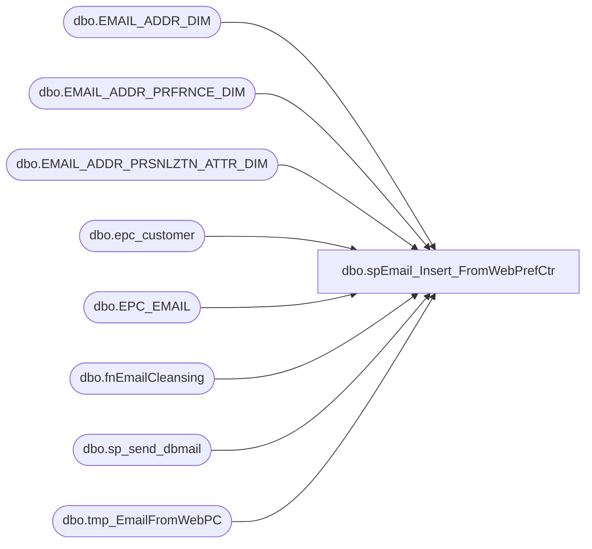

# dbo.spEmail_Insert_FromWebPrefCtr

**Database:** dw  
**Server:** papamart  

## Architecture Diagram



## Table Dependencies

| Referenced Table |
|---|
| dbo.EMAIL_ADDR_DIM |
| dbo.EMAIL_ADDR_PRFRNCE_DIM |
| dbo.EMAIL_ADDR_PRSNLZTN_ATTR_DIM |
| dbo.epc_customer |
| dbo.EPC_EMAIL |
| dbo.fnEmailCleansing |
| dbo.sp_send_dbmail |
| dbo.tmp_EmailFromWebPC |

## Stored Procedure Code

```sql
CREATE proc [dbo].[spEmail_Insert_FromWebPrefCtr]
-- =============================================================================================================
-- Name: spEmail_Insert_FromWebPrefCtr
--
-- Description:	Inserts e-mails from bearwebdb.emailcenter into data warehouse email table
--
-- Input:	@ad_date	datetime	initial date to find new e-mails created on web 
--
-- Output:	N/A
--
-- Dependencies: 
--
-- Revision History
--		Name:			Date:			Comments:
--		Keith Missey	6/5/2009		created
--		Keith Missey	8/18/2009		added e-mail cleansing function
--		Keith Missey	7/21/2010		added update statement to make countries 3-digit codes
--		Keith Missey	02/13/2011		updated for preference center changes
-- =============================================================================================================
@ad_date DATETIME
AS
SET NOCOUNT ON

    IF EXISTS ( SELECT  *
                FROM    dw.dbo.sysobjects
                WHERE   id = OBJECT_ID(N'[tmp_EmailFromWebPC]')
                        AND type in ( N'U' ) )
     DROP TABLE dw.dbo.tmp_EmailFromWebPC
                  
CREATE TABLE dw.dbo.tmp_EmailFromWebPC
(
	tmpid INT,
	email_address VARCHAR(255),
	emailstatus VARCHAR(20),
	firstname VARCHAR(100),
	lastname VARCHAR(100),
	birthdate DATETIME,
	country VARCHAR(100),
	create_date datetime
)

DECLARE @sourcecnt INT,
		@destcnt1 INT,
		@destcnt2 INT,
		@destcnt3 INT,
		@sql NVARCHAR(1000),
		@maxid int

--INSERT ALL E-MAILS THAT HAVE PERSONAL INFORMATION
INSERT dw.dbo.tmp_EmailFromWebPC
(email_address, emailstatus, firstname, lastname, birthdate, country, create_date)
SELECT email_addr, global_out_y_n, first_name, last_name, [BIRTHDATE], [PREFERRED_COUNTRY], e.sys_create_date
FROM bearwebdb.[EMAILCENTER].dbo.[EPC_EMAIL] e WITH (NOLOCK)
	INNER JOIN bearwebdb.[EMAILCENTER].dbo.epc_customer c WITH (NOLOCK) ON e.[EMAIL_KEY] = c.[EMAIL_KEY]
	WHERE e.sys_create_date >= @ad_date

--INSERT REMAINING E-MAILS
INSERT dw.dbo.tmp_EmailFromWebPC  
(email_address, emailstatus, firstname, lastname, birthdate, country, create_date)
SELECT email_addr, global_out_y_n, NULL, NULL, NULL, 'USA' AS country, sys_create_date
FROM bearwebdb.[EMAILCENTER].dbo.[EPC_EMAIL] e WITH (NOLOCK)
	WHERE e.sys_create_date >= @ad_date AND email_addr NOT IN (SELECT email_address FROM dw.dbo.tmp_EmailFromWebPC) 

--MAKE COUNTRIES 3-DIGIT CODES
UPDATE dw.dbo.tmp_EmailFromWebPC SET country = 
	CASE WHEN country IN ('GB', 'UK', 'GBR') THEN 'GBR'
		WHEN country IN ('FR', 'FRA') THEN 'FRA'
		WHEN country IN ('CA','CAN') THEN 'CAN'
		WHEN country IN ('IE','IRE') THEN 'IRE'
		ELSE 'USA' END
		
ALTER TABLE dw.dbo.[tmp_EmailFromWebPC] DROP COLUMN tmpid
SET @maxid = (SELECT MAX(email_addr_id) + 1 FROM dw.dbo.[EMAIL_ADDR_DIM] WITH (NOLOCK))
SET @sql = 'ALTER TABLE dw.dbo.tmp_EmailFromWebPC ADD tmpid INT IDENTITY (' + CAST(@maxid AS VARCHAR) + ', 1)'
EXEC sp_executesql @sql

INSERT dw.dbo.[EMAIL_ADDR_DIM] (
 email_addr_id,
	[EMAIL_ADDR_TXT],
	[EMAIL_STAT_CD],
	[EMAIL_STAT_DT],
	[INS_DT],
	[UPDT_DT],
	[BEG_EFF_DT],
	[END_EFF_DT],
	[ETL_LOG_ID],
	[ETL_EVNT_ID]
)
SELECT MAX(tmpid), dbo.fnEmailCleansing(email_address), 'VALID',
	MAX(create_date), GETDATE(), GETDATE(), GETDATE(), '1/1/3000', -3, -3
FROM dw.dbo.tmp_EmailFromWebPC
WHERE LEFT(email_address,1) <> '@' AND LEN(email_address) > 0 
	AND email_address  NOT IN (SELECT email_addr_txt FROM dw.dbo.[EMAIL_ADDR_DIM] WHERE email_addr_txt IS NOT NULL)
GROUP BY email_address

SET @destcnt1 = @@ROWCOUNT

INSERT dw.dbo.[EMAIL_ADDR_PRSNLZTN_ATTR_DIM] (
	[EMAIL_ADDR_ID],
	[EMAIL_PRSNLZTN_ATTR_SEQ_NBR],
	[EMAIL_FRST_NM],
	[EMAIL_LAST_NM],
	[EMAIL_BRTH_DT],
	[CNTRY_ABBRV],
	[INS_DT],
	[UPDT_DT],
	[BEG_EFF_DT],
	[END_EFF_DT],
	[ETL_LOG_ID],
	[ETL_EVNT_ID]
) 
SELECT email_addr_id, 1, firstname, lastname, birthdate, country, GETDATE(), GETDATE(), GETDATE(),
	'1/1/3000', -3, -3
FROM dw.[dbo].[EMAIL_ADDR_DIM] e
	INNER JOIN dw.dbo.tmp_EmailFromWebPC ON email_addr_id = tmpid
WHERE e.[INS_DT] >= CONVERT(VARCHAR, GETDATE(), 101) AND e.[ETL_LOG_ID] = -3

SET @destcnt2 = @@ROWCOUNT

INSERT dw.dbo.[EMAIL_ADDR_PRFRNCE_DIM] (
	[EMAIL_ADDR_ID],
	[ORIG_SRC_SYS_CD],
	[UPDT_SRC_SYS_CD],
	[PROMO_PREF],
	[PROMO_UPDT_DT],
	[SFSCERT_PREF],
	[SFSCERT_UPDT_DT],
	[SFSPNTS_PREF],
	[SFSPNTS_UPDT_DT],
	INS_DT,
	UPDT_DT,
	[BEG_EFF_DT],
	[END_EFF_DT],
	[ETL_LOG_ID],
	[ETL_EVNT_ID]
) 
SELECT email_addr_id, 'WEB_PC', 'WEB_PC',
	CASE emailstatus 
		WHEN 'N' THEN 'Y'
		WHEN 'Y' THEN 'N' END , create_date, 
		CASE emailstatus 
		WHEN 'N' THEN 'Y'
		WHEN 'Y' THEN 'N' END , create_date,
		CASE emailstatus 
		WHEN 'N' THEN 'Y'
		WHEN 'Y' THEN 'N' END , create_date,
		GETDATE(), GETDATE(), GETDATE(),'1/1/3000', -3, -3
FROM dw.[dbo].[EMAIL_ADDR_DIM] e
	INNER JOIN dw.dbo.tmp_EmailFromWebPC ON email_addr_id = tmpid
WHERE e.[INS_DT] >= CONVERT(VARCHAR, GETDATE(), 101) AND e.[ETL_LOG_ID] = -3

SET @destcnt3 = @@ROWCOUNT

SET @sourcecnt = (SELECT COUNT(*) FROM dw.[dbo].[tmp_EmailFromWebPC])

DECLARE @query VARCHAR(1000)

SET @query = 'SET NOCOUNT ON '
+ ' SELECT ' + CAST(ISNULL(@sourcecnt,0) AS VARCHAR) + ' AS [Source Emails], ' + CAST(@destcnt1 AS VARCHAR) + ' AS [EAD Insert], ' 
+ CAST(@destcnt2 AS VARCHAR) + ' AS [EAPAD Records], ' 
+ CAST(@destcnt3 AS VARCHAR) + ' AS [EAPPD Records]' 

EXEC msdb.dbo.sp_send_dbmail @recipients = 'databears@buildabear.com'
	,@subject = 'WebPC Insert Status'
	,@body = 'The number below represents the number of records inserted from the Web Preference Center to the Data Warehouse.  Note that the final two numbers should always equal one another.  Those two numbers will more than likely always be less than the first number because numbers that already exist in the data warehouse are not re-inserted.  If there are issues, please review papamart.dw.dbo.spEmail_Insert_FromWebPrefCtr.
	'
	,@query = @query

dbo,SelectDWBearitoryName,-- =============================================
-- Author:		Aaron Davis
-- Create date: 08/11/2006
-- Description:	Retrieves the DimensionTuple value for a bearitory
-- =============================================
CREATE PROCEDURE SelectDWBearitoryName
	@ADBearitoryName nvarchar(120)
AS
BEGIN
	SET NOCOUNT ON;
	SELECT
		bearitory
	FROM
		Store_AD_Xref
	WHERE
		Bearitory_AD_Group = @ADBearitoryName
END
```

