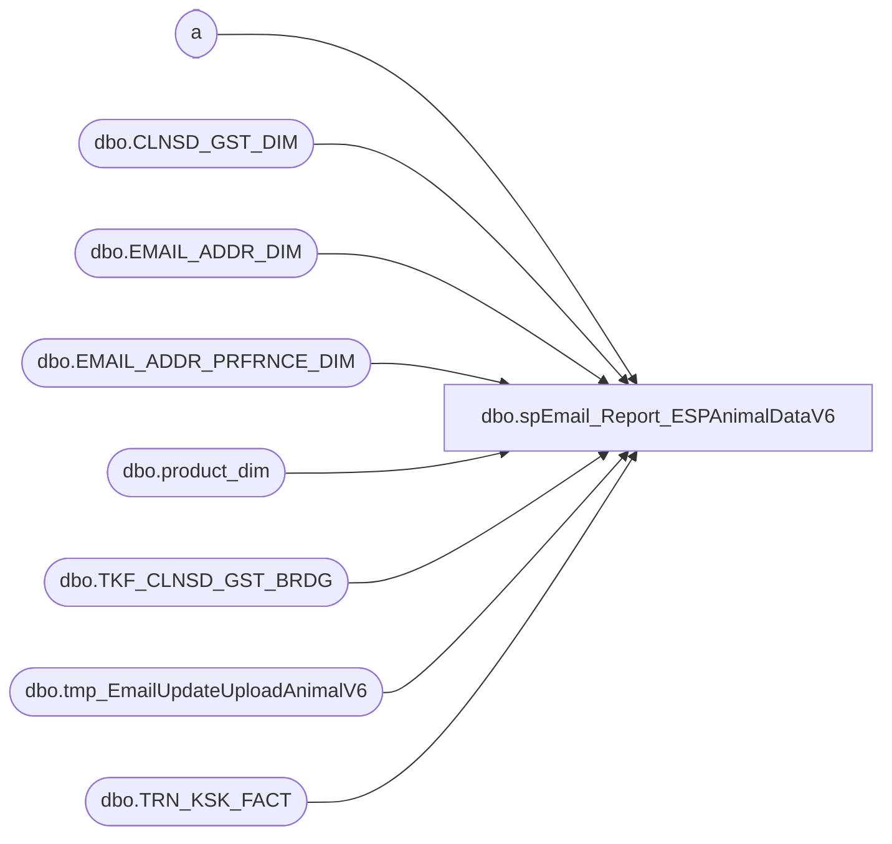

# dbo.spEmail_Report_ESPAnimalDataV6

**Database:** dw  
**Server:** papamart  

## Architecture Diagram



## Table Dependencies

| Referenced Table |
|---|
| a |
| dbo.CLNSD_GST_DIM |
| dbo.EMAIL_ADDR_DIM |
| dbo.EMAIL_ADDR_PRFRNCE_DIM |
| dbo.product_dim |
| dbo.TKF_CLNSD_GST_BRDG |
| dbo.tmp_EmailUpdateUploadAnimalV6 |
| dbo.TRN_KSK_FACT |

## Stored Procedure Code

```sql
CREATE PROC [dbo].[spEmail_Report_ESPAnimalDataV6]
-- =============================================================================================================
-- Name: [dbo].[spEmail_Report_ESPAnimalDataV6]
--
-- Description:	selects data and sends to ESP via FTP text file
--
-- Input:	@ad_date	datetime		grabs records updated since this date
--			@reload		bit				if 1, reload all records
--
-- Output: N/A
--
-- Dependencies: 
--
-- Revision History
--		Name:			Date:			Comments:
--		Gary Derikito	07/29/2012		Created
--		Gary Derikito	10/16/2012		Remove test code.  Add exclusion of bad emails.
--		Gary Derikito	10/18/2012		Update destination folder path.
--		Gary Derikito	10/30/2012		Change from pipe to tab because there are pipes in the data
--		Gary Derikito	11/07/2012		Change column header from pipe to tab 
--		Gary Derikito	11/16/2012		Fix last_animal_bday header being chopped off.

/*
DECLARE @date datetime
SET @date = CONVERT(VARCHAR, DATEADD(DAY, -10000, GETDATE()), 101)
Exec spEmail_Report_ESPAnimalDataV6 @ad_date = @date,  @reload = 1

DECLARE @date datetime
SET @date = CONVERT(VARCHAR, DATEADD(DAY, -10000, GETDATE()), 101)
Exec spEmail_Report_ESPAnimalDataV6 @ad_date = @date,  @reload = 0
*/
-- =============================================================================================================
@ad_date datetime=NULL,
@reload bit=0
AS 
    SET NOCOUNT ON

IF @ad_date IS NULL
	SET @ad_date = CONVERT(VARCHAR, DATEADD(DAY, -1, GETDATE()), 101)

CREATE TABLE #tmpemailids
(
	email_addr_id int
)

--Exclude bad emails
SELECT EMAIL_ADDR_ID
INTO #tmp_ExcludeEmails
FROM dbo.EMAIL_ADDR_DIM e WITH (NOLOCK)
WHERE e.email_addr_txt LIKE '%BABWTEST.com%'
    
CREATE INDEX IX_tmp_ExcludeEmails_emailaddrid
ON #tmp_ExcludeEmails (email_addr_id);

IF @reload = 0
BEGIN
--Only need to know when a registration is new for this procedure    

   --GRAB NEW REGISTRATION DATA
    INSERT #tmpemailids
    SELECT DISTINCT
            e.email_addr_id
    FROM    dw.dbo.[TRN_KSK_FACT] tkf WITH (NOLOCK)
		INNER JOIN dw.dbo.[TKF_CLNSD_GST_BRDG] b WITH (NOLOCK) ON tkf.[TKF_ID] = b.[TKF_ID]
		INNER JOIN dw.dbo.[CLNSD_GST_DIM] g WITH (NOLOCK) ON b.[CLNSD_GST_ID] = g.[CLNSD_GST_ID]
		INNER JOIN dw.dbo.[EMAIL_ADDR_DIM] e WITH (NOLOCK) ON g.[EMAIL_ADDR_ID] = e.[EMAIL_ADDR_ID]
		INNER JOIN dw.dbo.EMAIL_ADDR_PRFRNCE_DIM ep WITH (NOLOCK) ON e.EMAIL_ADDR_ID = ep.EMAIL_ADDR_ID
    WHERE  tkf.[INS_DT] >= @ad_date AND e.email_addr_id > 0 AND RTRIM(LTRIM(email_stat_cd)) = 'VALID' 
		AND (ep.promo_pref = 'Y' OR ep.sfspnts_pref = 'Y' OR ep.sfscert_pref = 'Y')
		AND e.EMAIL_ADDR_ID NOT IN (SELECT email_addr_id FROM #tmp_ExcludeEmails)
--Testing filter
	--and e.EMAIL_ADDR_ID in (select email_addr_id from dbo.tmp_TestCases)
--Testing filter
	
END
ELSE ---start of full load section
BEGIN
	INSERT #tmpemailids
		SELECT DISTINCT e.email_addr_id
    FROM    dw.dbo.[EMAIL_ADDR_DIM] e WITH ( NOLOCK )
		INNER JOIN dw.dbo.EMAIL_ADDR_PRFRNCE_DIM ep WITH (NOLOCK) ON e.EMAIL_ADDR_ID = ep.EMAIL_ADDR_ID
    WHERE  RTRIM(LTRIM(email_stat_cd)) = 'VALID' 
    		AND (ep.promo_pref = 'Y' OR ep.sfspnts_pref = 'Y' OR ep.sfscert_pref = 'Y')
    		AND e.EMAIL_ADDR_ID NOT IN (SELECT email_addr_id FROM #tmp_ExcludeEmails)
--testing filter
    		--and e.EMAIL_ADDR_ID between 100000 and 105000
    		--and e.EMAIL_ADDR_ID in (select email_addr_id from dbo.tmp_TestCases)
--testing filter
--select * from #tmpemailids return
END

CREATE INDEX IX_tmpemailids_emailaddrid
    ON #tmpemailids (email_addr_id); 

	
CREATE TABLE [#tmpemail](
	clnsd_gst_id INT NOT NULL,
	[customer_id] [int] NOT NULL
)

INSERT #tmpemail
    SELECT DISTINCT  
			c.clnsd_gst_id, 
			e.email_addr_id AS customer_id 
    FROM    dw.dbo.[EMAIL_ADDR_DIM] e WITH ( NOLOCK )
            INNER JOIN #tmpemailids t ON e.[EMAIL_ADDR_ID] = t.email_addr_id
            INNER JOIN dw.dbo.[CLNSD_GST_DIM] c WITH ( NOLOCK ) ON e.[EMAIL_ADDR_ID] = c.[EMAIL_ADDR_ID] 


		
CREATE INDEX IX_tmpemail_customerid
    ON #tmpemail (customer_id); 
    

CREATE TABLE [#tmpanimal](
	customer_id int NOT NULL,
	animal_name VARCHAR(50) NULL,
	sku BIGINT  NULL,
	class VARCHAR(20) NULL,
	animal_bday DATETIME NULL,
	KSK_REGIS_START_DT DATETIME,
	TKF_ID INT NULL,
	f	CHAR(1) NULL,
	l	CHAR(1) NULL)
	
	 
INSERT INTO #tmpanimal(customer_id, animal_name, sku, class, animal_bday, KSK_REGIS_START_DT, TKF_ID)
SELECT
e.customer_id 
,tkf.ANML_NM
,p.sku 
,p.class
,tkf.ANML_BRTH_DT
,tkf.KSK_REGIS_START_DT
,tkf.TKF_ID
FROM #tmpemail e
	INNER JOIN dw.dbo.[CLNSD_GST_DIM] c WITH ( NOLOCK ) on (e.CLNSD_GST_ID = c.CLNSD_GST_ID)
	INNER JOIN dw.dbo.tkf_clnsd_gst_brdg b WITH (NOLOCK) ON b.CLNSD_GST_ID = c.clnsd_gst_id
	INNER JOIN dw.dbo.trn_ksk_fact tkf WITH (NOLOCK) ON b.tkf_id = tkf.tkf_id
	INNER JOIN dw.dbo.product_dim p WITH (NOLOCK) ON (tkf.PRDCT_ID = p.product_key)

--select * from #tmpanimal where customer_id in (12293213, 20243094, 22806378)  return
--select * from #tmpanimal where customer_id in (13435824)  return --nonSFS with many animals

SELECT a.customer_id, 
MIN(a.KSK_REGIS_START_DT) fday, 
(SELECT MIN(TKF_ID) FROM #tmpanimal af WHERE af.customer_id = a.customer_id AND af.KSK_REGIS_START_DT = MIN(a.KSK_REGIS_START_DT)) AS   'fid', 
MAX(a.KSK_REGIS_START_DT) lday, 
(SELECT MAX(TKF_ID) FROM #tmpanimal al WHERE al.customer_id = a.customer_id AND al.KSK_REGIS_START_DT = MAX(a.KSK_REGIS_START_DT)) AS   'lid'  
INTO #tmpfirstlast
FROM #tmpanimal a
GROUP BY a.customer_id

--select * from #tmpfirstlast return

UPDATE a
SET f = 1
FROM #tmpanimal a JOIN #tmpfirstlast fl ON (a.customer_id = fl.customer_id)
WHERE a.tkf_id = fl.fid

UPDATE a
SET l = 1
FROM #tmpanimal a JOIN #tmpfirstlast fl ON (a.customer_id = fl.customer_id)
WHERE a.tkf_id = fl.lid

--select * from #tmpanimal where customer_id in (12293213, 20243094, 22806378)  return
--select * from #tmpanimal where customer_id in (13435824)  return


--SAVE EVERYTHING TO PHYSICAL TABLE
if (Object_ID('dw.dbo.tmp_EmailUpdateUploadAnimalV6') IS NOT NULL) DROP TABLE dw.dbo.tmp_EmailUpdateUploadAnimalV6

CREATE TABLE [dbo].[tmp_EmailUpdateUploadAnimalV6](
	[customer_id] [int] NOT NULL,
	[first_animal_name] [varchar](100) NULL,
	[first_animal_sku] [varchar](100) NULL,
	[first_animal_category] [varchar](100) NULL,
	[first_animal_bday] [datetime] NULL,
	[last_animal_name] [varchar](100) NULL,
	[last_animal_sku] [varchar](100) NULL,
	[last_animal_category] [varchar](100) NULL,
	[last_animal_bday] [datetime] NULL)

INSERT dw.dbo.tmp_EmailUpdateUploadAnimalV6
SELECT
f.customer_id
,f.animal_name AS 'first_animal_name'
,f.sku AS 'first_animal_sku'
,f.class AS 'first_animal_category'
,f.animal_bday AS 'first_animal_bday'
,l.animal_name AS 'last_animal_name'
,l.sku AS 'last_animal_sku'
,l.class AS 'last_animal_category'
,l.animal_bday AS 'last_animal_bday'
FROM #tmpanimal f JOIN #tmpanimal l ON (f.customer_id = l.customer_id)
WHERE f.f = 1 AND l.l = 1


--select * from dw.dbo.tmp_EmailUpdateUploadAnimalV6 where customer_id in (12293213, 20243094, 22806378) order by customer_id return
--Carla and Ashley
--select * from dw.dbo.tmp_EmailUpdateUploadAnimalV6 where customer_id in (20698451, 22331446) order by customer_id return

    DECLARE @cmd varchar(1000),
        @filename varchar(100),
		@filename_header varchar(100),
        @path varchar(200),
        @filedate varchar(20),
        @selectstmnt varchar(5000),
        @bcpsql varchar(500),
		@columnheaders varchar(4000), 
		@tablename varchar(128)

--CREATE TABLE CONTAINING COLUMN HEADERS FOR FILE EXPORT
SET @columnheaders = ''
SET @tablename='tmp_EmailUpdateUploadAnimalV6'

SELECT @columnheaders = @columnheaders + c.name + char(9)
 FROM syscolumns c INNER JOIN sysobjects o ON o.id = c.id
 WHERE o.name = @tablename
 ORDER BY colid

SELECT @columnheaders = Substring(@columnheaders, 1, Datalength(@columnheaders) - 1)

if (Object_ID('dw.dbo.tmp_EmailUpdateUploadAnimal_HeaderV6') IS NOT NULL) DROP TABLE dw.dbo.tmp_EmailUpdateUploadAnimal_HeaderV6

SELECT @columnheaders AS columnheader
INTO dw.dbo.tmp_EmailUpdateUploadAnimal_HeaderV6

    SET @path = 'I:\Responsys\Upload\V6\'
	SET @filedate = CONVERT(VARCHAR(20), GETDATE(), 112)
    SET @filename = 'BABW_OPTINEMAILV6_ANIMAL_' + @filedate + '.txt'
	SET @filename_header = 'BABW_OPTINEMAIL_ANIMAL_HEADERV6.txt'

--CREATE FILE CONTAINING EMAILS USING BCP COMMAND
    SET @selectstmnt = 'SELECT * FROM dw.dbo.tmp_EmailUpdateUploadAnimalV6'
    SET @bcpsql = 'bcp "' + @selectstmnt + '" queryout "' + @path + @filename
        + '.data" -t \t -T -c'
    EXEC master..xp_cmdshell @bcpsql--, no_output

    SET @selectstmnt = 'SELECT * FROM dw.dbo.tmp_emailupdateuploadAnimal_headerV6'
    SET @bcpsql = 'bcp "' + @selectstmnt + '" queryout "' + @path + @filename_header
        + '" -t \t -T -c'
    EXEC master..xp_cmdshell @bcpsql--, no_output

    SET @cmd = 'copy ' + @path + @filename_header + '+' + @path + @filename
            + '.data ' + @path + @filename 
    EXEC master..xp_cmdshell @cmd, no_output

--COMPRESS FILE
    SELECT  @cmd = '"C:\Program Files\7-zip\7z.exe" a -tzip '
            + @path + REPLACE(@filename, '.txt', '') + '.zip ' + @path
            + @filename 
    EXEC master..xp_cmdshell @cmd--, no_output

--DELETE TEXT FILE
    SELECT  @cmd = 'del ' + @path + '*.txt /Q /F'
    EXEC master..xp_cmdshell @cmd, no_output

	SELECT  @cmd = 'del ' + @path + '*.data /Q /F'
    EXEC master..xp_cmdshell @cmd, no_output
```

